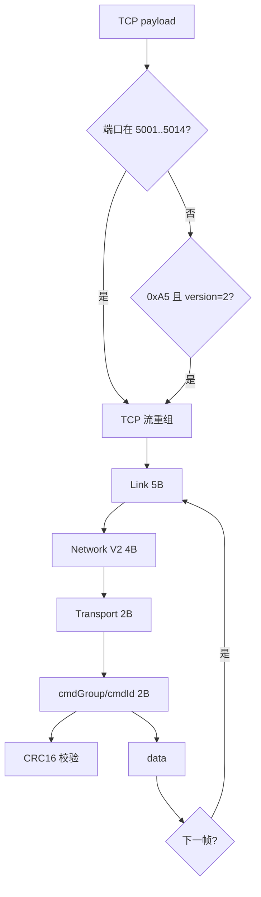

---
tags:
  - wireshark
  - BMS
  - 底软协议
created: 2026-06-06
status: implemented
---

# BMS2.0 底软协议 Wireshark V2 解析方案

## 0. 结论

**Lua dissector**（`bms20_v2.lua`），无需编译，Reload Lua Plugins 即生效。**固定注册 TCP 端口 5001（HMI）、5002（BBMS）、5003..5014（RBMS 各簇 TCP Server）**（对端端口不固定），**同一抓包可同时解析 HMI / BBMS / 多簇 RBMS 流量**；按 TCP 端口标注 `bms20.service_port`、`bms20.rack_id` 与 Info 前缀 `[HMI:5001]` / `[BBMS:5002]` / `[R1:5003]` 等。将 Data 前 13 字节按 V2 帧头展开，并据 `len` 解析 `data[]`、校验 CRC16-Modbus。

> [!note] BMS2.0 服务端口
> | 场景 | 角色 | 服务端口 |
> | :--- | :--- | :--- |
> | 上位机 | HMI | **5001** |
> | BBMS 三级板 | BBMS TCP Server | **5002** |
> | RBMS 第 N 簇 | RBMS TCP Server | **5002 + N**（第 1 簇 **5003**，后续每簇 +1） |
>
> 抓包中 `5003 → 对端` 表示本端固定 **5003**（RBMS 第 1 簇）；`5002 → 对端` 为 BBMS。Wireshark 的 `tcp.port >= 5001 && tcp.port <= 5014` 会匹配**源或目的**为对应端口的流量。

## 1. 交付物

| 文件 | 作用 |
| :--- | :--- |
| [[bms20_v2.lua]] | Lua dissector 主文件 |
| [[README]] | 安装、Reload、过滤器 |
| [[BMS2.0底软通信协议.pdf]] | 协议来源 |

## 2. 抓包对照（Frame 57）

```text
a5 e2 10 6e ba | 03 01 01 01 | 01 31 | 02 01 | ...
└─ Link 5B ────┘ └─ Network 4B ┘ └Trans2B┘ └Expr2B┘
```

| 字节 | 字段 | 值 | 说明 |
| :--- | :--- | :--- | :--- |
| 1 | head | `0xA5` | 固定帧头 |
| 2-3 | version + len | `0xE2 0x10` → `0x10E2` | version=**2**，len=**135** |
| 4-5 | check | `0x6E 0xBA` | CRC16-Modbus（小端） |
| 6 | src | `0x03` | 源器件地址 |
| 7 | srcSub | `0x01` | 源子地址 |
| 8 | dest | `0x01` | 目的器件地址 |
| 9 | destSub | `0x01` | 目的子地址 |
| 10 | transportType | `0x01` | 不需回应 |
| 11 | frameId | `0x31` | 帧序号 49 |
| 12 | cmdGroup | `0x02` | 命令组 |
| 13 | cmdId | `0x01` | 命令号 |
| 14+ | data[] | … | 长度 = len − 8 = **127** 字节 |

位域（小端，见 [[C语言位域详解]]）：

```lua
local ver_len = tvb(1, 2):le_uint()
local version = bit.band(ver_len, 0x1F)
local datalen = bit.rshift(ver_len, 5)
```

整帧长度 = **5 + datalen**；TCP Len=1030 时一个段内可含多帧。

## 3. 目标效果

```text
Transmission Control Protocol
  BMS2.0 V2 Protocol
    Link Layer: Head / Version / Data Length / CRC16
    Network Layer: src, srcSub, dest, destSub
    Transport Layer: transportType, frameId
    Application Layer: cmdGroup, cmdId
    Payload (N bytes)
```

## 4. 实现架构



## 5. 安装与验证

使用者请阅读 [[BMS2.0-Wireshark插件使用说明]]；Windows 见 `WINDOWS安装说明.txt`。

### 验收清单

- [x] Frame 57 前 13 字节与上表一致
- [x] len=135 时 Payload 127 字节
- [x] CRC 标注 Valid/Invalid
- [x] 1030 字节 payload 多帧拆分
- [x] LAN Matrix Message Name 映射

## 6. 协议依据

- [[BMS2.0底软通信协议.pdf]]
- [[C语言位域详解]]
- [[13-MMS报文Wireshark解析指南]]（Wireshark 方法论）

## 7. 后续扩展

- src/dest 器件地址名称映射
- 按命令类型解析 `data[]` 内部 struct
