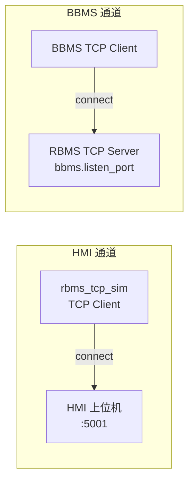

# RBMS TCP Sim

模拟 **第一簇** Rack BMS（RBMS）的 TCP 协议行为。通过 `--mode hmi` 或 `--mode bbms` **二选一**运行单通道（默认 `hmi` 连上位机）。

## 架构



| 通道 | 角色 | 配置段 | 状态 |
| :--- | :--- | :--- | :--- |
| RBMS → HMI | TCP **Client** | `[hmi]` | **已实现、已联调** |
| BBMS → RBMS | TCP **Server** | `[bbms]` | **已实现**（`--mode bbms` 单进程） |

## 环境

- Python **3.13**（[uv](https://docs.astral.sh/uv/) 管理）
- 本目录为 monorepo [`py_work_script_repo`](../) 下的独立工具；验收与全局工具链见根目录 [AGENTS.md](../AGENTS.md)

**首次（子项目内运行模拟器）**

```powershell
cd 4.rbms_tcp_sim
uv sync
```

**全局 CLI（本机一次，在任意目录可用）**

```powershell
uv tool install ruff
uv tool install ty
uv tool install pytest
```

> [!IMPORTANT]
> **lint / 类型 / 测试** 请直接用 `ruff`、`ty`、`pytest`（或 `uv tool run ruff`），**不要**用 `uv run ruff`——后者会尝试构建本包并拉取 `hatchling`，在 PyPI 镜像异常时会失败。

## 配置

| 文件 | 说明 |
| :--- | :--- |
| `config/rbms_sim.toml` | 主配置：HMI 地址、周期报文、各 CSV 路径 |
| `config/rbms_suminfo.csv` | SumInfo 点表（Excel 导出） |
| `config/rbms_fault.csv` | 故障位图（25B / 200 bit） |
| `config/rbms_volt.csv` | 电芯电压 + 有效性 + AFE 总压 |
| `config/rbms_temp.csv` | 电芯/极柱/Pack/均衡板温度 |
| `config/rbms_cellbalst.csv` | 均衡状态（52B） |
| `config/rbms_cellsdr.csv` | 自放电率（416B） |

生成六类周期报文默认 CSV（含 SumInfo）：

```powershell
cd 4.rbms_tcp_sim
uv run rbms-sim --init-matrix-config
```

`config/rbms_sim.toml` 示例：

```toml
[hmi]
host = "127.0.0.1"   # 上位机 IP
port = 5001          # 上位机服务端口
reconnect_interval_s = 5.0

[bbms]
listen_host = "0.0.0.0"
listen_port = 5002

[periodic]
messages = "suminfo,fault"
interval_s = 1.0

[suminfo]
config_path = "config/rbms_suminfo.csv"   # 相对项目根目录
use_external_config = true
```

> [!NOTE]
> 暂时固定模拟 **第一簇**（协议 `src_sub = 1`）。TOML 中的相对路径（如 `config_path`）均相对**本目录**（`4.rbms_tcp_sim/`）解析，而非 TOML 文件所在目录。

## 运行

**前置**：在 `4.rbms_tcp_sim/` 下已执行 `uv sync`（见 [环境](#环境)）。

### 运行模式（`--mode`）

| 模式 | 说明 |
| :--- | :--- |
| `hmi`（默认） | 作为 TCP Client 连接上位机 |
| `bbms` | 作为 TCP Server 供 BBMS 连接 |

### 常用命令

在 **`4.rbms_tcp_sim/`** 目录下执行（路径以 monorepo 根为起点时请先 `cd 4.rbms_tcp_sim`）：

```powershell
cd 4.rbms_tcp_sim

# 连接上位机（默认）
uv run rbms-sim
# 或显式
uv run rbms-sim --mode hmi

# BBMS Server（监听 config 中 [bbms] 端口）
uv run rbms-sim --mode bbms

# 覆盖 BBMS 监听地址
uv run rbms-sim --bbms-host 0.0.0.0 --bbms-port 5002

# 覆盖上位机地址
uv run rbms-sim --hmi-host 192.168.1.100 --hmi-port 5001

# 调整基准周期（秒）
uv run rbms-sim --interval 1.0

# BBMS 不自动应答 CtlWord
uv run rbms-sim --no-reply

# DEBUG 日志
uv run rbms-sim -v

# 生成配置模板（不启动模拟器）
uv run rbms-sim --init-config
uv run rbms-sim --init-matrix-config
```

### 推荐：已 `uv sync` 后直接调用入口（避免重复安装）

`uv run` 每次可能重装 editable 包；日常调试可改用本目录 `.venv` 内已安装的脚本：

```powershell
cd 4.rbms_tcp_sim

.\.venv\Scripts\rbms-sim.exe --mode bbms
.\.venv\Scripts\rbms-sim.exe --help
```

或不经 `.exe`、直接跑模块（`.exe` 被占用时的备选）：

```powershell
.\.venv\Scripts\python.exe src\rbms_tcp_sim\cli.py --mode bbms
```

若仅需跳过同步、仍用 `uv run`：

```powershell
uv run --no-sync rbms-sim --mode bbms
```

### Windows：`rbms-sim.exe` 拒绝访问（os error 5）

`uv run` 更新包时会替换 `.venv\Scripts\rbms-sim.exe`。**仍有模拟器进程在跑** 时文件被锁定，会报「拒绝访问」。

1. 结束已有进程后再执行 `uv run`：

```powershell
Stop-Process -Name rbms-sim -Force -ErrorAction SilentlyContinue
uv run rbms-sim --mode bbms
```

2. 或改用上文 **`.venv\Scripts\rbms-sim.exe`** / **`python.exe src\rbms_tcp_sim\cli.py`**，无需覆盖 exe。

> [!TIP]
> 联调前用 `Get-Process rbms-sim -ErrorAction SilentlyContinue` 确认没有残留实例；BBMS 默认端口被占用时同样需先停旧进程。

### 成功建连日志示例

`--mode hmi`：

```text
SumInfo 配置: .../config/rbms_suminfo.csv 信号数=193 animate=True
RBMS 模拟器启动: rack_id=1 → HMI 127.0.0.1:5001 periodic=...
HMI 已连接: 127.0.0.1:5001 rack_id=1
```

`--mode bbms`：

```text
BBMS Server 监听 0.0.0.0:5002 rack_id=1 periodic=...
```

按 `Ctrl+C` 退出；退出后再启动可避免 Windows 下 exe 占用问题。

## HMI 通道

- 作为 **TCP Client** 连接 HMI，断线按 `reconnect_interval_s` 自动重连
- 周期上送（5B LinkMsg，经 LAN Matrix CSV 编码）：

| 报文 | cmdId | payload | 默认周期 |
| :--- | :--- | ---: | ---: |
| RBMS_SumInfo | 0x03:0x01 | 310B | 1s |
| RBMS_Fault | 0x03:0x29 | 25B | 1s |
| RBMS_Volt | 0x03:0x02 | 1012B | 1s |
| RBMS_Temp | 0x03:0x03 | 1188B | 1s |
| RBMS_CellBalSt | 0x03:0x04 | 52B | 10s |
| RBMS_CellSdr | 0x03:0x05 | 416B | 30s |

- 各报文独立 CSV；`animate` 行控制正弦缓变（见 [REVIEW_CHECKLIST.md](docs/REVIEW_CHECKLIST.md) §10）
- SumInfo 上送时会话心跳覆盖 `RBMS_StrCtrlHb`（§9.3）
- 处理经 HMI 转发的 `BBMS_CtlWord` / `BBMS_SafetySignal`

## BBMS Server 功能

- 监听 `[bbms].listen_host:listen_port`，接受 BBMS TCP Client 连接
- 周期上送与 HMI 通道相同的六类报文，目标地址为 `DEV_BBMS_A (0x01:0x02)`（BBMS 侧 Client 连入后上送）：

| 报文 | cmdId | payload | 默认周期 |
| :--- | :--- | ---: | ---: |
| RBMS_SumInfo | 0x03:0x01 | 310B | 1s |
| RBMS_Fault | 0x03:0x29 | 25B | 1s |
| RBMS_Volt | 0x03:0x02 | 1012B | 1s |
| RBMS_Temp | 0x03:0x03 | 1188B | 1s |
| RBMS_CellBalSt | 0x03:0x04 | 52B | 10s |
| RBMS_CellSdr | 0x03:0x05 | 416B | 30s |

- 接收 BBMS 下发的 `BBMS_CtlWord` / `BBMS_SafetySignal`，CtlWord 自动 1B 应答（可用 `--no-reply` 关闭）
- 同一时刻仅维持一条 BBMS 连接；新连接会替换旧会话

## 工程结构

```text
src/rbms_tcp_sim/
├── matrix_config/          # CSV 加载、编码、默认生成器
│   ├── csv_common.py
│   ├── profiles.py
│   └── generators.py
├── protocol.py             # 5B LinkMsg 组帧 / 解帧 / CRC16
├── codec.py                # Matrix 物理量 ↔ payload 字节
├── matrix_runtime.py       # 周期 payload 构建、CSV 热加载
├── state.py                # frameId、StrCtrlHb、scheduler_tick
├── tx_builder.py           # 周期 Tx 组帧
├── rx_handlers.py          # CtlWord / SafetySignal 处理
├── session.py              # 单连接 Tx 线程 + Rx 循环
├── scheduler.py            # 周期上送调度
├── tcp_client_to_hmi.py
├── tcp_server_for_bbms.py
├── app_config.py
├── cli.py
└── handlers.py             # 对外 re-export
tests/                      # pytest（见下节）
config/                     # TOML + 六类 CSV 点表
docs/                       # 需求、测试规格、审查清单
```

## 测试

`tests/` 共 **16** 个文件、**97** 条用例（`pytest -q tests`），主要覆盖：

| 区域 | 代表文件 |
| :--- | :--- |
| 协议 / CRC / 脏流 resync | `test_protocol.py`, `test_protocol_errors.py` |
| Matrix 编解码 | `test_codec.py`, `test_raw_to_physical.py` |
| 周期报文 / frameId | `test_matrix_messages.py`, `test_frame_id.py`, `test_messages.py` |
| Rx / Tx 处理 | `test_handlers.py`, `test_suminfo_csv_handlers.py` |
| Session / Scheduler | `test_session.py` |
| HMI / BBMS 集成 | `test_hmi_client.py`, `test_bbms_server.py` |
| 配置 / CLI | `test_app_config.py`, `test_cli_mode.py`, `test_suminfo_config.py` |

用例与需求 ID 对照见 [docs/测试规格.md](docs/测试规格.md)。

## 质量检查

在 **monorepo 根目录**（推荐，与 CI 一致）：

```powershell
cd py_work_script_repo
ruff check 4.rbms_tcp_sim
ruff format --check 4.rbms_tcp_sim
ty check
.venv\Scripts\pytest.exe -q 4.rbms_tcp_sim/tests
```

在 **本子目录** 内：

```powershell
cd 4.rbms_tcp_sim
ruff check .
ruff format --check .
ty check
..\.venv\Scripts\pytest.exe -q tests
```

修改 Python 后须上述四项均通过，详见根目录 [AGENTS.md](../AGENTS.md)。

## 文档

| 文档 | 说明 |
| :--- | :--- |
| [docs/需求文档.md](docs/需求文档.md) | 功能需求（FR-*） |
| [docs/测试规格.md](docs/测试规格.md) | 可执行测试用例与需求追溯 |
| [docs/PLAN.md](docs/PLAN.md) | 实施计划与 Matrix 报文清单 |
| [docs/REVIEW_CHECKLIST.md](docs/REVIEW_CHECKLIST.md) | 业务逻辑逐步审查清单（无需读代码） |
| [docs/DISCREPANCIES.md](docs/DISCREPANCIES.md) | 固件 vs Matrix 差异 |
| [docs/AI开发工作流.md](docs/AI开发工作流.md) | AI 辅助开发约定 |
