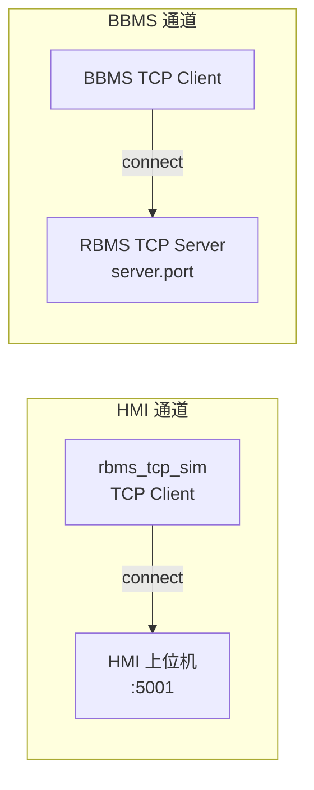

# RBMS TCP Sim

模拟 Rack BMS（RBMS）的 TCP 协议行为。**一个进程模拟一个簇**（`rack_id` 1~12）。通过 `--mode client` 或 `--mode server` **二选一**运行（默认 `client` 连上位机）。

## 架构


```mermaid
flowchart LR
    subgraph hmi [HMI 通道]
        SimC[rbms_tcp_sim<br/>TCP Client]
        HMI[HMI 上位机<br/>:5001]
        SimC -->|connect| HMI
    end
    subgraph bbms [BBMS 通道]
        BBMS[BBMS TCP Client]
        Srv[RBMS TCP Server<br/>server.port]
        BBMS -->|connect| Srv
    end
```

| 通道 | 角色 | 配置段 | 状态 |
| :--- | :--- | :--- | :--- |
| RBMS → HMI | TCP **Client** | `[client]` | **`--mode client`** |
| BBMS → RBMS | TCP **Server** | `[server]` | **`--mode server`** |

## 环境

- Python **3.13**（[uv](https://docs.astral.sh/uv/) 管理）
- 本目录为 monorepo [`py_work_script_repo`](../) 下的独立工具；验收与全局工具链见根目录 [AGENTS.md](../AGENTS.md)

**首次（子项目内运行模拟器）**

```powershell
cd 4.rbms_tcp_sim
uv sync
```

**全局 CLI（本机一次，在任意目录可用）**

```powershell
uv tool install ruff
uv tool install ty
uv tool install pytest
```

> [!IMPORTANT]
> **lint / 类型 / 测试** 请直接用 `ruff`、`ty`、`pytest`（或 `uv tool run ruff`），**不要**用 `uv run ruff`——后者会尝试构建本包并拉取 `hatchling`，在 PyPI 镜像异常时会失败。

## 配置

| 文件 | 说明 |
| :--- | :--- |
| `config/rbms_sim.toml` | 主配置：TCP 地址、周期报文、各 CSV 路径 |
| `config/rbms_suminfo.csv` | SumInfo 点表（Excel 导出） |
| `config/rbms_fault.csv` | 故障位图（25B / 200 bit） |
| `config/rbms_volt.csv` | 电芯电压 + 有效性 + AFE 总压 |
| `config/rbms_temp.csv` | 电芯/极柱/Pack/均衡板温度 |
| `config/rbms_cellbalst.csv` | 均衡状态（52B） |
| `config/rbms_cellsdr.csv` | 自放电率（416B） |

生成六类周期报文默认 CSV（含 SumInfo）：

```powershell
cd 4.rbms_tcp_sim
uv run rbms-sim --init-matrix-config
```

`config/rbms_sim.toml` 示例：

```toml
[rbms]
rack_id = 1              # 协议 srcSub（簇号 1~12）；CLI --rack-id 可覆盖

[client]
host = "127.0.0.1"       # client 模式：上位机 IP
port = 5001
auto_bind_host = true
bind_host_base = "192.168.1.137"   # rack 1→.137，rack 2→.138，…
# bind_host = "192.168.1.137"      # 显式指定时覆盖 auto
connect_retry_interval_s = 1.0   # 建连失败快速重试（秒）
reconnect_interval_s = 5.0         # 对端断开后重连（秒）

[server]
host = "0.0.0.0"         # server 模式：监听地址
port = 5002

[periodic]
messages = "suminfo,fault"
interval_s = 1.0

[suminfo]
config_path = "config/rbms_suminfo.csv"   # 相对 4.rbms_tcp_sim/ 目录
use_external_config = true
```

> [!NOTE]
> **TOML 段名与 `--mode` 对齐**：`[client]` ↔ `client`，`[server]` ↔ `server`。旧段名 `[hmi]` / `[bbms]` 仍可加载（`listen_host` / `listen_port` 会映射到 `host` / `port`）。相对路径（如 `config_path`）均相对 **`4.rbms_tcp_sim/`** 解析，而非 TOML 文件所在目录。

## 运行

**前置**：在 `4.rbms_tcp_sim/` 下已执行 `uv sync`（见 [环境](#环境)）。

### 快速开始

```powershell
cd 4.rbms_tcp_sim

# 单簇（默认 rack_id=1，源 IP 192.168.1.137）
uv run rbms-sim

# 多簇：各开一终端，仅改 --rack-id（需 config 中 auto_bind_host = true）
uv run rbms-sim --rack-id 1   # 绑定 192.168.1.137
uv run rbms-sim --rack-id 2   # 绑定 192.168.1.138

# 覆盖上位机地址
uv run rbms-sim --host 192.168.1.136 --port 5001

# 监听 BBMS（读 [server]）
uv run rbms-sim --mode server
```

### CLI 参数

| 参数 | 默认 | 说明 |
| :--- | :--- | :--- |
| `--mode` | `client` | `client` = TCP Client 连上位机；`server` = TCP Server 供 BBMS 连入 |
| `--config` | `config/rbms_sim.toml` | 主配置文件路径 |
| `--host` | （TOML） | **按 mode 解释**：client → 上位机 IP；server → 监听地址 |
| `--port` | （TOML） | **按 mode 解释**：client → 上位机端口；server → 监听端口 |
| `--bind-host` | （TOML） | **仅 client**：显式源 IP；设置后不再按 `rack_id` 自动推导 |
| `--rack-id` | `[rbms] rack_id` | 协议 `srcSub`，簇号 **1~12** |
| `--interval` | `[periodic] interval_s` | 基准周期上送间隔（秒） |
| `--no-reply` | 关 | 不自动应答 `BBMS_CtlWord` |
| `-v` / `--verbose` | 关 | DEBUG 日志（含 Rx 帧细节） |
| `--init-config` | — | 生成默认 `rbms_sim.toml` 后退出 |
| `--init-matrix-config` | — | 生成周期报文默认 CSV 后退出 |

### TOML 与 CLI 对应

| `--mode` | 使用的 TOML 段 | `--host` / `--port` 覆盖 |
| :--- | :--- | :--- |
| `client`（默认） | `[client]` | 上位机 `host:port`；源 IP 见 `auto_bind_host` / `bind_host_base` |
| `server` | `[server]` | 监听 `host:port` |

**源 IP 与 `rack_id` 自动对应**（`[client] auto_bind_host = true` 且已设 `bind_host_base` 时）：

| `rack_id` | 源 IP（`bind_host_base = "192.168.1.137"`） |
| :---: | :--- |
| 1 | 192.168.1.137 |
| 2 | 192.168.1.138 |
| N | 192.168.1.(136 + N) |

`[rbms] rack_id` 与 `--rack-id` 无关 mode，两种模式都会写入协议源地址 `(0x04, rack_id)`。

### 常用命令

```powershell
cd 4.rbms_tcp_sim

# client：单簇 / 多簇（源 IP 随 rack_id 自动绑定）
uv run rbms-sim
uv run rbms-sim --rack-id 1   # 绑定 192.168.1.137
uv run rbms-sim --rack-id 2   # 绑定 192.168.1.138
uv run rbms-sim --host 192.168.1.136 --port 5001

# 显式源 IP（覆盖 auto_bind_host）
uv run rbms-sim --bind-host 192.168.1.200

# server：BBMS 连入
uv run rbms-sim --mode server
uv run rbms-sim --mode server --host 0.0.0.0 --port 5002

# 其它
uv run rbms-sim --interval 1.0
uv run rbms-sim --no-reply
uv run rbms-sim -v

# 仅生成配置 / CSV（不启动）
uv run rbms-sim --init-config
uv run rbms-sim --init-matrix-config
```

### 多簇联调（多个 client 进程）

上位机最多识别 **12 个簇**。模拟多簇时：**每个簇一个进程**，共用同一 `[client] host:port`，**`rack_id` 必须各不相同**。若 `auto_bind_host = true`，各进程源 IP 随 `rack_id` 自动变化（无需手配 `--bind-host`）。

```powershell
cd 4.rbms_tcp_sim

# 方式 A：多终端（各开一窗口）
uv run rbms-sim --rack-id 1   # 绑定 192.168.1.137
uv run rbms-sim --rack-id 2   # 绑定 192.168.1.138

# 方式 B：PowerShell 一次拉起（后台新窗口）
1..3 | ForEach-Object {
    Start-Process -FilePath "uv" -ArgumentList @(
        "run", "rbms-sim", "--rack-id", "$_"
    ) -WorkingDirectory (Get-Location)
}

# 方式 C：每簇独立 TOML（CSV 或周期报文不同时）
uv run rbms-sim --config config/rbms_rack1.toml
uv run rbms-sim --config config/rbms_rack2.toml
```

> [!IMPORTANT]
> 两个进程**不能**使用相同 `rack_id`。默认共用同一套 CSV；仅改 `rack_id` 时各簇 payload 相同，只有协议源地址不同。查进程：`Get-Process rbms-sim`；`Stop-Process -Name rbms-sim` 会结束**全部**实例。

### 推荐：已 `uv sync` 后直接调用入口（避免重复安装）

`uv run` 每次可能重装 editable 包；日常调试可改用本目录 `.venv` 内已安装的脚本：

```powershell
cd 4.rbms_tcp_sim

.\.venv\Scripts\rbms-sim.exe --mode server
.\.venv\Scripts\rbms-sim.exe --help
```

或不经 `.exe`、直接跑模块（`.exe` 被占用时的备选）：

```powershell
.\.venv\Scripts\python.exe src\rbms_tcp_sim\cli.py --mode server
```

若仅需跳过同步、仍用 `uv run`：

```powershell
uv run --no-sync rbms-sim --mode server
```

### Windows：`rbms-sim.exe` 拒绝访问（os error 5）

`uv run` 更新包时会替换 `.venv\Scripts\rbms-sim.exe`。**仍有模拟器进程在跑** 时文件被锁定，会报「拒绝访问」。

1. 结束已有进程后再执行 `uv run`：

```powershell
Stop-Process -Name rbms-sim -Force -ErrorAction SilentlyContinue
uv run rbms-sim --mode server
```

2. 或改用上文 **`.venv\Scripts\rbms-sim.exe`** / **`python.exe src\rbms_tcp_sim\cli.py`**，无需覆盖 exe。

> [!TIP]
> 联调前用 `Get-Process rbms-sim -ErrorAction SilentlyContinue` 确认没有残留实例；BBMS 默认端口被占用时同样需先停旧进程。

### 成功建连日志示例

`--mode client`：

```text
SumInfo 配置: .../config/rbms_suminfo.csv 信号数=193 animate=False
RBMS 模拟器启动: rack_id=1 → HMI 192.168.1.136:5001 periodic=...
HMI 已连接: 192.168.1.136:5001 rack_id=1
TX SUMINFO cmd=0x03:0x01 srcSub=1 payload=310B StrCtrlHb=1
TX TEMP cmd=0x03:0x03 srcSub=2 payload=1188B          # rack_id=2 时 Wireshark Source Sub Address=0x02
BBMS_CtlWord bat_conn=3 ins_meas_en=0 bat_str_en=0 ctrl_mode=0   # 经 HMI 转发的下行控制字
```

`--mode server`：

```text
BBMS Server 监听 0.0.0.0:5002 rack_id=1 periodic=...
```

按 `Ctrl+C` 退出；退出后再启动可避免 Windows 下 exe 占用问题。

## HMI 通道

- 作为 **TCP Client** 连接 HMI，断线按 `reconnect_interval_s` 自动重连
- 每 `interval_s`（默认 1s）节拍连发所有到期报文（字母序、同轮帧间约 2ms）；每类 1s 报文稳定约 1Hz，不对齐系统整秒
- 周期上送（5B LinkMsg，经 LAN Matrix CSV 编码）：

| 报文 | cmdId | payload | 默认周期 |
| :--- | :--- | ---: | ---: |
| RBMS_SumInfo | 0x03:0x01 | 310B | 1s |
| RBMS_Fault | 0x03:0x29 | 25B | 1s |
| RBMS_Volt | 0x03:0x02 | 1012B | 1s |
| RBMS_Temp | 0x03:0x03 | 1188B | 1s |
| RBMS_CellBalSt | 0x03:0x04 | 52B | 10s |
| RBMS_CellSdr | 0x03:0x05 | 416B | 30s |

- 各报文独立 CSV；默认 **`[protocol] animate_payload = false`** → 固定 `value`（仅 SumInfo **StrCtrlHb** 递增）。演示缓变设 `animate_payload = true` 并配合 CSV `animate` 行（见 [REVIEW_CHECKLIST.md](docs/REVIEW_CHECKLIST.md) §10）
- SumInfo 上送时会话心跳覆盖 `RBMS_StrCtrlHb`（§9.3）
- 处理经 HMI 转发的 `BBMS_CtlWord` / `BBMS_SafetySignal`

## BBMS Server 功能

- 监听 `[server].host:port`，接受 BBMS TCP Client 连接
- 周期上送与 HMI 通道相同的六类报文，目标地址为 `DEV_BBMS_A (0x01:0x02)`（BBMS 侧 Client 连入后上送）：

| 报文 | cmdId | payload | 默认周期 |
| :--- | :--- | ---: | ---: |
| RBMS_SumInfo | 0x03:0x01 | 310B | 1s |
| RBMS_Fault | 0x03:0x29 | 25B | 1s |
| RBMS_Volt | 0x03:0x02 | 1012B | 1s |
| RBMS_Temp | 0x03:0x03 | 1188B | 1s |
| RBMS_CellBalSt | 0x03:0x04 | 52B | 10s |
| RBMS_CellSdr | 0x03:0x05 | 416B | 30s |

- 接收 BBMS 下发的 `BBMS_CtlWord` / `BBMS_SafetySignal`，CtlWord 自动 1B 应答（可用 `--no-reply` 关闭）
- 同一时刻仅维持一条 BBMS 连接；新连接会替换旧会话

## 工程结构

```text
src/rbms_tcp_sim/
├── matrix_config/          # CSV 加载、编码、默认生成器
│   ├── csv_common.py
│   ├── profiles.py
│   └── generators.py
├── protocol.py             # 5B LinkMsg 组帧 / 解帧 / CRC16
├── codec.py                # Matrix 物理量 ↔ payload 字节
├── matrix_runtime.py       # 周期 payload 构建、CSV 热加载
├── state.py                # frameId、StrCtrlHb、scheduler_tick
├── tx_builder.py           # 周期 Tx 组帧
├── rx_handlers.py          # CtlWord / SafetySignal 处理
├── session.py              # 单连接 Tx 线程 + Rx 循环
├── scheduler.py            # 周期上送调度
├── tcp_client_to_hmi.py
├── tcp_server_for_bbms.py
├── app_config.py
├── cli.py
└── handlers.py             # 对外 re-export
tests/                      # pytest（见下节）
config/                     # TOML + 六类 CSV 点表
docs/                       # 需求、测试规格、审查清单
```

## 测试

`tests/` 共 **20** 个文件、**128** 条用例（`pytest -q tests`），主要覆盖：

| 区域 | 代表文件 |
| :--- | :--- |
| 协议 / CRC / 脏流 resync | `test_protocol.py`, `test_protocol_errors.py` |
| Matrix 编解码 | `test_codec.py`, `test_raw_to_physical.py` |
| 周期报文 / frameId | `test_matrix_messages.py`, `test_frame_id.py`, `test_messages.py` |
| Rx / Tx 处理 | `test_handlers.py`, `test_suminfo_csv_handlers.py` |
| Session / Scheduler | `test_session.py` |
| HMI / BBMS 集成 | `test_hmi_client.py`, `test_bbms_server.py` |
| 配置 / CLI | `test_app_config.py`, `test_cli_mode.py`, `test_suminfo_config.py` |

用例与需求 ID 对照见 [docs/测试规格.md](docs/测试规格.md)。

## 质量检查

在 **monorepo 根目录**（推荐，与 CI 一致）：

```powershell
cd py_work_script_repo
ruff check 4.rbms_tcp_sim
ruff format --check 4.rbms_tcp_sim
ty check
.venv\Scripts\pytest.exe -q 4.rbms_tcp_sim/tests
```

在 **本子目录** 内：

```powershell
cd 4.rbms_tcp_sim
ruff check .
ruff format --check .
ty check
..\.venv\Scripts\pytest.exe -q tests
```

修改 Python 后须上述四项均通过，详见根目录 [AGENTS.md](../AGENTS.md)。

## 文档

| 文档 | 说明 |
| :--- | :--- |
| [docs/需求文档.md](docs/需求文档.md) | 功能需求（FR-*） |
| [docs/测试规格.md](docs/测试规格.md) | 可执行测试用例与需求追溯 |
| [docs/PLAN.md](docs/PLAN.md) | 实施计划与 Matrix 报文清单 |
| [docs/REVIEW_CHECKLIST.md](docs/REVIEW_CHECKLIST.md) | 业务逻辑逐步审查清单（无需读代码） |
| [docs/DISCREPANCIES.md](docs/DISCREPANCIES.md) | 固件 vs Matrix 差异 |
| [docs/AI开发工作流.md](docs/AI开发工作流.md) | AI 辅助开发约定 |
