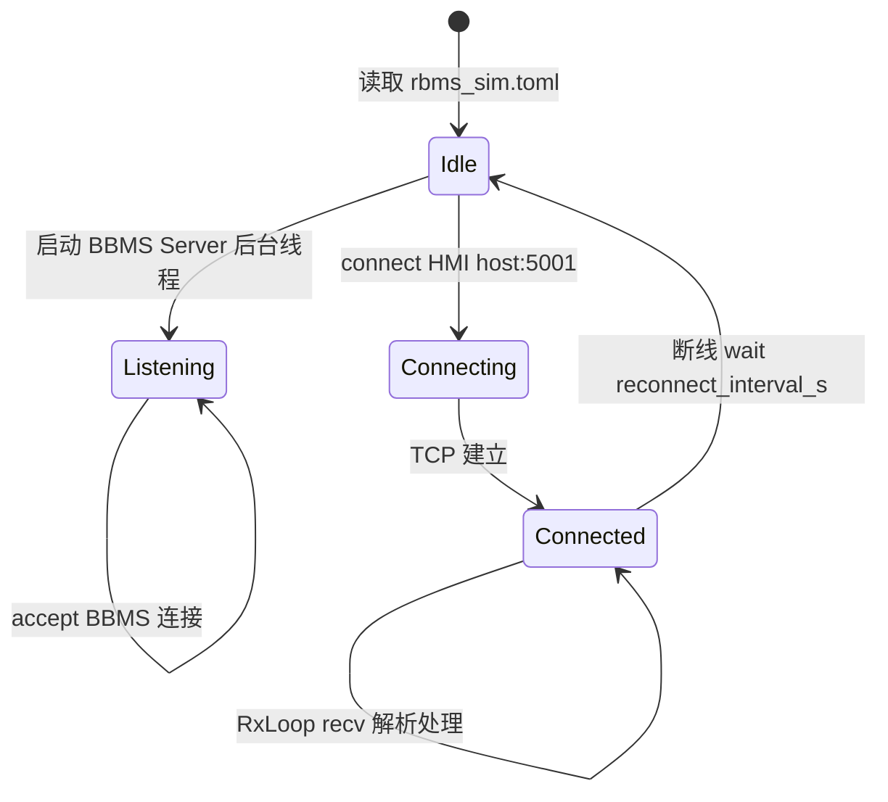
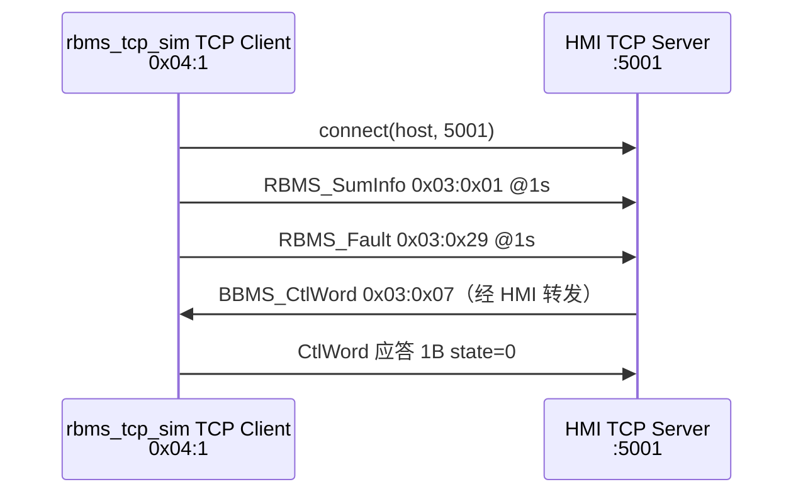
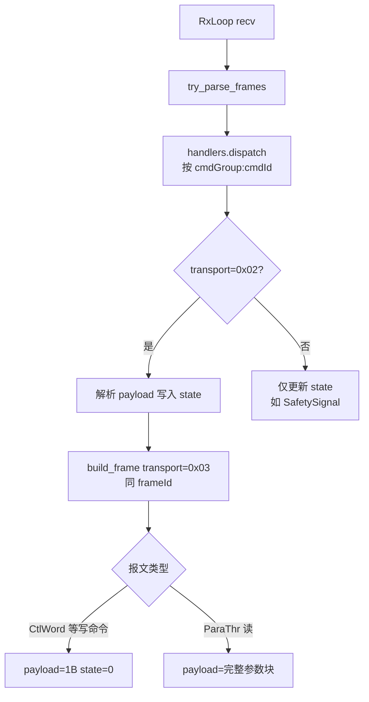

# RBMS TCP 模拟器实施计划

> [!NOTE]
> **规范来源**：[`docs/protocols/BMS2.0 LAN Matrix V1.0.44.xlsx`](../../docs/protocols/BMS2.0%20LAN%20Matrix%20V1.0.44.xlsx)（Message ID + Comm Matrix）  
> **辅助文档**：[`docs/protocols/BBMS_RBMS_Communication_Protocol.md`](../../docs/protocols/BBMS_RBMS_Communication_Protocol.md)（部分 cmdId/结构已过时，以 Excel 为准）  
> **运行环境**：Python 3.13 + uv；工程路径 `bmsSim/rbms_tcp_sim/`

## Table of Contents

- [已确认决策](#已确认决策)
- [主要目标与运行时模型](#主要目标与运行时模型)
- [网络拓扑](#网络拓扑)
- [协议帧格式](#协议帧格式)
- [LAN Matrix 报文清单](#lan-matrix-报文清单)
- [MVP 交付边界](#mvp-交付边界)
- [Rx 处理规则](#rx-处理规则)
- [目录结构](#目录结构)
- [模块职责](#模块职责)
- [CLI 参数](#cli-参数)
- [与固件/现有代码差异](#与固件现有代码差异)
- [实施步骤](#实施步骤)
- [质量门禁](#质量门禁)
- [验证方式](#验证方式)
- [风险与依赖](#风险与依赖)

---

## 已确认决策

| 项 | 决定 |
| :--- | :--- |
| **cmdId** | **严格按 Excel**（wire 字节 = Matrix 十进制 cmdid 的十六进制值）；与固件不一致处写入 [`DISCREPANCIES.md`](DISCREPANCIES.md) |
| **连接模型** | **双通道同时就绪**：① RBMS TCP Client → HMI `:5001`；② RBMS TCP Server ← BBMS（`[bbms]` 监听） |
| **第一版范围** | 六类周期 Tx（CSV 驱动）+ BBMS_CtlWord / BBMS_SafetySignal Rx；**固定第一簇**（`rack_id=1`） |
| **HMI 默认** | `127.0.0.1:5001`（`config/rbms_sim.toml` `[hmi]` 段；CLI `--hmi-host/port` 可覆盖） |
| **BBMS Server** | `[bbms]` 段；启动即与 HMI Client **并行**监听（无 `enabled` 开关） |
| **xlsx 路径** | 开发资料目录下原文件为加密格式；**权威副本**用 `docs/protocols/BMS2.0 LAN Matrix V1.0.44.xlsx` |

---

## 主要目标与运行时模型

**模拟 RBMS 的双通道 TCP 角色**（均已实现）：

| 通道 | 角色 | 状态 |
| :--- | :--- | :--- |
| HMI | TCP **Client** → 上位机 `:5001` | **已实现** |
| BBMS | TCP **Server** ← BBMS 连接 | **已实现** |



### 核心组件

| 组件 | 文件 | 职责 |
| :--- | :--- | :--- |
| **TcpHmiClient** | `tcp_client_to_hmi.py` | 连接 HMI、断线重连、驱动 Session |
| **BbmsTcpServer** | `tcp_server_for_bbms.py` | 监听 BBMS；单连接 Session |
| **SimConfig** | `app_config.py` | 加载 `rbms_sim.toml` |
| **Session** | `session.py` | 持有 `socket`、`RbmsState`；建连后启动 Tx 线程 + Rx 循环 |
| **TxScheduler** | `scheduler.py` | 按 Matrix 周期组帧并 `sendall` |
| **RxHandlers** | `rx_handlers.py` | Rx 分发与 CtlWord 应答 |
| **TxBuilder** | `tx_builder.py` | 周期 Tx 组帧 |
| **Protocol** | `protocol.py` | 5B LinkMsg 组帧/解帧、Modbus CRC16 |
| **MatrixRuntime** | `matrix_runtime.py` | CSV 缓存、热加载、payload 构建 |

> 全量 Matrix：**10 条 Tx + 25 条 Rx**。实现顺序：**HMI Client 骨架 → 5B 协议帧 → MVP 4 条报文 → BBMS Server → 表驱动补全**。

---

## 网络拓扑

### HMI 通道（已实现）



### BBMS 通道（已实现）

BBMS 作为 TCP Client 连接本机 RBMS Server；监听地址见 `rbms_sim.toml` `[bbms]` 段。

| 角色 | 地址 | 说明 |
| :--- | :--- | :--- |
| RBMS 模拟器（HMI 通道） | `0x04:1` | TCP **Client**，连接 HMI `:5001`（固定第一簇） |
| HMI 上位机 | — | TCP **Server**，默认端口 5001 |
| BBMS | `0x03:0x01` | TCP **Client**，连接 RBMS Server `:5002` |
| RBMS 模拟器（BBMS 通道） | `0x04:1` | TCP **Server**；周期 Tx **dest**=`0x03:0x01` |

---

## 协议帧格式

与 [`firmware/bsp/bsp_bms_com.c`](../../firmware/bsp/bsp_bms_com.c) 中 `createSendFrame()` / `parseCheckRbmsData()` 对齐。

### LinkMsg（5 字节）

| 偏移 | 字段 | 长度 | 说明 |
| :---: | :--- | :---: | :--- |
| 0 | Head | 1 | 固定 `0xA5` |
| 1-2 | Version & Len | 2 | version=2；len = body 字节数（byte6 起） |
| 3-4 | CRC16 | 2 | 对 **body** 做 Modbus CRC16 |
| 5+ | Body | len | 见下表 |

### Body（8 + payload 字节）

| body 偏移 | 字段 | 长度 |
| :---: | :--- | :---: |
| 0 | src | 1 |
| 1 | srcSub | 1 |
| 2 | dest | 1 |
| 3 | destSub | 1 |
| 4 | transportType | 1 |
| 5 | frameId | 1 |
| 6 | cmdGroup | 1 |
| 7 | cmdId | 1 |
| 8+ | payload | N |

### transportType

| 值 | 含义 |
| :---: | :--- |
| `0x01` | 不需要应答（周期 Tx 默认） |
| `0x02` | 需要应答（BBMS 控制字等） |
| `0x03` | 应答报文 |

> [!IMPORTANT]
> **Tx 必须使用 5B LinkMsg**（`len = 8 + payload_len`，总帧长 = 5 + len）。  
> 旧版根目录 `protocol.py` 的 `for_bbms_parser=True`（6 字节前缀）会导致 BBMS `parseCheckRbmsData` CRC/长度校验失败。

---

## LAN Matrix 报文清单

> Excel **cmdid 列为十进制**；线上 **wire 字节** = 该十进制值的十六进制（例：Debug cmdid=23 → wire `0x17`）。

### RBMS 发送（Tx，10 条）

| Wire ID | 报文 | 周期 ms | Payload | MVP |
| :--- | :--- | ---: | ---: | :---: |
| `0x03:0x01` | RBMS_SumInfo | 1000 | 310 | ✓ |
| `0x03:0x02` | RBMS_Volt | 1000 | 1012 | |
| `0x03:0x03` | RBMS_Temp | 1000 | 1188 | |
| `0x03:0x04` | RBMS_CellBalSt | 10000 | 52 | |
| `0x03:0x05` | RBMS_CellSdr | 30000 | 416 | |
| `0x03:0x29` | RBMS_Fault | 1000 | 25 | ✓ |
| `0x03:0x26` | TMS_SumInfo | 1000 | 12 | |
| `0x03:0x19` | RBMS_SOXdebugData1 | 1000 | 60 | |
| `0x03:0x1A` | RBMS_SOXdebugData2 | 1000 | 61 | |
| `0x03:0x17` | RBMS_Debug | 1000 | 26 | |

### RBMS 接收（Rx，25 条）

| Wire ID | 报文 | 发送类型 | Payload | 应答 | MVP |
| :--- | :--- | :--- | ---: | :--- | :---: |
| `0x03:0x07` | BBMS_CtlWord | Periodic 1000ms | 7 | `0x03` + 1B state | ✓ |
| `0x02:0x0E` | BBMS_SafetySignal | Periodic 1000ms | 3 | 无 | ✓ |
| `0x04:0x04` | HMI_CtlWord | OnChange | 7 | 1B state | |
| `0x03:0x25` | HMI_TMSCtrlWord(RBMS) | OnChange | 4 | 1B state | |
| `0x03:0x08` | HMI_RackCaliCtrl | OnChange | 16 | 1B state | |
| `0x03:0x09` | HMI_RBMSRlyCtrl | OnChange | 3 | 1B state | |
| `0x03:0x0A`~`0x0B` | ParaThr_CellV 读/写 | OnRequest | 36 | 读：数据；写：state | |
| `0x03:0x0C`~`0x0D` | ParaThr_RackV 读/写 | OnRequest | 20 | 同上 | |
| `0x03:0x0E`~`0x0F` | ParaThr_RackI 读/写 | OnRequest | 20 | 同上 | |
| `0x03:0x10`~`0x11` | ParaThr_ModuleT 读/写 | OnRequest | 56 | 同上 | |
| `0x03:0x12`~`0x13` | ParaThr_SOX 读/写 | OnRequest | 36 | 同上 | |
| `0x03:0x14`~`0x15` | ParaThr_AUX 读/写 | OnRequest | 2 | 同上 | |
| `0x03:0x27`~`0x28` | ParaThr_TMS 读/写 | OnRequest | 8 | 同上 | |
| `0x03:0x18` | HMI_RBMSDOCtrl | OnChange | 2 | 1B state | |
| `0x03:0x1C` | HMI_RackFaultCali | OnChange | 401 | 1B state | |
| `0x04:0x05` | HMI_FltOvTiNbr | OnRequest | 400 | 回数据 | |
| `0x04:0x08`~`0x09` | HMI_FltEna 读/写 | OnRequest | 25 | 读/写 | |

### MVP 报文字段要点

#### RBMS_SumInfo（Tx，`0x03:0x01`，310B）

- MVP：`payload[0] = 0x01`（RBMS_St 在线），其余可先填 0
- 完整字段见 Comm Matrix（RBMS_St、RBMS_ChaSt、RBMS_V、SOC 等）

#### RBMS_Fault（Tx，`0x03:0x29`，25B）

- 200 bit 故障位图；MVP 全 0
- FaultID 与 [`SystemConfiguration_BMS20_RBMS-FaultList.md`](../../docs/海辰提供的文件/开发需求/SystemConfiguration_BMS20_RBMS-FaultList.md) 对应

#### BBMS_CtlWord（Rx，`0x03:0x07`，7B）

与 [`firmware/protocol/protocol_bms.h`](../../firmware/protocol/protocol_bms.h) 中 `bbms_ctrl_t` 位域对齐：

| 字节 | 位域 | 说明 |
| :---: | :--- | :--- |
| 0 | bat_conn[1:0] | 连接/断开电池串 |
| 0 | ins_meas_en[3:2] | 绝缘检测使能 |
| 0 | bat_str_en[7:6] | 电池串使能 |
| 1 | bank_hb | Bank 心跳 |
| 2 | str_en_rack | 退簇后使能 |
| 3 | rack_exit_flag[4:0] / ctrl_mode[7:5] | 退簇标志 / 控制模式 |
| 4-5 | sys_arch_type / bank_err_lvl | 架构 / 故障等级 |
| 6-7 | disch_pwr_lim / chg_pwr_lim | SOP 限制系数 |

**应答**（Matrix）：`transport=0x03`，同 `frameId`，payload = **1 字节** `state`（0=成功，1=失败）。  
> 旧模拟器 echo 整个 7 字节 — **不符合规范**。

#### BBMS_SafetySignal（Rx，`0x02:0x0E`，3B）

| 字节 | 字段 |
| :---: | :--- |
| 0 | container_epo_flg |
| 1 | rolling_counter |
| 2 | checksum |

MVP：解析写入 `RbmsState`，**无需应答**；checksum 校验可后续 Step 2 增加。

---

## MVP 交付边界

当前已实现（Step 1 + 双通道 + 六类周期 Tx）：

- [x] **TcpHmiClient** 连接 HMI（默认 `127.0.0.1:5001`），断线重连
- [x] **BbmsTcpServer** 监听 `[bbms]`，与 HMI Client **同时启动**
- [x] 六类周期 Tx（SumInfo / Fault / Volt / Temp / CellBalSt / CellSdr），CSV 驱动 + 热加载
- [x] 收到 `BBMS_CtlWord`：解析位域、日志、回 **1B state=0**
- [x] 收到 `BBMS_SafetySignal`：解析落 state，无应答
- [x] HMI / BBMS **独立** `matrix_messages` runtime 与 Session 计数器
- [x] **src 布局**；删除根目录旧 `rbms_sim.py` / `protocol.py`
- [x] 通过 `ruff check` + `ty check` + `pytest`（**45** 项）

全量 10 Tx + 25 Rx **不在当前必须范围**（Step 2~4 后续）。

---

## Rx 处理规则



---

## 目录结构

```text
bmsSim/rbms_tcp_sim/
├── README.md
├── docs/
│   ├── PLAN.md                  # 本文档
│   ├── REVIEW_CHECKLIST.md      # 业务逻辑审查清单
│   └── DISCREPANCIES.md
├── config/
│   ├── rbms_sim.toml
│   ├── rbms_suminfo.csv
│   ├── rbms_fault.csv
│   ├── rbms_volt.csv
│   ├── rbms_temp.csv
│   ├── rbms_cellbalst.csv
│   └── rbms_cellsdr.csv
├── src/rbms_tcp_sim/
│   ├── cli.py
│   ├── app_config.py
│   ├── tcp_client_to_hmi.py     # TcpHmiClient → HMI
│   ├── tcp_server_for_bbms.py   # BbmsTcpServer
│   ├── session.py
│   ├── protocol.py
│   ├── scheduler.py
│   ├── rx_handlers.py
│   ├── tx_builder.py
│   ├── handlers.py              # re-export
│   ├── matrix_config/           # profiles、csv_common、generators
│   ├── matrix_runtime.py        # CSV 运行时；SumInfo StrCtrlHb 会话覆盖
│   ├── state.py
│   ├── messages.py
│   └── codec.py
└── tests/
    ├── test_app_config.py
    ├── test_protocol.py
    ├── test_handlers.py
    ├── test_messages.py
    ├── test_matrix_runtime.py
    ├── test_matrix_messages.py
    ├── test_bbms_server.py
    ├── test_suminfo_config.py
    └── test_suminfo_csv_handlers.py
```

---

## 模块职责

### `tcp_client_to_hmi.py` — TcpHmiClient

- 读取 `SimConfig`，`connect(hmi.host, hmi.port)`
- 断线后等待 `reconnect_interval_s` 再连
- 驱动 `Session` 生命周期

### `tcp_server_for_bbms.py` — BbmsTcpServer

- 读取 `[bbms].listen_host:listen_port`，后台 daemon 线程 `accept` 循环
- 单 BBMS 连接；新连接踢旧连接
- 与 HMI Client **并行**；独立 `matrix_messages` runtime，上送 dest=`0x03:0x01`

### `matrix_runtime.py` — MatrixRuntime

- CSV 加载、热更新、`build_message_payload`
- SumInfo：`RBMS_StrCtrlHb` 从 CSV 加载位域；上送前 Session 心跳 **覆盖 value**（见 [`REVIEW_CHECKLIST.md`](REVIEW_CHECKLIST.md) §9.3）

### `session.py` — Session

- 建连：启动 **daemon Tx 线程**（`TxScheduler.run`）
- 主线程：**Rx 循环**（`recv` timeout 1s，解帧，dispatch）
- 断线：`shutdown` + `close`，通知 Tx 线程停止

### `scheduler.py` — TxScheduler

当前周期表（`[periodic].interval_s` 为基准 tick，默认 1s）：

| 间隔 | 报文 |
| :--- | :--- |
| 1000 ms | SumInfo, Fault, Volt, Temp |
| 10000 ms | CellBalSt |
| 30000 ms | CellSdr |

未实现 Tx：TMS_SumInfo、SOXdebug×2、Debug 等（见 [`REVIEW_CHECKLIST.md`](REVIEW_CHECKLIST.md) §15）。

### `handlers.py` — 分发

```python
# 伪代码结构
def dispatch(frame: BmsFrame, state: RbmsState) -> list[bytes]:
    if frame.cmd_group == 0x03 and frame.cmd_id == 0x07:
        return handle_bbms_ctl_word(frame, state)
    if frame.cmd_group == 0x02 and frame.cmd_id == 0x0E:
        return handle_bbms_safety_signal(frame, state)
    ...
```

---

## CLI 参数

主配置：`config/rbms_sim.toml`（`--init-config` 生成模板）

| 参数 | 说明 |
| :--- | :--- |
| `--config` | TOML 路径（默认 `config/rbms_sim.toml`） |
| `--init-config` | 生成默认 `rbms_sim.toml` |
| `--init-matrix-config` | 生成六类周期报文默认 CSV 后退出 |
| `--hmi-host` / `--hmi-port` | 覆盖 `[hmi]` 上位机地址 |
| `--bbms-host` / `--bbms-port` | 覆盖 `[bbms]` 监听地址 |
| `--periodic` / `--interval` | 覆盖周期报文与基准 tick |
| `--no-reply` | 不自动应答 CtlWord |
| `-v` | DEBUG 日志 |

各报文 CSV 路径、`use_external_config`、animate 等由 TOML `[suminfo]` / `[fault]` 等段配置（无单独 SumInfo CLI）。

```bash
cd bmsSim/rbms_tcp_sim
uv sync --group dev
uv run rbms-sim --hmi-host 192.168.1.100 --hmi-port 5001 --bbms-port 5002
```

---

## 与固件/现有代码差异

> 模拟器按 **Excel** 实现；下列问题记录于 [`DISCREPANCIES.md`](DISCREPANCIES.md)。

### 1. cmdId 误用（`protocol_bms_rbms.c`）

固件 `rbmsParseRecvDataFun` 使用 C **十六进制字面量**，与 Matrix **十进制 cmdid** 混淆：

| 报文 | Excel wire | 固件 `cmdId ==` | 结论 |
| :--- | :--- | :--- | :--- |
| RBMS_Debug | `0x17` | `0x23` | 错误 |
| RBMS_SOXdebugData1 | `0x19` | `0x25` | 错误 |
| RBMS_SOXdebugData2 | `0x1A` | `0x26` | 错误 |
| TMS_SumInfo | `0x26` | `0x38` | 错误 |
| ParaThr_TMS 读 | `0x27` | `0x27` 但绑 TMS 点表 | 语义错误 |

cmdId 1~9（SumInfo~CellSdr、BBMS_CtlWord）数值重合，**MVP 无此问题**。

### 2. 旧模拟器问题（根目录 `rbms_sim.py` / `protocol.py`）

| 问题 | 说明 |
| :--- | :--- |
| Tx 帧格式 | 使用 6 字节前缀，BBMS CRC 校验可能失败 |
| CtlWord 应答 | echo 7 字节 payload，应为 1 字节 state |
| 默认端口 | 旧默认 5000，现改为 **5001** |
| `build_frame` bug | `for_bbms_parser=False` 路径 `return bytes(frame[:body_len])` 截断帧 |

### 3. 文档与 Matrix 不一致

- `BBMS_RBMS_Communication_Protocol.md` 写 HMI_TMSCtrlWord(RBMS) 为 `0x03:37`；Matrix 为 cmdid=37 → wire **`0x25`**
- RBMS_SOXdebugData2：Matrix **61B**，固件注释 **62B**

### 4. 加密 xlsx

`docs/海辰提供的文件/开发资料/BMS2.0 LAN Matrix V1.0.44.xlsx` 为 `%TSD-Header-###%` 加密，不可解析。请使用 `docs/protocols/` 下未加密副本。

---

## 实施步骤

### Step 0：src 布局 + HMI Client 骨架

- [x] 创建 `src/rbms_tcp_sim/` 包结构
- [x] 更新 `pyproject.toml`（hatchling、ruff、ty、`rbms-sim` 入口）
- [x] 实现 `tcp_client_to_hmi.py` / `session.py` / `app_config.py` + `cli.py`
- [x] 删除根目录 `rbms_sim.py`、`protocol.py`、旧 `server.py`
- [x] 验收：`uv run rbms-sim -h`；Client 可连接 HMI

### Step 1：协议层 + MVP 收发

- [x] `protocol.py`：5B LinkMsg 组帧；Rx 兼容 BBMS 5B 发送
- [x] `messages.py`：SumInfo（310B）、Fault（25B）默认 payload
- [x] `handlers.py`：CtlWord + SafetySignal
- [x] `scheduler.py`：1s 周期 Tx
- [x] `session.py`：Tx 线程 + Rx 循环 wired
- [x] 验收：mock/联调 — 周期 TX + CtlWord 1B 应答

### Step 2：Matrix 导出 + 报文注册表

- [ ] `tools/export_lan_matrix.py` → `generated/matrix_rbms.json`
- [ ] `matrix_loader.py` + `messages.py` 表驱动注册 35 条消息

### Step 3：补全 Tx（10 条）

- [x] `codec.py` 位域编解码
- [x] 六类 Matrix 周期 Tx（SumInfo~CellSdr）+ CSV 热加载
- [x] Scheduler 1s / 10s / 30s 分频
- [ ] 其余 4 条 Tx（Debug、SOXdebug、TMS_SumInfo 等）

### Step 4：补全 Rx（25 条）

- [ ] HMI_*、ParaThr 读/写对
- [ ] 大 payload（401B/400B）handler

### Step 5：测试与文档

- [x] `pytest`：protocol、handlers、BBMS Server、Matrix CSV（45 项）
- [x] `README.md`、`REVIEW_CHECKLIST.md`、`DISCREPANCIES.md`
- [ ] `uv run check` 一键门禁（可选）

---

## 质量门禁

> 所有 Python 代码合入前必须通过。

### 编码约束

| 规则 | 要求 |
| :--- | :--- |
| 类型注解 | 参数、返回值、类属性必须标注；禁止裸 `Any` |
| 忽略注释 | 禁止 `# type: ignore` |
| import | 文件顶部；ruff isort 通过 |
| 语法 | Python 3.13（`int \| None`、`list[str]`） |

### 命令

```bash
cd bmsSim/rbms_tcp_sim
uv sync --group dev
uv run ruff check src tests
uv run ruff format --check src tests
uv run ty check src tests
uv run pytest
```

---

## 验证方式

1. **主流程（必过）**：`uv run rbms-sim` → HMI 日志 `已连接` + BBMS 日志 `Server 监听` → 周期六类 Tx → CtlWord 1B 应答
2. **静态质量（必过）**：`ruff check` + `ty check` + `pytest`（**45** 个单元/集成测试）
3. **协议单元测试**：`parse_check_frame`、CtlWord 应答长度=1、SumInfo 310B、StrCtrlHb 会话覆盖
4. **全量 Matrix（后续）**：其余 4 条 Tx、约 23 条 Rx handler
5. **联调**：上位机 Rack 心跳递增；BBMS 直连 `:5002`（与 HMI 并行）
6. **业务逻辑审查**：见 [`REVIEW_CHECKLIST.md`](REVIEW_CHECKLIST.md)

---

## 风险与依赖

| 风险 | 说明 | 缓解 |
| :--- | :--- | :--- |
| 加密 xlsx | 开发资料目录原文件不可用 | 统一用 `docs/protocols/` 副本 |
| 固件 cmdId 错误 | MVP 不含 Debug/SOX/TMS Tx | DISCREPANCIES 预先说明；后续联调暴露固件 bug |
| 大 payload | Volt 1012B / Temp 1188B | Step 3 注意 send 缓冲与日志 `-v` |
| Plan 模式阻塞写码 | Cursor Plan 模式仅允许 md | 执行阶段切换 Agent 模式或 shell 写文件 |

---

## 变更记录

| 日期 | 变更 |
| :--- | :--- |
| 2026-06-10 | 初版；确认 cmdId/连接模型/MVP/端口 5001 |
| 2026-06-10 | 扩充完整 Matrix 清单、协议帧、模块职责、固件差异 |
| 2026-06-10 | 架构纠正：RBMS 作 HMI TCP Client（:5001）；BBMS Server 配置预留；HMI 联调通过 |
| 2026-06-10 | 双通道默认同时就绪；固定第一簇；收敛 SumInfo 运维特例；45 项测试 |
