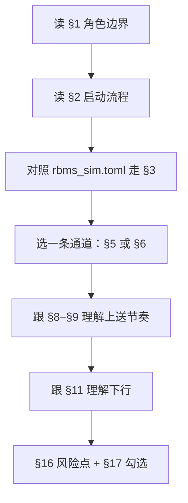
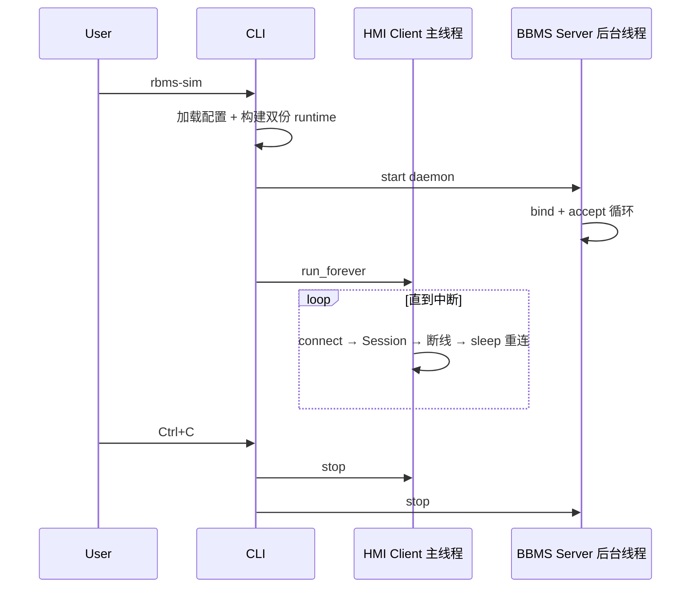
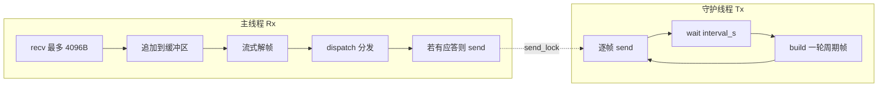
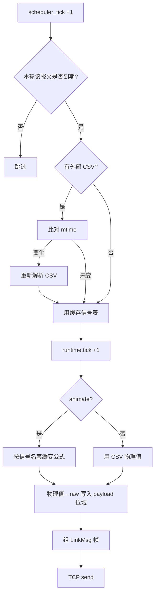

# RBMS TCP Sim 业务逻辑审查清单

> **文档定位**：供产品经理 / 业务分析师 / 联调工程师审查「模拟器实际会做什么」，**不依赖阅读源码**。  
> **版本锚点**：与当前实现一致（双通道同时就绪、固定第一簇、六类周期 Tx、45 项自动化测试）。  
> **最后同步**：2026-06-10

## Table of Contents

- [0. 如何使用本文档](#0-如何使用本文档)
- [1. 系统边界与角色](#1-系统边界与角色)
- [2. 进程启动全流程](#2-进程启动全流程)
- [3. 配置加载与合并规则](#3-配置加载与合并规则)
- [4. CSV 点表加载规则](#4-csv-点表加载规则)
- [5. HMI 通道完整生命周期](#5-hmi-通道完整生命周期)
- [6. BBMS 通道完整生命周期](#6-bbms-通道完整生命周期)
- [7. 单条 TCP 会话（Session）内部逻辑](#7-单条-tcp-会话session内部逻辑)
- [8. 周期上送调度逻辑](#8-周期上送调度逻辑)
- [9. 单条周期报文从 CSV 到线上的步骤](#9-单条周期报文从-csv-到线上的步骤)
- [10. Animate 缓变规则](#10-animate-缓变规则)
- [11. 下行报文（Rx）处理决策树](#11-下行报文rx处理决策树)
- [12. 协议帧：组帧与解帧步骤](#12-协议帧组帧与解帧步骤)
- [13. 运行时计数器与隔离规则](#13-运行时计数器与隔离规则)
- [14. 六类周期报文参数表](#14-六类周期报文参数表)
- [15. 尚未实现的功能范围](#15-尚未实现的功能范围)
- [16. 需人工确认的风险点](#16-需人工确认的风险点)
- [17. 审查勾选表](#17-审查勾选表)

---

## 0. 如何使用本文档

### 0.1 审查目标

确认模拟器在以下维度是否符合你的业务预期：

1. **连谁、何时连、断线怎么办**
2. **每秒 / 每 10 秒 / 每 30 秒发什么**
3. **报文里每个字段从哪来（CSV / 计数器 / 公式）**
4. **收到下行命令后做什么、是否应答**
5. **哪些能力明确不做**

### 0.2 建议审查顺序



### 0.3 符号说明

| 符号 | 含义 |
| :--- | :--- |
| **必须** | 不满足则行为错误 |
| **应当** | 强烈建议一致；偏差需记录 |
| **可选** | 可配置关闭或不影响主流程 |
| `rack_id` | 簇编号，**固定为 1**（暂时仅模拟第一簇；协议 `src_sub`） |
| **物理值** | CSV `value` 列的工程单位数值（非报文 raw） |
| **raw** | 写入报文的整数：`raw = round((物理值 - offset) / Resolution)` |

---

## 1. 系统边界与角色

### 1.1 模拟器扮演谁

模拟器扮演 **第一簇 Rack BMS（RBMS）**，同时维护 **两条独立 TCP 通道**：

| 通道 | 模拟器网络角色 | 对端 | 配置段 | 状态 |
| :--- | :--- | :--- | :--- | :--- |
| **HMI 通道** | TCP **Client**（主动连接） | 上位机 HMI | `[hmi]` | 已实现 |
| **BBMS 通道** | TCP **Server**（被动监听） | BBMS 主控 | `[bbms]` | 已实现 |

两条通道 **启动后同时就绪、并行运行**（无 `enabled` 开关）。

### 1.2 模拟器不做的事

- 不模拟多簇（一次进程固定 **第一簇**，`rack_id=1`）
- 不实现 Matrix 中除 6 类周期 Tx + 2 类 Rx 以外的报文
- 不对 SafetySignal 做 checksum 校验
- 不把收到的控制字写回 CSV 或改变周期上送内容（仅内存记录 + 日志）
- 不提供 Web UI / REST API

### 1.3 设备地址（协议层）

| 名称 | 地址 (dev, sub) | 用途 |
| :--- | :--- | :--- |
| RBMS 源地址 | `(0x04, rack_id)` | 所有周期上送、CtlWord 应答的 **src** |
| HMI 通道上送目标 | `(0x01, 0x00)` | HMI 通道周期 Tx 的 **dest** |
| BBMS 通道上送目标 | `(0x03, 0x01)` | BBMS 通道周期 Tx 的 **dest** |
| BBMS 客户端（典型） | `(0x03, 0x01)` | 测试中 CtlWord 来源地址 |

> [!IMPORTANT]
> HMI 与 BBMS 通道 **上送目标地址不同**；联调 BBMS 直连时需确认对端是否接受 `dest=0x03:0x01`。

---

## 2. 进程启动全流程

用户执行 `uv run rbms-sim`（或带 CLI 参数）后，按 **严格顺序** 发生：

### 2.1 仅初始化模式（提前退出）

| 步骤 | 条件 | 行为 | 退出码 |
| :---: | :--- | :--- | :---: |
| S-01 | `--init-config` | 写出默认 `rbms_sim.toml` | 0 |
| S-02 | S-01 且未带其他 init | **进程结束** | 0 |
| S-03 | `--init-matrix-config` | 生成 **六类** 周期报文默认 CSV（SumInfo 复制模板，其余程序生成） | 0 |
| S-04 | S-03 且配置文件不存在 | **进程结束** | 0 |

### 2.2 正常运行模式

| 步骤 | 行为 | 失败时 |
| :---: | :--- | :--- |
| S-10 | 解析 CLI 参数，初始化日志（默认 INFO；`-v` 为 DEBUG） | — |
| S-11 | 读取 TOML（默认 `config/rbms_sim.toml`） | 文件不存在 → 退出并提示 `--init-config` |
| S-12 | CLI 覆盖合并进配置（见 §3） | 非法 `--periodic` → 报错退出 |
| S-13 | 对 `[periodic]` 中每种报文检查 CSV 是否存在（见 §4.2） | 缺失 → 自动生成默认 CSV |
| S-14 | **构建 HMI 通道专用** 报文运行时（一份独立拷贝） | — |
| S-15 | **再构建一份** BBMS 通道专用运行时（与 HMI **不共享**） | — |
| S-16 | INFO 日志打印每种报文：路径、信号数、animate、周期、payload 长度 | — |
| S-17 | 后台线程开始 BBMS `listen` | bind 失败 → 线程内 WARNING |
| S-18 | 主线程进入 HMI Client 无限重连循环 | — |
| S-19 | 用户 Ctrl+C 或异常 | 停止 HMI → 停止 BBMS Server → join 后台线程（最多 3s） |



---

## 3. 配置加载与合并规则

### 3.1 TOML 段与含义

| 段 | 关键字段 | 默认值 | 业务含义 |
| :--- | :--- | :--- | :--- |
| `[hmi]` | `host`, `port` | 127.0.0.1:5001 | 上位机地址 |
| `[hmi]` | `reconnect_interval_s` | 5.0 | HMI 断线后等待秒数再连 |
| `[bbms]` | `listen_host`, `listen_port` | 0.0.0.0:5002 | BBMS 监听地址（启动即监听） |
| `[periodic]` | `messages` | 六类全选 | 见 §14 |
| `[periodic]` | `interval_s` | 1.0 | **基准调度 tick**（秒） |
| `[protocol]` | `auto_reply_ctl_word` | true | 是否自动应答 CtlWord |
| `[suminfo]` 等 | `config_path` | `config/rbms_*.csv` | 相对 **项目根** |
| `[suminfo]` 等 | `use_external_config` | true | false 则用内置默认 |

### 3.2 CLI 覆盖优先级

**CLI 参数 > TOML 文件**（仅当参数显式传入时覆盖）：

| CLI 参数 | 覆盖项 |
| :--- | :--- |
| `--hmi-host` / `--hmi-port` | `[hmi]` |
| `--bbms-host` / `--bbms-port` | `[bbms]` 监听 |
| `--periodic` | `[periodic].messages`（支持 `none`） |
| `--interval` | `[periodic].interval_s` |
| `--no-reply` | 强制不应答 CtlWord |
| `-v` | DEBUG 日志 |

> [!NOTE]
> 各报文 CSV 路径与是否使用外部文件，统一由 TOML `[suminfo]` / `[fault]` 等段的 `config_path`、`use_external_config` 配置；无单独 CLI 覆盖项。

### 3.3 periodic 解析规则

1. 按逗号拆分、去空格、转小写
2. 若含 `none` → 周期上送集合为空（仍可能收 Rx）
3. 未知报文名 → **启动失败**
4. 合法名：`suminfo`, `fault`, `volt`, `temp`, `cellbalst`, `cellsdr`

---

## 4. CSV 点表加载规则

### 4.1 通用 CSV 格式要求

1. 必须有表头；支持 `#` 注释行
2. 必须能映射出列：`signal`、`Byte` 或 `Start Bit`、`Bit Length`、`Resolution`、`value`
3. 可选行：`animate`（signal 列固定写 `animate`，value 列 true/false）
4. 每行一个信号；重复 signal 名 → **后行覆盖前行**（打 WARNING）
5. 缺 Byte/Start Bit 或缺 Bit Length/Resolution → **跳过该行**

### 4.2 启动时 CSV 存在性策略

| 报文 | 文件缺失时 |
| :--- | :--- |
| 六类周期报文（含 suminfo） | **自动生成**：suminfo 复制内置模板，其余走内置生成器 |

### 4.3 初次加载 vs 热加载

| 时机 | 行为 |
| :--- | :--- |
| **进程启动** | 读 CSV → 解析为信号表 → 存入该通道专属 runtime |
| **每次组 payload 前** | 检查文件 `mtime`；若变化则 **重新读 CSV** 并替换内存信号表 |
| **mtime 读失败** | 保留旧缓存，打 WARNING |
| **热加载读失败** | 保留旧缓存，打 WARNING |

### 4.4 内置默认（`use_external_config = false`）

| 报文 | 信号来源 | 默认 animate |
| :--- | :--- | :--- |
| suminfo | 内置 `config/rbms_suminfo.csv` 模板 | 模板中 `animate` 行（默认 false） |
| fault | 内置生成器 | false |
| volt / temp / cellbalst / cellsdr | 内置生成器 | true |

需要演示缓变时：编辑对应 CSV 的 `animate` 行，或 TOML 设 `use_external_config = false` 后改内置模板/生成器逻辑。

---

## 5. HMI 通道完整生命周期

### 5.1 连接阶段

| 步骤 | 行为 |
| :---: | :--- |
| H-01 | 日志：`RBMS 模拟器启动: rack_id=… → HMI host:port periodic=…` |
| H-02 | 创建 TCP 连接（超时 10s） |
| H-03 | 开启 TCP keepalive |
| H-04 | 创建 Session（peer_role=HMI，上送 dest=`0x01:0x00`） |
| H-05 | Session.start：启动 Tx 守护线程 + 主线程进入 Rx 循环 |

### 5.2 连接保持阶段

- Tx 线程：按 §8 周期上送
- Rx 循环：按 §11 处理下行
- 任一线程检测到断线 → Session 结束

### 5.3 断线与重连

| 步骤 | 触发 | 行为 |
| :---: | :--- | :--- |
| H-20 | recv 返回空 / OSError | 日志「连接断开」或「对端关闭」 |
| H-21 | Session finally | 关闭 socket；日志「会话结束」 |
| H-22 | 回到 H-02 前 | 日志「N 秒后重连」；sleep `reconnect_interval_s` |
| H-23 | 连接失败 OSError | WARNING；同样 sleep 后重试 |
| H-24 | 用户 Ctrl+C | 跳出循环，不再重连 |

### 5.4 并发约束

- 对 HMI：**同一时刻仅 1 条** TCP 连接
- 断线重连后：**新建 Session** → frame_id、StrCtrlHb、scheduler_tick 归零（见 §13 注意）

---

## 6. BBMS 通道完整生命周期

### 6.1 监听阶段

| 步骤 | 行为 |
| :---: | :--- |
| B-01 | `SO_REUSEADDR`；bind `listen_host:listen_port`；listen backlog=1 |
| B-02 | accept 超时 1s（便于响应 stop） |
| B-03 | 日志：`BBMS Server 监听 host:port rack_id=… periodic=…` |

### 6.2 新连接接入

| 步骤 | 行为 |
| :---: | :--- |
| B-10 | accept 成功 → 设置 keepalive |
| B-11 | 若已有旧 Session → **先 stop 旧连接**（日志「新 BBMS 连接，关闭旧会话」） |
| B-12 | 创建 Session（peer_role=BBMS，上送 dest=`0x03:0x01`） |
| B-13 | Session.start（同 HMI） |
| B-14 | Session 结束 → 清理 active_session 引用 |

### 6.3 并发约束

- **同一时刻仅 1 个 BBMS 客户端** 会话
- BBMS 与 HMI 通道：**独立 Session、独立计数器、独立 CSV runtime 拷贝**

---

## 7. 单条 TCP 会话（Session）内部逻辑

每个 Session 内含 **两个并发活动**：



### 7.1 创建 Session 时初始化的状态

| 状态项 | 初始值 | 作用域 |
| :--- | :--- | :--- |
| `frame_id` | 0 | 本 Session |
| `str_ctrl_hb` | 0 | 本 Session |
| `scheduler_tick` | 0 | 本 Session |
| `bbms_ctrl` | 7 字节零 | 本 Session |
| `bbms_safety` | 零 | 本 Session |
| 各报文 runtime.tick | 0 | 本 Session 持有的 runtime 拷贝 |

### 7.2 发送互斥

- 周期 Tx 与 Rx 应答 **共用一把 send 锁**，避免交错写 socket

### 7.3 停止 Session

1. 置位 stop 事件 → Tx 线程下一轮退出
2. shutdown + close socket
3. Rx 循环退出 finally
4. 可选回调 `on_close`（BBMS 用于清除 active_session）

---

## 8. 周期上送调度逻辑

### 8.1 基准节拍

- 配置项：`[periodic].interval_s`（默认 **1.0 秒**）
- Tx 线程每轮：
  1. 构建 **一轮** 待发帧列表
  2. **按报文名字母序** 依次 send
  3. `wait(interval_s)` 或直到 stop

### 8.2 单轮内「是否发送某报文」判定

记 `scheduler_tick` = 本轮全局轮次（每轮 +1），`base` = `interval_s`，`T_msg` = 该报文 Matrix 周期（秒）：

| 条件 | 本轮是否发送 |
| :--- | :--- |
| `T_msg <= base` | **每轮都发** |
| `T_msg > base` | 仅当 `scheduler_tick % round(T_msg/base) == 0` 时发送 |

**示例**（`base=1s`）：

| 报文 | Matrix 周期 | 实际发送频率 |
| :--- | ---: | :--- |
| suminfo / fault / volt / temp | 1s | 每 1s |
| cellbalst | 10s | 每 10s |
| cellsdr | 30s | 每 30s |

> [!NOTE]
> 这是 **tick 整除** 而非墙钟对齐；进程启动时刻不影响相对间隔，但不保证与整点秒对齐。

### 8.3 单轮发送顺序

固定字母序：`cellbalst` → `cellsdr` → `fault` → `suminfo` → `temp` → `volt`（仅包含 `[periodic]` 启用的项）。

### 8.4 每帧公共头字段

| 字段 | 值 |
| :--- | :--- |
| src | `(0x04, rack_id)` |
| dest | HMI 通道 `(0x01,0x00)`；BBMS 通道 `(0x03,0x01)` |
| transport_type | `0x01`（不需应答） |
| frame_id | 本 Session 递增，**8bit 回绕** |
| cmd_group / cmd_id | 见 §14 |

---

## 9. 单条周期报文从 CSV 到线上的步骤

以下对 **每一种** 启用的周期报文，每次发送前执行：



> [!NOTE]
> **SumInfo 唯一附加步骤**：在步骤 K 之后、组帧之前，用 Session 递增心跳 **覆盖** `RBMS_StrCtrlHb` 的 value（位域仍来自 CSV，见 §9.3）。

### 9.1 物理值编码规则

对每个信号：

1. `raw = round((value - offset) / Resolution)`
2. 按 `Start Bit` + `Bit Length` 写入 payload（Intel 小端位域）
3. `data_type` 未指定时：按位宽与 offset 符号 **自动推断** Uint/Int

### 9.2 后写覆盖

同一 payload 内若位域重叠，**后处理的信号覆盖先写的位**（CSV 行顺序）。

### 9.3 唯一例外：`RBMS_StrCtrlHb` 心跳

六类报文共用 §9 流程；**仅 SumInfo** 在 payload 编码完成后多一步：

1. Session：`str_ctrl_hb = (上一值 + 1) & 0xFFFF`
2. 按 CSV 中 `RBMS_StrCtrlHb` 行的位域写入（缺行时回退 Matrix 字节 160–161，Uint16 小端 @ payload `[159:161]`）
3. CSV 该行 `value` **不参与上送**（模板注释「value 可忽略」指此）

审查：上位机心跳每次 +1；与 SoC 等 CSV 字段独立。

---

## 10. Animate 缓变规则

仅当该报文 runtime 的 `animate=true` 时，在 CSV 物理值基础上叠加变化（tick = 该报文专属 runtime.tick）：

| 信号族（名称匹配） | 变化方式（摘要） |
| :--- | :--- |
| 电芯电压 `CellVolt*`（非 Validity） | 正弦 ±15mV，带索引相位 |
| AFE 总压 `AfeVolt*` | 正弦 ±500 |
| 温度类 `*Temp*`（非 Validity） | 正弦 ±2°C |
| 故障位 `Fault*` / `RBMS_Fault*` | 脉冲 0/1 或叠加 |
| 均衡 `CellBalStatus*` | 正弦调制 |
| 自放电 `CellSdRate*` | 正弦 ±5，钳位 0~127.5 |
| `RBMS_SoC` | 正弦 ±5，钳位 10~100 |
| `RBMS_V` / `RBMS_DCBusV` | 正弦 ±6 |
| `RBMS_A_HighAccu` | 正弦 ±15 |
| 高压盒温度等 | 正弦 ±2~±3 |
| 极值位置 `CellVMaxPstn` 等 | 与 tick 取模相关的整数 |
| **其他信号** | **保持 CSV 值不变** |

`animate` 来源优先级：

1. 外部 CSV 中 `animate` 行（`use_external_config = true` 时）
2. 内置默认：suminfo 读模板 `animate` 行；fault 为 false；volt/temp/cellbalst/cellsdr 为 true

---

## 11. 下行报文（Rx）处理决策树

每解析出一帧：

```
收到一帧
├─ cmd = 0x03:0x07 (BBMS_CtlWord)
│   ├─ payload < 7 字节 → WARNING，不应答
│   ├─ 解析 7 字节 → 写入 Session.bbms_ctrl
│   ├─ INFO 日志：bat_conn, ins_meas_en, bat_str_en, ctrl_mode
│   └─ 若 auto_reply 且 transport=0x02(需应答)
│       └─ 回一帧：transport=0x03，payload=[0]（state=OK）
│
├─ cmd = 0x02:0x0E (BBMS_SafetySignal)
│   ├─ payload < 3 字节 → WARNING
│   ├─ 解析 3 字节 → 写入 Session.bbms_safety
│   ├─ INFO 日志：epo, counter, checksum
│   └─ 不应答
│
└─ 其他 cmd → DEBUG 日志「未专门处理」，不应答
```

### 11.1 BBMS_CtlWord 7 字节位域（payload[0..6]）

| 字段 | 来源 | 说明 |
| :--- | :--- | :--- |
| bat_conn | byte0 bit0-1 | 电池连接 |
| ins_meas_en | byte0 bit2-3 | 绝缘检测使能 |
| bat_str_en | byte0 bit6-7 | 电池串使能 |
| bank_hb | byte1 | 银行心跳 |
| str_en_rack | byte2 | 簇使能位图 |
| ctrl_mode | byte3 bit0-2 | 控制模式 |
| byte4~6 | — | 解析为 raw 保留，日志未展开 |

### 11.2 CtlWord 应答帧字段

| 字段 | 值 |
| :--- | :--- |
| src | `(0x04, rack_id)` |
| dest | **请求帧的 src / src_sub** |
| transport_type | `0x03`（应答） |
| frame_id | **与请求相同** |
| cmd_group / cmd_id | **与请求相同** |
| payload | **1 字节**，固定 `0x00` |

### 11.3 SafetySignal 3 字节

| 偏移 | 字段 |
| :---: | :--- |
| 0 | container_epo_flg |
| 1 | rolling_counter |
| 2 | checksum（**只存不验**） |

---

## 12. 协议帧：组帧与解帧步骤

### 12.1 线上帧结构（LinkMsg 5 + Body）

| 区段 | 长度 | 内容 |
| :--- | ---: | :--- |
| Head | 1B | 固定 `0xA5` |
| Version&Len | 2B | version=2；len=body 字节数 |
| CRC16 | 2B | 对 **body** Modbus CRC16，小端 |
| Body | len | 见下 |

Body = 8 字节头 + payload：

| 偏移 | 字段 |
| :---: | :--- |
| 0 | src |
| 1 | src_sub |
| 2 | dest |
| 3 | dest_sub |
| 4 | transport_type |
| 5 | frame_id |
| 6 | cmd_group |
| 7 | cmd_id |
| 8+ | payload |

**总长度** = 5 + len(body)。

### 12.2 接收缓冲解帧步骤

1. 在缓冲区找 `0xA5` 帧头；找不到则清空缓冲
2. 头不完整 → 等待更多数据
3. 读 version/len；非法则偏移 +1 继续找
4. 整帧未到齐 → 等待
5. CRC 校验失败 → 偏移 +1 继续找（**不抛错**）
6. 校验通过 → 产出 BmsFrame；继续解析缓冲剩余

### 12.3 transport_type 枚举

| 值 | 含义 | 本模拟器用法 |
| :---: | :--- | :--- |
| 0x01 | 不需应答 | 周期上送 |
| 0x02 | 需应答 | CtlWord 请求 |
| 0x03 | 应答帧 | CtlWord 应答 |

---

## 13. 运行时计数器与隔离规则

### 13.1 计数器一览

| 计数器 | 归属 | 递增时机 | 回绕 |
| :--- | :--- | :--- | :--- |
| `frame_id` | Session | 每发一帧周期 Tx | 8bit |
| `str_ctrl_hb` | Session | 每发一次 SumInfo | 16bit |
| `scheduler_tick` | Session | 每轮 Tx 调度 | 无 |
| `runtime.tick` | 报文 runtime | 每次该报文组 payload | 无 |

### 13.2 双通道隔离（必须理解）

| 资源 | HMI 通道 | BBMS 通道 |
| :--- | :--- | :--- |
| matrix runtime 对象 | **独立拷贝** | **独立拷贝** |
| Session 计数器 | 独立 | 独立 |
| animate tick | 独立 | 独立 |
| CSV 热加载 | 各自 mtime | 各自 mtime |

> HMI 断线重连 **不重建** runtime 对象（同一进程内 HMI runtime 持续存在）；但 **新建 Session**，故 frame_id / StrCtrlHb **在同一 HMI 连接序列内连续**，重连后 Session 对象新建时从 0 再计。

---

## 14. 六类周期报文参数表

| 配置名 | Matrix 名 | cmd | payload | 默认周期 | 默认 CSV |
| :--- | :--- | :--- | ---: | ---: | :--- |
| suminfo | RBMS_SumInfo | 0x03:0x01 | 310B | 1s | rbms_suminfo.csv |
| fault | RBMS_Fault | 0x04:0x01 | 25B | 1s | rbms_fault.csv |
| volt | RBMS_Volt | 0x03:0x02 | 1012B | 1s | rbms_volt.csv |
| temp | RBMS_Temp | 0x03:0x03 | 1188B | 1s | rbms_temp.csv |
| cellbalst | RBMS_CellBalSt | 0x03:0x04 | 52B | 10s | rbms_cellbalst.csv |
| cellsdr | RBMS_CellSdr | 0x03:0x05 | 416B | 30s | rbms_cellsdr.csv |

---

## 15. 尚未实现的功能范围

以下在 LAN Matrix 中存在，**本模拟器明确不做**：

### 15.1 未实现的周期 Tx（4 类示例）

| 报文 | cmd |
| :--- | :--- |
| TMS_SumInfo | 0x03:0x26 |
| RBMS_SOXdebugData1/2 | 0x03:0x19 / 0x1A |
| RBMS_Debug | 0x03:0x17 |

### 15.2 未实现的 Rx（除 2 类外约 23 条）

包括但不限于：

- HMI_CtlWord、HMI_TMSCtrlWord、各类 ParaThr 读写
- HMI_RBMSRlyCtrl、HMI_RBMSDOCtrl、HMI_RackFaultCali
- HMI_FltOvTiNbr、HMI_FltEna 读写 等

收到上述报文 → **仅 DEBUG 记录，不应答**。

### 15.3 未实现的产品能力

- 多簇 / 多 BBMS 客户端并发
- CtlWord 失败态（非 0 state）
- SafetySignal checksum 校验
- 根据 CtlWord 改变上送内容或停发
- 墙钟对齐的绝对周期调度

---

## 16. 需人工确认的风险点

> 对照 Excel Matrix / 抓包 / 上位机显示逐项确认。

| # | 风险点 | 当前行为 | 建议核对 |
| :---: | :--- | :--- | :--- |
| R1 | SumInfo 点表版本 | 以 `config/rbms_suminfo.csv` 为准 | 与 Excel 逐行对比 Byte/Start Bit |
| R2 | HMI 上送 dest | 固定 `0x01:0x00` | 上位机是否按此地址收 |
| R3 | BBMS 上送 dest | 固定 `0x03:0x01` | BBMS 直连是否接受 |
| R4 | StrCtrlHb 字节序 | LE @ payload[159:161] | 心跳是否 +1 |
| R5 | RBMS_St 默认值 | 取决于 CSV 物理值 | 上位机「在线/使能」显示 |
| R6 | 有符号字段推断 | offset&lt;0 → Int 类型 | 负温度等抓包 |
| R7 | 位域重叠 | 后写覆盖 | 异常字段值 |
| R8 | CtlWord 应答 | 恒 state=0 | 失败场景协议要求 |
| R9 | Safety checksum | 不校验 | 协议是否要求 RBMS 验 |
| R10 | Fault 默认 | CSV 驱动，可 animate 脉冲 | 故障联调预期 |
| R11 | frame_id 回绕 | 8bit | 长时间运行上位机表现 |
| R12 | HMI 重连 | 新 Session，计数器归零 | 是否期望跨连接连续心跳 |

---

## 17. 审查勾选表

复制到评审记录中使用。

### 17.1 启动与配置

- [ ] §2 启动顺序与预期一致
- [ ] TOML 路径、HMI/BBMS 地址正确（`rack_id` 固定为 1）
- [ ] `[periodic]` 列表与联调范围一致
- [ ] SumInfo CSV 与 Matrix Excel 一致
- [ ] 理解 HMI/BBMS **双份 runtime 隔离**

### 17.2 HMI 通道

- [ ] 建连日志出现「HMI 已连接」
- [ ] 断线后按 `reconnect_interval_s` 重连
- [ ] 周期报文种类与频率符合 §8.2
- [ ] 上送 dest 为 `0x01:0x00`

### 17.3 BBMS 通道

- [ ] 监听端口可达
- [ ] 仅 1 客户端；新连接踢旧连接
- [ ] 上送 dest 为 `0x03:0x01`
- [ ] 与 HMI 通道可同时工作

### 17.4 上送内容

- [ ] SumInfo 310B 被对端正确解析
- [ ] StrCtrlHb 递增规则符合 §9.3
- [ ] Fault 25B 位图含义符合 FaultList
- [ ] Volt/Temp 等大 payload 不截断
- [ ] CellBalSt 10s、CellSdr 30s 节奏符合预期
- [ ] CSV 热改后 **无需重启** 即生效
- [ ] animate 行为符合演示需求

### 17.5 下行与应答

- [ ] CtlWord 7B 解析字段含义正确
- [ ] `--no-reply` 时无应答
- [ ] 应答 1B state=0
- [ ] SafetySignal 无应答
- [ ] 未实现 Rx 不影响主流程

### 17.6 范围接受度

- [ ] 已接受 §15 未实现列表
- [ ] §16 风险点已逐项确认或接受偏差

---

## 附录 A：日志级别预期

| 级别 | 典型内容 |
| :--- | :--- |
| **INFO** | 启动、建连、断线、CtlWord/Safety 解析摘要、配置加载摘要 |
| **DEBUG**（`-v`） | 每帧 Rx/Tx 摘要、SumInfo 心跳、未识别 cmd payload |
| **WARNING** | CSV/连接/accept 异常（尽量继续运行） |

默认 **不打印** 完整报文 hex，避免刷屏。

---

## 附录 C：AI 生成代码质量验证方法

> 面向产品经理 / 联调工程师：如何在不阅读源码的前提下验证 AI 写的代码符合预期。

### C.1 核心理念：可执行守门条件

AI 代码不需要人工 Review 源码，只需通过以下自动化检查：

| 守门条件 | 工具 | 验证什么 |
| :--- | :--- | :--- |
| 单元测试 | `pytest tests/` | 每个函数/模块的输入输出符合契约 |
| 集成测试 | `pytest tests/` | 跨模块交互（TCP 建连、断线重连、踢旧） |
| 边界测试 | `pytest tests/` | 异常输入、空数据、超时等场景不崩溃 |
| Lint | `ruff check` | 语法、风格、常见错误 |
| Type check | `mypy` / `pyright` | 类型安全、接口签名一致 |

### C.2 验证流程

```
① 写测试规格         → 文档（如本文档 §17 勾选表）
② 规格→自动化测试    → tests/*.py
③ 提交 AI 代码前运行  → pytest + ruff + mypy
④ 全绿 → 通过
   有失败 → 只看失败项，要求 AI 修复，重复③
```

### C.3 关键原则

- **测试即评审** — 测试通过 = 行为正确，不需要读 AI 写的源码
- **先写测试，再写代码** — 测试就是需求的可执行形式
- **只守门，不追责** — 测试覆盖不到的才需要人工确认（如 §16 风险点）
- **红/绿灯信号** — 全绿即可合入，不要求零 warning（但需人工确认 warning 无害）

| 文档 | 用途 |
| :--- | :--- |
| [README.md](../README.md) | 安装、运行命令 |
| [PLAN.md](PLAN.md) | Matrix 全量清单与实施计划 |
| [DISCREPANCIES.md](DISCREPANCIES.md) | 固件 vs Excel 已知差异 |
