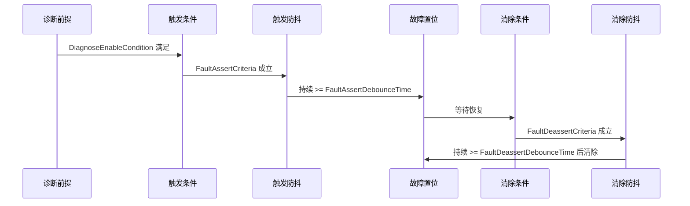

# SystemConfiguration_BMS20A_BBMS — FaultList

> [!NOTE]
> **数据来源**：[`SystemConfiguration_BMS20A_BBMS.xlsm`](SystemConfiguration_BMS20A_BBMS.xlsm) → **FaultList**、**Fault Category**  
> **固件映射**：[`firmware/app/app_bms_fault.c`](../../../firmware/app/app_bms_fault.c) → `a_fault_configs`

> [!IMPORTANT]
> 代码实现须与本文档 **FaultList** 对齐；`EnableFault=0` 的条目不参与项目故障逻辑。

## Table of Contents

- [概述](#概述)
- [故障判定流程](#故障判定流程)
- [字段说明](#字段说明)
- [故障等级与系统响应](#故障等级与系统响应)
- [启用故障一览](#启用故障一览)
- [未启用故障一览](#未启用故障一览)
- [完整故障表](#完整故障表)
- [SystemParameter 联动](#systemparameter-联动)
- [HIL 测试清单](#hil-测试清单)
- [相关代码](#相关代码)

## 概述

BMS20A BBMS 当前 **FaultList** 共定义 **8** 条故障（FaultID **0–7**）。

| 统计项 | 数量 | 备注 |
| :--- | :---: | :--- |
| 故障总数 | 8 | FaultID 连续编号 |
| 启用（`EnableFault=1`） | 6 | 参与项目逻辑 |
| 未启用（`EnableFault=0`） | 2 | LAN 通讯类，已关闭 |
| 故障等级 | 全部为 **Level 3** | 对应 CAT3 |
| 充 / 放电 SOP | 均为 **100%** | 置位时不限功率 |

## 故障判定流程



> [!WARNING]
> **FaultDeassertDebounceTime** 为 `NA` 时，满足清除条件后立即清除；此类条目通常对应 **下电恢复**，需重新上电才能完全恢复。

## 字段说明

| 字段 | 类型 | 必填 | 描述 |
| :--- | :--- | :---: | :--- |
| **Classification** | enum | 是 | 故障分类：`bms` / `peripherals` |
| **FaultDescription** | string | 是 | 故障描述及关联信号标志 |
| **FaultName** | string | 是 | 代码枚举名 |
| **DiagnoseEnableCondition** | string | 是 | 诊断使能前提；不满足则不判故障 |
| **FaultAssertCriteria** | string | 是 | 故障触发条件 |
| **FaultAssertDebounceTime** | duration | 是 | 触发防抖（条件持续达到该时间才置位） |
| **FaultDeassertCriteria** | string | 是 | 故障清除条件 |
| **FaultDeassertDebounceTime** | duration | 否 | 清除防抖；`NA` = 无防抖 |
| **EnableFault** | bool | 是 | `1` 启用；`0` 不启用 |
| **FaultID** | int | 是 | 故障序号（数组下标） |
| **FaultLevel** | int | 是 | 故障等级（1 / 2 / 3） |
| **ChargeSOPCoef(%)** | int | 是 | 置位时充电功率限制百分比 |
| **DischargeSOPCoef(%)** | int | 是 | 置位时放电功率限制百分比 |

## 故障等级与系统响应

### 等级对照表（Fault Category）

| 故障等级 | 故障报警 | 继电器状态 | 上下高压限制 |
| :--- | :--- | :--- | :--- |
| CAT3 / CAT2 | Yes | 闭合 | 不限制 |
| CAT1 | Yes | 断开 | 禁止上高压 |

### 补充说明

1. **故障断高压**
   - 系统发生一级故障后，继电器将在 **4 秒**内断开。
   - 若在此期间检测到电流低于 **20 A**，可提前断开高压。

2. **功率限制（SOP）**
   - 基于所有置起故障中 **最低的** 充 / 放电限制百分比进行功率限制。
   - `ChargeSOPCoef(%)`：充电限制百分比。
   - `DischargeSOPCoef(%)`：放电限制百分比。
   - 二级板与三级板均会进行 SOP 限制。

3. **示例**
   - 二级板置起故障：`ChargeSOPCoef` 最低 **100**，`DischargeSOPCoef` 最低 **50** → 充电不限，放电限 **50%**。
   - 三级板置起故障：`ChargeSOPCoef` 最低 **50**，`DischargeSOPCoef` 最低 **100** → 充电限 **50%**，放电限 **50%**（取两级最小值）。

## 启用故障一览

共 **6** 条（`EnableFault=1`）。

| FaultID | FaultName | Classification | FaultDescription | DiagnoseEnableCondition | FaultLevel | ChargeSOP(%) | DischargeSOP(%) |
| :--- | :--- | :--- | :--- | :--- | :--- | :--- | :--- |
| 0 | `EMCR_SSD_Fault` | `bms` | SSD故障【BSWSSSDLostFlg；SbEMCR_SSDLostFltFlg】 | 上电 | 3 | 100 | 100 |
| 1 | `EMCR_SD_Fault` | `bms` | SD故障【BSWSSDLostFlg；SbEMCR_SDLostFltFlg】 | 上电 | 3 | 100 | 100 |
| 2 | `EMCR_M_CORE_COMMUNICATION_FAULT` | `bms` | M核通讯故障【BSWSMCoreCommFltFlg；SbEMCR_MCoreCommFltFlg】 | 上电 | 3 | 100 | 100 |
| 3 | `EMCR_EMS_TO_BMS_COMMUNICATION_LOST_FAULT` | `peripherals` | EMS通讯节点丢失故障【BSWEMSMsgAvlFlg、SbEMCR_EMSCommLostFltFlg】 | 上电 | 3 | 100 | 100 |
| 6 | `EMCR_ONERACK_TO_BANK_COMMUNICATION_LOST_FAULT` | `bms` | 至少一个RBMS通讯丢失【SbEMCR_OneRackCommLostPreFltFlg；SbEMCR_OneRackCommLostFltFlg】 | 上电一分钟、通讯使能 | 3 | 100 | 100 |
| 7 | `EMCR_ALLRACK_TO_BANK_COMMUNICATION_LOST_FAULT` | `bms` | 所有RBMS通讯丢失【SbEMCR_AllRackCommLostPreFltFlg；SbEMCR_AllRackCommLostFltFlg】 | 上电一分钟、通讯使能 | 3 | 100 | 100 |

## 未启用故障一览

共 **2** 条（`EnableFault=0`）。

> [!TIP]
> 以下 LAN 通讯类故障当前未启用，HIL 通常 **无需** 测试。

| FaultID | FaultName | Classification | FaultDescription | DiagnoseEnableCondition |
| :--- | :--- | :--- | :--- | :--- |
| 4 | `EMCR_ONERACK_TO_BANK_LAN_COMMUNICATION_LOST_FAULT` | `bms` | 至少一个RBMS的LAN通讯丢失【SbEMCR_OneRackLanCommLostPreFltFlg；SbEMCR_OneRackLanCommLostFltFlg】 | 上电一分钟、通讯使能 |
| 5 | `EMCR_ALLRACK_TO_BANK_LAN_COMMUNICATION_LOST_FAULT` | `bms` | 所有RBMS的LAN通讯丢失【SbEMCR_AllRackLanCommLostPreFltFlg；SbEMCR_AllRackLanCommLostFltFlg】 | 上电一分钟、通讯使能 |

## 完整故障表

<details>
<summary>点击展开全部 8 条故障（含触发 / 恢复条件与防抖时间）</summary>

| FaultID | FaultName | EnableFault | Classification | DiagnoseEnableCondition | FaultAssertCriteria | FaultAssertDebounceTime | FaultDeassertCriteria | FaultDeassertDebounceTime | FaultLevel | ChargeSOP(%) | DischargeSOP(%) | FaultDescription |
| :--- | :--- | :--- | :--- | :--- | :--- | :--- | :--- | :--- | :--- | :--- | :--- | :--- |
| 0 | `EMCR_SSD_Fault` | 1 | `bms` | 上电 | BSWSSSDLost == 1(SSD出现故障) | 【CcEMCR_SSDLostJudgeDurms=3000】ms | BSWSSSDLost == 0(SSD正常) | 【CcEMCR_SSDLostRcvryDurms=3000】ms | 3 | 100 | 100 | SSD故障【BSWSSSDLostFlg；SbEMCR_SSDLostFltFlg】 |
| 1 | `EMCR_SD_Fault` | 1 | `bms` | 上电 | BSWSSDLost == 1(SD出现故障) | 【CcEMCR_SDLostJudgeDurms=3000】ms | BSWSSDLost == 0(SD正常) | 【CcEMCR_SDLostRcvryDurms=3000】ms | 3 | 100 | 100 | SD故障【BSWSSDLostFlg；SbEMCR_SDLostFltFlg】 |
| 2 | `EMCR_M_CORE_COMMUNICATION_FAULT` | 1 | `bms` | 上电 | 收不到M核的信号 | 【CcEMCR_MCoreCommFltJudgeDurms=30000】ms | 收到M核的信号 | 【CcEMCR_MCoreCommFltRcvryDurms=30000】ms | 3 | 100 | 100 | M核通讯故障【BSWSMCoreCommFltFlg；SbEMCR_MCoreCommFltFlg】 |
| 3 | `EMCR_EMS_TO_BMS_COMMUNICATION_LOST_FAULT` | 1 | `peripherals` | 上电 | 收不到EMS节点信号 | 【CcEMCR_EMSCommLostJudgeDurms=30000】ms | 收到EMS节点信号 | 【CcEMCR_EMSCommLostRcvryDurms=30000】ms | 3 | 100 | 100 | EMS通讯节点丢失故障【BSWEMSMsgAvlFlg、SbEMCR_EMSCommLostFltFlg】 |
| 4 | `EMCR_ONERACK_TO_BANK_LAN_COMMUNICATION_LOST_FAULT` | 0 | `bms` | 上电一分钟、通讯使能 | 至少有一个RBMS的LAN通讯丢失 | 【CcEMCR_RackLanCommLostJudgeDurms=30000】ms | 至少有一个RBMS的LAN通讯恢复 | 【CcEMCR_RackLanCommLostRcvryDurms=30000】ms | 3 | 100 | 100 | 至少一个RBMS的LAN通讯丢失【SbEMCR_OneRackLanCommLostPreFltFlg；SbEMCR_OneRackLanCommLostFltFlg】 |
| 5 | `EMCR_ALLRACK_TO_BANK_LAN_COMMUNICATION_LOST_FAULT` | 0 | `bms` | 上电一分钟、通讯使能 | 所有RBMS的LAN通讯丢失 | 【CcEMCR_RackLanCommLostJudgeDurms=30000】ms | 所有RBMS的LAN通讯恢复 | 【CcEMCR_RackLanCommLostRcvryDurms=30000】ms | 3 | 100 | 100 | 所有RBMS的LAN通讯丢失【SbEMCR_AllRackLanCommLostPreFltFlg；SbEMCR_AllRackLanCommLostFltFlg】 |
| 6 | `EMCR_ONERACK_TO_BANK_COMMUNICATION_LOST_FAULT` | 1 | `bms` | 上电一分钟、通讯使能 | 收到至少有一个RBMS心跳信号不变化 | 【CcEMCR_OneRackCommLostJudgeDurms=30000】ms | 收到所有RBMS心跳信号变化 | 【CcEMCR_OneRackCommLostRcvryeDurms=30000】ms | 3 | 100 | 100 | 至少一个RBMS通讯丢失【SbEMCR_OneRackCommLostPreFltFlg；SbEMCR_OneRackCommLostFltFlg】 |
| 7 | `EMCR_ALLRACK_TO_BANK_COMMUNICATION_LOST_FAULT` | 1 | `bms` | 上电一分钟、通讯使能 | 收到的所有RBMS心跳信号不变化 | 【CcEMCR_AllRackCommLostJudgeDurms=30000】ms | 收到所有RBMS心跳信号变化 | 【CcEMCR_AllRackCommLostRcvryDurms=30000】ms | 3 | 100 | 100 | 所有RBMS通讯丢失【SbEMCR_AllRackCommLostPreFltFlg；SbEMCR_AllRackCommLostFltFlg】 |

</details>

## SystemParameter 联动

FaultList 与 SystemParameter 通过以下参数关联：

| 参数 | 默认值 | 说明 |
| :--- | :--- | :--- |
| **FAULT_TOTAL_NUMBER** | `[200]` | 系统故障槽位总数 |
| **FAULT_NUMBER_USED** | `[8]` | 实际使用的故障数 |
| **FAULT_NUMBER_RESERVED** | `[192]` | 预留槽位 |
| **CaFDCH_FltStsDisaAryFlg** | 200 项数组 | 故障使能禁用（0 启用，1 禁用） |
| **CaFDCH_FltRcvryModeFlg** | 200 项数组 | 恢复模式（0 在线，1 下电） |
| **FAULT_CH_SOP_COEF** | 8 项数组 | 各故障充电 SOP 系数 |
| **FAULT_DCHA_SOP_COEF** | 8 项数组 | 各故障放电 SOP 系数 |
| **FRLM_FLT_LIST_LVL** | 8 项数组 | 各故障系统等级 |

详见 [`SystemConfiguration_BMS20A_BBMS-SystemParameter.md`](SystemConfiguration_BMS20A_BBMS-SystemParameter.md)。

## HIL 测试清单

- [ ] FaultID 0 — `EMCR_SSD_Fault`（SSD 故障）
- [ ] FaultID 1 — `EMCR_SD_Fault`（SD 故障）
- [ ] FaultID 2 — `EMCR_M_CORE_COMMUNICATION_FAULT`（M 核通讯；Odin 单处理器可跳过）
- [ ] FaultID 3 — `EMCR_EMS_TO_BMS_COMMUNICATION_LOST_FAULT`（EMS 通讯丢失，可手动测试）
- [ ] FaultID 6 — `EMCR_ONERACK_TO_BANK_COMMUNICATION_LOST_FAULT`（至少一个 RBMS 通讯丢失）
- [ ] FaultID 7 — `EMCR_ALLRACK_TO_BANK_COMMUNICATION_LOST_FAULT`（所有 RBMS 通讯丢失）
- [x] FaultID 4 / 5 — LAN 通讯类（`EnableFault=0`，无需测试）

## 相关代码

```c
// firmware/app/app_bms_fault.c
static const fault_config_t a_fault_configs[] = { ... };
```

| 符号 | 路径 |
| :--- | :--- |
| `a_fault_configs` | [`firmware/app/app_bms_fault.c`](../../../firmware/app/app_bms_fault.c) |
| `fault_config_t` | [`firmware/app/app_bms_fault.h`](../../../firmware/app/app_bms_fault.h) |
