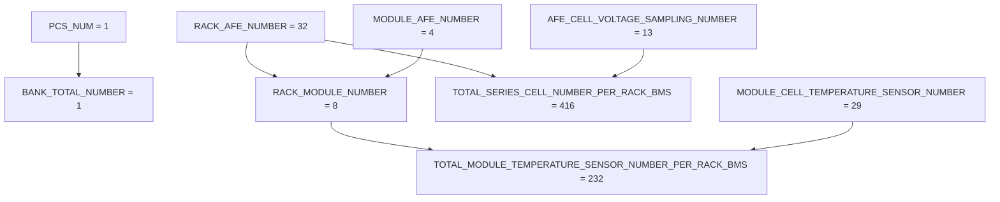
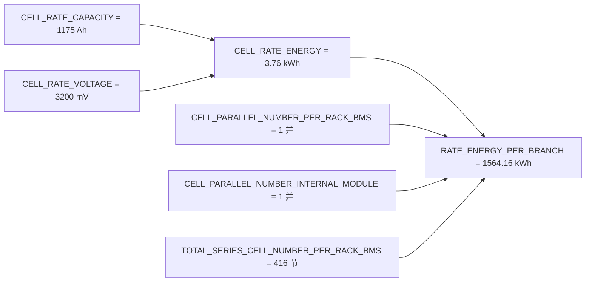

# SystemConfiguration_BMS20A_BBMS — SystemParameter

> [!NOTE]
> **数据来源**：[`SystemConfiguration_BMS20A_BBMS.xlsm`](SystemConfiguration_BMS20A_BBMS.xlsm) → **SystemParameter** 工作表  
> **配置版本**：V4.0（作者 `xuc01`）  
> **用途**：ASW 系统配置参数整理，供固件与 Web 配置对齐参考。

> [!IMPORTANT]
> 派生参数（**Formula ≠ NA**）由 Excel 工具或代码生成器计算，修改基础参数后需同步重新生成。

## Table of Contents

- [概述](#概述)
- [参数关系图](#参数关系图)
- [列字段说明](#列字段说明)
- [参数分组摘要](#参数分组摘要)
- [派生参数](#派生参数)
- [关键枚举](#关键枚举)
- [完整参数表](#完整参数表)
- [固件对齐清单](#固件对齐清单)
- [相关代码](#相关代码)

## 概述

**SystemParameter** 定义 BMS20A BBMS（A Core）的系统级常量，覆盖：

- 硬件拓扑（PCS / Bank / Rack / AFE）
- 电芯与能量模型
- 采样规模与温度通道
- 平台与板级标识
- 与 **FaultList** 联动的故障数组与 SOP 配置

| 项 | 值 | 说明 |
| :--- | :--- | :--- |
| 参数总数 | **41** | SystemParameter 有效行数 |
| 平台 | `[2]` | BBMS2.0 **A Core** |
| BMS 板级 | `[3]` | 三层 BMS 的 RBMS |
| PCS 数量 | `[1]` | 单 PCS 接入 |
| Bank 总数 | `[1]` | `PCS_NUM=1` 时为 1 |
| 单 Rack 串联电芯 | `[416]` | 32 AFE × 13 采样 |
| 故障槽位 | 总计 `[200]` / 已用 `[8]` / 预留 `[192]` | 与 FaultList 联动 |

## 参数关系图

### 硬件拓扑与采样规模



### 能量派生链



## 列字段说明

| 列名 | 类型 | 必填 | 描述 |
| :--- | :--- | :---: | :--- |
| **Name** | string | 是 | 参数标识符（代码宏 / 变量名） |
| **PackageAttribute** | string | 是 | 固定为 `BMS.Parameter` |
| **Value** | array / scalar | 是 | 当前项目默认值 |
| **StorageClass** | enum | 是 | 多为 `Custom` |
| **CustomStorageClass** | enum | 是 | `SystemDefine` / `Import` / `Import_Safety` |
| **DataType** | enum | 是 | `int32` / `uint8` / `single` / `boolean` 等 |
| **Min / Max** | array | 否 | 取值范围 |
| **Dimensions** | array | 否 | 数组维度 |
| **DocUnits** | string | 否 | 物理单位 |
| **Description** | string | 否 | 参数说明 |
| **Formula** | string | 否 | 派生公式；`NA` 表示独立配置项 |

> [!TIP]
> **CustomStorageClass** 含义：
>
> - `SystemDefine`：系统固定，通常不可通过导入修改
> - `Import`：可通过配置工具导入
> - `Import_Safety`：安全相关导入项

## 参数分组摘要

| 分组 | Name | Value | DataType | CustomStorageClass | 单位 | Description |
| :--- | :--- | :--- | :--- | :--- | :--- | :--- |
| 系统拓扑 / Bank / PCS | `PCS_NUM` | `[1]` | `int32` | `SystemDefine` | Nbr | Number of PCS connected to BBMS |
| 系统拓扑 / Bank / PCS | `BANK_TOTAL_NUMBER` | `[1]` | `int32` | `SystemDefine` | Nbr | Total number of banks in the system. If PCS_NUM = 1, the system has only one bank. If PCS_NUM > 1, the system contains P |
| 系统拓扑 / Bank / PCS | `RACK_NUMBER_PER_PCS` | `[4]` | `uint8` | `Import` | Nbr | Number of racks for each bank. Element [1] is the rack number of the original bank; elements [2..N] are the rack numbers |
| 系统拓扑 / Bank / PCS | `RACK_NUMBER_FOR_EVERY_BANK` | `[4]` | `int32` | `SystemDefine` | Nbr | Number of cell parallel between modules within a branch |
| 系统拓扑 / Bank / PCS | `RACK_NUMBER_FOR_EVERY_BANK_MAX` | `[12]` | `int32` | `SystemDefine` | Nbr | Max number of cell parallel between modules within a branch |
| 系统拓扑 / Bank / PCS | `BESS_ALLOWED_RACK_FOR_PARTIAL_OPERATION_MIN` | `[4]` | `uint8` | `Import` | - | minimum allowed operation rack number |
| 电芯与能量 | `CELL_TYPE` | `[0]` | `int32` | `SystemDefine` | - | 0 for LFP, 1 for NCM, 2 for LCO, 3 for LNO, 4 for LMO, 5 for NCA, 6 for SIB |
| 电芯与能量 | `CELL_RATE_CAPACITY` | `[1175]` | `int32` | `SystemDefine` | - | Single cell capacity |
| 电芯与能量 | `CELL_RATE_VOLTAGE` | `[3200]` | `uint16` | `SystemDefine` | mV | Rated Voltage of the Battery Cell |
| 电芯与能量 | `CELL_RATE_ENERGY` | `[3.76]` | `single` | `SystemDefine` | kWh | Single cell rate energy |
| 电芯与能量 | `CELL_PARALLEL_NUMBER_PER_RACK_BMS` | `[1]` | `int32` | `SystemDefine` | Nbr | Number of cell parallel between modules within a branch |
| 电芯与能量 | `CELL_PARALLEL_NUMBER_INTERNAL_MODULE` | `[1]` | `int32` | `SystemDefine` | Nbr | Number of cell parallel within a module |
| 电芯与能量 | `RATE_ENERGY_PER_BRANCH` | `[1564.16]` | `single` | `SystemDefine` | kWh | Single rack branch sum energy |
| 采样硬件规模（AFE / Module / Rack） | `RACK_AFE_NUMBER` | `[32]` | `int32` | `SystemDefine` | Nbr | Actual AFE number |
| 采样硬件规模（AFE / Module / Rack） | `RACK_AFE_NUMBER_MAX` | `[32]` | `int32` | `SystemDefine` | Nbr | The capability of max AFE number |
| 采样硬件规模（AFE / Module / Rack） | `MODULE_AFE_NUMBER` | `[4]` | `int32` | `SystemDefine` | Nbr | AFE number per module |
| 采样硬件规模（AFE / Module / Rack） | `AFE_CELL_VOLTAGE_SAMPLING_NUMBER` | `[13]` | `int32` | `SystemDefine` | Nbr | Cell voltage sampling number for every AFE |
| 采样硬件规模（AFE / Module / Rack） | `AFE_TEMPERATURE_SENSOR_MUX_NUMBER` | `[2]` | `int32` | `SystemDefine` | Nbr | temperature sampling mux number for every AFE |
| 采样硬件规模（AFE / Module / Rack） | `RACK_MODULE_NUMBER` | `[8]` | `int32` | `SystemDefine` | Nbr | Actual module number |
| 采样硬件规模（AFE / Module / Rack） | `RACK_MODULE_NUMBER_MAX` | `[8]` | `int32` | `SystemDefine` | Nbr | The capability of max module number |
| 采样硬件规模（AFE / Module / Rack） | `TOTAL_SERIES_CELL_NUMBER_PER_RACK_BMS` | `[416]` | `int32` | `SystemDefine` | Nbr | Actual total cell number |
| 采样硬件规模（AFE / Module / Rack） | `TOTAL_SERIES_CELL_NUMBER_PER_RACK_MAX_REAL` | `[416]` | `int32` | `SystemDefine` | Nbr | Actual total cell number for real 1500v system |
| 采样硬件规模（AFE / Module / Rack） | `MODULE_CELL_TEMPERATURE_SENSOR_NUMBER` | `[29]` | `int32` | `SystemDefine` | Nbr | Cell temp sensor number per module |
| 采样硬件规模（AFE / Module / Rack） | `TOTAL_MODULE_TEMPERATURE_SENSOR_NUMBER_PER_RACK_BMS` | `[232]` | `int32` | `SystemDefine` | Nbr | Actual module/cell temperature number per rack |
| 采样硬件规模（AFE / Module / Rack） | `RACK_TEMPERATURE_SENSOR_MUX_NUMBER` | `[64]` | `int32` | `SystemDefine` | Nbr | temperature sampling mux number for every rack |
| 平台与板级 | `BBMS_Platform` | `[2]` | `uint8` | `SystemDefine` | - | BBMS Platform 0:BBMS1.0 1:BBMS2.0 M Core  2:BBMS2.0 A Core |
| 平台与板级 | `ACIS_BMS_BOARD` | `[3]` | `uint8` | `SystemDefine` | - | different board-level BMS 1:BBMS 2:RBMS of two-tier BMS 3:RBMS of three-tier BMS |
| 平台与板级 | `BBMS_SW_VERSION` | `[77 85 50 52 87 49 57 48]` | `uint8` | `Import` | Nbr | Rack软件版本号 |
| 平台与板级 | `HIL_TEST_ENABLE` | `[1]` | `int32` | `SystemDefine` | - | - |
| 故障系统配置（与 FaultList 联动） | `FAULT_TOTAL_NUMBER` | `[200]` | `int32` | `SystemDefine` | Nbr | System total fault number |
| 故障系统配置（与 FaultList 联动） | `FAULT_NUMBER_USED` | `[8]` | `int32` | `SystemDefine` | Nbr | Used fault number |
| 故障系统配置（与 FaultList 联动） | `FAULT_NUMBER_RESERVED` | `[192]` | `int32` | `SystemDefine` | Nbr | Reserved fault number |
| 故障系统配置（与 FaultList 联动） | `CaFDCH_FltStsDisaAryFlg` | `[0 … 1]`（共 200 项） | `boolean` | `Import` | / | Fault status disable array (0: Enable, 1: Disable) |
| 故障系统配置（与 FaultList 联动） | `CaFDCH_FltStsDisaArySftyFlg` | `[0 … 1]`（共 200 项） | `boolean` | `Import_Safety` | / | Safety fault status disable array (0: Enable, 1: Disable) |
| 故障系统配置（与 FaultList 联动） | `CaFDCH_FltRcvryModeFlg` | `[0 … 0]`（共 200 项） | `boolean` | `Import` | / | Fault recovery mode array (0: 可在线恢复, 1: 下电恢复) |
| 故障系统配置（与 FaultList 联动） | `CaFDCH_FltRcvryModeSftyFlg` | `[0 … 0]`（共 200 项） | `boolean` | `Import_Safety` | / | Safety fault recovery mode array (0: 可在线恢复, 1: 下电恢复) |
| 故障系统配置（与 FaultList 联动） | `FAULT_CH_SOP_COEF` | `[100 100 100 100 100 100 100 100]` | `uint8` | `Import` | pct | Charge SOP coefficient when fault asserted |
| 故障系统配置（与 FaultList 联动） | `FAULT_DCHA_SOP_COEF` | `[100 100 100 100 100 100 100 100]` | `uint8` | `Import` | pct | Discharge SOP coefficient when fault asserted |
| 故障系统配置（与 FaultList 联动） | `FRLM_FLT_LIST_LVL` | `[3 3 3 3 3 3 3 3]` | `uint8` | `Import` | / | System fault level when fault asserted |
| 其它 | `CURRENT_SENSOR_ZERO_DRIFT_A` | `[2]` | `single` | `SystemDefine` | A | current sensor zero drift threshold |
| 其它 | `NVM_WRITE_FLAG_HOLD_TIME` | `[2000]` | `uint16` | `SystemDefine` | ms | The NVM write flag from ASW must remain set to true during this period to ensure the signal is successfully received by |

> [!CAUTION]
> 故障联动数组（`CaFDCH_*`、`FAULT_*_COEF`）长度为 **200** 或 **FAULT_NUMBER_USED**，完整数值见 [完整参数表](#完整参数表)。

## 派生参数

以下 **17** 项由其它 SystemParameter 或 **FaultList** 表计算得出：

| Name | Value | Formula | Description |
| :--- | :--- | :--- | :--- |
| `RACK_MODULE_NUMBER` | `[8]` | `RACK_AFE_NUMBER/MODULE_AFE_NUMBER` | Actual module number |
| `TOTAL_SERIES_CELL_NUMBER_PER_RACK_BMS` | `[416]` | `RACK_AFE_NUMBER * AFE_CELL_VOLTAGE_SAMPLING_NUMBER` | Actual total cell number |
| `TOTAL_MODULE_TEMPERATURE_SENSOR_NUMBER_PER_RACK_BMS` | `[232]` | `RACK_MODULE_NUMBER*MODULE_CELL_TEMPERATURE_SENSOR_NUMBER` | Actual module/cell temperature number per rack |
| `CELL_RATE_ENERGY` | `[3.76]` | `CELL_RATE_CAPACITY*CELL_RATE_VOLTAGE/1000/1000` | Single cell rate energy |
| `RATE_ENERGY_PER_BRANCH` | `[1564.16]` | `CELL_RATE_ENERGY*CELL_PARALLEL_NUMBER_PER_RACK_BMS*CELL_PARALLEL_NUMBER_INTERNAL_MODULE*TOTAL_SERIES_CELL_NUMBER_PER_RACK_BMS` | Single rack branch sum energy |
| `RACK_MODULE_NUMBER_MAX` | `[8]` | `RACK_AFE_NUMBER_MAX/MODULE_AFE_NUMBER` | The capability of max module number |
| `RACK_TEMPERATURE_SENSOR_MUX_NUMBER` | `[64]` | `RACK_AFE_NUMBER_MAX * AFE_TEMPERATURE_SENSOR_MUX_NUMBER` | temperature sampling mux number for every rack |
| `CaFDCH_FltStsDisaAryFlg` | `[0 … 1]`（共 200 项） | `[Tab_FaultList.EnableFault==0, ones(1, FAULT_NUMBER_RESERVED)]` | Fault status disable array (0: Enable, 1: Disable) |
| `CaFDCH_FltStsDisaArySftyFlg` | `[0 … 1]`（共 200 项） | `[Tab_FaultList.EnableFault==0, ones(1, FAULT_NUMBER_RESERVED)]` | Safety fault status disable array (0: Enable, 1: Disable) |
| `CaFDCH_FltRcvryModeFlg` | `[0 … 0]`（共 200 项） | `[contains(Tab_FaultList.FaultDeassertCriteria,'下电'), zeros(1, FAULT_NUMBER_RESERVED)]` | Fault recovery mode array (0: 可在线恢复, 1: 下电恢复) |
| `CaFDCH_FltRcvryModeSftyFlg` | `[0 … 0]`（共 200 项） | `[contains(Tab_FaultList.FaultDeassertCriteria,'下电'), zeros(1, FAULT_NUMBER_RESERVED)]` | Safety fault recovery mode array (0: 可在线恢复, 1: 下电恢复) |
| `FAULT_CH_SOP_COEF` | `[100 100 100 100 100 100 100 100]` | `Tab_FaultList("ChargeSOPCoef(%)")` | Charge SOP coefficient when fault asserted |
| `FAULT_DCHA_SOP_COEF` | `[100 100 100 100 100 100 100 100]` | `Tab_FaultList("DischargeSOPCoef(%)")` | Discharge SOP coefficient when fault asserted |
| `FRLM_FLT_LIST_LVL` | `[3 3 3 3 3 3 3 3]` | `Tab_FaultList.FaultLevel` | System fault level when fault asserted |
| `FAULT_NUMBER_USED` | `[8]` | `height(Tab_FaultList.FaultLevel)` | Used fault number |
| `FAULT_NUMBER_RESERVED` | `[192]` | `FAULT_TOTAL_NUMBER - FAULT_NUMBER_USED` | Reserved fault number |
| `BANK_TOTAL_NUMBER` | `[1]` | `if PCS_NUM==1, return 1, 
else return PCS_NUM+1` | Total number of banks in the system. If PCS_NUM = 1, the system has only one bank. If PCS_NUM > 1, the system contains P |

### BANK_TOTAL_NUMBER 计算逻辑

```text
if PCS_NUM == 1:
    BANK_TOTAL_NUMBER = 1
else:
    BANK_TOTAL_NUMBER = PCS_NUM + 1
```

## 关键枚举

### CELL_TYPE — 电芯类型

| 值 | 电芯类型 | 中文 |
| :---: | :--- | :--- |
| 0 | LFP | 磷酸铁锂 |
| 1 | NCM | 镍钴锰三元 |
| 2 | LCO | 钴酸锂 |
| 3 | LNO | 镍酸锂 |
| 4 | LMO | 锰酸锂 |
| 5 | NCA | 镍钴铝三元 |
| 6 | SIB | 钠离子 |

### BBMS_Platform — 平台版本

| 值 | 平台 |
| :---: | :--- |
| 0 | BBMS1.0 |
| 1 | BBMS2.0 M Core |
| 2 | BBMS2.0 A Core |

### ACIS_BMS_BOARD — 板级 BMS 类型

| 值 | 类型 |
| :---: | :--- |
| 1 | BBMS |
| 2 | 两层 BMS 的 RBMS |
| 3 | 三层 BMS 的 RBMS |

## 完整参数表

<details>
<summary>点击展开全部 41 项参数（含 Formula）</summary>

| Name | Value | DataType | CustomStorageClass | 单位 | Description | Formula |
| :--- | :--- | :--- | :--- | :--- | :--- | :--- |
| `RACK_NUMBER_FOR_EVERY_BANK` | `[4]` | `int32` | `SystemDefine` | Nbr | Number of cell parallel between modules within a branch | `NA` |
| `RACK_NUMBER_PER_PCS` | `[4]` | `uint8` | `Import` | Nbr | Number of racks for each bank. Element [1] is the rack number of the original bank; elements [2..N] are the rack numbers | `NA` |
| `PCS_NUM` | `[1]` | `int32` | `SystemDefine` | Nbr | Number of PCS connected to BBMS | `NA` |
| `MODULE_CELL_TEMPERATURE_SENSOR_NUMBER` | `[29]` | `int32` | `SystemDefine` | Nbr | Cell temp sensor number per module | `NA` |
| `RACK_NUMBER_FOR_EVERY_BANK_MAX` | `[12]` | `int32` | `SystemDefine` | Nbr | Max number of cell parallel between modules within a branch | `NA` |
| `BBMS_Platform` | `[2]` | `uint8` | `SystemDefine` | - | BBMS Platform 0:BBMS1.0 1:BBMS2.0 M Core  2:BBMS2.0 A Core | `NA` |
| `FAULT_TOTAL_NUMBER` | `[200]` | `int32` | `SystemDefine` | Nbr | System total fault number | `NA` |
| `CELL_TYPE` | `[0]` | `int32` | `SystemDefine` | - | 0 for LFP, 1 for NCM, 2 for LCO, 3 for LNO, 4 for LMO, 5 for NCA, 6 for SIB | `NA` |
| `CELL_PARALLEL_NUMBER_PER_RACK_BMS` | `[1]` | `int32` | `SystemDefine` | Nbr | Number of cell parallel between modules within a branch | `NA` |
| `CELL_PARALLEL_NUMBER_INTERNAL_MODULE` | `[1]` | `int32` | `SystemDefine` | Nbr | Number of cell parallel within a module | `NA` |
| `CELL_RATE_CAPACITY` | `[1175]` | `int32` | `SystemDefine` | - | Single cell capacity | `NA` |
| `BESS_ALLOWED_RACK_FOR_PARTIAL_OPERATION_MIN` | `[4]` | `uint8` | `Import` | - | minimum allowed operation rack number | `NA` |
| `RACK_AFE_NUMBER` | `[32]` | `int32` | `SystemDefine` | Nbr | Actual AFE number | `NA` |
| `MODULE_AFE_NUMBER` | `[4]` | `int32` | `SystemDefine` | Nbr | AFE number per module | `NA` |
| `AFE_CELL_VOLTAGE_SAMPLING_NUMBER` | `[13]` | `int32` | `SystemDefine` | Nbr | Cell voltage sampling number for every AFE | `NA` |
| `BBMS_SW_VERSION` | `[77 85 50 52 87 49 57 48]` | `uint8` | `Import` | Nbr | Rack软件版本号 | `NA` |
| `HIL_TEST_ENABLE` | `[1]` | `int32` | `SystemDefine` | - | - | `NA` |
| `CURRENT_SENSOR_ZERO_DRIFT_A` | `[2]` | `single` | `SystemDefine` | A | current sensor zero drift threshold | `NA` |
| `AFE_TEMPERATURE_SENSOR_MUX_NUMBER` | `[2]` | `int32` | `SystemDefine` | Nbr | temperature sampling mux number for every AFE | `NA` |
| `RACK_AFE_NUMBER_MAX` | `[32]` | `int32` | `SystemDefine` | Nbr | The capability of max AFE number | `NA` |
| `ACIS_BMS_BOARD` | `[3]` | `uint8` | `SystemDefine` | - | different board-level BMS 1:BBMS 2:RBMS of two-tier BMS 3:RBMS of three-tier BMS | `NA` |
| `NVM_WRITE_FLAG_HOLD_TIME` | `[2000]` | `uint16` | `SystemDefine` | ms | The NVM write flag from ASW must remain set to true during this period to ensure the signal is successfully received by | `NA` |
| `CELL_RATE_VOLTAGE` | `[3200]` | `uint16` | `SystemDefine` | mV | Rated Voltage of the Battery Cell | `NA` |
| `TOTAL_SERIES_CELL_NUMBER_PER_RACK_MAX_REAL` | `[416]` | `int32` | `SystemDefine` | Nbr | Actual total cell number for real 1500v system | `NA` |
| `RACK_MODULE_NUMBER` | `[8]` | `int32` | `SystemDefine` | Nbr | Actual module number | `RACK_AFE_NUMBER/MODULE_AFE_NUMBER` |
| `TOTAL_SERIES_CELL_NUMBER_PER_RACK_BMS` | `[416]` | `int32` | `SystemDefine` | Nbr | Actual total cell number | `RACK_AFE_NUMBER * AFE_CELL_VOLTAGE_SAMPLING_NUMBER` |
| `TOTAL_MODULE_TEMPERATURE_SENSOR_NUMBER_PER_RACK_BMS` | `[232]` | `int32` | `SystemDefine` | Nbr | Actual module/cell temperature number per rack | `RACK_MODULE_NUMBER*MODULE_CELL_TEMPERATURE_SENSOR_NUMBER` |
| `CELL_RATE_ENERGY` | `[3.76]` | `single` | `SystemDefine` | kWh | Single cell rate energy | `CELL_RATE_CAPACITY*CELL_RATE_VOLTAGE/1000/1000` |
| `RATE_ENERGY_PER_BRANCH` | `[1564.16]` | `single` | `SystemDefine` | kWh | Single rack branch sum energy | `CELL_RATE_ENERGY*CELL_PARALLEL_NUMBER_PER_RACK_BMS*CELL_PARALLEL_NUMBER_INTERNAL_MODULE*TOTAL_SERIES_CELL_NUMBER_PER_RACK_BMS` |
| `RACK_MODULE_NUMBER_MAX` | `[8]` | `int32` | `SystemDefine` | Nbr | The capability of max module number | `RACK_AFE_NUMBER_MAX/MODULE_AFE_NUMBER` |
| `RACK_TEMPERATURE_SENSOR_MUX_NUMBER` | `[64]` | `int32` | `SystemDefine` | Nbr | temperature sampling mux number for every rack | `RACK_AFE_NUMBER_MAX * AFE_TEMPERATURE_SENSOR_MUX_NUMBER` |
| `CaFDCH_FltStsDisaAryFlg` | `[0 … 1]`（共 200 项） | `boolean` | `Import` | / | Fault status disable array (0: Enable, 1: Disable) | `[Tab_FaultList.EnableFault==0, ones(1, FAULT_NUMBER_RESERVED)]` |
| `CaFDCH_FltStsDisaArySftyFlg` | `[0 … 1]`（共 200 项） | `boolean` | `Import_Safety` | / | Safety fault status disable array (0: Enable, 1: Disable) | `[Tab_FaultList.EnableFault==0, ones(1, FAULT_NUMBER_RESERVED)]` |
| `CaFDCH_FltRcvryModeFlg` | `[0 … 0]`（共 200 项） | `boolean` | `Import` | / | Fault recovery mode array (0: 可在线恢复, 1: 下电恢复) | `[contains(Tab_FaultList.FaultDeassertCriteria,'下电'), zeros(1, FAULT_NUMBER_RESERVED)]` |
| `CaFDCH_FltRcvryModeSftyFlg` | `[0 … 0]`（共 200 项） | `boolean` | `Import_Safety` | / | Safety fault recovery mode array (0: 可在线恢复, 1: 下电恢复) | `[contains(Tab_FaultList.FaultDeassertCriteria,'下电'), zeros(1, FAULT_NUMBER_RESERVED)]` |
| `FAULT_CH_SOP_COEF` | `[100 100 100 100 100 100 100 100]` | `uint8` | `Import` | pct | Charge SOP coefficient when fault asserted | `Tab_FaultList("ChargeSOPCoef(%)")` |
| `FAULT_DCHA_SOP_COEF` | `[100 100 100 100 100 100 100 100]` | `uint8` | `Import` | pct | Discharge SOP coefficient when fault asserted | `Tab_FaultList("DischargeSOPCoef(%)")` |
| `FRLM_FLT_LIST_LVL` | `[3 3 3 3 3 3 3 3]` | `uint8` | `Import` | / | System fault level when fault asserted | `Tab_FaultList.FaultLevel` |
| `FAULT_NUMBER_USED` | `[8]` | `int32` | `SystemDefine` | Nbr | Used fault number | `height(Tab_FaultList.FaultLevel)` |
| `FAULT_NUMBER_RESERVED` | `[192]` | `int32` | `SystemDefine` | Nbr | Reserved fault number | `FAULT_TOTAL_NUMBER - FAULT_NUMBER_USED` |
| `BANK_TOTAL_NUMBER` | `[1]` | `int32` | `SystemDefine` | Nbr | Total number of banks in the system. If PCS_NUM = 1, the system has only one bank. If PCS_NUM > 1, the system contains P | `if PCS_NUM==1, return 1, 
else return PCS_NUM+1` |

</details>

## 固件对齐清单

- [ ] 核对 `SystemDefine` 参数与目标硬件拓扑一致（AFE / Module / 电芯数）
- [ ] 核对 `Import` 参数（`RACK_NUMBER_PER_PCS`、`BBMS_SW_VERSION` 等）与现场配置一致
- [ ] 修改 FaultList 后重新生成 `CaFDCH_*` 与 SOP 数组
- [ ] 确认 `FAULT_NUMBER_USED` 与 FaultList 行数一致
- [ ] 与 [`SystemConfiguration_BMS20A_BBMS-FaultList.md`](SystemConfiguration_BMS20A_BBMS-FaultList.md) 交叉校验

## 相关代码

| 路径 | 说明 |
| :--- | :--- |
| [`firmware/app/app_bms_fault.c`](../../../firmware/app/app_bms_fault.c) | `a_fault_configs` 故障配置（与 FaultList 对齐） |
| [`firmware/app/app_bms_fault.h`](../../../firmware/app/app_bms_fault.h) | `fault_config_t` 结构体定义 |
