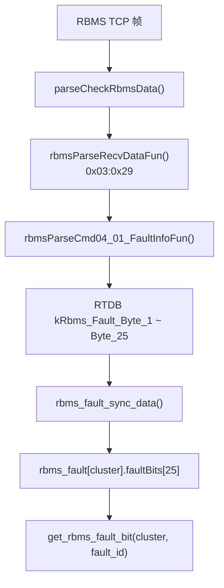
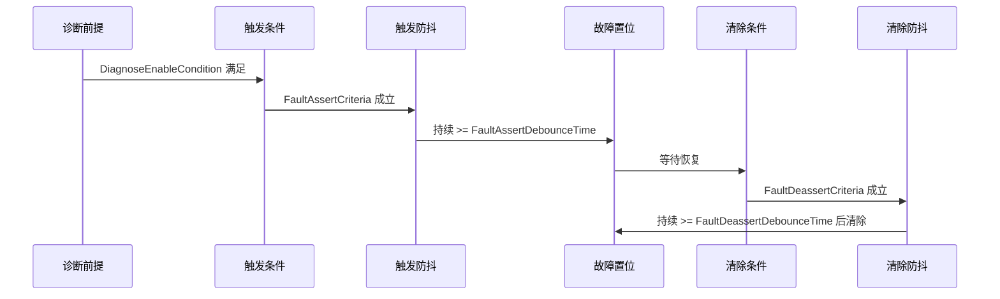
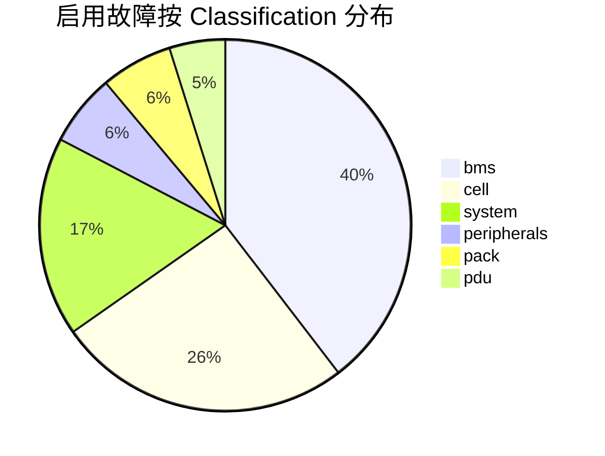

# SystemConfiguration_BMS20_RBMS — FaultList

> [!NOTE]
> **数据来源**：[`SystemConfiguration_BMS20_RBMS.xlsm`](SystemConfiguration_BMS20_RBMS.xlsm) → **FaultList**、**Fault Category**  
> **固件映射**：[`firmware/app/app_bms_fault.h`](../../../firmware/app/app_bms_fault.h) → `rbms_fault_type`

> [!IMPORTANT]
> RBMS 故障逻辑在簇级 RBMS 中实现，BBMS 负责统计上报；`EnableFault=0` 的条目不参与项目故障逻辑。

## Table of Contents

- [概述](#概述)
- [RBMS Fault 报文解析](#rbms-fault-报文解析)
- [故障判定流程](#故障判定流程)
- [字段说明](#字段说明)
- [故障等级与系统响应](#故障等级与系统响应)
- [分类与等级统计](#分类与等级统计)
- [未启用故障一览](#未启用故障一览)
- [启用故障索引](#启用故障索引)
- [完整故障表](#完整故障表)
- [SystemParameter 联动](#systemparameter-联动)
- [HIL 测试说明](#hil-测试说明)
- [相关代码](#相关代码)

## 概述

BMS20 RBMS 当前 **FaultList** 共定义 **172** 条故障（FaultID **0–171**）。

| 统计项 | 数量 | 备注 |
| :--- | :---: | :--- |
| 故障总数 | 172 | FaultID 连续编号 |
| 启用（`EnableFault=1`） | 144 | 参与项目逻辑 |
| 未启用（`EnableFault=0`） | 28 | 含 MCU / SOC 等待定项 |
| Level 1（CAT1） | 100（启用 85） | 断高压，SOP 0% |
| Level 2（CAT2） | 28（启用 27） | SOP 50% |
| Level 3（CAT3） | 44（启用 32） | SOP 100% |
| 充电 SOP 系数 | 0 / 50 / 100 % | 按故障等级配置 |
| 放电 SOP 系数 | 0 / 50 / 100 % | 按故障等级配置 |

## RBMS Fault 报文解析

RBMS 通过私有协议 TCP 报文 **`RBMS_Fault`** 周期上送故障位图；本文 **FaultList** 中的 **FaultID** 即为位图中的 bit 下标。

### 报文标识

| 项 | 值 |
| :--- | :--- |
| 报文名 | `RBMS_Fault` |
| cmdGroup / cmdId | `0x03` / `0x29`（Matrix V1.0.50：cmdGroup 3 / cmdId 41） |
| 发送周期 | 1000 ms |
| payload 长度 | **25 字节**（200 bit） |
| 协议参考 | [`docs/protocols/BBMS_RBMS_Communication_Protocol.md`](../../protocols/BBMS_RBMS_Communication_Protocol.md) |

### TCP 帧与 payload 偏移

完整帧去掉 `LinkMsg`（5 字节）后，body 布局如下（与 `firmware/bsp/bsp_bms_com.c` 一致）：

| body 偏移 | 字段 | 长度（字节） |
| :---: | :--- | :---: |
| 0 | src | 1 |
| 1 | srcSub（簇号 Rack ID） | 1 |
| 2 | dest | 1 |
| 3 | destSub | 1 |
| 4 | transportType | 1 |
| 5 | frameId | 1 |
| 6 | cmdGroup | 1 |
| 7 | cmdId | 1 |
| **8** | **fault payload 起始** | **25** |

在完整 TCP 帧中，fault payload 起始字节偏移 = **5（LinkMsg）+ 8 = 13**。


### 位图解析规则

每个 **FaultID** 对应 payload 中的 **1 bit**：`1` = 故障置位，`0` = 无故障。

```text
byte_index = FaultID / 8
bit_offset = FaultID % 8
active     = (payload[byte_index] >> bit_offset) & 0x01
```

| FaultID | 字节 | bit | 示例故障名 |
| :---: | :---: | :---: | :--- |
| 0 | `payload[0]` | bit0 | `AFES_AFE_FAULT` |
| 1 | `payload[0]` | bit1 | `AFES_DAISY_CHAIN_NO_UPDATE_FAULT` |
| 7 | `payload[0]` | bit7 | — |
| 8 | `payload[1]` | bit0 | — |
| 171 | `payload[21]` | bit3 | `PRECH_RLY_STK_CLS_FAULT` |

> [!TIP]
> **FaultID** 与固件枚举 `rbms_fault_type`、本表 **FaultName** 列一一对应；查具体名称见 [启用故障索引](#启用故障索引) 或 [完整故障表](#完整故障表)。

**示例**：`payload[0] = 0x05`（`00000101`）表示 FaultID **0**、**2** 置位。

### 固件解析链路



| 阶段 | 文件 / 符号 | 说明 |
| :--- | :--- | :--- |
| 点表定义 | `firmware/protocol/protocol_bms_rbms.c` → `rbmsCmd04_01_RBMS_Fault_PointAttr` | 25 字节写入 RTDB |
| 分发入口 | `rbmsParseRecvDataFun()` | `cmdGroup==0x03 && cmdId==0x29`（wire `0x0329`） |
| RTDB 点位 | `kRbms_Fault_Byte_1` … `kRbms_Fault_Byte_25` | 每簇 25 个 `uint8` |
| 内存位图 | `RBMS_Fault_t.faultBits[25]` | `rbms_fault_sync_data()` 同步 |
| 查询 API | `get_rbms_fault_bit()` | 按 FaultID 读单 bit |
| 堆级聚合 | `bms_bank_rbms_fault_or()` | BBMS 多簇 OR 统计 |

```c
// firmware/app/app_bms_fault.c
uint8_t byte_index = fault_id / 8;
uint8_t bit_offset = fault_id % 8;
return (rbms_fault[cluster_id].faultBits[byte_index] >> bit_offset) & 0x01;
```

### 概要报文中的故障摘要（补充）

除 **`RBMS_Fault`（`0x03:0x29`）** 位图外，`RBMS_SumInfo（0x03:0x01）` 含摘要字段，**不能替代**逐条故障位图：

| RTDB 点位 | 说明 |
| :--- | :--- |
| `kRbms_BMSMaxFltLevel` | 当前最高故障等级 |
| `kRbms_FaultEvt` | 故障事件字（32 bit） |

完整逐条状态以 **`RBMS_Fault` 的 25 字节 payload** 为准。

### 手工 / 脚本解析示例

运行环境：Python 3.11+（与 `bmsSim/rbms_tcp_sim` 一致）

```python
def parse_rbms_fault_payload(payload: bytes) -> list[int]:
    """payload 为 25 字节故障位图，返回已置位的 FaultID 列表。"""
    if len(payload) != 25:
        raise ValueError(f"期望 25 字节，实际 {len(payload)}")

    active: list[int] = []
    for fault_id in range(200):
        byte_index = fault_id // 8
        bit_offset = fault_id % 8
        if (payload[byte_index] >> bit_offset) & 1:
            active.append(fault_id)
    return active


def extract_fault_payload_from_frame(frame: bytes) -> bytes:
    """从完整 RBMS TCP 帧提取 fault payload。"""
    return frame[13:38]  # LinkMsg(5) + 路由头(8) = 13，长度 25
```

### 本地验证

```bash
python3 bmsSim/rbms_tcp_sim/rbms_sim.py --port 5000 --rack-id 1 --periodic suminfo,fault
```

模拟器常量 `RBMS_FAULT_PAYLOAD_LEN = 25`，与协议及 `FAULT_TOTAL_NUMBER = 200` 一致。

## 故障判定流程



> [!WARNING]
> **FaultDeassertDebounceTime** 为 `NA` 时，满足清除条件后立即清除；RBMS 大量一级故障的恢复条件为 **下电**，需重新上电。

## 字段说明

| 字段 | 类型 | 必填 | 描述 |
| :--- | :--- | :---: | :--- |
| **Classification** | enum | 是 | `bms` / `cell` / `system` / `peripherals` / `pack` / `pdu` |
| **FaultDescription** | string | 是 | 故障描述及关联信号标志 |
| **FaultName** | string | 是 | 代码枚举名 |
| **DiagnoseEnableCondition** | string | 是 | 诊断使能前提 |
| **FaultAssertCriteria** | string | 是 | 故障触发条件 |
| **FaultAssertDebounceTime** | duration | 是 | 触发防抖时间 |
| **FaultDeassertCriteria** | string | 是 | 故障清除条件 |
| **FaultDeassertDebounceTime** | duration | 否 | 清除防抖；`NA` = 无防抖 |
| **EnableFault** | bool | 是 | `1` 启用；`0` 不启用 |
| **FaultID** | int | 是 | 故障序号（数组下标） |
| **FaultLevel** | int | 是 | 故障等级（1 / 2 / 3） |
| **ChargeSOPCoef(%)** | int | 是 | 置位时充电功率限制百分比 |
| **DischargeSOPCoef(%)** | int | 是 | 置位时放电功率限制百分比 |
| **Justification** | string | 否 | 故障设计依据 / 备注（RBMS 特有列） |

## 故障等级与系统响应

### 等级对照表（Fault Category）

| 故障等级 | 故障报警 | 继电器状态 | 上下高压限制 |
| :--- | :--- | :--- | :--- |
| CAT3 / CAT2 | Yes | 闭合 | 不限制 |
| CAT1 | Yes | 断开 | 禁止上高压 |

### 补充说明

1. **故障断高压**
   - 系统发生一级故障后，继电器将在 **4 秒**内断开。
   - 若在此期间检测到电流低于 **20 A**，可提前断开高压。

2. **功率限制（SOP）**
   - 基于所有置起故障中 **最低的** 充 / 放电限制百分比进行功率限制。
   - Level 1 → SOP **0%**；Level 2 → **50%**；Level 3 → **100%**。

3. **极限故障**
   - `FaultDescription` 含 **「极限」** 字样的为极限故障，须按一级（最重）策略处理。

## 分类与等级统计

### 按 Classification 统计

| Classification | 总数 | 启用数 |
| :--- | :--- | :--- |
| `bms` | 63 | 57 |
| `cell` | 38 | 37 |
| `pack` | 11 | 9 |
| `pdu` | 7 | 7 |
| `peripherals` | 24 | 9 |
| `system` | 29 | 25 |



### 按 FaultLevel 统计

| 等级 | 总数 | 启用数 |
| :--- | :--- | :--- |
| Level 1 | 100 | 85 |
| Level 2 | 28 | 27 |
| Level 3 | 44 | 32 |

## 未启用故障一览

共 **28** 条（`EnableFault=0`）。

> [!TIP]
> 以下故障当前未启用，HIL 通常 **无需** 测试；待 RBMS 开发阶段再评估是否开启。

| FaultID | FaultName | Classification | FaultDescription | DiagnoseEnableCondition |
| :--- | :--- | :--- | :--- | :--- |
| 19 | `MCUD_RESET_FAULT` | `bms` | MCU故障复位原因【故障已删除】 | 上电 |
| 20 | `MCUD_MEMORY_INTERNAL_DATA_FAULT` | `bms` | MCU内部数据及存储地址错误故障【故障已删除】 | MCU memory and addressing error |
| 32 | `CLVH_VOLTAGE_MISMATCH_FAULT` | `cell` | 单体电压和与AFE电压不匹配【SaCLVS_CellVmV、SaCLVS_MdulVmV；SbCLVH_VoltageMismatchFlt】 | AFE电压大于【CcCLVH_MdulCellSumFltVmV=19500】mv |
| 35 | `ACIS_MSD_OPEN_FAULT` | `peripherals` | MSD开路(互锁)故障【BSWSMSDAuxVRawValNbr；SbACIS_MSDOpenFlt】 | 24V供电电压有效 |
| 77 | `CTSC_RBMS_EPO_OPEN_FAULT` | `peripherals` | 主控EPO开 【故障已删除】 | 24V供电电压有效 |
| 85 | `SOCA_SOC_TOO_LOW_LEVEL2_FAULT` | `system` | SOC低二级【ScSOCA_DispSysSOCPct；SbSOCA_SOCTooLowLvl2FltFlg】 | 上电 |
| 90 | `CTSC_COMBINE_SWITCH_VOLT_LOW_FAULT` | `peripherals` | 融合开关欠压故障【ScLVPS_RlyPowSplyValV；SbCTSC_CombineSwVoltLowFlt】 | 电动模式下且24V电压有效 |
| 91 | `SOCA_SOC_TOO_LOW_LEVEL3_FAULT` | `system` | SOC低三级【ScSOCA_DispSysSOCPct；SbSOCA_SOCTooLowLvl3FltFlg】 | 上电 |
| 93 | `SOCA_SOC_TOO_HIGH_LEVEL2_FAULT` | `system` | SOC高二级【ScSOCA_DispSysSOCPct；SbSOCA_SOCTooHighLvl2FltFlg】 | 上电 |
| 94 | `SOCA_SOC_TOO_HIGH_LEVEL3_FAULT` | `system` | SOC高三级【ScSOCA_DispSysSOCPct；SbSOCA_SOCTooHighLvl3FltFlg】 | 上电 |
| 120 | `CTSC_MAINPOS_AUX_CONTACT_ST_FAULT` | `bms` | 主正继电器辅助触点电路故障【故障已删除】 | 供电电压有效 |
| 121 | `CTSC_MAINNEG_AUX_CONTACT_ST_FAULT` | `bms` | 主负继电器辅助触点电路故障【故障已删除】 | 供电电压有效 |
| 122 | `ACIS_RBMS_DOOR_OPEN_FAULT` | `peripherals` | 门禁故障【BSWSDoorOpenFlg;SbACIS_DoorOpenFlg】 | 上电 |
| 142 | `ACIS_FIRE_EXTINGUISHER_ALERT_FAULT` | `peripherals` | 消防一级故障【BSWSFireExtAlertFlg；SbACIS_FireExtAlertFlt】 | 上电 |
| 157 | `ACIS_COOL_FAN_FAULT` | `peripherals` | 散热风扇故障【BSWSCoolingFanFlg；SbACIS_CoolingFanFlt】 | 上电 |
| 158 | `ACIS_SMOKE_FEEDBACK_FAULT` | `peripherals` | 烟感故障【BSWSSmokeFdbkFlg；SbACIS_SmokeFdbkFlt】 | 上电 |
| 159 | `ACIS_TEMP_FEEDBACK_FAULT` | `peripherals` | 温感故障【BSWSTempFdbkFlg；SbACIS_TempFdbkFlt】 | 上电 |
| 160 | `ACIS_ESTOP_FAULT` | `peripherals` | 急停故障【BSWSEStopFlg】 | 上电 |
| 161 | `ACIS_WATER_FLOOD_FAULT` | `peripherals` | 水浸告警故障【BSWSWtrFldFlg】 | 上电 |
| 162 | `ACIS_QF1_BREAKER_FAULT` | `peripherals` | QF1断路器故障【BSWSQF1BrkFlg】 | 上电 |
| 163 | `ACIS_AEROSOL_FAULT` | `pack` | 气溶胶故障1【BSWSAerosolFlg；SbACIS_AerosolFlt】 | 上电 |
| 164 | `ACIS_AEROSOL2_FAULT` | `pack` | 气溶胶故障2【BSWSAerosol2Flg；SbACIS_Aerosol2Flt】 | 上电 |
| 165 | `EMCR_DEHUMIDIFIER_TO_BMS_COMMUNICATION_LOST_FAULT` | `peripherals` | 除湿机通讯节点丢失故障【BSWSDehumidifierMsgAvlFlg、SbEMCR_DehumidifierComLostFltFlg】 | 上电 |
| 166 | `EMCR_IOModule_TO_BMS_COMMUNICATION_LOST_FAULT` | `peripherals` | IO模块通讯节点丢失故障【BSWSIOModuleMsgAvlFlg、SbEMCR_IOModuleComLostFltFlg】 | 上电 |
| 167 | `EMCR_PCS_TO_BMS_COMMUNICATION_LOST_FAULT` | `bms` | PCS通信丢失故障【BSWSPCSHeartbeat】 | PCS通讯故障配置使能 |
| 168 | `BTCD_SHORT_CIRCUIT_FAULT` | `peripherals` | 总线短路故障【ScBTCS_BatIA；SbBTCD_ShortCircuitFlt】 | 电流有效 |
| 169 | `BTCS_HALLSENS_OVERRANGE_FAULT` | `peripherals` | 电流传感器超量程故障【BSWSOverCurIndFlg；SbBTCS_HallSensOverRangeFlt】 | 上电 |
| 171 | `CTSC_PRECHRG_RELAY_STUCK_CLOSE_FAULT` | `bms` | 预充继电器粘连故障【SbCTSC_PreChrgRlyStuckClosePreFailFlg；SbCTSC_PreChrgRlyStuckCloseFlt】 | 继电器供电电压未超范围 And 电池串电压有效 And LinkPos电压有效 |

## 启用故障索引

共 **144** 条（`EnableFault=1`），完整触发 / 恢复条件见 [完整故障表](#完整故障表)。

<details>
<summary>点击展开启用故障索引（144 条）</summary>

| FaultID | FaultName | Classification | Level | ChargeSOP(%) | DischargeSOP(%) | FaultDescription |
| :--- | :--- | :--- | :--- | :--- | :--- | :--- |
| 0 | `AFES_AFE_FAULT` | `bms` | 1 | 0 | 0 | AFE硬件故障【AFEPreFltFlg；AFEFltFlg】 |
| 1 | `AFES_DAISY_CHAIN_NO_UPDATE_FAULT` | `bms` | 1 | 0 | 0 | 菊花链通信丢失故障【DaisyChainUpdPreFltFlg；DaisyChainUpdFltFlg】 |
| 2 | `AFES_CRC_FAULT` | `bms` | 1 | 0 | 0 | AFE采样CRC故障【AFEMsgCRCPreFltFlg；AFEMsgCRCFltFlg】 |
| 3 | `AFES_CELL_VOLTAGE_SAMPLING_LINE_OFF_FAULT` | `bms` | 1 | 0 | 0 | 电芯电压采样线掉线【CellVSamplgLineOffPreFltFlg；CellVSamplgLineOffFltF |
| 4 | `AFES_DAISY_CHAIN_SINGLE_POINT_OFF_FAULT` | `bms` | 3 | 100 | 100 | 菊花链单点断线【DaisyChainSngPointOffPreFltFlg；DaisyChainSngPointOff |
| 5 | `AFES_DAISY_CHAIN_MULTIPLE_POINT_OFF_FAULT` | `bms` | 1 | 0 | 0 | 菊花链多点断线【DaisyChainMplPointOffPreFltFlg；DaisyChainMplPointOff |
| 6 | `CBSS_BALANCING_LOOP_CIRCUIT_FAULT` | `bms` | 2 | 50 | 50 | 均衡回路故障【SbCBSS_BalLoopCircPreFailFlg；SbCBSS_BalLoopCircFlt】 |
| 7 | `CLTS_CELL_TEMPERATURE_OUT_OF_RANGE_HIGH_FAULT` | `bms` | 1 | 0 | 0 | 电芯温度采样短地(STG)【SbCLTS_CellTOorHiLimPreFltFlg；SbCLTS_CellTOorH |
| 8 | `CLTS_CELL_TEMPERATURE_OUT_OF_RANGE_LOW_FAULT` | `bms` | 1 | 0 | 0 | 电芯温度采样短电源(STB or Oc)【SbCLTS_CellTOorLoLimPreFltFlg；SbCLTS_Ce |
| 9 | `CLTS_CELL_TEMPERATURE_SAMPLING_MUX_FAULT` | `bms` | 1 | 0 | 0 | 电芯温度采样MUX故障【SbCLTS_CellTSamplgMUXPreFltFlg；SbCLTS_CellTMUXFl |
| 10 | `CLVS_CELL_VOLTAGE_OUT_OF_RANGE_FAULT` | `bms` | 1 | 0 | 0 | 电芯电压采样超范围【SaCLVS_CellVmV；SbCLVS_CellVOorFlt】 |
| 11 | `HVSS_HIGH_VOLTAGE_SENSOR_FAULT` | `bms` | 1 | 0 | 0 | 高压采样传感器故障 【BSWSHvBatVRawValVldFlg、BSWSHvLnkPosVRawValVldFlg， |
| 12 | `HVSS_BATTERY_VOLTAGE_OUT_OF_RANGE_FAULT` | `bms` | 1 | 0 | 0 | Battery电压超范围故障 【BSWSHvBatVRawValNbr，SbHVSS_HvBatVOorPrefail； |
| 13 | `HVSS_LINK_POSITIVE_VOLTAGE_OUT_OF_RANGE_FAULT` | `bms` | 1 | 0 | 0 | LinkPos电压超范围故障【BSWSHvLnkPosVRawValNbr，SbHVSS_HvLnkPosVOorPre |
| 14 | `BTCS_CANMSG_TIMEOUT_FAULT` | `peripherals` | 1 | 0 | 0 | 电流传感器通讯丢失故障【BSWSMsgAvlFlg；SbBTCS_MsgToFlt】 |
| 15 | `BTCS_CANBATI_IMPLY_FAULT` | `peripherals` | 1 | 0 | 0 | 电流传感器硬件故障【BSWSBatIDiagInfoFlg；SbBTCS_BatIsnsRInvalidFlt】 |
| 16 | `BTCS_CANBATI_ZERODRIFT_FAULT` | `peripherals` | 2 | 50 | 50 | 电流传感器零漂故障【SbBTCS_CANBatIZeroDriftFlg；SbBTCS_CANBatIZeroDrift |
| 17 | `BTCS_CANMSG_CRCRES_FAULT` | `peripherals` | 1 | 0 | 0 | 电流传感器CRC故障【BSWSMsgCRCResFlg；SbBTCS_MsgCRCResFlt】 |
| 18 | `ACIS_RBMS_SPD1_OPEN_FAULT` | `peripherals` | 3 | 100 | 100 | 主控SPD1浪涌反馈【BSWSSPD1SrgFlg；SbACIS_Spd1OpenFlt】 |
| 21 | `CLVH_MAXCELLV_OV_LEVEL1_FAULT` | `cell` | 1 | 0 | 0 | 单体电压高一级【ScCLVH_MaxCellVmV；SbCLVH_MaxCellVoltageOverLevel1Fau |
| 22 | `CLVH_MAXCELLV_OV_LEVEL2_FAULT` | `cell` | 2 | 0 | 100 | 单体电压高二级【ScCLVH_MaxCellVmV；SbCLVH_MaxCellVoltageOverLevel2Fau |
| 23 | `CLVH_MAXCELLV_OV_LEVEL3_FAULT` | `cell` | 3 | 100 | 100 | 单体电压高三级【ScCLVH_MaxCellVmV；SbCLVH_MaxCellVoltageOverLevel3Fau |
| 24 | `CLVH_MINCELLV_UV_LEVEL1_FAULT` | `cell` | 1 | 0 | 0 | 单体电压低一级【ScCLVH_MinCellVmV；SbCLVH_MinCellVoltageUnderLevel1Fa |
| 25 | `CLVH_MINCELLV_UV_LEVEL2_FAULT` | `cell` | 2 | 100 | 0 | 单体电压低二级【ScCLVH_MinCellVmV；SbCLVH_MinCellVoltageUnderLevel2Fa |
| 26 | `CLVH_MINCELLV_UV_LEVEL3_FAULT` | `cell` | 3 | 100 | 100 | 单体电压低三级【ScCLVH_MinCellVmV；SbCLVH_MinCellVoltageUnderLevel3Fa |
| 27 | `CLVH_DELTACELLV_OL_LEVEL1_FAULT` | `cell` | 1 | 0 | 0 | 单体压差大一级【ScCLVH_MaxCellVmV、ScCLVH_MinCellVmV；SbCLVH_DeltaCell |
| 28 | `CLVH_DELTACELLV_OL_LEVEL2_FAULT` | `cell` | 2 | 50 | 50 | 单体压差大二级【ScCLVH_MaxCellVmV、ScCLVH_MinCellVmV；SbCLVH_DeltaCell |
| 29 | `CLVH_DELTACELLV_OL_LEVEL3_FAULT` | `cell` | 3 | 100 | 100 | 单体压差大三级【ScCLVH_MaxCellVmV、ScCLVH_MinCellVmV；SbCLVH_DeltaCell |
| 30 | `CLVH_MAXCELLV_OV_LEVEL4_FAULT` | `cell` | 1 | 0 | 0 | 单体极限过压【ScCLVH_MaxCellVmV；SbCLVH_MaxCellVoltageOverLevel4Faul |
| 31 | `CLVH_MINCELLV_UV_LEVEL4_FAULT` | `cell` | 1 | 0 | 0 | 单体极限欠压【ScCLVH_MinCellVmV；SbCLVH_MinCellVoltageUnderLevel4Fau |
| 33 | `HVSH_HIGH_VOLTAGE_LOOP_BROKEN_FAULT` | `bms` | 1 | 0 | 0 | 高压回路断路故障【ScCLVH_CellSumV、ScHVSS_HvBatV；SbHVSH_HvLoopBknFlt】 |
| 34 | `HVSH_CELL_SUM_VOLTAGE_WITH_BATTERY_MISMTCH_FAULT` | `bms` | 3 | 100 | 100 | 电芯电压与Battery电压不匹配【ScHVSS_HvBatV、ScCLVH_CellSumV；SbHVSH_CellS |
| 36 | `HVSH_BATTERY_OVER_VOLTAGE_LEVEL1_FAULT` | `system` | 1 | 0 | 0 | 总电压过高一级【ScHVSS_HvBatV；SbHVSH_BatOVLvl1Flt】 |
| 37 | `HVSH_BATTERY_OVER_VOLTAGE_LEVEL2_FAULT` | `system` | 2 | 0 | 100 | 总电压过高二级【ScHVSS_HvBatV；SbHVSH_BatOVLvl2Flt】 |
| 38 | `HVSH_BATTERY_OVER_VOLTAGE_LEVEL3_FAULT` | `system` | 3 | 100 | 100 | 总电压过高三级【ScHVSS_HvBatV；SbHVSH_BatOVLvl3Flt】 |
| 39 | `HVSH_BATTERY_UNDER_VOLTAGE_LEVEL1_FAULT` | `system` | 1 | 0 | 0 | 总电压过低一级【ScHVSS_HvBatV；SbHVSH_BatUVLvl1Flt】 |
| 40 | `HVSH_BATTERY_UNDER_VOLTAGE_LEVEL2_FAULT` | `system` | 2 | 100 | 0 | 总电压过低二级【ScHVSS_HvBatV；SbHVSH_BatUVLvl2Flt】 |
| 41 | `HVSH_BATTERY_UNDER_VOLTAGE_LEVEL3_FAULT` | `system` | 3 | 100 | 100 | 总电压过低三级【ScHVSS_HvBatV；SbHVSH_BatUVLvl3Flt】 |
| 42 | `BTCD_DISCHARGE_OVER_CURRENT_LEVEL1_FAULT` | `system` | 1 | 0 | 0 | 放电电流大一级【ScBTCS_BatIA；SbBTCD_DChaOvcurLvl1】 |
| 43 | `BTCD_DISCHARGE_OVER_CURRENT_LEVEL2_FAULT` | `system` | 2 | 50 | 50 | 放电电流大二级【ScBTCS_BatIA；SbBTCD_DChaOvcurLvl2】 |
| 44 | `BTCD_DISCHARGE_OVER_CURRENT_LEVEL3_FAULT` | `system` | 3 | 100 | 100 | 放电电流大三级【ScBTCS_BatIA；SbBTCD_DChaOvcurLvl3】 |
| 45 | `BTCD_RECHARGE_OVER_CURRENT_LEVEL1_FAULT` | `system` | 1 | 0 | 0 | 充电电流大一级【ScBTCS_BatIA；SbBTCD_ReChOvcurLvl1】 |
| 46 | `BTCD_RECHARGE_OVER_CURRENT_LEVEL2_FAULT` | `system` | 2 | 50 | 50 | 充电电流大二级【ScBTCS_BatIA；SbBTCD_ReChOvcurLvl2】 |
| 47 | `BTCD_RECHARGE_OVER_CURRENT_LEVEL3_FAULT` | `system` | 3 | 100 | 100 | 充电电流大三级【ScBTCS_BatIA；SbBTCD_ReChOvcurLvl3】 |
| 48 | `CLTH_OVER_TEMPERATURE_LEVEL0_FAULT` | `cell` | 1 | 0 | 0 | 电芯极限过温【ScCLTH_MaxCellTDegC；SbCLTH_OvtempLvl0】 |
| 49 | `CLTH_DELTA_TEMPERATURE_TOO_MUCH_LEVEL1_FAULT` | `cell` | 1 | 0 | 0 | 电芯温度差异大一级【ScCLTH_MaxCellTDegC、ScCLTH_MinCellTDegC；SbCLTH_Del |
| 50 | `CLTH_DELTA_TEMPERATURE_TOO_MUCH_LEVEL2_FAULT` | `cell` | 2 | 50 | 50 | 电芯温度差异大二级【ScCLTH_MaxCellTDegC、ScCLTH_MinCellTDegC；SbCLTH_Del |
| 51 | `CLTH_DELTA_TEMPERATURE_TOO_MUCH_LEVEL3_FAULT` | `cell` | 3 | 100 | 100 | 电芯温度差异大三级【ScCLTH_MaxCellTDegC、ScCLTH_MinCellTDegC；SbCLTH_Del |
| 52 | `CLTH_TEMPERATURE_RISE_TOO_FAST_FAULT` | `cell` | 1 | 0 | 0 | 电芯温升过快【ScCLTH_MaxCellTDegC、ScCLTH_MinCellTDegC；SbCLTH_CellTe |
| 53 | `CLTH_THERMAL_RUNAWAY_FAULT` | `cell` | 1 | 0 | 0 | 电芯热失控故障【ScCLVH_MinCellVmV、ScCLTS_MaxCellTDegC、EbCLTH_CellTem |
| 54 | `CLTH_PCB_BOARD_OVER_TEMPERATURE1_FAULT` | `bms` | 2 | 50 | 50 | 从板均衡温度高一级【SbCLTH_PCBBdTVldFlg、ScCLTH_MaxPCBTDegC；SbCLTH_PCBO |
| 55 | `CLTH_PCB_BOARD_OVER_TEMPERATURE2_FAULT` | `bms` | 3 | 100 | 100 | 从板均衡温度高二级【SbCLTH_PCBBdTVldFlg、ScCLTH_MaxPCBTDegC；SbCLTH_PCBO |
| 56 | `AFES_AFE_OVER_TEMPERATURE_FAULT` | `bms` | 1 | 0 | 0 | AFE芯片过温报警【ChipTOverPreFltFlg；ChipTOverFltFlg】 |
| 57 | `CLTH_HV_BOX_AMBIENT_OVER_TEMP_LEVEL1_FAULT` | `pdu` | 1 | 0 | 0 | 高压盒过温一级【ScCLTH_CtlBoxTMaxDegC；SbCLTH_AmbientOvTLvl1Flt】 |
| 58 | `CLTH_HV_BOX_AMBIENT_OVER_TEMP_LEVEL2_FAULT` | `pdu` | 2 | 50 | 50 | 高压盒过温二级【ScCLTH_CtlBoxTMaxDegC；SbCLTH_AmbientOvTLvl2Flt】 |
| 59 | `CLTH_HV_BOX_AMBIENT_OVER_TEMP_LEVEL3_FAULT` | `pdu` | 3 | 100 | 100 | 高压盒过温三级【ScCLTH_CtlBoxTMaxDegC；SbCLTH_AmbientOvTLvl3Flt】 |
| 60 | `LVPH_RELAY_POWER_SUPPLY_OVER_VOLTAGE_FAULT` | `bms` | 1 | 0 | 0 | 继电器供电电压过高故障【ScLVPS_RlyPowSplyValV、SbLVPS_RlyPowSplyVldFlg、Sb |
| 61 | `LVPH_RELAY_POWER_SUPPLY_UNDER_VOLTAGE_FAULT` | `bms` | 1 | 0 | 0 | 继电器供电电压过低故障【ScLVPS_RlyPowSplyValV、SbLVPS_RlyPowSplyVldFlg、Sb |
| 62 | `LVPH_CURRENT_SENSOR_POWER_SUPPLY_OVER_VOLTAGE_FAULT` | `bms` | 1 | 0 | 0 | 电流传感器供电电压过高故障【ScLVPS_CurrSnsrPowSplyValV、SbLVPS_CurrSnsrPowS |
| 63 | `LVPH_CURRENT_SENSOR_POWER_SUPPLY_UNDER_VOLTAGE_FAULT` | `bms` | 1 | 0 | 0 | 电流传感器供电电压过低故障【ScLVPS_CurrSnsrPowSplyValV、SbLVPS_CurrSnsrPowS |
| 64 | `LVPH_24V_INTERNAL_POWER_SUPPLY_OVER_VOLTAGE_FAULT` | `bms` | 1 | 0 | 0 | RBMS供电电压过高故障【ScLVPS_24VIntPowSplyValV、SbLVPS_24VIntPowSplyVl |
| 65 | `LVPH_24V_INTERNAL_POWER_SUPPLY_UNDER_VOLTAGE_FAULT` | `bms` | 1 | 0 | 0 | RBMS供电电压过低故障【ScLVPS_24VIntPowSplyValV、SbMCUD_MCUChipADCPrefa |
| 66 | `LVPH_HIGH_VOLTAGE_SENSOR_POWER_SUPPLY_UNDER_VOLTAGE_FAULT` | `bms` | 2 | 50 | 50 | 高压采样芯片供电电压过低故障【ScLVPS_HvSnsrPowSplyValV；SbLVPH_HvSnsrPowSply |
| 67 | `ISOH_ISOLATION_LOW_LEVEL1_FAULT` | `system` | 1 | 0 | 0 | 高压绝缘低一级【ScISOH_IslnMeastValkOhms；SbISOH_IsLow1Flt】 |
| 68 | `ISOH_ISOLATION_LOW_LEVEL2_FAULT` | `system` | 2 | 50 | 50 | 高压绝缘低二级【ScISOH_IslnMeastValkOhms；SbISOH_IsLow2FltFlg】 |
| 69 | `ISOH_ISOLATION_LOW_LEVEL3_FAULT` | `system` | 3 | 100 | 100 | 高压绝缘低三级【ScISOH_IslnMeastValkOhms；SbISOH_IsLow3Flt】 |
| 70 | `ISOH_ISOLATION_VALUE_INVALID_FAULT` | `bms` | 3 | 100 | 100 | 绝缘无效故障【ScISOH_IslnFinalPosV、ScISOH_IslnFinalNegV；SbISOH_Isln |
| 71 | `CBCC_SELF_DISCHARGE_DIFFERENCE_OVER_HIGH1_FAULT` | `cell` | 2 | 50 | 50 | 电芯自放电差异过大一级【ScCBCC_MaxCellSelfDischRtoPct；SbCBCC_CellSelfDis |
| 72 | `CBCC_SELF_DISCHARGE_DIFFERENCE_OVER_HIGH2_FAULT` | `cell` | 2 | 50 | 50 | 电芯自放电差异过大二级【ScCBCC_MaxCellSelfDischRtoPct；SbCBCC_CellSelfDis |
| 73 | `CBCC_SELF_DISCHARGE_DIFFERENCE_OVER_HIGH3_FAULT` | `cell` | 3 | 100 | 100 | 电芯自放电差异过大三级【ScCBCC_MaxCellSelfDischRtoPct；SbCBCC_CellSelfDis |
| 74 | `SOCA_RACK_OVER_CHARGE_FAULT` | `bms` | 1 | 0 | 0 | Rack过充【；SbSOCA_OverChgFltFlg】 |
| 75 | `CTSC_PRECHARGE_OVER_TIME_FAULT` | `bms` | 1 | 0 | 0 | 预充超时故障【SbCTSC_PrechOverTiPreFailFlg；SbCTSC_PrechOverTiFlt】 |
| 76 | `CTSC_PRECHARGE_OVER_CURRENT_FAULT` | `bms` | 1 | 0 | 0 | 预充过流故障【SbCTSC_PrechOverCurrPreFailFlg；SbCTSC_PrechOverCurrFl |
| 78 | `ACIS_RBMS_QS_OPEN_FAULT` | `peripherals` | 1 | 0 | 0 | 隔离开关开【BSWSQSAuxVRawValNbr；SbACIS_QSOpenFlt】 |
| 79 | `EMCR_RANK_TO_BANK_COMMUNICATION_LOST_FAULT` | `bms` | 1 | 0 | 0 | Bank通信丢失故障【BBMS_Heartbeat；SbEMCR_CommLostFlg】 |
| 80 | `EMCR_CRC_FAULT` | `bms` | 1 | 0 | 0 | Bank通信CRC异常故障【BSWSExtMsgCRCResFlg；SbEMCR_CRCResFlg】 |
| 81 | `ISOH_INVALID_ISOLATION_POSV_FAULT` | `system` | 1 | 0 | 0 | 绝缘正对地电压故障【BSWSIslnPosVRawValVldFlg；SbISOH_InvlIsoPosVFlt】 |
| 82 | `ISOH_INVALID_ISOLATION_NEGV_FAULT` | `system` | 1 | 0 | 0 | 绝缘负对地电压故障【BSWSIslnNegVRawValVldFlg；SbISOH_InvalIsoNegVFlt】 |
| 83 | `CLTH_CELL_POLE_DELTA_TEMPERATURE_OVER_LEVEL1_FAULT` | `cell` | 1 | 0 | 0 | 电芯单体温度与电芯极柱温度偏差过大一级故障【ScCLTH_MaxCellTDegC、ScCLTH_MinCellTDeg |
| 84 | `SOCA_SOC_TOO_LOW_LEVEL1_FAULT` | `system` | 3 | 100 | 100 | SOC低一级【ScSOCA_DispSysSOCPct；SbSOCA_SOCTooLowLvl1FltFlg】 |
| 86 | `SOCA_SOC_DIFFER_VALUE_OVER_HIGH_FAULT` | `system` | 3 | 100 | 100 | SOC差异过大【ScSOCA_SysMaxSOCPct，ScSOCA_SysMinSOCPct；SbSOCA_SOCDi |
| 87 | `SOHA_SOH_TOO_LOW_LEVEL1_FAULT` | `system` | 1 | 0 | 0 | SOH低一级【ScSOHA_RealSysSOHCPct；SbSOHA_SOHTooLowLvl1Flt】 |
| 88 | `SOHA_SOH_TOO_LOW_LEVEL2_FAULT` | `system` | 2 | 50 | 50 | SOH低二级【ScSOHA_RealSysSOHCPct；SbSOHA_SOHTooLowLvl2Flt】 |
| 89 | `SOHA_SOH_TOO_LOW_LEVEL3_FAULT` | `system` | 3 | 100 | 100 | SOH低三级【ScSOHA_RealSysSOHCPct；SbSOHA_SOHTooLowLvl3Flt】 |
| 92 | `SOCA_SOC_TOO_HIGH_LEVEL1_FAULT` | `system` | 3 | 100 | 100 | SOC高一级【ScSOCA_DispSysSOCPct；SbSOCA_SOCTooHighLvl1FltFlg】 |
| 95 | `CLTH_POLE_OVER_TEMPERATURE_LEVEL1_FAULT` | `cell` | 1 | 0 | 0 | 极柱温度过温一级告警【ScCLTH_MaxPoleTDegC；SbCLTH_PoleOverTempLvl1FltFlg |
| 96 | `CLTH_POLE_OVER_TEMPERATURE_LEVEL2_FAULT` | `cell` | 2 | 50 | 50 | 极柱温度过温二级告警【ScCLTH_MaxPoleTDegC；SbCLTH_PoleOverTempLvl2FltFlg |
| 97 | `CLTH_POLE_OVER_TEMPERATURE_LEVEL3_FAULT` | `cell` | 3 | 100 | 100 | 极柱温度过温三级告警【ScCLTH_MaxPoleTDegC；SbCLTH_PoleOverTempLvl3FltFlg |
| 98 | `CLTH_CHG_OVER_TEMPERATURE_LEVEL1_FAULT` | `cell` | 1 | 0 | 0 | 电芯充电温度过高一级报警【ScCLTH_MaxCellTDegC；SbCLTH_ChgOvtempLvl1】 |
| 99 | `CLTH_CHG_OVER_TEMPERATURE_LEVEL2_FAULT` | `cell` | 2 | 50 | 50 | 电芯充电温度过高二级报警【ScCLTH_MaxCellTDegC；SbCLTH_ChgOvtempLvl2】 |
| 100 | `CLTH_CHG_OVER_TEMPERATURE_LEVEL3_FAULT` | `cell` | 3 | 100 | 100 | 电芯充电温度过高三级报警【ScCLTH_MaxCellTDegC；SbCLTH_ChgOvtempLvl3】 |
| 101 | `CLTH_DSG_OVER_TEMPERATURE_LEVEL1_FAULT` | `cell` | 1 | 0 | 0 | 电芯放电温度过高一级报警【ScCLTH_MaxCellTDegC；SbCLTH_DsgOvtempLvl1】 |
| 102 | `CLTH_DSG_OVER_TEMPERATURE_LEVEL2_FAULT` | `cell` | 2 | 50 | 50 | 电芯放电温度过高二级报警【ScCLTH_MaxCellTDegC；SbCLTH_DsgOvtempLvl2】 |
| 103 | `CLTH_DSG_OVER_TEMPERATURE_LEVEL3_FAULT` | `cell` | 3 | 100 | 100 | 电芯放电温度过高三级报警【ScCLTH_MaxCellTDegC；SbCLTH_DsgOvtempLvl3】 |
| 104 | `CLTH_CHG_UNDER_TEMPERATURE_LEVEL1_FAULT` | `cell` | 1 | 0 | 0 | 电芯充电温度过低一级报警【ScCLTH_MinCellTDegC；SbCLTH_ChgUndertempLvl1】 |
| 105 | `CLTH_CHG_UNDER_TEMPERATURE_LEVEL2_FAULT` | `cell` | 2 | 100 | 100 | 电芯充电温度过低二级报警【ScCLTH_MinCellTDegC；SbCLTH_ChgUndertempLvl2】 |
| 106 | `CLTH_CHG_UNDER_TEMPERATURE_LEVEL3_FAULT` | `cell` | 3 | 100 | 100 | 电芯充电温度过低三级报警【ScCLTH_MinCellTDegC；SbCLTH_ChgUndertempLvl3】 |
| 107 | `CLTH_DSG_UNDER_TEMPERATURE_LEVEL1_FAULT` | `cell` | 1 | 0 | 0 | 电芯放电温度过低一级报警【ScCLTH_MinCellTDegC；SbCLTH_DsgUndertempLvl1】 |
| 108 | `CLTH_DSG_UNDER_TEMPERATURE_LEVEL2_FAULT` | `cell` | 2 | 100 | 100 | 电芯放电温度过低二级报警【ScCLTH_MinCellTDegC；SbCLTH_DsgUndertempLvl2】 |
| 109 | `CLTH_DSG_UNDER_TEMPERATURE_LEVEL3_FAULT` | `cell` | 3 | 100 | 100 | 电芯放电温度过低三级报警【ScCLTH_MinCellTDegC；SbCLTH_DsgUndertempLvl3】 |
| 110 | `CLVH_MODULE_OVER_VOLTAGE_LEVEL1_FAULT` | `pack` | 1 | 0 | 0 | 模组电压高一级【ScCLVH_MaxCellVmV；SbCLVH_ModuleOverVoltageLevel1Faul |
| 111 | `CLVH_MODULE_OVER_VOLTAGE_LEVEL2_FAULT` | `pack` | 2 | 0 | 100 | 模组电压高二级【ScCLVH_MaxCellVmV；SbCLVH_ModuleOverVoltageLevel2Faul |
| 112 | `CLVH_MODULE_OVER_VOLTAGE_LEVEL3_FAULT` | `pack` | 3 | 100 | 100 | 模组电压高三级【ScCLVH_MaxCellVmV；SbCLVH_ModuleOverVoltageLevel3Faul |
| 113 | `CLVH_MODULE_UNDER_VOLTAGE_LEVEL1_FAULT` | `pack` | 1 | 0 | 0 | 模组电压低一级【ScCLVH_MinCellVmV；SbCLVH_ModuleUnderVoltageLevel1Fau |
| 114 | `CLVH_MODULE_UNDER_VOLTAGE_LEVEL2_FAULT` | `pack` | 2 | 100 | 0 | 模组电压低二级【ScCLVH_MinCellVmV；SbCLVH_ModuleUnderVoltageLevel2Fau |
| 115 | `CLVH_MODULE_UNDER_VOLTAGE_LEVEL3_FAULT` | `pack` | 3 | 100 | 100 | 模组电压低三级【ScCLVH_MinCellVmV；SbCLVH_ModuleUnderVoltageLevel3Fau |
| 116 | `CTSC_MAIN_NEGATIVE_RELAY_STUCK_CLOSE_FAULT` | `bms` | 1 | 0 | 0 | 主负继电器粘连故障【SbCTSC_MainNegRelayStuckClosePrefail；SbCTSC_MainNe |
| 117 | `CTSC_MAIN_NEGATIVE_RELAY_STUCK_OPEN_FAULT` | `bms` | 1 | 0 | 0 | 主负继电器开路故障【SbCTSC_MainNegRelayStuckOpenPrefail；SbCTSC_MainNeg |
| 118 | `CTSC_MAIN_POSITIVE_RELAY_STUCK_CLOSE_FAULT` | `bms` | 1 | 0 | 0 | 主正继电器粘连故障【SbCTSC_MainPosRelayStuckClosePrefail；SbCTSC_MainPo |
| 119 | `CTSC_MAIN_POSITIVE_RELAY_STUCK_OPEN_FAULT` | `bms` | 1 | 0 | 0 | 主正继电器开路故障【SbCTSC_MainPosRelayStuckOpenPrefail；SbCTSC_MainPos |
| 123 | `CLVS_AFE_VOLTAGE_OUT_OF_RANGE_FAULT` | `bms` | 1 | 0 | 0 | AFE电压采样超范围【SaCLVS_MdulVmV；SbCLVS_MdulVOorFlt】 |
| 124 | `BTCD_RECHARGE_OVER_CURRENT_LEVEL0_FAULT` | `system` | 1 | 0 | 0 | 充电极限过流报警【ScBTCS_BatIA；SbBTCD_ReChOvcurLvl0】 |
| 125 | `BTCD_DISCHARGE_OVER_CURRENT_LEVEL0_FAULT` | `system` | 1 | 0 | 0 | 放电极限过流报警【ScBTCS_BatIA；SbBTCD_DChaOvcurLvl0】 |
| 126 | `LVPS_RELAY_POWER_SUPPLY_OVERORUNDER_VOLTAGE_FAULT` | `bms` | 1 | 0 | 0 | 继电器供电电压超范围故障【BSWSRlyPowSplyRawValVCnt，SbLVPS_RlyPwrSplyOvUnF |
| 127 | `LVPS_CURRENT_SENSOR_POWER_SUPPLY_OVERORUNDER_VOLTAGE_FAULT` | `bms` | 1 | 0 | 0 | 电流传感器供电电压超范围故障【BSWSCurrSnsrPowSplyRawValVCnt，SbLVPS_24VIntPo |
| 128 | `LVPS_24V_INTERNAL_POWER_SUPPLY_OVERORUNDER_VOLTAGE_FAULT` | `bms` | 1 | 0 | 0 | RBMS供电电压超范围故障【BSWS24VIntPowSplyRawValVCnt，SbLVPS_CurrSnsrPow |
| 129 | `CLTH_UNDER_TEMPERATURE_LEVEL0_FAULT` | `cell` | 1 | 0 | 0 | 电芯极限欠温【ScCLTH_MinCellTDegC；SbCLTH_UndertempLvl0】 |
| 130 | `CLTS_CELL_TEMPERATURE_REDUNDANT_DETECT_FAULT` | `bms` | 1 | 0 | 0 | 电芯温度冗余检测故障【SbCLTS_CellTRedunChkPreFltFlg；SbCLTS_CellTRedunCh |
| 131 | `EMCR_EMERGENCY_SHUTDOWN_SIGNAL_TIMEOUT_FAULT` | `peripherals` | 1 | 0 | 0 | 紧急关断信号CAN通信超时故障【BSWSEmgShdnSigTimeoutFlg、SbEMCR_EmgShdnSigTi |
| 132 | `EMCR_EMERGENCY_SHUTDOWN_SIGNAL_CRC_FAULT` | `peripherals` | 1 | 0 | 0 | 紧急关断信号CAN通信CRC故障【BSWSEmgShdnSigCRCErrFlg、SbEMCR_EmgShdnSigCR |
| 133 | `EMCR_EMERGENCY_SHUTDOWN_SIGNAL_COUNTER_FAULT` | `peripherals` | 1 | 0 | 0 | 紧急关断信号CAN通信Counter故障【BSWSEmgShdnSigCounterErrFlg、SbEMCR_EmgS |
| 134 | `MCUD_INIT_FAULT` | `bms` | 1 | 0 | 0 | MCU初始化故障【BSWSMCUInitFltNbr；SbMCUD_MCUInitFlt】 |
| 135 | `MCUD_CHIP_GPIO_FAULT` | `bms` | 1 | 0 | 0 | MCU芯片GPIO模块故障【BSWSMCUChipFltNbr；SbMCUD_MCUChipGPIOFlt】 |
| 136 | `MCUD_CHIP_SPI_FAULT` | `bms` | 1 | 0 | 0 | MCU芯片SPI模块故障【BSWSMCUChipFltNbr；SbMCUD_MCUChipSPIFlt】 |
| 137 | `MCUD_CHIP_CAN_FAULT` | `bms` | 1 | 0 | 0 | MCU芯片CAN模块故障【BSWSMCUChipFltNbr；SbMCUD_MCUChipCANFlt】 |
| 138 | `MCUD_CHIP_ADC_FAULT` | `bms` | 1 | 0 | 0 | MCU芯片ADC模块故障【BSWSMCUChipFltNbr；SbMCUD_MCUChipADCFlt】 |
| 139 | `CTSC_MAIN_POSITIVE_RELAY_DRIVER_CIRCUIT_FAULT` | `bms` | 1 | 0 | 0 | 主正继电器驱动电路故障【SbCTSC_MainPosRlyDrvCrctFltPreFailFlg；SbCTSC_Mai |
| 140 | `CTSC_MAIN_NEGATIVE_RELAY_DRIVER_CIRCUIT_FAULT` | `bms` | 1 | 0 | 0 | 主负继电器驱动电路故障【SbCTSC_MainNegRlyDrvCrctFltPreFailFlg；SbCTSC_Mai |
| 141 | `CTSC_RELAY_DRIVER_SAMPLING_SELECT_CHANNEL_FAULT` | `bms` | 1 | 0 | 0 | 继电器驱动回采选通故障【SbCTSC_RlyDrvSmplSlctChnnlPreFailFlg；SbCTSC_RlyD |
| 143 | `SGPC_RTC_TIME_INVALID_FAULT` | `bms` | 3 | 100 | 100 | RTC时间无效故障【RTCTimeInvalidPreFltFlg；RTCTimeInvalidFltFlg】 |
| 144 | `ACIS_HV_FUSE_FAULT` | `pdu` | 1 | 0 | 0 | 高压箱熔断器故障【BSWSHighVFuseFlg；SbACIS_HighVFuseFlt】 |
| 145 | `CLTH_PACKPOSNEGCONN_OVER_TEMPERATURE_LEVEL1_FAULT` | `pdu` | 1 | 0 | 0 | Pack正负极连接件温度过温一级告警【ScCLTH_PackPosNegConnTDegC；SbCLTH_PackPos |
| 146 | `CLTH_PACKPOSNEGCONN_OVER_TEMPERATURE_LEVEL2_FAULT` | `pdu` | 2 | 50 | 50 | Pack正负极连接件温度过温二级告警【ScCLTH_PackPosNegConnTDegC；SbCLTH_PackPos |
| 147 | `CLTH_PACKPOSNEGCONN_OVER_TEMPERATURE_LEVEL3_FAULT` | `pdu` | 3 | 100 | 100 | Pack正负极连接件温度过温三级告警【ScCLTH_PackPosNegConnTDegC；SbCLTH_PackPos |
| 148 | `CLTS_PCB_BOARD_TEMP_SENSOR_SHORT_TO_GROUND_FAULT` | `bms` | 3 | 100 | 100 | 从板均衡温度采样短地(STG)【BSWSTRawValNbr；SbCLTS_PCBBdTSTGFlt】 |
| 149 | `CLTS_PCB_BOARD_TEMP_SENSOR_SHORT_TO_BATTERY_FAULT` | `bms` | 3 | 100 | 100 | 从板均衡温度采样短电源(STB or Oc)【BSWSTRawValNbr；SbCLTS_PCBBdTSTBFlt】 |
| 150 | `CLVH_DELTAMODULEV_OL_LEVEL1_FAULT` | `pack` | 1 | 0 | 0 | 模组压差大一级【ScCLVH_MaxModuleVmV、ScCLVH_MinModuleVmV；SbCLVH_Delta |
| 151 | `CLVH_DELTAMODULEV_OL_LEVEL2_FAULT` | `pack` | 2 | 50 | 50 | 模组压差大二级【ScCLVH_MaxModuleVmV、ScCLVH_MinModuleVmV；SbCLVH_Delta |
| 152 | `CLVH_DELTAMODULEV_OL_LEVEL3_FAULT` | `pack` | 3 | 100 | 100 | 模组压差大三级【ScCLVH_MaxModuleVmV、ScCLVH_MinModuleVmV；SbCLVH_Delta |
| 153 | `AFES_DAISY_CHAIN_COUNTER_ERROR_FAULT` | `bms` | 1 | 0 | 0 | 菊花链通信Counter故障【DaisyChainCounterPreFltFlg；DaisyChainCounterF |
| 154 | `AFES_CELL_VOLTAGE_REDUNDABCY_DETECT_FAULT` | `bms` | 1 | 0 | 0 | 电芯电压冗余检测故障【CellADCSampleErrorPreFltFlg；CellADCSampleErrorFlt |
| 155 | `AFES_NTC_POWER_SUPPLY_FAULT` | `bms` | 1 | 0 | 0 | NTC供电故障【NTCPowerSupplyPreFltFlg；NTCPowerSupplyFltFlg】 |
| 156 | `HVSH_MAIN_POSITIVE_BUS_BROKEN_FAULT` | `bms` | 1 | 0 | 0 | 主正连接母线断路故障【SbHVSH_MainPosBusBknPreFlt；SbHVSH_MainPosBusBknFl |
| 170 | `LVPH_HIGH_VOLTAGE_SENSOR_POWER_SUPPLY_OVER_VOLTAGE_FAULT` | `bms` | 2 | 50 | 50 | 高压采样芯片供电电压过高故障【ScLVPS_HvSnsrPowSplyValV；SbLVPH_HvSnsrPowSply |

</details>

## 完整故障表

<details>
<summary>点击展开全部 172 条故障（含触发 / 恢复条件、防抖时间与 Justification）</summary>

| FaultID | FaultName | EnableFault | Classification | DiagnoseEnableCondition | FaultAssertCriteria | FaultAssertDebounceTime | FaultDeassertCriteria | FaultDeassertDebounceTime | Level | ChargeSOP(%) | DischargeSOP(%) | FaultDescription | Justification |
| :--- | :--- | :--- | :--- | :--- | :--- | :--- | :--- | :--- | :--- | :--- | :--- | :--- | :--- |
| 0 | `AFES_AFE_FAULT` | 1 | `bms` | 无菊花链通信故障（CRC故障、Counter故障、通信丢失、多点断线） | 任一AFE故障诊断信息中出现以下任一故障： AFE电压源故障 AFE电压源超范围故障 AFE内部时钟故障 AFE误进测试 | 【CcAFES_AFEFltSetTims=3000】ms | 下电 | NA | 1 | 0 | 0 | AFE硬件故障【AFEPreFltFlg；AFEFltFlg】 |  |
| 1 | `AFES_DAISY_CHAIN_NO_UPDATE_FAULT` | 1 | `bms` | 上电 | 主副菊花链都不更新 | 【CcAFES_DaisyChainNoUpdFltSetTims=3000】ms | 下电 | NA | 1 | 0 | 0 | 菊花链通信丢失故障【DaisyChainUpdPreFltFlg；DaisyChainUpdFltF |  |
| 2 | `AFES_CRC_FAULT` | 1 | `bms` | 上电 | AFE采样数据的CRC校验不通过 | 【CcAFES_AFECRCFltSetTims=3000】ms | 下电 | NA | 1 | 0 | 0 | AFE采样CRC故障【AFEMsgCRCPreFltFlg；AFEMsgCRCFltFlg】 |  |
| 3 | `AFES_CELL_VOLTAGE_SAMPLING_LINE_OFF_FAULT` | 1 | `bms` | 1.无菊花链通信故障（CRC故障、Counter故障、通信丢失、多点断线）
2. 无AFE硬件故障 | 任一电芯电压采样线掉线 | 【CcAFES_CellVSamplgLineOffFltSetTims=3000】ms | 下电 | NA | 1 | 0 | 0 | 电芯电压采样线掉线【CellVSamplgLineOffPreFltFlg；CellVSamplgL |  |
| 4 | `AFES_DAISY_CHAIN_SINGLE_POINT_OFF_FAULT` | 1 | `bms` | 上电 | 菊花链回环单点断线 | 【CcAFES_DaisyChainSngPointOffFltSetTims=3000】ms | 菊花链单点掉线恢复 | 【CcAFES_DaisyChainSngPointOffFltClrTims=3000】ms | 3 | 100 | 100 | 菊花链单点断线【DaisyChainSngPointOffPreFltFlg；DaisyChainS |  |
| 5 | `AFES_DAISY_CHAIN_MULTIPLE_POINT_OFF_FAULT` | 1 | `bms` | 上电 | 菊花链回环多点断线 | 【CcAFES_DaisyChainMplPointOffFltSetTims=3000】ms | 下电 | NA | 1 | 0 | 0 | 菊花链多点断线【DaisyChainMplPointOffPreFltFlg；DaisyChainM |  |
| 6 | `CBSS_BALANCING_LOOP_CIRCUIT_FAULT` | 1 | `bms` | 上电 | 均衡回路诊断周期： 1. 上电诊断 2. 每【CcCBSS_BalCircDiagDeltTiMin=1440】min诊 | 【CcCBSS_CellBalLoopCircFltSetNbr=3】次 | 下电 | NA | 2 | 50 | 50 | 均衡回路故障【SbCBSS_BalLoopCircPreFailFlg；SbCBSS_BalLoop |  |
| 7 | `CLTS_CELL_TEMPERATURE_OUT_OF_RANGE_HIGH_FAULT` | 1 | `bms` | 上电 | 同时满足以下条件的温度数量>=【CcCLTS_TSampFailJudgCellNbr=1】或Pack数量>=【CcCL | 【CcCLTS_CellTOorHiLimFltSetTims=3000】ms | 下电 | NA | 1 | 0 | 0 | 电芯温度采样短地(STG)【SbCLTS_CellTOorHiLimPreFltFlg；SbCLTS |  |
| 8 | `CLTS_CELL_TEMPERATURE_OUT_OF_RANGE_LOW_FAULT` | 1 | `bms` | 上电 | 同时满足以下条件的温度数量>=【CcCLTS_TSampFailJudgCellNbr=1】或Pack数量>=【CcCL | 【CcCLTS_CellTOorLoLimFltSetTims=3000】ms | 下电 | NA | 1 | 0 | 0 | 电芯温度采样短电源(STB or Oc)【SbCLTS_CellTOorLoLimPreFltFlg |  |
| 9 | `CLTS_CELL_TEMPERATURE_SAMPLING_MUX_FAULT` | 1 | `bms` | 上电 | 同时满足以下条件的电芯数量>=【CcCLTS_TSampFailJudgCellNbr=1】或Pack数量>=【CcCL | 【CcCLTS_CellTMUXFltSetTims=3000】ms | 下电 | NA | 1 | 0 | 0 | 电芯温度采样MUX故障【SbCLTS_CellTSamplgMUXPreFltFlg；SbCLTS_ |  |
| 10 | `CLVS_CELL_VOLTAGE_OUT_OF_RANGE_FAULT` | 1 | `bms` | AFE电芯电压采样有效 | 相关电芯电压 >= 【CcCLVS_CellVOorHiLimmV=4500】mV or 相关电芯电压<= 【CcCLV | 【CcCLVS_CellVOorFltSetTims=3000】ms | 下电 | NA | 1 | 0 | 0 | 电芯电压采样超范围【SaCLVS_CellVmV；SbCLVS_CellVOorFlt】 |  |
| 11 | `HVSS_HIGH_VOLTAGE_SENSOR_FAULT` | 1 | `bms` | 上电 | 以下任意条件满足： 1. Battery电压采集无效； 2. LinkPos电压采集无效； | 【CcHVSS_HvSnsrFltSetTims=500】ms | 下电 | NA | 1 | 0 | 0 | 高压采样传感器故障 【BSWSHvBatVRawValVldFlg、BSWSHvLnkPosVRaw |  |
| 12 | `HVSS_BATTERY_VOLTAGE_OUT_OF_RANGE_FAULT` | 1 | `bms` | 需同时满足以下条件：
1. Battery电压采集有效；
2. 高压采样芯片供电电压有效； | Battery电压>【CcHVSS_HVOorHiCfmThdV=1884】V | 【CcHVSS_HvBatVOorFltSetTims=1000】ms | 下电 | NA | 1 | 0 | 0 | Battery电压超范围故障 【BSWSHvBatVRawValNbr，SbHVSS_HvBatVO |  |
| 13 | `HVSS_LINK_POSITIVE_VOLTAGE_OUT_OF_RANGE_FAULT` | 1 | `bms` | 需同时满足以下条件：
1. LinkPos电压采集有效；
2. 高压采样芯片供电电压有效； | Linkpos电压 >【CcHVSS_HVOorHiCfmThdV=1884】V | 【CcHVSS_HvLnkPosVOorFltSetTims=1000】ms | 下电 | NA | 1 | 0 | 0 | LinkPos电压超范围故障【BSWSHvLnkPosVRawValNbr，SbHVSS_HvLnk |  |
| 14 | `BTCS_CANMSG_TIMEOUT_FAULT` | 1 | `peripherals` | 上电 | RBMS未收到电流报文 | 【CcBTCS_CANMsgTOFltDiagTims=3000】ms | 下电 | NA | 1 | 0 | 0 | 电流传感器通讯丢失故障【BSWSMsgAvlFlg；SbBTCS_MsgToFlt】 |  |
| 15 | `BTCS_CANBATI_IMPLY_FAULT` | 1 | `peripherals` | 上电 | 电流传感器失效（满足任一失效模式：1、电流超过520A；2、闭环参考电压超范围；3、信号无效超过100ms；4、供电电压 | 【CcBTCS_CANBatISnsrHwFltDiagTims=3000】ms | 下电 | NA | 1 | 0 | 0 | 电流传感器硬件故障【BSWSBatIDiagInfoFlg；SbBTCS_BatIsnsRInval |  |
| 16 | `BTCS_CANBATI_ZERODRIFT_FAULT` | 1 | `peripherals` | 电流传感器无报文超时故障；
电流传感器报文无RollingCounter故障；
电流传感器无CRC故障；
电流传感器诊断OK； | 高压继电器断开，且电流传感器报文值绝对值大于等于零飘电流值（CURRENT_SENSOR_ZERO_DRIFT_A） | 【CcBTCS_CANBatIZeroDriftFltDiagTims=3000】ms | 下电 | NA | 2 | 50 | 50 | 电流传感器零漂故障【SbBTCS_CANBatIZeroDriftFlg；SbBTCS_CANBat |  |
| 17 | `BTCS_CANMSG_CRCRES_FAULT` | 1 | `peripherals` | 上电 | 检测到电流传感器RCR故障 | 【CcBTCS_CANMsgCRCResFltDiagTims=3000】ms | 下电 | NA | 1 | 0 | 0 | 电流传感器CRC故障【BSWSMsgCRCResFlg；SbBTCS_MsgCRCResFlt】 |  |
| 18 | `ACIS_RBMS_SPD1_OPEN_FAULT` | 1 | `peripherals` | 24V供电电压有效 | 回检异常(HIGH) | 【CcACIS_Spd1OpenFltSetTims=3000】ms | 回检正常(Low) | 【CcACIS_Spd1OpenFltClrTims=3000】ms | 3 | 100 | 100 | 主控SPD1浪涌反馈【BSWSSPD1SrgFlg；SbACIS_Spd1OpenFlt】 |  |
| 19 | `MCUD_RESET_FAULT` | 0 | `bms` | 上电 | BMU复位 | 【CcMCUD_MCURstFltSetTims=10000】ms | 下电 | NA | 3 | 100 | 100 | MCU故障复位原因【故障已删除】 | 【冗余定义检查】：故障已删除 |
| 20 | `MCUD_MEMORY_INTERNAL_DATA_FAULT` | 0 | `bms` | MCU memory and addressing error | error detected | 【CcMCUD_MCUMemIntDataFltSetTims=2000】ms | 下电 | NA | 1 | 0 | 0 | MCU内部数据及存储地址错误故障【故障已删除】 | 【冗余定义检查】：故障已删除 |
| 21 | `CLVH_MAXCELLV_OV_LEVEL1_FAULT` | 1 | `cell` | 电压有效 | 最高单体电压>【CcCLVH_MaxCellVOvLvl1FltVmV=3700】mV | 【CcCLVH_MaxCellVOvLvl1FltDiagTims=3000】ms | 下电 | NA | 1 | 0 | 0 | 单体电压高一级【ScCLVH_MaxCellVmV；SbCLVH_MaxCellVoltageOve |  |
| 22 | `CLVH_MAXCELLV_OV_LEVEL2_FAULT` | 1 | `cell` | 电压有效 | 最高单体电压> (FULL_CHARGE_CELLV=3620) mV | 【CcCLVH_MaxCellVOvLvl2FltDiagTims=3000】ms | 最高单体电压<=【CcCLVH_MaxCellVOvLvl2FltRcvryVm | 【CcCLVH_MaxCellVOvLvl2FltRcvryTims=3000】ms | 2 | 0 | 100 | 单体电压高二级【ScCLVH_MaxCellVmV；SbCLVH_MaxCellVoltageOve |  |
| 23 | `CLVH_MAXCELLV_OV_LEVEL3_FAULT` | 1 | `cell` | 电压有效 | 最高单体电压>【CcCLVH_MaxCellVOvLvl3FltVmV=3550】mV | 【CcCLVH_MaxCellVOvLvl3FltDiagTims=3000】ms | 最高单体电压<=【CcCLVH_MaxCellVOvLvl3FltRcvryVm | 【CcCLVH_MaxCellVOvLvl3FltRcvryTims=3000】ms | 3 | 100 | 100 | 单体电压高三级【ScCLVH_MaxCellVmV；SbCLVH_MaxCellVoltageOve |  |
| 24 | `CLVH_MINCELLV_UV_LEVEL1_FAULT` | 1 | `cell` | 电压有效 | 最低单体电压<【CcCLVH_MinCellVUvLvl1FltVmV=2450】mV | 【CcCLVH_MinCellVUvLvl1FltDiagTims=3000】ms | 下电 | NA | 1 | 0 | 0 | 单体电压低一级【ScCLVH_MinCellVmV；SbCLVH_MinCellVoltageUnd |  |
| 25 | `CLVH_MINCELLV_UV_LEVEL2_FAULT` | 1 | `cell` | 电压有效 | 最低单体电压< (FULL_DISCHARGE_CELLV=2500) mV | 【CcCLVH_MinCellVUvLvl2FltDiagTims=3000】ms | 最低单体电压>=【CcCLVH_MinCellVUvLvl2FltRcvryVm | 【CcCLVH_MinCellVUvLvl2FltRcvryTims=3000】ms | 2 | 100 | 0 | 单体电压低二级【ScCLVH_MinCellVmV；SbCLVH_MinCellVoltageUnd |  |
| 26 | `CLVH_MINCELLV_UV_LEVEL3_FAULT` | 1 | `cell` | 电压有效 | 最低单体电压<【CcCLVH_MinCellVUvLvl3FltVmV=2900】mV | 【CcCLVH_MinCellVUvLvl3FltDiagTims=3000】ms | 最低单体电压>=【CcCLVH_MinCellVUvLvl3FltRcvryVm | 【CcCLVH_MinCellVUvLvl3FltRcvryTims=3000】ms | 3 | 100 | 100 | 单体电压低三级【ScCLVH_MinCellVmV；SbCLVH_MinCellVoltageUnd |  |
| 27 | `CLVH_DELTACELLV_OL_LEVEL1_FAULT` | 1 | `cell` | 电压有效 | DeltV >【CcCLVH_DeltaCellVOLLvl1FltVmV=800】mV | 【CcCLVH_DeltaCellVOLLvl1FltDiagTims=3000】ms | 下电 | NA | 1 | 0 | 0 | 单体压差大一级【ScCLVH_MaxCellVmV、ScCLVH_MinCellVmV；SbCLVH |  |
| 28 | `CLVH_DELTACELLV_OL_LEVEL2_FAULT` | 1 | `cell` | 电压有效 | DeltV >【CcCLVH_DeltaCellVOLLvl2FltVmV=500】mV | 【CcCLVH_DeltaCellVOLLvl2FltDiagTims=3000】ms | 最大单体压差<=【CcCLVH_DeltaCellVOLLvl2FltRcvry | 【CcCLVH_DeltaCellVOLLvl2FltRcvryTims=3000】ms | 2 | 50 | 50 | 单体压差大二级【ScCLVH_MaxCellVmV、ScCLVH_MinCellVmV；SbCLVH |  |
| 29 | `CLVH_DELTACELLV_OL_LEVEL3_FAULT` | 1 | `cell` | 电压有效 | DeltV >【CcCLVH_DeltaCellVOLLvl3FltVmV=300】mV | 【CcCLVH_DeltaCellVOLLvl3FltDiagTims=3000】ms | 最大单体压差<=【CcCLVH_DeltaCellVOLLvl3FltRcvry | 【CcCLVH_DeltaCellVOLLvl3FltRcvryTims=3000】ms | 3 | 100 | 100 | 单体压差大三级【ScCLVH_MaxCellVmV、ScCLVH_MinCellVmV；SbCLVH |  |
| 30 | `CLVH_MAXCELLV_OV_LEVEL4_FAULT` | 1 | `cell` | 电压有效 | 最高单体电压>=【CcCLVH_MaxCellVOvLvl4FltVmV=3800】mV | 【CcCLVH_MaxCellVOvLvl4FltDiagTims=3000】ms | 上位机清除 | NA | 1 | 0 | 0 | 单体极限过压【ScCLVH_MaxCellVmV；SbCLVH_MaxCellVoltageOver |  |
| 31 | `CLVH_MINCELLV_UV_LEVEL4_FAULT` | 1 | `cell` | 电压有效 | 最低单体电压<=【CcCLVH_MinCellVUvLvl4FltV1mV=1600】mV(Tmin <= 0℃) 最低 | 【CcCLVH_MinCellVUvLvl4FltDiagTims=3000】ms | 上位机清除 | NA | 1 | 0 | 0 | 单体极限欠压【ScCLVH_MinCellVmV；SbCLVH_MinCellVoltageUnde |  |
| 32 | `CLVH_VOLTAGE_MISMATCH_FAULT` | 0 | `cell` | AFE电压大于【CcCLVH_MdulCellSumFltVmV=19500】mv | \|SumCV-MV\| >【CcCLVH_VoltageMismatchFltVmV=1250】mV | 【CcCLVH_VoltageMismatchFltDiagTims=1000】ms | \|SumCV-MV\| <= 【CcCLVH_VoltageMismatchFlt | 【CcCLVH_VoltageMismatchFltRcvryTims=1000】ms | 3 | 100 | 100 | 单体电压和与AFE电压不匹配【SaCLVS_CellVmV、SaCLVS_MdulVmV；SbCLV |  |
| 33 | `HVSH_HIGH_VOLTAGE_LOOP_BROKEN_FAULT` | 1 | `bms` | 下列条件都满足：
1.高压总压有效
2. 电芯概要电压有效 | 高压总压 <【CcHVSH_HvLoopBknVRatNbr=0.4】* 电芯电压累加和 | 【CcHVSH_HvLoopBknFltSetTims=1000】ms | 下电 | NA | 1 | 0 | 0 | 高压回路断路故障【ScCLVH_CellSumV、ScHVSS_HvBatV；SbHVSH_HvLo |  |
| 34 | `HVSH_CELL_SUM_VOLTAGE_WITH_BATTERY_MISMTCH_FAULT` | 1 | `bms` | 下列条件都满足：
1.高压总压有效
2. 电芯概要电压有效 | 高压总压和电芯电压累加和之差>【CcHVSH_CellSumVWithBatVMismtchFltCfmThdV=50】 | 【CcHVSH_CellSumVWithBatVMismtchFltSetTims=1000】ms | 高压总压和电芯电压累加和之差<=【CcHVSH_CellSumVWithBatV | 【CcHVSH_CellSumVWithBatVMismtchFltClrTims=1000】ms | 3 | 100 | 100 | 电芯电压与Battery电压不匹配【ScHVSS_HvBatV、ScCLVH_CellSumV；Sb |  |
| 35 | `ACIS_MSD_OPEN_FAULT` | 0 | `peripherals` | 24V供电电压有效 | MSD回检到异常高状态（DI7低电平） | 【CcACIS_MSDOpenFltSetTims=2000】ms | 下电 | NA | 1 | 0 | 0 | MSD开路(互锁)故障【BSWSMSDAuxVRawValNbr；SbACIS_MSDOpenFlt |  |
| 36 | `HVSH_BATTERY_OVER_VOLTAGE_LEVEL1_FAULT` | 1 | `system` | 总电压有效 | 总电压>【CcHVSH_BatOVLvl1FltCfmThdV=3.7】*串数V | 【CcHVSH_BatOVLvl1FltSetTims=3000】ms | 下电 | NA | 1 | 0 | 0 | 总电压过高一级【ScHVSS_HvBatV；SbHVSH_BatOVLvl1Flt】 |  |
| 37 | `HVSH_BATTERY_OVER_VOLTAGE_LEVEL2_FAULT` | 1 | `system` | 总电压有效 | 总电压>【CcHVSH_BatOVLvl2FltCfmThdV=3.62】*串数V | 【CcHVSH_BatOVLvl2FltSetTims=3000】ms | 总电压<=【CcHVSH_BatOVLvl2FltRcvrThdV=3.57】* | 【CcHVSH_BatOVLvl2FltClrTims=3000】ms | 2 | 0 | 100 | 总电压过高二级【ScHVSS_HvBatV；SbHVSH_BatOVLvl2Flt】 |  |
| 38 | `HVSH_BATTERY_OVER_VOLTAGE_LEVEL3_FAULT` | 1 | `system` | 总电压有效 | 总电压>【CcHVSH_BatOVLvl3FltCfmThdV=3.55】*串数V | 【CcHVSH_BatOVLvl3FltSetTims=3000】ms | 总电压<=【CcHVSH_BatOVLvl3FltRcvrThdV=3.5】*串 | 【CcHVSH_BatOVLvl3FltClrTims=3000】ms | 3 | 100 | 100 | 总电压过高三级【ScHVSS_HvBatV；SbHVSH_BatOVLvl3Flt】 |  |
| 39 | `HVSH_BATTERY_UNDER_VOLTAGE_LEVEL1_FAULT` | 1 | `system` | 总电压有效 | 总压电压<【CcHVSH_BatUVLvl1FltCfmThdV=2.45】*串数V | 【CcHVSH_BatUVLvl1FltSetTims=3000】ms | 下电 | NA | 1 | 0 | 0 | 总电压过低一级【ScHVSS_HvBatV；SbHVSH_BatUVLvl1Flt】 |  |
| 40 | `HVSH_BATTERY_UNDER_VOLTAGE_LEVEL2_FAULT` | 1 | `system` | 总电压有效 | 总压电压<【CcHVSH_BatUVLvl2FltCfmThdV=2.5】*串数V | 【CcHVSH_BatUVLvl2FltSetTims=3000】ms | 总压电压>=【CcHVSH_BatUVLvl2FltRcvrThdV=2.7】* | 【CcHVSH_BatUVLvl2FltClrTims=3000】ms | 2 | 100 | 0 | 总电压过低二级【ScHVSS_HvBatV；SbHVSH_BatUVLvl2Flt】 |  |
| 41 | `HVSH_BATTERY_UNDER_VOLTAGE_LEVEL3_FAULT` | 1 | `system` | 总电压有效 | 总压电压<【CcHVSH_BatUVLvl3FltCfmThdV=2.9】*串数V | 【CcHVSH_BatUVLvl3FltSetTims=3000】ms | 总压电压>=【CcHVSH_BatUVLvl3FltRcvrThdV=3.0】* | 【CcHVSH_BatUVLvl3FltClrTims=3000】ms | 3 | 100 | 100 | 总电压过低三级【ScHVSS_HvBatV；SbHVSH_BatUVLvl3Flt】 |  |
| 42 | `BTCD_DISCHARGE_OVER_CURRENT_LEVEL1_FAULT` | 1 | `system` | 电流有效 | 放电电流>【CcBTCD_DchILimLvl1ThdA=451】A | 【CcBTCD_CurrWarnFltSetTims=3000】ms | 下电 | NA | 1 | 0 | 0 | 放电电流大一级【ScBTCS_BatIA；SbBTCD_DChaOvcurLvl1】 |  |
| 43 | `BTCD_DISCHARGE_OVER_CURRENT_LEVEL2_FAULT` | 1 | `system` | 电流有效 | 放电电流>【CcBTCD_DchILimLvl2ThdA=414】A | 【CcBTCD_CurrWarnFltSetTims=3000】ms | 放电电流<=【CcBTCD_DchIClrLimLvl2ThdA=395】A | 【CcBTCD_CurrWarnFltClrTims=3000】ms | 2 | 50 | 50 | 放电电流大二级【ScBTCS_BatIA；SbBTCD_DChaOvcurLvl2】 |  |
| 44 | `BTCD_DISCHARGE_OVER_CURRENT_LEVEL3_FAULT` | 1 | `system` | 电流有效 | 放电电流>【CcBTCD_DchILimLvl3ThdA=395】A | 【CcBTCD_CurrWarnFltSetTims=3000】ms | 放电电流<=【CcBTCD_DchIClrLimLvl3ThdA=376】A | 【CcBTCD_CurrWarnFltClrTims=3000】ms | 3 | 100 | 100 | 放电电流大三级【ScBTCS_BatIA；SbBTCD_DChaOvcurLvl3】 |  |
| 45 | `BTCD_RECHARGE_OVER_CURRENT_LEVEL1_FAULT` | 1 | `system` | 电流有效 | 充电电流>【CcBTCD_RchaCurLvl1LimThdA=451】A | 【CcBTCD_CurrWarnFltSetTims=3000】ms | 下电 | NA | 1 | 0 | 0 | 充电电流大一级【ScBTCS_BatIA；SbBTCD_ReChOvcurLvl1】 |  |
| 46 | `BTCD_RECHARGE_OVER_CURRENT_LEVEL2_FAULT` | 1 | `system` | 电流有效 | 充电电流>【CcBTCD_RchaCurLvl2LimThdA=414】A | 【CcBTCD_CurrWarnFltSetTims=3000】ms | 充电电流<=【CcBTCD_RchaCurClrLvl2LimThdA=395】 | 【CcBTCD_CurrWarnFltClrTims=3000】ms | 2 | 50 | 50 | 充电电流大二级【ScBTCS_BatIA；SbBTCD_ReChOvcurLvl2】 |  |
| 47 | `BTCD_RECHARGE_OVER_CURRENT_LEVEL3_FAULT` | 1 | `system` | 电流有效 | 充电电流>【CcBTCD_RchaCurLvl3LimThdA=395】A | 【CcBTCD_CurrWarnFltSetTims=3000】ms | 充电电流<=【CcBTCD_RchaCurClrLvl3LimThdA=376】 | 【CcBTCD_CurrWarnFltClrTims=3000】ms | 3 | 100 | 100 | 充电电流大三级【ScBTCS_BatIA；SbBTCD_ReChOvcurLvl3】 |  |
| 48 | `CLTH_OVER_TEMPERATURE_LEVEL0_FAULT` | 1 | `cell` | 1. 任一电芯温度有效；
2. 电流有效； | 满足以下条件之一： 1. 处于放电或静置状态，且电芯最高温度>=【CcCLTH_DischOvtempLvl0LimDe | 【CcCLTH_TempWarnJudgeDur=3000】ms | 上位机清除 | NA | 1 | 0 | 0 | 电芯极限过温【ScCLTH_MaxCellTDegC；SbCLTH_OvtempLvl0】 |  |
| 49 | `CLTH_DELTA_TEMPERATURE_TOO_MUCH_LEVEL1_FAULT` | 1 | `cell` | 温度有效 | 电芯温差> 【CcCLTH_TempDiffLvl1LimDegC=15】℃ | 【CcCLTH_TempWarnJudgeDur=3000】ms | 下电 | NA | 1 | 0 | 0 | 电芯温度差异大一级【ScCLTH_MaxCellTDegC、ScCLTH_MinCellTDegC； |  |
| 50 | `CLTH_DELTA_TEMPERATURE_TOO_MUCH_LEVEL2_FAULT` | 1 | `cell` | 温度有效 | 电芯温差> 【CcCLTH_TempDiffLvl2LimDegC=10】℃ | 【CcCLTH_TempWarnJudgeDur=3000】ms | 电芯温差<=【CcCLTH_TempDiffLvl2RcvryLimDegC=8 | 【CcCLTH_TempWarnRcvryDur=3000】ms | 2 | 50 | 50 | 电芯温度差异大二级【ScCLTH_MaxCellTDegC、ScCLTH_MinCellTDegC； |  |
| 51 | `CLTH_DELTA_TEMPERATURE_TOO_MUCH_LEVEL3_FAULT` | 1 | `cell` | 温度有效 | 电芯温差> 【CcCLTH_TempDiffLvl3LimDegC=8】℃ | 【CcCLTH_TempWarnJudgeDur=3000】ms | 电芯温差<=【CcCLTH_TempDiffLvl3RcvryLimDegC=5 | 【CcCLTH_TempWarnRcvryDur=3000】ms | 3 | 100 | 100 | 电芯温度差异大三级【ScCLTH_MaxCellTDegC、ScCLTH_MinCellTDegC； |  |
| 52 | `CLTH_TEMPERATURE_RISE_TOO_FAST_FAULT` | 1 | `cell` | 温度有效 | 最高单体温度在【CcCLTH_CellTempRiseDebounceTimeS=60】s内的温升有效且温升速率>【Cc | 【CcCLTH_CellTempRiseTooFastJudgeDur=1000】ms | 上位机清除 | NA | 1 | 0 | 0 | 电芯温升过快【ScCLTH_MaxCellTDegC、ScCLTH_MinCellTDegC；SbC |  |
| 53 | `CLTH_THERMAL_RUNAWAY_FAULT` | 1 | `cell` | 温度有效 | 1. 最低单体电压降在【CcCLTH_CellTempRunAwayDebounceTimeS=3】s内超过初始值的25 | 【CcCLTH_TempRunAwayJudgeDur=1000】ms | 上位机清除 | NA | 1 | 0 | 0 | 电芯热失控故障【ScCLVH_MinCellVmV、ScCLTS_MaxCellTDegC、EbCL |  |
| 54 | `CLTH_PCB_BOARD_OVER_TEMPERATURE1_FAULT` | 1 | `bms` | 温度有效 | PCB板温>【CcCLTH_PCBOvtempLim1DegC=100】℃ | 【CcCLTH_TempWarnJudgeDur=3000】ms | PCB板温<=【CcCLTH_PCBOvtempRcvryLim1DegC=95 | 【CcCLTH_TempWarnRcvryDur=3000】ms | 2 | 50 | 50 | 从板均衡温度高一级【SbCLTH_PCBBdTVldFlg、ScCLTH_MaxPCBTDegC；S |  |
| 55 | `CLTH_PCB_BOARD_OVER_TEMPERATURE2_FAULT` | 1 | `bms` | 温度有效 | PCB板温>【CcCLTH_PCBOvtempLim2DegC=95】℃ | 【CcCLTH_TempWarnJudgeDur=3000】ms | PCB板温<=【CcCLTH_PCBOvtempRcvryLim2DegC=90 | 【CcCLTH_TempWarnRcvryDur=3000】ms | 3 | 100 | 100 | 从板均衡温度高二级【SbCLTH_PCBBdTVldFlg、ScCLTH_MaxPCBTDegC；S |  |
| 56 | `AFES_AFE_OVER_TEMPERATURE_FAULT` | 1 | `bms` | AFE芯片采样温度有效 | AFE Chip温度>【CcAFES_AFEOvTempLimDegC=120】℃ | 【CcAFES_TempWarnJudgeDur=3000】ms | 下电 | NA | 1 | 0 | 0 | AFE芯片过温报警【ChipTOverPreFltFlg；ChipTOverFltFlg】 |  |
| 57 | `CLTH_HV_BOX_AMBIENT_OVER_TEMP_LEVEL1_FAULT` | 1 | `pdu` | 高压盒温度有效 | T>【CcCLTH_CtlBoxOvTempLvl1DegC=105】℃ | 【CcCLTH_CtlBoxTWarnJudgeDur=5000】ms | T<=【CcCLTH_CtlBoxOvTempRcvryLvl1DegC=100 | 【CcCLTH_CtlBoxTWarnRcvryDur=5000】ms | 1 | 0 | 0 | 高压盒过温一级【ScCLTH_CtlBoxTMaxDegC；SbCLTH_AmbientOvTLvl |  |
| 58 | `CLTH_HV_BOX_AMBIENT_OVER_TEMP_LEVEL2_FAULT` | 1 | `pdu` | 高压盒温度有效 | T>【CcCLTH_CtlBoxOvTempLvl2DegC=100】℃ | 【CcCLTH_CtlBoxTWarnJudgeDur=5000】ms | T<=【CcCLTH_CtlBoxOvTempRcvryLvl2DegC=95】 | 【CcCLTH_CtlBoxTWarnRcvryDur=5000】ms | 2 | 50 | 50 | 高压盒过温二级【ScCLTH_CtlBoxTMaxDegC；SbCLTH_AmbientOvTLvl |  |
| 59 | `CLTH_HV_BOX_AMBIENT_OVER_TEMP_LEVEL3_FAULT` | 1 | `pdu` | 高压盒温度有效 | T>【CcCLTH_CtlBoxOvTempLvl3DegC=95】℃ | 【CcCLTH_CtlBoxTWarnJudgeDur=5000】ms | T<=【CcCLTH_CtlBoxOvTempRcvryLvl3DegC=90】 | 【CcCLTH_CtlBoxTWarnRcvryDur=5000】ms | 3 | 100 | 100 | 高压盒过温三级【ScCLTH_CtlBoxTMaxDegC；SbCLTH_AmbientOvTLvl |  |
| 60 | `LVPH_RELAY_POWER_SUPPLY_OVER_VOLTAGE_FAULT` | 1 | `bms` | 1、无MCU芯片ADC模块故障；
2、无继电器供电电压超范围故障； | 继电器供电电压大于【CcLVPH_RlyPowSplyOVFltCfmThdV=32】V | 【CcLVPH_RlyPowSplyOVFltSetTims=1000】ms | 下电 | NA | 1 | 0 | 0 | 继电器供电电压过高故障【ScLVPS_RlyPowSplyValV、SbLVPS_RlyPowSpl |  |
| 61 | `LVPH_RELAY_POWER_SUPPLY_UNDER_VOLTAGE_FAULT` | 1 | `bms` | 1、无MCU芯片ADC模块故障；
2、无继电器供电电压超范围故障； | 继电器供电电压小于【CcLVPH_RlyPowSplyUVFltCfmThdV=20】V | 【CcLVPH_RlyPowSplyUVFltSetTims=1000】ms | 下电 | NA | 1 | 0 | 0 | 继电器供电电压过低故障【ScLVPS_RlyPowSplyValV、SbLVPS_RlyPowSpl |  |
| 62 | `LVPH_CURRENT_SENSOR_POWER_SUPPLY_OVER_VOLTAGE_FAULT` | 1 | `bms` | 1、无MCU芯片ADC模块故障；
2、无电流传感器供电电压超范围故障； | 电流传感器供电电压大于【CcLVPH_CurrSnsrPowSplyOVFltCfmThdV=18】V | 【CcLVPH_CurrSnsrPowSplyOVFltSetTims=3000】ms | 下电 | NA | 1 | 0 | 0 | 电流传感器供电电压过高故障【ScLVPS_CurrSnsrPowSplyValV、SbLVPS_Cu |  |
| 63 | `LVPH_CURRENT_SENSOR_POWER_SUPPLY_UNDER_VOLTAGE_FAULT` | 1 | `bms` | 1、无MCU芯片ADC模块故障；
2、无电流传感器供电电压超范围故障； | 电流传感器供电电压小于【CcLVPH_CurrSnsrPowSplyUVFltCfmThdV=7.2】V | 【CcLVPH_CurrSnsrPowSplyUVFltSetTims=3000】ms | 下电 | NA | 1 | 0 | 0 | 电流传感器供电电压过低故障【ScLVPS_CurrSnsrPowSplyValV、SbLVPS_Cu |  |
| 64 | `LVPH_24V_INTERNAL_POWER_SUPPLY_OVER_VOLTAGE_FAULT` | 1 | `bms` | 1、无MCU芯片ADC模块故障；
2、无RBMS供电电压超范围故障； | 电源供电电压大于【CcLVPH_24VIntPowSplyOVFltCfmThdV=32】V | 【CcLVPH_24VIntPowSplyOVFltSetTims=3000】ms | 下电 | NA | 1 | 0 | 0 | RBMS供电电压过高故障【ScLVPS_24VIntPowSplyValV、SbLVPS_24VIn |  |
| 65 | `LVPH_24V_INTERNAL_POWER_SUPPLY_UNDER_VOLTAGE_FAULT` | 1 | `bms` | 1、无MCU芯片ADC模块故障；
2、无RBMS供电电压超范围故障； | 电源供电电压小于【CcLVPH_24VIntPowSplyUVFltCfmThdV=18】V | 【CcLVPH_24VIntPowSplyUVFltSetTims=3000】ms | 下电 | NA | 1 | 0 | 0 | RBMS供电电压过低故障【ScLVPS_24VIntPowSplyValV、SbMCUD_MCUCh |  |
| 66 | `LVPH_HIGH_VOLTAGE_SENSOR_POWER_SUPPLY_UNDER_VOLTAGE_FAULT` | 1 | `bms` | 高压采样芯片供电电压有效 | 高压采样芯片供电电压 <【CcLVPH_HvSnsrPowSplyUVFltCfmThdV=4.2】V | 【CcLVPH_HvSnsrPowSplyUVFltSetTims=1000】ms | 高压采样芯片供电电压 >=【CcLVPH_HvSnsrPowSplyUVFltR | 【CcLVPH_HvSnsrPowSplyUVFltClrTims=1000】ms | 2 | 50 | 50 | 高压采样芯片供电电压过低故障【ScLVPS_HvSnsrPowSplyValV；SbLVPH_HvS |  |
| 67 | `ISOH_ISOLATION_LOW_LEVEL1_FAULT` | 1 | `system` | 绝缘电压有效 | 最低绝缘 <= 【CcISOH_ErrorOhmsPerV=1000】Ω/V | 【CcISOH_ErrorConNbr=2】次 | 下电 | NA | 1 | 0 | 0 | 高压绝缘低一级【ScISOH_IslnMeastValkOhms；SbISOH_IsLow1Flt】 |  |
| 68 | `ISOH_ISOLATION_LOW_LEVEL2_FAULT` | 1 | `system` | 绝缘电压有效 | 最低绝缘 <= 【CcISOH_WarningOhmsPerV=2000】Ω/V | 【CcISOH_WarningConNbr=2】次 | 最低绝缘 >【CcISOH_WarningOhmsDsstPerV= 3000】 | 【CcISOH_WarningClrNbr=2】次 | 2 | 50 | 50 | 高压绝缘低二级【ScISOH_IslnMeastValkOhms；SbISOH_IsLow2FltF |  |
| 69 | `ISOH_ISOLATION_LOW_LEVEL3_FAULT` | 1 | `system` | 绝缘电压有效 | 最低绝缘<= 【CcISOH_LowOhmsPerV=3000】Ω/v | 【CcISOH_LowConNbr=2】次 | 最低绝缘 >【CcISOH_LowOhmsDsstPerV=4000】Ω/V | 【CcISOH_LowClrNbr=2】次 | 3 | 100 | 100 | 高压绝缘低三级【ScISOH_IslnMeastValkOhms；SbISOH_IsLow3Flt】 |  |
| 70 | `ISOH_ISOLATION_VALUE_INVALID_FAULT` | 1 | `bms` | 绝缘电压有效且非绝缘禁止状态 | 任意满足：绝缘正极采样的电压值>【CcISOH_BSWSIslnPosVOorHiLimValV=1500】V或绝缘正极 | 【CcISOH_IslnVInvldConTims=200】ms | 下电 | NA | 3 | 100 | 100 | 绝缘无效故障【ScISOH_IslnFinalPosV、ScISOH_IslnFinalNegV；S |  |
| 71 | `CBCC_SELF_DISCHARGE_DIFFERENCE_OVER_HIGH1_FAULT` | 1 | `cell` | 上电 | 自放电差异>【CcCBCC_CellSelfDischOverHighLvl1EnaThdValPct=15】% | 【CcCBCC_CellSelfDischOverHighEnaDbnTims=5000】ms | 下电 | NA | 2 | 50 | 50 | 电芯自放电差异过大一级【ScCBCC_MaxCellSelfDischRtoPct；SbCBCC_C |  |
| 72 | `CBCC_SELF_DISCHARGE_DIFFERENCE_OVER_HIGH2_FAULT` | 1 | `cell` | 上电 | 自放电差异>【CcCBCC_CellSelfDischOverHighLvl2EnaThdValPct=12】% | 【CcCBCC_CellSelfDischOverHighEnaDbnTims=5000】ms | 自放电差异<=【CcCBCC_CellSelfDischOverHighLvl2 | 【CcCBCC_CellSelfDischOverHighRecDbnTims=5000】ms | 2 | 50 | 50 | 电芯自放电差异过大二级【ScCBCC_MaxCellSelfDischRtoPct；SbCBCC_C |  |
| 73 | `CBCC_SELF_DISCHARGE_DIFFERENCE_OVER_HIGH3_FAULT` | 1 | `cell` | 上电 | 自放电差异>【CcCBCC_CellSelfDischOverHighLvl3EnaThdValPct=8】% | 【CcCBCC_CellSelfDischOverHighEnaDbnTims=5000】ms | 自放电差异<=【CcCBCC_CellSelfDischOverHighLvl3 | 【CcCBCC_CellSelfDischOverHighRecDbnTims=5000】ms | 3 | 100 | 100 | 电芯自放电差异过大三级【ScCBCC_MaxCellSelfDischRtoPct；SbCBCC_C |  |
| 74 | `SOCA_RACK_OVER_CHARGE_FAULT` | 1 | `bms` | 上电 | Overcharge >【CcSOCA_OverChgFltEnaThdValPct=15】% since full c | 【CcSOCA_OverChgFltEnaDbnTims=5000】ms | 下电 | NA | 1 | 0 | 0 | Rack过充【；SbSOCA_OverChgFltFlg】 |  |
| 75 | `CTSC_PRECHARGE_OVER_TIME_FAULT` | 1 | `bms` | 上电 | 在【CcCTSC_PrechOnceMaxTims=2000】ms内未完成主正内外侧压差没有达到【CcCTSC_Prec | 1 cycle
【CcCTSC_PrechOverTiFltSetTims=10】ms | 下电 | NA | 1 | 0 | 0 | 预充超时故障【SbCTSC_PrechOverTiPreFailFlg；SbCTSC_PrechOv |  |
| 76 | `CTSC_PRECHARGE_OVER_CURRENT_FAULT` | 1 | `bms` | 下列条件都满足：
1.预充继电器命令为闭合
2.主负继电器命令为闭合
3.主回路控制状态机为precharge状态（SeCTSC_MainRlyCtrlStState == Precharge）
4.总线电流有效 | 总线电流>【CcCTSC_PrechOverCurrThdA=10】A | 【CcCTSC_PrechOverCurrFltSetTims=200】ms | 上位机清除 | NA | 1 | 0 | 0 | 预充过流故障【SbCTSC_PrechOverCurrPreFailFlg；SbCTSC_Prech |  |
| 77 | `CTSC_RBMS_EPO_OPEN_FAULT` | 0 | `peripherals` | 24V供电电压有效 | 回检异常(High) | 【CcCTSC_RBMSEPOOpenFltSetTims=3000】ms | 下电 | NA | 1 | 0 | 0 | 主控EPO开 【故障已删除】 | 【冗余定义检查】：故障已删除 |
| 78 | `ACIS_RBMS_QS_OPEN_FAULT` | 1 | `peripherals` | 24V供电电压有效 | 回检异常(High) | 【CcACIS_RBMSQSOpenFltSetTims=3000】ms | 下电 | NA | 1 | 0 | 0 | 隔离开关开【BSWSQSAuxVRawValNbr；SbACIS_QSOpenFlt】 |  |
| 79 | `EMCR_RANK_TO_BANK_COMMUNICATION_LOST_FAULT` | 1 | `bms` | 上电一分钟 | rack与bank之间通讯心跳信号丢失 | 【CcEMCR_CommLostJudgeDur=30000】ms | 下电 | NA | 1 | 0 | 0 | Bank通信丢失故障【BBMS_Heartbeat；SbEMCR_CommLostFlg】 |  |
| 80 | `EMCR_CRC_FAULT` | 1 | `bms` | 上电 | CRC校验结果为1：Not ok | 【CcEMCR_CRCResJudgeDur=10000】ms | 下电 | NA | 1 | 0 | 0 | Bank通信CRC异常故障【BSWSExtMsgCRCResFlg；SbEMCR_CRCResFlg |  |
| 81 | `ISOH_INVALID_ISOLATION_POSV_FAULT` | 1 | `system` | 上电 | 正对地电压有效性无效 | 【CcISOH_InvldPosVConTims=3000】ms | 下电 | NA | 1 | 0 | 0 | 绝缘正对地电压故障【BSWSIslnPosVRawValVldFlg；SbISOH_InvlIsoP |  |
| 82 | `ISOH_INVALID_ISOLATION_NEGV_FAULT` | 1 | `system` | 上电 | 负对地电压有效性无效 | 【CcISOH_InvldNegVClrTims=3000】ms | 下电 | NA | 1 | 0 | 0 | 绝缘负对地电压故障【BSWSIslnNegVRawValVldFlg；SbISOH_InvalIso |  |
| 83 | `CLTH_CELL_POLE_DELTA_TEMPERATURE_OVER_LEVEL1_FAULT` | 1 | `cell` | 电芯温度与极柱温度有效 | 电芯单体温度与电芯极柱温度偏差大于【CcCLTH_CellPoleTempDiffLvl3LimDegC=30】℃ | 【CcCLTH_CellPoleTempDiffWarnJudgeDur=30000】ms | 电芯单体温度与电芯极柱温度偏差小于【CcCLTH_CellPoleTempDif | 【CcCLTH_CellPoleTempDiffWarnRcvryDur=3000】ms | 1 | 0 | 0 | 电芯单体温度与电芯极柱温度偏差过大一级故障【ScCLTH_MaxCellTDegC、ScCLTH_M |  |
| 84 | `SOCA_SOC_TOO_LOW_LEVEL1_FAULT` | 1 | `system` | 上电 | SOC<=【CcSOCA_SOCOverLowLvl1EnaThdValPct=5】% | 【CcSOCA_SOCOverLowEnaDbnTims=3000】ms | SOC>【CcSOCA_SOCOverLowLvl1RecThdValPct=8 | 【CcSOCA_SOCOverLowRecDbnTims=3000】ms | 3 | 100 | 100 | SOC低一级【ScSOCA_DispSysSOCPct；SbSOCA_SOCTooLowLvl1Fl |  |
| 85 | `SOCA_SOC_TOO_LOW_LEVEL2_FAULT` | 0 | `system` | 上电 | SOC<=【CcSOCA_SOCOverLowLvl2EnaThdValPct=3】% | 【CcSOCA_SOCOverLowEnaDbnTims=3000】ms | SOC>【CcSOCA_SOCOverLowLvl2RecThdValPct=5 | 【CcSOCA_SOCOverLowRecDbnTims=3000】ms | 3 | 100 | 100 | SOC低二级【ScSOCA_DispSysSOCPct；SbSOCA_SOCTooLowLvl2Fl |  |
| 86 | `SOCA_SOC_DIFFER_VALUE_OVER_HIGH_FAULT` | 1 | `system` | 上电 | 最大SOC与最小SOC差异> 【CcSOCA_SOCDiffOverHighEnaThdValPct=10】% | 【CcSOCA_SOCDiffOverHighEnaDbnTims=5000】ms | 最大SOC与最小SOC差异<=【CcSOCA_SOCDiffOverHighRe | 【CcSOCA_SOCDiffOverHighRecDbnTims=3000】ms | 3 | 100 | 100 | SOC差异过大【ScSOCA_SysMaxSOCPct，ScSOCA_SysMinSOCPct；Sb |  |
| 87 | `SOHA_SOH_TOO_LOW_LEVEL1_FAULT` | 1 | `system` | 上电 | 最小SOHC< 【CcSOHA_SOHCOverLowLvl1EnaThdValPct=40】% | 【CcSOHA_SOHCOverLowEnaDbnTims=5000】ms | 下电 | NA | 1 | 0 | 0 | SOH低一级【ScSOHA_RealSysSOHCPct；SbSOHA_SOHTooLowLvl1F |  |
| 88 | `SOHA_SOH_TOO_LOW_LEVEL2_FAULT` | 1 | `system` | 上电 | 最小SOHC< 【CcSOHA_SOHCOverLowLvl2EnaThdValPct=55】% | 【CcSOHA_SOHCOverLowEnaDbnTims=5000】ms | 下电 | NA | 2 | 50 | 50 | SOH低二级【ScSOHA_RealSysSOHCPct；SbSOHA_SOHTooLowLvl2F |  |
| 89 | `SOHA_SOH_TOO_LOW_LEVEL3_FAULT` | 1 | `system` | 上电 | 最小SOHC< 【CcSOHA_SOHCOverLowLvl3EnaThdValPct=60】% | 【CcSOHA_SOHCOverLowEnaDbnTims=5000】ms | 下电 | NA | 3 | 100 | 100 | SOH低三级【ScSOHA_RealSysSOHCPct；SbSOHA_SOHTooLowLvl3F |  |
| 90 | `CTSC_COMBINE_SWITCH_VOLT_LOW_FAULT` | 0 | `peripherals` | 电动模式下且24V电压有效 | 当输入电压低于【CcCTSC_CombineSwitchVoltLowFltSetThd=15.5】V时会触发端子Pin | 【CcCTSC_CombineSwitchVoltLowFltSetTims=5000】ms | 输入电压大于【CcCTSC_CombineSwitchVoltLowFltClr | 【CcCTSC_CombineSwitchVoltLowFltClrTims=5000】ms | 1 | 0 | 0 | 融合开关欠压故障【ScLVPS_RlyPowSplyValV；SbCTSC_CombineSwVol | 【冗余定义检查】：故障已删除 |
| 91 | `SOCA_SOC_TOO_LOW_LEVEL3_FAULT` | 0 | `system` | 上电 | SOC<=【CcSOCA_SOCOverLowLvl3EnaThdValPct=5】% | 【CcSOCA_SOCOverLowEnaDbnTims=3000】ms | SOC>【CcSOCA_SOCOverLowLvl3RecThdValPct=7 | 【CcSOCA_SOCOverLowRecDbnTims=3000】ms | 3 | 100 | 100 | SOC低三级【ScSOCA_DispSysSOCPct；SbSOCA_SOCTooLowLvl3Fl |  |
| 92 | `SOCA_SOC_TOO_HIGH_LEVEL1_FAULT` | 1 | `system` | 上电 | SOC>=【CcSOCA_SOCOverHighLvl1EnaThdValPct=97】% | 【CcSOCA_SOCOverHighEnaDbnTims=3000】ms | SOC<【CcSOCA_SOCOverHighLvl1RecThdValPct= | 【CcSOCA_SOCOverHighRecDbnTims=2000】ms | 3 | 100 | 100 | SOC高一级【ScSOCA_DispSysSOCPct；SbSOCA_SOCTooHighLvl1F |  |
| 93 | `SOCA_SOC_TOO_HIGH_LEVEL2_FAULT` | 0 | `system` | 上电 | SOC>=【CcSOCA_SOCOverHighLvl2EnaThdValPct=98】% | 【CcSOCA_SOCOverHighEnaDbnTims=3000】ms | SOC<【CcSOCA_SOCOverHighLvl2RecThdValPct= | 【CcSOCA_SOCOverHighRecDbnTims=2000】ms | 3 | 100 | 100 | SOC高二级【ScSOCA_DispSysSOCPct；SbSOCA_SOCTooHighLvl2F |  |
| 94 | `SOCA_SOC_TOO_HIGH_LEVEL3_FAULT` | 0 | `system` | 上电 | SOC>=【CcSOCA_SOCOverHighLvl3EnaThdValPct=96】% | 【CcSOCA_SOCOverHighEnaDbnTims=3000】ms | SOC<【CcSOCA_SOCOverHighLvl3RecThdValPct= | 【CcSOCA_SOCOverHighRecDbnTims=2000】ms | 3 | 100 | 100 | SOC高三级【ScSOCA_DispSysSOCPct；SbSOCA_SOCTooHighLvl3F |  |
| 95 | `CLTH_POLE_OVER_TEMPERATURE_LEVEL1_FAULT` | 1 | `cell` | 极柱温度有效 | 极柱最高温度>【CcCLTH_PoleOvtempLvl1LimDegC=80】℃ | 【CcCLTH_TempWarnJudgeDur=3000】ms | 极柱最高温度<=【CcCLTH_PoleOvtempLvl1RcvryLimDe | 【CcCLTH_TempWarnRcvryDur=3000】ms | 1 | 0 | 0 | 极柱温度过温一级告警【ScCLTH_MaxPoleTDegC；SbCLTH_PoleOverTemp |  |
| 96 | `CLTH_POLE_OVER_TEMPERATURE_LEVEL2_FAULT` | 1 | `cell` | 极柱温度有效 | 极柱最高温度>【CcCLTH_PoleOvtempLvl2LimDegC=70】℃ | 【CcCLTH_TempWarnJudgeDur=3000】ms | 极柱最高温度<=【CcCLTH_PoleOvtempLvl2RcvryLimDe | 【CcCLTH_TempWarnRcvryDur=3000】ms | 2 | 50 | 50 | 极柱温度过温二级告警【ScCLTH_MaxPoleTDegC；SbCLTH_PoleOverTemp |  |
| 97 | `CLTH_POLE_OVER_TEMPERATURE_LEVEL3_FAULT` | 1 | `cell` | 极柱温度有效 | 极柱最高温度>【CcCLTH_PoleOvtempLvl3LimDegC=65】℃ | 【CcCLTH_TempWarnJudgeDur=3000】ms | 极柱最高温度<=【CcCLTH_PoleOvtempLvl3RcvryLimDe | 【CcCLTH_TempWarnRcvryDur=3000】ms | 3 | 100 | 100 | 极柱温度过温三级告警【ScCLTH_MaxPoleTDegC；SbCLTH_PoleOverTemp |  |
| 98 | `CLTH_CHG_OVER_TEMPERATURE_LEVEL1_FAULT` | 1 | `cell` | 1. 任一电芯温度有效；
2. 电流有效； | 处于充电状态（或静置【CcCLTH_OverTempFltChStAddStandbyNbr=0】，0-静置时不报警，1 | 【CcCLTH_TempWarnJudgeDur=3000】ms | 下电 | NA | 1 | 0 | 0 | 电芯充电温度过高一级报警【ScCLTH_MaxCellTDegC；SbCLTH_ChgOvtempL |  |
| 99 | `CLTH_CHG_OVER_TEMPERATURE_LEVEL2_FAULT` | 1 | `cell` | 1. 任一电芯温度有效；
2. 电流有效； | 处于充电状态（或静置【CcCLTH_OverTempFltChStAddStandbyNbr=0】，0-静置时不报警，1 | 【CcCLTH_TempWarnJudgeDur=3000】ms | 满足以下条件之一： 1. 处于充电或静置状态，且电芯最高温度<=【CcCLTH_ | 【CcCLTH_TempWarnRcvryDur=3000】ms | 2 | 50 | 50 | 电芯充电温度过高二级报警【ScCLTH_MaxCellTDegC；SbCLTH_ChgOvtempL |  |
| 100 | `CLTH_CHG_OVER_TEMPERATURE_LEVEL3_FAULT` | 1 | `cell` | 1. 任一电芯温度有效；
2. 电流有效； | 处于充电状态（或静置【CcCLTH_OverTempFltChStAddStandbyNbr=0】，0-静置时不报警，1 | 【CcCLTH_TempWarnJudgeDur=3000】ms | 满足以下条件之一： 1. 处于充电或静置状态，且电芯最高温度<=【CcCLTH_ | 【CcCLTH_TempWarnRcvryDur=3000】ms | 3 | 100 | 100 | 电芯充电温度过高三级报警【ScCLTH_MaxCellTDegC；SbCLTH_ChgOvtempL |  |
| 101 | `CLTH_DSG_OVER_TEMPERATURE_LEVEL1_FAULT` | 1 | `cell` | 1. 任一电芯温度有效；
2. 电流有效； | 处于放电状态（或静置【CcCLTH_OverTempFltChStAddStandbyNbr=0】，0-静置时不报警，1 | 【CcCLTH_TempWarnJudgeDur=3000】ms | 下电 | NA | 1 | 0 | 0 | 电芯放电温度过高一级报警【ScCLTH_MaxCellTDegC；SbCLTH_DsgOvtempL |  |
| 102 | `CLTH_DSG_OVER_TEMPERATURE_LEVEL2_FAULT` | 1 | `cell` | 1. 任一电芯温度有效；
2. 电流有效； | 处于放电状态（或静置【CcCLTH_OverTempFltChStAddStandbyNbr=0】，0-静置时不报警，1 | 【CcCLTH_TempWarnJudgeDur=3000】ms | 满足以下条件之一： 1. 处于放电或静置状态，且电芯最高温度<=【CcCLTH_ | 【CcCLTH_TempWarnRcvryDur=3000】ms | 2 | 50 | 50 | 电芯放电温度过高二级报警【ScCLTH_MaxCellTDegC；SbCLTH_DsgOvtempL |  |
| 103 | `CLTH_DSG_OVER_TEMPERATURE_LEVEL3_FAULT` | 1 | `cell` | 1. 任一电芯温度有效；
2. 电流有效； | 处于放电状态（或静置【CcCLTH_OverTempFltChStAddStandbyNbr=0】，0-静置时不报警，1 | 【CcCLTH_TempWarnJudgeDur=3000】ms | 满足以下条件之一： 1. 处于放电或静置状态，且电芯最高温度<=【CcCLTH_ | 【CcCLTH_TempWarnRcvryDur=3000】ms | 3 | 100 | 100 | 电芯放电温度过高三级报警【ScCLTH_MaxCellTDegC；SbCLTH_DsgOvtempL |  |
| 104 | `CLTH_CHG_UNDER_TEMPERATURE_LEVEL1_FAULT` | 1 | `cell` | 1. 任一电芯温度有效；
2. 电流有效； | 处于充电状态（或静置【CcCLTH_UnderTempFltChStAddStandbyNbr=0】，0-静置时不报警， | 【CcCLTH_TempWarnJudgeDur=3000】ms | 下电 | NA | 1 | 0 | 0 | 电芯充电温度过低一级报警【ScCLTH_MinCellTDegC；SbCLTH_ChgUnderte |  |
| 105 | `CLTH_CHG_UNDER_TEMPERATURE_LEVEL2_FAULT` | 1 | `cell` | 1. 任一电芯温度有效；
2. 电流有效； | 处于充电状态（或静置【CcCLTH_UnderTempFltChStAddStandbyNbr=0】，0-静置时不报警， | 【CcCLTH_TempWarnJudgeDur=3000】ms | 满足以下条件之一： 1. 处于充电或静置状态，且电芯最低温度>=【CcCLTH_ | 【CcCLTH_TempWarnRcvryDur=3000】ms | 2 | 100 | 100 | 电芯充电温度过低二级报警【ScCLTH_MinCellTDegC；SbCLTH_ChgUnderte |  |
| 106 | `CLTH_CHG_UNDER_TEMPERATURE_LEVEL3_FAULT` | 1 | `cell` | 1. 任一电芯温度有效；
2. 电流有效； | 处于充电状态（或静置【CcCLTH_UnderTempFltChStAddStandbyNbr=0】，0-静置时不报警， | 【CcCLTH_TempWarnJudgeDur=3000】ms | 满足以下条件之一： 1. 处于充电或静置状态，且电芯最低温度>=【CcCLTH_ | 【CcCLTH_TempWarnRcvryDur=3000】ms | 3 | 100 | 100 | 电芯充电温度过低三级报警【ScCLTH_MinCellTDegC；SbCLTH_ChgUnderte |  |
| 107 | `CLTH_DSG_UNDER_TEMPERATURE_LEVEL1_FAULT` | 1 | `cell` | 1. 任一电芯温度有效；
2. 电流有效； | 处于放电状态（或静置【CcCLTH_UnderTempFltChStAddStandbyNbr=0】，0-静置时不报警， | 【CcCLTH_TempWarnJudgeDur=3000】ms | 下电 | NA | 1 | 0 | 0 | 电芯放电温度过低一级报警【ScCLTH_MinCellTDegC；SbCLTH_DsgUnderte |  |
| 108 | `CLTH_DSG_UNDER_TEMPERATURE_LEVEL2_FAULT` | 1 | `cell` | 1. 任一电芯温度有效；
2. 电流有效； | 处于放电状态（或静置【CcCLTH_UnderTempFltChStAddStandbyNbr=0】，0-静置时不报警， | 【CcCLTH_TempWarnJudgeDur=3000】ms | 满足以下条件之一： 1. 处于放电或静置状态，且电芯最低温度>=【CcCLTH_ | 【CcCLTH_TempWarnRcvryDur=3000】ms | 2 | 100 | 100 | 电芯放电温度过低二级报警【ScCLTH_MinCellTDegC；SbCLTH_DsgUnderte |  |
| 109 | `CLTH_DSG_UNDER_TEMPERATURE_LEVEL3_FAULT` | 1 | `cell` | 1. 任一电芯温度有效；
2. 电流有效； | 处于放电状态（或静置【CcCLTH_UnderTempFltChStAddStandbyNbr=0】，0-静置时不报警， | 【CcCLTH_TempWarnJudgeDur=3000】ms | 满足以下条件之一： 1. 处于放电或静置状态，且电芯最低温度>=【CcCLTH_ | 【CcCLTH_TempWarnRcvryDur=3000】ms | 3 | 100 | 100 | 电芯放电温度过低三级报警【ScCLTH_MinCellTDegC；SbCLTH_DsgUnderte |  |
| 110 | `CLVH_MODULE_OVER_VOLTAGE_LEVEL1_FAULT` | 1 | `pack` | 模组电压有效 | 任意模组电压>【CcCLVH_MaxCellVOvLvl1FltVmV=3700】*模组内串数 mV | 【CcCLVH_MaxCellVOvLvl1FltDiagTims=3000】ms | 下电 | NA | 1 | 0 | 0 | 模组电压高一级【ScCLVH_MaxCellVmV；SbCLVH_ModuleOverVoltage |  |
| 111 | `CLVH_MODULE_OVER_VOLTAGE_LEVEL2_FAULT` | 1 | `pack` | 模组电压有效 | 任意模组电压> (FULL_CHARGE_CELLV=3620)*模组内串数 mV | 【CcCLVH_MaxCellVOvLvl2FltDiagTims=3000】ms | 所有模组电压<=【CcCLVH_MaxCellVOvLvl2FltRcvryVm | 【CcCLVH_MaxCellVOvLvl2FltRcvryTims=3000】ms | 2 | 0 | 100 | 模组电压高二级【ScCLVH_MaxCellVmV；SbCLVH_ModuleOverVoltage |  |
| 112 | `CLVH_MODULE_OVER_VOLTAGE_LEVEL3_FAULT` | 1 | `pack` | 模组电压有效 | 任意模组电压>【CcCLVH_MaxCellVOvLvl3FltVmV=3550】*模组内串数 mV | 【CcCLVH_MaxCellVOvLvl3FltDiagTims=3000】ms | 所有模组电压<=【CcCLVH_MaxCellVOvLvl3FltRcvryVm | 【CcCLVH_MaxCellVOvLvl3FltRcvryTims=3000】ms | 3 | 100 | 100 | 模组电压高三级【ScCLVH_MaxCellVmV；SbCLVH_ModuleOverVoltage |  |
| 113 | `CLVH_MODULE_UNDER_VOLTAGE_LEVEL1_FAULT` | 1 | `pack` | 模组电压有效 | 任意模组电压<【CcCLVH_MinCellVUvLvl1FltVmV=2450】*模组内串数 mV | 【CcCLVH_MinCellVUvLvl1FltDiagTims=3000】ms | 下电 | NA | 1 | 0 | 0 | 模组电压低一级【ScCLVH_MinCellVmV；SbCLVH_ModuleUnderVoltag |  |
| 114 | `CLVH_MODULE_UNDER_VOLTAGE_LEVEL2_FAULT` | 1 | `pack` | 模组电压有效 | 任意模组电压< (FULL_DISCHARGE_CELLV=2500)*模组内串数 mV | 【CcCLVH_MinCellVUvLvl2FltDiagTims=3000】ms | 所有模组电压>=【CcCLVH_MinCellVUvLvl2FltRcvryVm | 【CcCLVH_MinCellVUvLvl2FltRcvryTims=3000】ms | 2 | 100 | 0 | 模组电压低二级【ScCLVH_MinCellVmV；SbCLVH_ModuleUnderVoltag |  |
| 115 | `CLVH_MODULE_UNDER_VOLTAGE_LEVEL3_FAULT` | 1 | `pack` | 模组电压有效 | 任意模组电压<【CcCLVH_MinCellVUvLvl3FltVmV=2900】*模组内串数 mV | 【CcCLVH_MinCellVUvLvl3FltDiagTims=3000】ms | 所有模组电压>=【CcCLVH_MinCellVUvLvl3FltRcvryVm | 【CcCLVH_MinCellVUvLvl3FltRcvryTims=3000】ms | 3 | 100 | 100 | 模组电压低三级【ScCLVH_MinCellVmV；SbCLVH_ModuleUnderVoltag |  |
| 116 | `CTSC_MAIN_NEGATIVE_RELAY_STUCK_CLOSE_FAULT` | 1 | `bms` | 继电器供电电压未超范围 And 继电器控制状态机不为强控状态 | 上一时刻主负继电器控制命令为断开，当前时刻主负继电器状态为闭合 | 【CcCTSC_MainNegRelayStuckCloseFltSetTims=300】ms | 上位机清除 | NA | 1 | 0 | 0 | 主负继电器粘连故障【SbCTSC_MainNegRelayStuckClosePrefail；SbC |  |
| 117 | `CTSC_MAIN_NEGATIVE_RELAY_STUCK_OPEN_FAULT` | 1 | `bms` | 继电器供电电压未超范围 And 继电器控制状态机不为强控状态 | 上一时刻主负继电器控制命令为闭合，当前时刻主负继电器状态为断开 | 【CcCTSC_MainNegRelayStuckOpenFltSetTims=300】ms | 下电 | NA | 1 | 0 | 0 | 主负继电器开路故障【SbCTSC_MainNegRelayStuckOpenPrefail；SbCT |  |
| 118 | `CTSC_MAIN_POSITIVE_RELAY_STUCK_CLOSE_FAULT` | 1 | `bms` | 继电器供电电压未超范围 And 继电器控制状态机不为强控状态 | 上一时刻主正继电器控制命令为断开，当前时刻主正继电器状态为闭合 | 【CcCTSC_MainPosRelayStuckCloseFltSetTims=300】ms | 上位机清除 | NA | 1 | 0 | 0 | 主正继电器粘连故障【SbCTSC_MainPosRelayStuckClosePrefail；SbC |  |
| 119 | `CTSC_MAIN_POSITIVE_RELAY_STUCK_OPEN_FAULT` | 1 | `bms` | 继电器供电电压未超范围 And 继电器控制状态机不为强控状态 | 上一时刻主正继电器控制命令为闭合，当前时刻主正继电器状态为断开 | 【CcCTSC_MainPosRelayStuckOpenFltSetTims=300】ms | 下电 | NA | 1 | 0 | 0 | 主正继电器开路故障【SbCTSC_MainPosRelayStuckOpenPrefail；SbCT |  |
| 120 | `CTSC_MAINPOS_AUX_CONTACT_ST_FAULT` | 0 | `bms` | 供电电压有效 | 上低压后继电器控制命令断开时收到主正继电器干接点反馈为Low | 【CcCTSC_MainPosAuxContractFltSetTims=300】ms | 下电 | NA | 3 | 100 | 100 | 主正继电器辅助触点电路故障【故障已删除】 | 【冗余定义检查】：故障已删除 |
| 121 | `CTSC_MAINNEG_AUX_CONTACT_ST_FAULT` | 0 | `bms` | 供电电压有效 | 上低压后继电器控制命令断开时收到主负继电器干接点反馈为Low | 【CcCTSC_MainNegAuxContractFltSetTims=300】ms | 下电 | NA | 3 | 100 | 100 | 主负继电器辅助触点电路故障【故障已删除】 | 【冗余定义检查】：故障已删除 |
| 122 | `ACIS_RBMS_DOOR_OPEN_FAULT` | 0 | `peripherals` | 上电 | 门禁开启（高电平） | 【CcACIS_DoorOpenFltSetTims=3000】ms | 门禁关闭（低电平） | 【CcACIS_DoorOpenFltClrTims=3000】ms | 3 | 100 | 100 | 门禁故障【BSWSDoorOpenFlg;SbACIS_DoorOpenFlg】 |  |
| 123 | `CLVS_AFE_VOLTAGE_OUT_OF_RANGE_FAULT` | 1 | `bms` | AFE模组电压采样有效 | 相关模组电压>= 【CcCLVS_AFEVOorHiLimmV=48000】mV or 相关模组电压<=【CcCLVS_ | 【CcCLVS_AFEVOorFltSetTims=2000】ms | 相关模组电压【CcCLVS_AFEVOorLoLimmV=13000】mV < | 【CcCLVS_AFEVOorFltClrTims=2000】ms | 1 | 0 | 0 | AFE电压采样超范围【SaCLVS_MdulVmV；SbCLVS_MdulVOorFlt】 |  |
| 124 | `BTCD_RECHARGE_OVER_CURRENT_LEVEL0_FAULT` | 1 | `system` | 电流有效 | 充电电流>【CcBTCD_RchaCurLvl0LimThdA=1500】A | 【CcBTCD_CurrWarnFltSetTims=3000】ms | 上位机清除 | NA | 1 | 0 | 0 | 充电极限过流报警【ScBTCS_BatIA；SbBTCD_ReChOvcurLvl0】 |  |
| 125 | `BTCD_DISCHARGE_OVER_CURRENT_LEVEL0_FAULT` | 1 | `system` | 电流有效 | 放电电流>【CcBTCD_DchILimLvl0ThdA=1500】A | 【CcBTCD_CurrWarnFltSetTims=3000】ms | 上位机清除 | NA | 1 | 0 | 0 | 放电极限过流报警【ScBTCS_BatIA；SbBTCD_DChaOvcurLvl0】 |  |
| 126 | `LVPS_RELAY_POWER_SUPPLY_OVERORUNDER_VOLTAGE_FAULT` | 1 | `bms` | 上电 | 电压值<【CcLVPS_RlyPwrSupplyUnThd=0】或 电压值>【CcLVPS_RlyPwrSupplyOv | 【CcLVPS_RlyPwrSupplyOVorUVFltSetTims=3000】ms | 下电 | NA | 1 | 0 | 0 | 继电器供电电压超范围故障【BSWSRlyPowSplyRawValVCnt，SbLVPS_RlyPw |  |
| 127 | `LVPS_CURRENT_SENSOR_POWER_SUPPLY_OVERORUNDER_VOLTAGE_FAULT` | 1 | `bms` | 上电 | 电压值<【CcLVPS_CurrSnsrPowSplyUnThd=0】或  电压值>【CcLVPS_CurrSnsrPo | 【CcLVPS_CurrSnsrPwrSplyOVorUVFltSetTims=3000】ms | 下电 | NA | 1 | 0 | 0 | 电流传感器供电电压超范围故障【BSWSCurrSnsrPowSplyRawValVCnt，SbLVP |  |
| 128 | `LVPS_24V_INTERNAL_POWER_SUPPLY_OVERORUNDER_VOLTAGE_FAULT` | 1 | `bms` | 上电 | 电压值<【CcLVPS_24VIntPwrSplyUnThd=0】或 电压值>【CcLVPS_24VIntPwrSply | 【CcLVPS_24VIntPwrSplyOVorUVFltSetTims=3000】ms | 下电 | NA | 1 | 0 | 0 | RBMS供电电压超范围故障【BSWS24VIntPowSplyRawValVCnt，SbLVPS_C |  |
| 129 | `CLTH_UNDER_TEMPERATURE_LEVEL0_FAULT` | 1 | `cell` | 1. 任一电芯温度有效；
2. 电流有效； | 满足以下条件之一： 1. 处于放电或静置状态，且电芯最低温度<【CcCLTH_DischUndertempLvl0Lim | 【CcCLTH_TempWarnJudgeDur=3000】ms | 上位机清除 | NA | 1 | 0 | 0 | 电芯极限欠温【ScCLTH_MinCellTDegC；SbCLTH_UndertempLvl0】 |  |
| 130 | `CLTS_CELL_TEMPERATURE_REDUNDANT_DETECT_FAULT` | 1 | `bms` | 上电 | 任一组配对的两个电芯同时满足以下条件： 1. AFE电芯温度采样有效； 2. 无电芯温度采样MUX故障； 3. 无电芯温 | 【CcCLTS_NTCRedunChkAssertTims=3000】ms | 下电 | NA | 1 | 0 | 0 | 电芯温度冗余检测故障【SbCLTS_CellTRedunChkPreFltFlg；SbCLTS_Ce |  |
| 131 | `EMCR_EMERGENCY_SHUTDOWN_SIGNAL_TIMEOUT_FAULT` | 1 | `peripherals` | 上电 | 紧急关断信号（从三级板传递过来）CAN通信timeout | 【CcEMCR_EmgShdnSigTimeoutJudgeDurms=3000】ms | 下电 | NA | 1 | 0 | 0 | 紧急关断信号CAN通信超时故障【BSWSEmgShdnSigTimeoutFlg、SbEMCR_Em |  |
| 132 | `EMCR_EMERGENCY_SHUTDOWN_SIGNAL_CRC_FAULT` | 1 | `peripherals` | 上电 | 紧急关断信号（从三级板传递过来）CAN通信CRC错误 | 【CcEMCR_EmgShdnSigCRCErrJudgeDurms=3000】ms | 下电 | NA | 1 | 0 | 0 | 紧急关断信号CAN通信CRC故障【BSWSEmgShdnSigCRCErrFlg、SbEMCR_Em |  |
| 133 | `EMCR_EMERGENCY_SHUTDOWN_SIGNAL_COUNTER_FAULT` | 1 | `peripherals` | 上电 | 紧急关断信号（从三级板传递过来）CAN通信Counter错误 | 【CcEMCR_EmgShdnSigCounterErrJudgeDurms=3000】ms | 下电 | NA | 1 | 0 | 0 | 紧急关断信号CAN通信Counter故障【BSWSEmgShdnSigCounterErrFlg、S |  |
| 134 | `MCUD_INIT_FAULT` | 1 | `bms` | 上电（CRC校验值已默认仅在MCU上电或复位时检测） | 片外FLASH存储的安全数据CRC校验错误（以下为或关系）：   1. 极限欠压flag的CRC校验值错误；   2. | 【CcMCUD_MCUInitFltSetTims=2000】ms | 下电 | NA | 1 | 0 | 0 | MCU初始化故障【BSWSMCUInitFltNbr；SbMCUD_MCUInitFlt】 |  |
| 135 | `MCUD_CHIP_GPIO_FAULT` | 1 | `bms` | 上电 | 1、GPIO模块配置寄存器回读校验错误；或者 2、GPIO alternate function寄存器回读校验错误 | 【CcMCUD_MCUChipFltSetTims=3000】ms | 下电 | NA | 1 | 0 | 0 | MCU芯片GPIO模块故障【BSWSMCUChipFltNbr；SbMCUD_MCUChipGPIO |  |
| 136 | `MCUD_CHIP_SPI_FAULT` | 1 | `bms` | 上电 | 1、SPI模块配置寄存器回读校验错误；或者 2、SPI模块Protocol error signals置位（SPI硬件固 | 【CcMCUD_MCUChipFltSetTims=3000】ms | 下电 | NA | 1 | 0 | 0 | MCU芯片SPI模块故障【BSWSMCUChipFltNbr；SbMCUD_MCUChipSPIFl |  |
| 137 | `MCUD_CHIP_CAN_FAULT` | 1 | `bms` | 上电 | 1、CAN模块配置寄存器回读校验错误；或者 2、CAN模块Protocol error signals置位（CAN硬件固 | 【CcMCUD_MCUChipFltSetTims=3000】ms | 下电 | NA | 1 | 0 | 0 | MCU芯片CAN模块故障【BSWSMCUChipFltNbr；SbMCUD_MCUChipCANFl |  |
| 138 | `MCUD_CHIP_ADC_FAULT` | 1 | `bms` | 上电 | 1、ADC模块配置寄存器回读校验错误；或者 2、voltage reference buffer模块配置寄存器回读校验错 | 【CcMCUD_MCUChipFltSetTims=3000】ms | 下电 | NA | 1 | 0 | 0 | MCU芯片ADC模块故障【BSWSMCUChipFltNbr；SbMCUD_MCUChipADCFl |  |
| 139 | `CTSC_MAIN_POSITIVE_RELAY_DRIVER_CIRCUIT_FAULT` | 1 | `bms` | 下列条件都满足：
1、高边驱动电压未超范围
（高边驱动和继电器是同一个供电）
2、低边驱动电压未超范围
（低边驱动和电流传感器是同一个供电）
3、继电器控制状态机不为强控状态 | 常开继电器满足以下任一条件： 1.当主正继电器的高低边控制命令都为闭合 或者都为断开时 或者高边断开低边闭合，主正低边采 | 【CcCTSC_MainPosRlyDriverCircuitFltSetTims=3000】ms | 下电 | NA | 1 | 0 | 0 | 主正继电器驱动电路故障【SbCTSC_MainPosRlyDrvCrctFltPreFailFlg； |  |
| 140 | `CTSC_MAIN_NEGATIVE_RELAY_DRIVER_CIRCUIT_FAULT` | 1 | `bms` | 下列条件都满足：
1、高边驱动电压未超范围
（高边驱动和继电器是同一个供电）
2、低边驱动电压未超范围
（低边驱动和电流传感器是同一个供电）
3、继电器控制状态机不为强控状态 | 常开继电器满足以下任一条件： 1.当主负继电器的高低边控制命令都为闭合 或者都为断开时 或者高边断开低边闭合，主负低边采 | 【CcCTSC_MainNegRlyDriverCircuitFltSetTims=3000】ms | 下电 | NA | 1 | 0 | 0 | 主负继电器驱动电路故障【SbCTSC_MainNegRlyDrvCrctFltPreFailFlg； |  |
| 141 | `CTSC_RELAY_DRIVER_SAMPLING_SELECT_CHANNEL_FAULT` | 1 | `bms` | 上电 | MCU软件选择特定通道（该通道接地），判断读取的电压值是否接近0V，如果电压不接近0，即电压阈值>=【CcCTSC_Rl | 【CcCTSC_RlyDrvSmplSlctChnnlFltSetTims=3000】ms | 下电 | NA | 1 | 0 | 0 | 继电器驱动回采选通故障【SbCTSC_RlyDrvSmplSlctChnnlPreFailFlg；S |  |
| 142 | `ACIS_FIRE_EXTINGUISHER_ALERT_FAULT` | 0 | `peripherals` | 上电 | 消防二级信号低电平 | 【CcACIS_FireExtAlertFltConTims=3000】ms | 下电 | NA | 1 | 0 | 0 | 消防一级故障【BSWSFireExtAlertFlg；SbACIS_FireExtAlertFlt】 | 【冗余定义检查】：故障未使用 |
| 143 | `SGPC_RTC_TIME_INVALID_FAULT` | 1 | `bms` | 上电 | RTC时间无效 | 【CcSGPC_RTCTimeFltSetTims=1000】ms | RTC时间有效 | 【CcSGPC_RTCTimeFltRcvryTims=1000】ms | 3 | 100 | 100 | RTC时间无效故障【RTCTimeInvalidPreFltFlg；RTCTimeInvalidFl |  |
| 144 | `ACIS_HV_FUSE_FAULT` | 1 | `pdu` | 上电 | 熔断器状态反馈干接点断开 | 【CcACIS_HighVFuseFltConTims=3000】ms | 下电 | NA | 1 | 0 | 0 | 高压箱熔断器故障【BSWSHighVFuseFlg；SbACIS_HighVFuseFlt】 |  |
| 145 | `CLTH_PACKPOSNEGCONN_OVER_TEMPERATURE_LEVEL1_FAULT` | 1 | `pdu` | Pack正负极连接件温度有效 | 任一Pack正负极连接件温度>【CcCLTH_PackPosNegConnOvtempLvl1LimDegC=100】℃ | 【CcCLTH_TempWarnJudgeDur=3000】ms | 下电 | NA | 1 | 0 | 0 | Pack正负极连接件温度过温一级告警【ScCLTH_PackPosNegConnTDegC；SbCL |  |
| 146 | `CLTH_PACKPOSNEGCONN_OVER_TEMPERATURE_LEVEL2_FAULT` | 1 | `pdu` | Pack正负极连接件温度有效 | 任一Pack正负极连接件温度>【CcCLTH_PackPosNegConnOvtempLvl2LimDegC=90】℃ | 【CcCLTH_TempWarnJudgeDur=3000】ms | 任一Pack正负极连接件温度<=【CcCLTH_PackPosNegConnOv | 【CcCLTH_TempWarnRcvryDur=3000】ms | 2 | 50 | 50 | Pack正负极连接件温度过温二级告警【ScCLTH_PackPosNegConnTDegC；SbCL |  |
| 147 | `CLTH_PACKPOSNEGCONN_OVER_TEMPERATURE_LEVEL3_FAULT` | 1 | `pdu` | Pack正负极连接件温度有效 | 任一Pack正负极连接件温度>【CcCLTH_PackPosNegConnOvtempLvl3LimDegC=80】℃ | 【CcCLTH_TempWarnJudgeDur=3000】ms | 任一Pack正负极连接件温度<=【CcCLTH_PackPosNegConnOv | 【CcCLTH_TempWarnRcvryDur=3000】ms | 3 | 100 | 100 | Pack正负极连接件温度过温三级告警【ScCLTH_PackPosNegConnTDegC；SbCL |  |
| 148 | `CLTS_PCB_BOARD_TEMP_SENSOR_SHORT_TO_GROUND_FAULT` | 1 | `bms` | 24V供电电压有效 | PCB板温CNT值< -9057 | 【CcCLTS_TempSnsrSTGFltSetTims=5000】ms | 下电 | NA | 3 | 100 | 100 | 从板均衡温度采样短地(STG)【BSWSTRawValNbr；SbCLTS_PCBBdTSTGFlt |  |
| 149 | `CLTS_PCB_BOARD_TEMP_SENSOR_SHORT_TO_BATTERY_FAULT` | 1 | `bms` | 24V供电电压有效 | PCB板温CNT值 >9429 | 【CcCLTS_TempSnsrSTBFltSetTims=5000】ms | 下电 | NA | 3 | 100 | 100 | 从板均衡温度采样短电源(STB or Oc)【BSWSTRawValNbr；SbCLTS_PCBBd |  |
| 150 | `CLVH_DELTAMODULEV_OL_LEVEL1_FAULT` | 1 | `pack` | 模组电压有效 | DeltaV >【CcCLVH_DeltaCellVOLLvl1FltVmV=800】*模组内串数 mV | 【CcCLVH_DeltaCellVOLLvl1FltDiagTims=3000】ms | 下电 | NA | 1 | 0 | 0 | 模组压差大一级【ScCLVH_MaxModuleVmV、ScCLVH_MinModuleVmV；Sb |  |
| 151 | `CLVH_DELTAMODULEV_OL_LEVEL2_FAULT` | 1 | `pack` | 模组电压有效 | DeltaV >【CcCLVH_DeltaCellVOLLvl2FltVmV=500】*模组内串数 mV | 【CcCLVH_DeltaCellVOLLvl2FltDiagTims=3000】ms | DeltaV <=【CcCLVH_DeltaCellVOLLvl2FltRcvr | 【CcCLVH_DeltaCellVOLLvl2FltRcvryTims=3000】ms | 2 | 50 | 50 | 模组压差大二级【ScCLVH_MaxModuleVmV、ScCLVH_MinModuleVmV；Sb |  |
| 152 | `CLVH_DELTAMODULEV_OL_LEVEL3_FAULT` | 1 | `pack` | 模组电压有效 | DeltaV >【CcCLVH_DeltaCellVOLLvl3FltVmV=300】*模组内串数 mV | 【CcCLVH_DeltaCellVOLLvl3FltDiagTims=3000】ms | DeltaV <=【CcCLVH_DeltaCellVOLLvl3FltRcvr | 【CcCLVH_DeltaCellVOLLvl3FltRcvryTims=3000】ms | 3 | 100 | 100 | 模组压差大三级【ScCLVH_MaxModuleVmV、ScCLVH_MinModuleVmV；Sb |  |
| 153 | `AFES_DAISY_CHAIN_COUNTER_ERROR_FAULT` | 1 | `bms` | 上电 | 菊花链通信Counter错误 | 【CcAFES_DaisyChainCounterErrorFltSetTims=3000】ms | 下电 | NA | 1 | 0 | 0 | 菊花链通信Counter故障【DaisyChainCounterPreFltFlg；DaisyCha |  |
| 154 | `AFES_CELL_VOLTAGE_REDUNDABCY_DETECT_FAULT` | 1 | `bms` | 1.无菊花链通信故障（CRC故障、counter故障、通信丢失、多点断线）
2. 无AFE硬件故障 | 任一电芯电压冗余检测异常 | 【CcAFES_CellADCSampleErrorFltSetTims=3000】ms | 下电 | NA | 1 | 0 | 0 | 电芯电压冗余检测故障【CellADCSampleErrorPreFltFlg；CellADCSamp |  |
| 155 | `AFES_NTC_POWER_SUPPLY_FAULT` | 1 | `bms` | 上电 | 任一AFE的NTC供电故障 | 【CcAFES_NTCPowerSupplyFltSetTims=3000】ms | 下电 | NA | 1 | 0 | 0 | NTC供电故障【NTCPowerSupplyPreFltFlg；NTCPowerSupplyFltF |  |
| 156 | `HVSH_MAIN_POSITIVE_BUS_BROKEN_FAULT` | 1 | `bms` | 下列条件都满足：1.主回路状态为闭合；2.总电压采集有效；3.LinkPos电压采集有效 | LinkPos电压 <【CcHVSH_MainPosBusBknVRatNbr=0.4】* 总电压V | 【CcHVSH_MainPosBusBknFltSetTims=100】ms | 下电 | NA | 1 | 0 | 0 | 主正连接母线断路故障【SbHVSH_MainPosBusBknPreFlt；SbHVSH_MainP |  |
| 157 | `ACIS_COOL_FAN_FAULT` | 0 | `peripherals` | 上电 | 散热风扇告警 | 【CcACIS_CoolingFanFltConTims=3000】ms | 检测恢复 | 【CcACIS_CoolingFanFltClrTims=3000】ms | 3 | 100 | 100 | 散热风扇故障【BSWSCoolingFanFlg；SbACIS_CoolingFanFlt】 |  |
| 158 | `ACIS_SMOKE_FEEDBACK_FAULT` | 0 | `peripherals` | 上电 | 烟感告警 | 【CcACIS_SmokeFdbkFltConTims=3000】ms | 下电 | NA | 1 | 0 | 0 | 烟感故障【BSWSSmokeFdbkFlg；SbACIS_SmokeFdbkFlt】 |  |
| 159 | `ACIS_TEMP_FEEDBACK_FAULT` | 0 | `peripherals` | 上电 | 温感告警 | 【CcACIS_TempFdbkFltConTims=3000】ms | 下电 | NA | 1 | 0 | 0 | 温感故障【BSWSTempFdbkFlg；SbACIS_TempFdbkFlt】 |  |
| 160 | `ACIS_ESTOP_FAULT` | 0 | `peripherals` | 上电 | 急停告警（高电平） | 【CcACIS_EStopFltConTims=3000】ms | 下电 | NA | 1 | 0 | 0 | 急停故障【BSWSEStopFlg】 |  |
| 161 | `ACIS_WATER_FLOOD_FAULT` | 0 | `peripherals` | 上电 | 水浸告警（低电平） | 【CcACIS_WtrFldFltConNbr=300】s | 下电 | NA | 1 | 0 | 0 | 水浸告警故障【BSWSWtrFldFlg】 |  |
| 162 | `ACIS_QF1_BREAKER_FAULT` | 0 | `peripherals` | 上电 | QF1断路器闭合（低电平） | 【CcACIS_QF1BrkFltConTims=3000】ms | QF1断路器断开（高电平） | 【CcACIS_QF1BrkFltClrTims=3000】ms | 2 | 50 | 50 | QF1断路器故障【BSWSQF1BrkFlg】 |  |
| 163 | `ACIS_AEROSOL_FAULT` | 0 | `pack` | 上电 | 检测无输入 | 【CcACIS_AerosolFltConTims=3000】ms | 下电 | NA | 1 | 0 | 0 | 气溶胶故障1【BSWSAerosolFlg；SbACIS_AerosolFlt】 |  |
| 164 | `ACIS_AEROSOL2_FAULT` | 0 | `pack` | 上电 | 检测无输入 | 【CcACIS_Aerosol2FltConTims=3000】ms | 下电 | NA | 1 | 0 | 0 | 气溶胶故障2【BSWSAerosol2Flg；SbACIS_Aerosol2Flt】 |  |
| 165 | `EMCR_DEHUMIDIFIER_TO_BMS_COMMUNICATION_LOST_FAULT` | 0 | `peripherals` | 上电 | 与除湿机通讯丢失 | 【CcEMCR_DehumidifierCommLostJudgeDurms=3000】ms | 与除湿机通讯正常 | 【CcEMCR_DehumidifierCommLostRcvryDurms=3000】ms | 3 | 100 | 100 | 除湿机通讯节点丢失故障【BSWSDehumidifierMsgAvlFlg、SbEMCR_Dehum |  |
| 166 | `EMCR_IOModule_TO_BMS_COMMUNICATION_LOST_FAULT` | 0 | `peripherals` | 上电 | 与IO模块通讯丢失 | 【CcEMCR_DehumidifierCommLostJudgeDurms=3000】ms | 下电 | NA | 1 | 0 | 0 | IO模块通讯节点丢失故障【BSWSIOModuleMsgAvlFlg、SbEMCR_IOModule |  |
| 167 | `EMCR_PCS_TO_BMS_COMMUNICATION_LOST_FAULT` | 0 | `bms` | PCS通讯故障配置使能 | 与PCS通讯丢失 | 【CcEMCR_PCSCommLostJudgeDurms=10000】ms | 下电 | NA | 1 | 0 | 0 | PCS通信丢失故障【BSWSPCSHeartbeat】 |  |
| 168 | `BTCD_SHORT_CIRCUIT_FAULT` | 0 | `peripherals` | 电流有效 | 电流绝对值>【CcBTCD_ShortCircuitThdA=1200】A | 【CcBTCD_ShortCircuitFltDiagTims=100】ms | 下电 | NA | 1 | 0 | 0 | 总线短路故障【ScBTCS_BatIA；SbBTCD_ShortCircuitFlt】 |  |
| 169 | `BTCS_HALLSENS_OVERRANGE_FAULT` | 0 | `peripherals` | 上电 | 检测到霍尔电流传感器超量程（过流信号BSWSOverCurIndFlg置1） | 【CcBTCS_HallSensOverRangeFltDiagTims=3000】ms | 检测到霍尔电流传感器未超量程（过流信号BSWSOverCurIndFlg置0） | 【CcBTCS_HallSensOverRangeFltClrTims=3000】ms | 3 | 100 | 100 | 电流传感器超量程故障【BSWSOverCurIndFlg；SbBTCS_HallSensOverRa |  |
| 170 | `LVPH_HIGH_VOLTAGE_SENSOR_POWER_SUPPLY_OVER_VOLTAGE_FAULT` | 1 | `bms` | 高压采样芯片供电电压有效 | 高压采样芯片供电电压 >【CcLVPH_HvSnsrPowSplyOVFltCfmThdV=5.3】V | 【CcLVPH_HvSnsrPowSplyOVFltSetTims=1000】ms | 高压采样芯片供电电压 <=【CcLVPH_HvSnsrPowSplyOVFltR | 【CcLVPH_HvSnsrPowSplyOVFltClrTims=1000】ms | 2 | 50 | 50 | 高压采样芯片供电电压过高故障【ScLVPS_HvSnsrPowSplyValV；SbLVPH_HvS |  |
| 171 | `CTSC_PRECHRG_RELAY_STUCK_CLOSE_FAULT` | 0 | `bms` | 继电器供电电压未超范围 And 电池串电压有效 And LinkPos电压有效 | 主正继电器为断开状态 && 预充继电器控制指令为断开 && LinkPos电压>电池串电压*【CcCTSC_PreChr | 【CcCTSC_PreChrgRelayStuckCloseFltSetTims=300】ms | 下电 | NA | 1 | 0 | 0 | 预充继电器粘连故障【SbCTSC_PreChrgRlyStuckClosePreFailFlg；Sb |  |

</details>

## SystemParameter 联动

FaultList 与 SystemParameter 通过以下参数关联：

| 参数 | 默认值 | 说明 |
| :--- | :--- | :--- |
| **FAULT_TOTAL_NUMBER** | `[200]` | 系统故障槽位总数 |
| **FAULT_NUMBER_USED** | `[172]` | 实际使用的故障数 |
| **FAULT_NUMBER_RESERVED** | `[28]` | 预留槽位 |
| **CaFDCH_FltStsDisaAryFlg** | 200 项数组 | 故障使能禁用（0 启用，1 禁用） |
| **CaFDCH_FltRcvryModeFlg** | 200 项数组 | 恢复模式（0 在线，1 下电） |
| **FAULT_CH_SOP_COEF** | 172 项数组 | 各故障充电 SOP 系数 |
| **FAULT_DCHA_SOP_COEF** | 172 项数组 | 各故障放电 SOP 系数 |
| **FRLM_FLT_LIST_LVL** | 172 项数组 | 各故障系统等级 |

详见 [`SystemConfiguration_BMS20_RBMS-SystemParameter.md`](SystemConfiguration_BMS20_RBMS-SystemParameter.md)。

## HIL 测试说明

> [!NOTE]
> 海辰 HIL 对 RBMS 故障用例多数标记为 **TBD**，待 RBMS 模块开发时逐项补充。参考 [`docs/BMS故障列表260518.md`](../../BMS故障列表260518.md) 中 RBMS 章节。

- [ ] AFE / 菊花链类（FaultID 0–5 等）— 需菊花链硬件环境
- [ ] 电芯电压 / 温度采样类（`CLVS_*`、`CLTS_*`）— 部分用例已标记「是」
- [ ] 高压采样类（`HVSS_*`）— 需高压信号注入
- [ ] 电流传感器类（`BTCS_*`）— CAN 报文 / 硬件故障模拟
- [x] `EnableFault=0` 的 **28** 条 — 无需测试

## 相关代码

```c
// firmware/app/app_bms_fault.h — RBMS 故障枚举
typedef enum { ... } rbms_fault_type;

// firmware/app/app_bms_fault.c — 簇级故障状态
RBMS_Fault_t rbms_fault[MAX_CLUSTER_NUM];
```

| 符号 | 路径 |
| :--- | :--- |
| `rbms_fault_type` | [`firmware/app/app_bms_fault.h`](../../../firmware/app/app_bms_fault.h) |
| `rbms_fault[]` | [`firmware/app/app_bms_fault.c`](../../../firmware/app/app_bms_fault.c) |
| `get_rbms_fault_bit` | [`firmware/app/app_bms_fault.h`](../../../firmware/app/app_bms_fault.h) |
| `bms_bank_rbms_fault_or` | [`firmware/app/app_bms_statistics.h`](../../../firmware/app/app_bms_statistics.h) |
