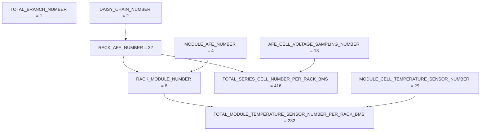
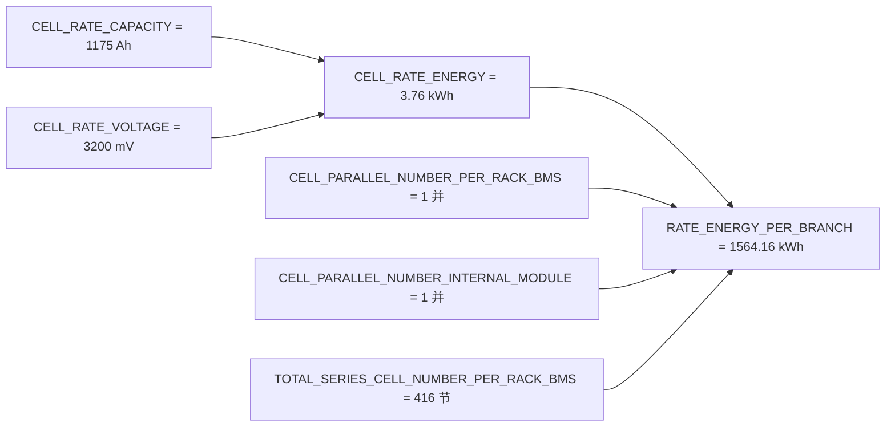

# SystemConfiguration_BMS20_RBMS — SystemParameter

> [!NOTE]
> **数据来源**：[`SystemConfiguration_BMS20_RBMS.xlsm`](SystemConfiguration_BMS20_RBMS.xlsm) → **SystemParameter** 工作表  
> **配置版本**：V9.4.9（作者 `zhangyf03`）  
> **用途**：RBMS（簇级 BMS）ASW 系统配置参数整理，供固件与 Web 配置对齐参考。

> [!IMPORTANT]
> 派生参数（**Formula ≠ NA**）由 Excel 工具或代码生成器计算，修改基础参数后需同步重新生成。

## Table of Contents

- [概述](#概述)
- [参数关系图](#参数关系图)
- [列字段说明](#列字段说明)
- [参数分组摘要](#参数分组摘要)
- [派生参数](#派生参数)
- [关键枚举](#关键枚举)
- [完整参数表](#完整参数表)
- [固件对齐清单](#固件对齐清单)
- [相关代码](#相关代码)

## 概述

**SystemParameter** 定义 BMS20 RBMS（簇级）的系统级常量，覆盖：

- 高压支路 / 菊花链拓扑
- 电芯与能量模型
- AFE / Module 采样规模与通道配置
- 平台与板级标识
- SOP 降额策略
- 与 **FaultList** 联动的故障数组配置

| 项 | 值 | 说明 |
| :--- | :--- | :--- |
| 参数总数 | **83** | SystemParameter 有效行数 |
| BMS 板级 | `[3]` | 三层 BMS 的 RBMS |
| 高压支路数 | `[1]` | 单簇配置 |
| 菊花链条数 | `[2]` | 主 / 副菊花链 |
| 单 Rack 串联电芯 | `[416]` | 32 AFE × 13 采样 |
| 单 Rack 温度点 | `[304]` | 含电芯 + 极柱温度 |
| 故障槽位 | 总计 `[200]` / 已用 `[172]` / 预留 `[28]` | 与 FaultList 联动 |

## 参数关系图

### 硬件拓扑与采样规模

### 能量派生链

## 列字段说明

| 列名 | 类型 | 必填 | 描述 |
| :--- | :--- | :---: | :--- |
| **Name** | string | 是 | 参数标识符（代码宏 / 变量名） |
| **PackageAttribute** | string | 是 | 固定为 `BMS.Parameter` |
| **Value** | array / scalar | 是 | 当前项目默认值 |
| **StorageClass** | enum | 是 | 多为 `Custom` |
| **CustomStorageClass** | enum | 是 | `SystemDefine` / `Import` / `Import_Safety` |
| **DataType** | enum | 是 | `int32` / `uint8` / `single` / `boolean` 等 |
| **Min / Max** | array | 否 | 取值范围 |
| **Dimensions** | array | 否 | 数组维度 |
| **DocUnits** | string | 否 | 物理单位 |
| **Description** | string | 否 | 参数说明 |
| **Formula** | string | 否 | 派生公式；`NA` 表示独立配置项 |

> [!TIP]
> **CustomStorageClass** 含义：
>
> - `SystemDefine`：系统固定，通常不可通过导入修改
> - `Import`：可通过配置工具导入
> - `Import_Safety`：安全相关导入项

## 参数分组摘要

| 分组 | Name | Value | DataType | CustomStorageClass | 单位 | Description |
| :--- | :--- | :--- | :--- | :--- | :--- | :--- |
| 簇 / 支路拓扑 | `TOTAL_BRANCH_NUMBER` | `[1]` | `int32` | `SystemDefine` | Nbr | High voltage branch |
| 簇 / 支路拓扑 | `TOTAL_BRANCH_NUMBER_MAX` | `[1]` | `int32` | `SystemDefine` | Nbr | The capability of max high voltage branch number |
| 簇 / 支路拓扑 | `RACK_NUMBER_FOR_EVERY_BANK_MAX` | `[12]` | `int32` | `SystemDefine` | Nbr | Max number of cell parallel between modules within a branch |
| 簇 / 支路拓扑 | `DAISY_CHAIN_NUMBER` | `[2]` | `int32` | `SystemDefine` | Nbr | Daisy-chain number |
| 簇 / 支路拓扑 | `AFE_NUMBER_FOR_EVERY_DAISY_CHAIN_USED` | `[32 0]` | `uint8` | `Import` | Nbr | AFE number at every actual used Daisy-chain |
| 簇 / 支路拓扑 | `SERIES_CELL_NUMBER_PER_RACK_CHANNEL` | `[256]` | `int32` | `SystemDefine` | Nbr | even or odd AFE channel number |
| 电芯与能量 | `CELL_RATE` | `[-1]` | `int32` | `SystemDefine` | C | Normal charge or discharge rate |
| 电芯与能量 | `CELL_RATE_CAPACITY` | `[1175]` | `int32` | `SystemDefine` | - | Single cell capacity |
| 电芯与能量 | `CELL_RATE_VOLTAGE` | `[3200]` | `uint16` | `SystemDefine` | mV | Rated Voltage of the Battery Cell |
| 电芯与能量 | `CELL_RATE_ENERGY` | `[3.76]` | `single` | `SystemDefine` | kWh | Single cell rate energy |
| 电芯与能量 | `CELL_RATE_POWER` | `[0.25]` | `single` | `Import` | - | Rated Power (Prate) of the Battery Cell |
| 电芯与能量 | `FULL_DISCHARGE_CELLV` | `[2500]` | `uint16` | `Import` | mV | Fully Discharged Cutoff Voltage of a Single Battery Cell |
| 电芯与能量 | `FULL_CHARGE_CELLV` | `[3620]` | `uint16` | `Import` | mV | Fully Charged Cutoff Voltage of a Single Battery Cell |
| 电芯与能量 | `CELL_PARALLEL_NUMBER_PER_RACK_BMS` | `[1]` | `int32` | `SystemDefine` | Nbr | Number of cell parallel between modules within a branch |
| 电芯与能量 | `CELL_PARALLEL_NUMBER_INTERNAL_MODULE` | `[1]` | `int32` | `SystemDefine` | Nbr | Number of cell parallel within a module |
| 电芯与能量 | `RATE_ENERGY_PER_BRANCH` | `[1564.16]` | `single` | `SystemDefine` | kWh | Single rack branch sum energy; accuracy change 418-417.9968 |
| AFE / Module / 采样通道 | `RACK_AFE_NUMBER` | `[32]` | `int32` | `SystemDefine` | Nbr | Actual AFE number |
| AFE / Module / 采样通道 | `RACK_AFE_NUMBER_MAX` | `[32]` | `int32` | `SystemDefine` | Nbr | The capability of max AFE number |
| AFE / Module / 采样通道 | `MODULE_AFE_NUMBER` | `[4]` | `int32` | `SystemDefine` | Nbr | AFE number per module |
| AFE / Module / 采样通道 | `AFE_CELL_VOLTAGE_SAMPLING_NUMBER` | `[13]` | `int32` | `SystemDefine` | Nbr | Cell voltage sampling number for every AFE |
| AFE / Module / 采样通道 | `AFE_CELL_VOLTAGE_SAMPLING_NUMBER_MAX` | `[16]` | `int32` | `SystemDefine` | Nbr | Cell voltage sampling number max for every AFE |
| AFE / Module / 采样通道 | `AFE_TEMPERATURE_SENSOR_NUMBER_MAX` | `[20]` | `int32` | `SystemDefine` | Nbr | GPIO temperature sensor number max for every AFE(cover module temperature and balancing temperature) |
| AFE / Module / 采样通道 | `RACK_MODULE_NUMBER` | `[8]` | `int32` | `SystemDefine` | Nbr | Actual module number |
| AFE / Module / 采样通道 | `RACK_MODULE_NUMBER_MAX` | `[8]` | `int32` | `SystemDefine` | Nbr | The capability of max module number |
| AFE / Module / 采样通道 | `AFE_TEMPERATURE_SENSOR_MUX_NUMBER` | `[2]` | `int32` | `SystemDefine` | Nbr | temperature sampling mux number for every AFE |
| AFE / Module / 采样通道 | `RACK_TEMPERATURE_SENSOR_MUX_NUMBER` | `[64]` | `int32` | `SystemDefine` | Nbr | temperature sampling mux number for every rack |
| AFE / Module / 采样通道 | `TOTAL_SERIES_CELL_NUMBER_PER_RACK_BMS` | `[416]` | `int32` | `SystemDefine` | Nbr | Actual total cell number |
| AFE / Module / 采样通道 | `TOTAL_SERIES_CELL_NUMBER_PER_RACK_BMS_MAX` | `[512]` | `int32` | `SystemDefine` | Nbr | The capability of max cell number |
| AFE / Module / 采样通道 | `TOTAL_SERIES_CELL_NUMBER_PER_RACK_MAX_REAL` | `[416]` | `int32` | `SystemDefine` | Nbr | Actual total cell number for real 1500v system |
| AFE / Module / 采样通道 | `MODULE_CELL_TEMPERATURE_SENSOR_NUMBER` | `[29]` | `int32` | `SystemDefine` | Nbr | Cell temp sensor number per module |
| AFE / Module / 采样通道 | `MODULE_CELL_TEMPERATURE_REDUNCHK_PAIR_NUMBER` | `[9]` | `int32` | `SystemDefine` | Nbr | Number of paired cell pairs with temperature redundancy detection for every module |
| AFE / Module / 采样通道 | `MODULE_CELL_TEMPERATURE_REDUNCHK_PAIR_INDEX` | `[2, … 29]`（共 18 项） | `uint8` | `Import` | Nbr | Corresponding elements of row1 and row2 are paired cell indexes for temperature redundancy detection |
| AFE / Module / 采样通道 | `TOTAL_MODULE_TEMPERATURE_SENSOR_NUMBER_PER_RACK_BMS` | `[232]` | `int32` | `SystemDefine` | Nbr | Actual module/cell temperature number per rack |
| AFE / Module / 采样通道 | `TOTAL_MODULE_TEMPERATURE_SENSOR_NUMBER_PER_RACK_BMS_MAX` | `[640]` | `int32` | `SystemDefine` | Nbr | The capability of max module temperature number |
| AFE / Module / 采样通道 | `TOTAL_TEMPERATURE_SENSOR_NUMBER_PER_RACK_BMS` | `[304]` | `int32` | `SystemDefine` | Nbr | Total temperature number per rack, including cell and pole temp. |
| AFE / Module / 采样通道 | `PCB_TEMPERATURE_NUMBER` | `[32]` | `int32` | `SystemDefine` | Nbr | The actual balance temperature number |
| AFE / Module / 采样通道 | `POLE_TEMP_ENABLE` | `[1]` | `int32` | `SystemDefine` | Nbr | Distinguish between pole/copper temperature and cell temperature |
| AFE / Module / 采样通道 | `MODULE_CELL_POLE_TEMPERATURE_SENSOR_NUMBER` | `[36]` | `int32` | `SystemDefine` | Nbr | Cell temp and pole temp sensor number per module |
| AFE / Module / 采样通道 | `MODULE_CELL_POLE_CONN_TEMPERATURE_SENSOR_NUMBER` | `[38]` | `int32` | `SystemDefine` | Nbr | Cell temp, pole temp and pack connector sensor number per module |
| AFE / Module / 采样通道 | `RACK_POLE_TEMPERATURE_NUMBER_MAX` | `[128]` | `int32` | `SystemDefine` | Nbr | Max pole tempetrature number in a rack |
| AFE / Module / 采样通道 | `RACK_MODULE_CONN_TEMPERATURE_NUMBER_MAX` | `[16]` | `int32` | `SystemDefine` | Nbr | Max pack/module pos and neg connector tempetrature number in a rack,  especially for the projects wi |
| AFE / Module / 采样通道 | `MODULE_TEMPERATURE_SENSOR_SAMPLING_CHANNEL_CONFIGURATION` | `[1 … 0]`（共 80 项） | `uint8` | `Import` | Nbr | temperature sampling channel configuration:  0: None,  1: PCB Temp (balancing) 2: MUX_GND Temp,  3: |
| AFE / Module / 采样通道 | `AFE_CELL_VOLTAGE_SAMPLING_CHANNEL_TYPE1` | `[1 1 1 1 1 1 1 1 1 1 1 1 1 0 0 0]` | `uint8` | `Import` | Nbr | Cell voltage sampling AFE type 1 every dimension element means whether or not have cell voltage samp |
| AFE / Module / 采样通道 | `AFE_CELL_VOLTAGE_SAMPLING_CHANNEL_TYPE2` | `[1 1 1 1 1 1 1 1 1 1 1 1 1 0 0 0]` | `uint8` | `Import` | Nbr | Cell voltage sampling AFE type 2 every dimension element means whether or not have cell voltage samp |
| AFE / Module / 采样通道 | `AFE_TEMPERATURE_SENSOR_MUX_START_INDEX` | `[1 10]` | `uint8` | `Import` | Nbr | temperature sampling channel start index of each mux for every AFE |
| AFE / Module / 采样通道 | `RACK_CELL_VOLTAGE_SAMPLING_NUMBER_FOR_EVERY_AFE` | `[13 … 13]`（共 32 项） | `uint8` | `Import` | Nbr | Cell voltage sampling number for every AFE |
| AFE / Module / 采样通道 | `RACK_CELL_VOLTAGE_SAMPLING_AFE_TYPE` | `[1 … 2]`（共 32 项） | `uint8` | `Import` | Nbr | Cell voltage sampling AFE type definition(1 for 7-0-6 type and 2 for 6-0-7 type) |
| AFE / Module / 采样通道 | `RACK_CELL_VOLTAGE_SAMPLING_NUMBER_FOR_EVERY_AFE_USED` | `[13 … 13]`（共 32 项） | `uint8` | `Import` | Nbr | Cell voltage sampling number at every actual used AFE |
| AFE / Module / 采样通道 | `RACK_TEMPERATURE_SENSOR_NUMBER_FOR_EVERY_AFE_USED` | `[9 … 11]`（共 32 项） | `uint8` | `Import` | Nbr | Module temperature number at every actual used AFE |
| AFE / Module / 采样通道 | `RACK_CELL_VOLTAGE_SAMPLING_FLAG_FOR_ALL_AFE_CHANNEL` | `[1 … 0]`（共 512 项） | `uint8` | `Import` | Flg | for all available afe voltage sampling channed, this flag detect if the channel is used to measure v |
| AFE / Module / 采样通道 | `RACK_CELL_VOLTAGE_SAMPLING_INDEX_FOR_ALL_AFE_CHANNEL` | `[0 … 508]`（共 416 项） | `uint16` | `Import` | Nbr | index for all available afe voltage sampling channed, zero-based index |
| AFE / Module / 采样通道 | `RACK_CELL_VOLTAGE_SAMPLING_ODDEVEN_FLAG` | `[0 … 0]`（共 416 项） | `uint8` | `Import` | Flg | check the cell is odd or even in AFE channel, 0 is odd channel, 1 is even channel |
| AFE / Module / 采样通道 | `AFE_MASTER_NODE` | `[0]` | `uint8` | `SystemDefine` | / | 0: 表示IPB为主链，1:表示IPA为主链 |
| 平台 / 板级 / 软件 | `ACIS_BMS_BOARD` | `[3]` | `uint8` | `SystemDefine` | - | different board-level BMS 1:BBMS 2:RBMS of two-tier BMS 3:RBMS of three-tier BMS |
| 平台 / 板级 / 软件 | `RBMS_SW_VERSION` | `[77 85 49 48 87 49 57 48]` | `uint8` | `Import` | Nbr | Rack软件版本号 |
| 平台 / 板级 / 软件 | `HIL_TEST_ENABLE` | `[0]` | `int32` | `SystemDefine` | Nbr | HIL test enable/disable define flag |
| 平台 / 板级 / 软件 | `ARRANGE_TWO_HALL_SENSORS` | `[0]` | `uint8` | `SystemDefine` | Nbr | Current sensor layout form (0 indicates the layout of 1 Hall sensor, 1 indicates the layout of 2 Hal |
| 平台 / 板级 / 软件 | `ENABLE_CAN3_SEND` | `[0]` | `int32` | `SystemDefine` | Nbr | 是否通过CAN0通道发送数据帧，用于Pack下线测试 |
| 高压 / 接触器 / 绝缘 | `MAIN_CONTACTOR_TYPE` | `[0]` | `int32` | `SystemDefine` | - | 0：常开继电器；1：常闭继电器。 |
| 高压 / 接触器 / 绝缘 | `FUSE_TYPE` | `[0]` | `int32` | `SystemDefine` | - | （0：常规继电器；1：融合开关含预充回路（全融合方式）；2：融合开关不含预充回路（半融合方式）） |
| 高压 / 接触器 / 绝缘 | `CTSC_RLYLSD_NORMAL_CLOSE` | `[1]` | `uint8` | `SystemDefine` | Nbr | Is the low side of the relay normally closed? (0: No; 1:Yes) |
| 高压 / 接触器 / 绝缘 | `CTSC_THREE_LEVEL_SYSTEM_RBMS_POWERUP_AUTO` | `[0]` | `uint8` | `Import` | 1 | Three-tier architecture system, can the clusters automatically be connected to high voltage? (0: can |
| 高压 / 接触器 / 绝缘 | `ISOH_INSULATION_FAULT_CONFIGURATION` | `[0]` | `uint8` | `SystemDefine` | Nbr | Insulation  low fault parameter configuration  0:parameter*HVbatV 1:parameter |
| SOP / 降额 | `SOPC_DEGRATE_BASE_BBMS_FAULT` | `[1]` | `int32` | `Import` | Nbr | Power and current degrate based on BBMS fault level |
| SOP / 降额 | `SOPC_DEGRATE_BASED_SOC` | `[1]` | `int32` | `SystemDefine` | Nbr | Power and current degrate based on SOC |
| SOP / 降额 | `SOPC_DEGRATE_BASED_SOH` | `[0]` | `int32` | `SystemDefine` | Nbr | Power and current degrate based on SOH |
| SOP / 降额 | `SOPC_DEGRATE_BASED_FAULT_ENABLE` | `[0]` | `int32` | `SystemDefine` | Nbr | Power and current degrate based on fault level |
| SOP / 降额 | `SOPC_DEGRATE_BASED_FAULT_WITHONESIDE_ENABLE` | `[0]` | `int32` | `SystemDefine` | Nbr | Power and current degrate based on specific faults, 1 for BMS1.3, 0 for other projects |
| SOP / 降额 | `SOPC_IsBaseCurrentResetForbid` | `[0]` | `int32` | `SystemDefine` | Nbr | 单边禁充禁放恢复逻辑： 0：对所有只禁单边功率的情况，设置所限功率仅当单边限功率故障恢复时才可消除限0 1：对所有只禁单边功率的情况，设置所限功率仅当出现反向电流时才可消除限0 |
| 故障系统配置（与 FaultList 联动） | `FAULT_TOTAL_NUMBER` | `[200]` | `int32` | `SystemDefine` | Nbr | System total fault number |
| 故障系统配置（与 FaultList 联动） | `FAULT_NUMBER_USED` | `[172]` | `int32` | `SystemDefine` | Nbr | Used fault number |
| 故障系统配置（与 FaultList 联动） | `FAULT_NUMBER_RESERVED` | `[28]` | `int32` | `SystemDefine` | Nbr | Reserved fault number |
| 故障系统配置（与 FaultList 联动） | `CaFDCH_FltStsDisaAryFlg` | `[0 … 1]`（共 200 项） | `boolean` | `Import` | / | Fault status disable array (0: Enable, 1: Disable) |
| 故障系统配置（与 FaultList 联动） | `CaFDCH_FltStsDisaArySftyFlg` | `[0 … 1]`（共 200 项） | `boolean` | `Import_Safety` | / | Safety fault status disable array (0: Enable, 1: Disable) |
| 故障系统配置（与 FaultList 联动） | `CaFDCH_FltRcvryModeFlg` | `[1 … 0]`（共 200 项） | `boolean` | `Import` | / | Fault recovery mode array (0: 可在线恢复, 1: 下电恢复) |
| 故障系统配置（与 FaultList 联动） | `CaFDCH_FltRcvryModeSftyFlg` | `[1 … 0]`（共 200 项） | `boolean` | `Import_Safety` | / | Safety fault recovery mode array (0: 可在线恢复, 1: 下电恢复) |
| 故障系统配置（与 FaultList 联动） | `FAULT_CH_SOP_COEF` | `[0 … 0]`（共 172 项） | `uint8` | `Import` | pct | Charge SOP coefficient when fault asserted |
| 故障系统配置（与 FaultList 联动） | `FAULT_DCHA_SOP_COEF` | `[0 … 0]`（共 172 项） | `uint8` | `Import` | pct | Discharge SOP coefficient when fault asserted |
| 故障系统配置（与 FaultList 联动） | `FRLM_FLT_LIST_LVL` | `[1 … 1]`（共 172 项） | `uint8` | `Import` | / | System fault level when fault asserted |
| 其它 | `FUN_SAFETY_RESET` | `[0]` | `int32` | `SystemDefine` | Nbr | 是否启用功能安全失败动作reset |
| 其它 | `BTCS_CURRENT_SELECT_MODE` | `[0]` | `uint8` | `SystemDefine` | Nbr | When both Hall current sensors are valid, the current selection strategy (0: select the maximum valu |
| 其它 | `CURRENT_SENSOR_ZERO_DRIFT_A` | `[2]` | `single` | `SystemDefine` | A | current sensor zero drift threshold |
| 其它 | `NVM_WRITE_FLAG_HOLD_TIME` | `[2000]` | `uint16` | `SystemDefine` | ms | The NVM write flag from ASW must remain set to true during this period to ensure the signal is succe |

> [!CAUTION]
> 故障联动数组（`CaFDCH_*`、`FAULT_*_COEF`）长度与 **FaultList** 行数相关，完整数值见 [完整参数表](#完整参数表)。

## 派生参数

以下 **36** 项由其它 SystemParameter 或 **FaultList** 表计算得出：

| Name | Value | Formula | Description |
| :--- | :--- | :--- | :--- |
| `RACK_MODULE_NUMBER` | `[8]` | `RACK_AFE_NUMBER/MODULE_AFE_NUMBER` | Actual module number |
| `RACK_MODULE_NUMBER_MAX` | `[8]` | `RACK_AFE_NUMBER_MAX/MODULE_AFE_NUMBER` | The capability of max module number |
| `AFE_TEMPERATURE_SENSOR_MUX_NUMBER` | `[2]` | `sum(MODULE_TEMPERATURE_SENSOR_SAMPLING_CHANNEL_CONFIGURATION==2, 'All')/MODULE_AFE_NUMBER` | temperature sampling mux number for every AFE |
| `RACK_TEMPERATURE_SENSOR_MUX_NUMBER` | `[64]` | `RACK_AFE_NUMBER_MAX * AFE_TEMPERATURE_SENSOR_MUX_NUMBER` | temperature sampling mux number for every rack |
| `MODULE_CELL_TEMPERATURE_REDUNCHK_PAIR_NUMBER` | `[9]` | `size(MODULE_CELL_TEMPERATURE_REDUNCHK_PAIR_INDEX, 2)` | Number of paired cell pairs with temperature redundancy detection for every modu |
| `TOTAL_SERIES_CELL_NUMBER_PER_RACK_BMS` | `[416]` | `RACK_AFE_NUMBER*AFE_CELL_VOLTAGE_SAMPLING_NUMBER` | Actual total cell number |
| `TOTAL_SERIES_CELL_NUMBER_PER_RACK_BMS_MAX` | `[512]` | `RACK_AFE_NUMBER_MAX*AFE_CELL_VOLTAGE_SAMPLING_NUMBER_MAX` | The capability of max cell number |
| `PCB_TEMPERATURE_NUMBER` | `[32]` | `sum(MODULE_TEMPERATURE_SENSOR_SAMPLING_CHANNEL_CONFIGURATION==1, 'All')*RACK_MODULE_NUMBER` | The actual balance temperature number |
| `MODULE_CELL_POLE_TEMPERATURE_SENSOR_NUMBER` | `[36]` | `sum((MODULE_TEMPERATURE_SENSOR_SAMPLING_CHANNEL_CONFIGURATION ==3) \| (MODULE_TEMPERATURE_SENSOR_SAMPLING_CHANNEL_CONFIGURATION ==4) , 'All')` | Cell temp and pole temp sensor number per module |
| `MODULE_CELL_TEMPERATURE_SENSOR_NUMBER` | `[29]` | `sum(MODULE_TEMPERATURE_SENSOR_SAMPLING_CHANNEL_CONFIGURATION ==3, 'All')` | Cell temp sensor number per module |
| `TOTAL_TEMPERATURE_SENSOR_NUMBER_PER_RACK_BMS` | `[304]` | `sum(MODULE_TEMPERATURE_SENSOR_SAMPLING_CHANNEL_CONFIGURATION >=3, 'All') * RACK_MODULE_NUMBER` | Total temperature number per rack, including cell and pole temp. |
| `TOTAL_MODULE_TEMPERATURE_SENSOR_NUMBER_PER_RACK_BMS` | `[232]` | `sum(MODULE_TEMPERATURE_SENSOR_SAMPLING_CHANNEL_CONFIGURATION ==3, 'All') * RACK_MODULE_NUMBER` | Actual module/cell temperature number per rack |
| `TOTAL_MODULE_TEMPERATURE_SENSOR_NUMBER_PER_RACK_BMS_MAX` | `[640]` | `RACK_AFE_NUMBER_MAX*AFE_TEMPERATURE_SENSOR_NUMBER_MAX` | The capability of max module temperature number |
| `CELL_RATE_ENERGY` | `[3.76]` | `CELL_RATE_CAPACITY*CELL_RATE_VOLTAGE/1000/1000` | Single cell rate energy |
| `RATE_ENERGY_PER_BRANCH` | `[1564.16]` | `CELL_RATE_ENERGY*CELL_PARALLEL_NUMBER_PER_RACK_BMS*CELL_PARALLEL_NUMBER_INTERNAL_MODULE*TOTAL_SERIES_CELL_NUMBER_PER_RACK_BMS` | Single rack branch sum energy; accuracy change 418-417.9968 |
| `SERIES_CELL_NUMBER_PER_RACK_CHANNEL` | `[256]` | `RACK_AFE_NUMBER*AFE_CELL_VOLTAGE_SAMPLING_NUMBER_MAX/2` | even or odd AFE channel number |
| `AFE_NUMBER_FOR_EVERY_DAISY_CHAIN_USED` | `[32 0]` | `[RACK_AFE_NUMBER 0]` | AFE number at every actual used Daisy-chain |
| `RACK_CELL_VOLTAGE_SAMPLING_NUMBER_FOR_EVERY_AFE` | `[13 … 13]`（共 32 项） | `repmat(AFE_CELL_VOLTAGE_SAMPLING_NUMBER,1,RACK_AFE_NUMBER_MAX)` | Cell voltage sampling number for every AFE |
| `RACK_CELL_VOLTAGE_SAMPLING_AFE_TYPE` | `[1 … 2]`（共 32 项） | `repmat([1 2], 1, RACK_AFE_NUMBER_MAX/2)` | Cell voltage sampling AFE type definition(1 for 7-0-6 type and 2 for 6-0-7 type) |
| `RACK_CELL_VOLTAGE_SAMPLING_NUMBER_FOR_EVERY_AFE_USED` | `[13 … 13]`（共 32 项） | `repmat(AFE_CELL_VOLTAGE_SAMPLING_NUMBER, 1, RACK_AFE_NUMBER)` | Cell voltage sampling number at every actual used AFE |
| `RACK_TEMPERATURE_SENSOR_NUMBER_FOR_EVERY_AFE_USED` | `[9 … 11]`（共 32 项） | `repmat(sum(MODULE_TEMPERATURE_SENSOR_SAMPLING_CHANNEL_CONFIGURATION >=3,2)', 1, RACK_MODULE_NUMBER)` | Module temperature number at every actual used AFE |
| `RACK_CELL_VOLTAGE_SAMPLING_FLAG_FOR_ALL_AFE_CHANNEL` | `[1 … 0]`（共 512 项） | `cell2mat(arrayfun(@(x) (AFE_CELL_VOLTAGE_SAMPLING_CHANNEL_TYPE1*(x==1) + AFE_CELL_VOLTAGE_SAMPLING_CHANNEL_TYPE2*(x==2)), RACK_CELL_VOLTAGE_SAMPLING_AFE_TYPE, 'UniformOutput', false))` | for all available afe voltage sampling channed, this flag detect if the channel |
| `RACK_CELL_VOLTAGE_SAMPLING_INDEX_FOR_ALL_AFE_CHANNEL` | `[0 … 508]`（共 416 项） | `find(RACK_CELL_VOLTAGE_SAMPLING_FLAG_FOR_ALL_AFE_CHANNEL == 1,TOTAL_SERIES_CELL_NUMBER_PER_RACK_BMS) - 1` | index for all available afe voltage sampling channed, zero-based index |
| `RACK_CELL_VOLTAGE_SAMPLING_ODDEVEN_FLAG` | `[0 … 0]`（共 416 项） | `mod(RACK_CELL_VOLTAGE_SAMPLING_INDEX_FOR_ALL_AFE_CHANNEL,2)` | check the cell is odd or even in AFE channel, 0 is odd channel, 1 is even channe |
| `RACK_POLE_TEMPERATURE_NUMBER_MAX` | `[128]` | `4*RACK_AFE_NUMBER` | Max pole tempetrature number in a rack |
| `RACK_MODULE_CONN_TEMPERATURE_NUMBER_MAX` | `[16]` | `2*RACK_MODULE_NUMBER` | Max pack/module pos and neg connector tempetrature number in a rack,  especially |
| `MODULE_CELL_POLE_CONN_TEMPERATURE_SENSOR_NUMBER` | `[38]` | `TOTAL_TEMPERATURE_SENSOR_NUMBER_PER_RACK_BMS / RACK_MODULE_NUMBER` | Cell temp, pole temp and pack connector sensor number per module |
| `CaFDCH_FltStsDisaAryFlg` | `[0 … 1]`（共 200 项） | `[Tab_FaultList.EnableFault==0, ones(1, FAULT_NUMBER_RESERVED)]` | Fault status disable array (0: Enable, 1: Disable) |
| `CaFDCH_FltStsDisaArySftyFlg` | `[0 … 1]`（共 200 项） | `[Tab_FaultList.EnableFault==0, ones(1, FAULT_NUMBER_RESERVED)]` | Safety fault status disable array (0: Enable, 1: Disable) |
| `CaFDCH_FltRcvryModeFlg` | `[1 … 0]`（共 200 项） | `[contains(Tab_FaultList.FaultDeassertCriteria,'下电'), zeros(1, FAULT_NUMBER_RESERVED)]` | Fault recovery mode array (0: 可在线恢复, 1: 下电恢复) |
| `CaFDCH_FltRcvryModeSftyFlg` | `[1 … 0]`（共 200 项） | `[contains(Tab_FaultList.FaultDeassertCriteria,'下电'), zeros(1, FAULT_NUMBER_RESERVED)]` | Safety fault recovery mode array (0: 可在线恢复, 1: 下电恢复) |
| `FAULT_CH_SOP_COEF` | `[0 … 0]`（共 172 项） | `Tab_FaultList("ChargeSOPCoef(%)")` | Charge SOP coefficient when fault asserted |
| `FAULT_DCHA_SOP_COEF` | `[0 … 0]`（共 172 项） | `Tab_FaultList("DischargeSOPCoef(%)")` | Discharge SOP coefficient when fault asserted |
| `FRLM_FLT_LIST_LVL` | `[1 … 1]`（共 172 项） | `Tab_FaultList.FaultLevel` | System fault level when fault asserted |
| `FAULT_NUMBER_USED` | `[172]` | `height(Tab_FaultList.FaultLevel)` | Used fault number |
| `FAULT_NUMBER_RESERVED` | `[28]` | `FAULT_TOTAL_NUMBER - FAULT_NUMBER_USED` | Reserved fault number |

## 关键枚举

### ACIS_BMS_BOARD — 板级 BMS 类型

| 值 | 类型 |
| :---: | :--- |
| 1 | BBMS |
| 2 | 两层 BMS 的 RBMS |
| 3 | 三层 BMS 的 RBMS |

### MAIN_CONTACTOR_TYPE — 主接触器类型

| 值 | 类型 |
| :---: | :--- |
| 0 | 常开继电器 |
| 1 | 常闭继电器 |

### FUSE_TYPE — 熔断 / 开关类型

| 值 | 类型 |
| :---: | :--- |
| 0 | 常规继电器 |
| 1 | 融合开关含预充回路（全融合） |
| 2 | 融合开关不含预充回路（半融合） |

## 完整参数表

点击展开全部 83 项参数（含 Formula）

| Name | Value | DataType | CustomStorageClass | 单位 | Description | Formula |
| :--- | :--- | :--- | :--- | :--- | :--- | :--- |
| `TOTAL_BRANCH_NUMBER` | `[1]` | `int32` | `SystemDefine` | Nbr | High voltage branch | `NA` |
| `SOPC_DEGRATE_BASE_BBMS_FAULT` | `[1]` | `int32` | `Import` | Nbr | Power and current degrate based on BBMS fault level | `NA` |
| `ENABLE_CAN3_SEND` | `[0]` | `int32` | `SystemDefine` | Nbr | 是否通过CAN0通道发送数据帧，用于Pack下线测试 | `NA` |
| `CTSC_RLYLSD_NORMAL_CLOSE` | `[1]` | `uint8` | `SystemDefine` | Nbr | Is the low side of the relay normally closed? (0: No; 1:Yes) | `NA` |
| `CTSC_THREE_LEVEL_SYSTEM_RBMS_POWERUP_AUTO` | `[0]` | `uint8` | `Import` | 1 | Three-tier architecture system, can the clusters automatically be connected to h | `NA` |
| `ISOH_INSULATION_FAULT_CONFIGURATION` | `[0]` | `uint8` | `SystemDefine` | Nbr | Insulation  low fault parameter configuration  0:parameter*HVbatV 1:parameter | `NA` |
| `BTCS_CURRENT_SELECT_MODE` | `[0]` | `uint8` | `SystemDefine` | Nbr | When both Hall current sensors are valid, the current selection strategy (0: sel | `NA` |
| `SOPC_IsBaseCurrentResetForbid` | `[0]` | `int32` | `SystemDefine` | Nbr | 单边禁充禁放恢复逻辑： 0：对所有只禁单边功率的情况，设置所限功率仅当单边限功率故障恢复时才可消除限0 1：对所有只禁单边功率的情况，设置所限功率仅当出现反向电 | `NA` |
| `RACK_NUMBER_FOR_EVERY_BANK_MAX` | `[12]` | `int32` | `SystemDefine` | Nbr | Max number of cell parallel between modules within a branch | `NA` |
| `FUN_SAFETY_RESET` | `[0]` | `int32` | `SystemDefine` | Nbr | 是否启用功能安全失败动作reset | `NA` |
| `TOTAL_BRANCH_NUMBER_MAX` | `[1]` | `int32` | `SystemDefine` | Nbr | The capability of max high voltage branch number | `NA` |
| `RACK_AFE_NUMBER` | `[32]` | `int32` | `SystemDefine` | Nbr | Actual AFE number | `NA` |
| `RACK_AFE_NUMBER_MAX` | `[32]` | `int32` | `SystemDefine` | Nbr | The capability of max AFE number | `NA` |
| `MODULE_AFE_NUMBER` | `[4]` | `int32` | `SystemDefine` | Nbr | AFE number per module | `NA` |
| `AFE_CELL_VOLTAGE_SAMPLING_NUMBER` | `[13]` | `int32` | `SystemDefine` | Nbr | Cell voltage sampling number for every AFE | `NA` |
| `AFE_CELL_VOLTAGE_SAMPLING_NUMBER_MAX` | `[16]` | `int32` | `SystemDefine` | Nbr | Cell voltage sampling number max for every AFE | `NA` |
| `AFE_TEMPERATURE_SENSOR_NUMBER_MAX` | `[20]` | `int32` | `SystemDefine` | Nbr | GPIO temperature sensor number max for every AFE(cover module temperature and ba | `NA` |
| `DAISY_CHAIN_NUMBER` | `[2]` | `int32` | `SystemDefine` | Nbr | Daisy-chain number | `NA` |
| `CELL_PARALLEL_NUMBER_PER_RACK_BMS` | `[1]` | `int32` | `SystemDefine` | Nbr | Number of cell parallel between modules within a branch | `NA` |
| `CELL_PARALLEL_NUMBER_INTERNAL_MODULE` | `[1]` | `int32` | `SystemDefine` | Nbr | Number of cell parallel within a module | `NA` |
| `FAULT_TOTAL_NUMBER` | `[200]` | `int32` | `SystemDefine` | Nbr | System total fault number | `NA` |
| `CELL_RATE` | `[-1]` | `int32` | `SystemDefine` | C | Normal charge or discharge rate | `NA` |
| `CELL_RATE_CAPACITY` | `[1175]` | `int32` | `SystemDefine` | - | Single cell capacity | `NA` |
| `SOPC_DEGRATE_BASED_SOC` | `[1]` | `int32` | `SystemDefine` | Nbr | Power and current degrate based on SOC | `NA` |
| `SOPC_DEGRATE_BASED_SOH` | `[0]` | `int32` | `SystemDefine` | Nbr | Power and current degrate based on SOH | `NA` |
| `SOPC_DEGRATE_BASED_FAULT_ENABLE` | `[0]` | `int32` | `SystemDefine` | Nbr | Power and current degrate based on fault level | `NA` |
| `SOPC_DEGRATE_BASED_FAULT_WITHONESIDE_ENABLE` | `[0]` | `int32` | `SystemDefine` | Nbr | Power and current degrate based on specific faults, 1 for BMS1.3, 0 for other pr | `NA` |
| `HIL_TEST_ENABLE` | `[0]` | `int32` | `SystemDefine` | Nbr | HIL test enable/disable define flag | `NA` |
| `TOTAL_SERIES_CELL_NUMBER_PER_RACK_MAX_REAL` | `[416]` | `int32` | `SystemDefine` | Nbr | Actual total cell number for real 1500v system | `NA` |
| `MAIN_CONTACTOR_TYPE` | `[0]` | `int32` | `SystemDefine` | - | 0：常开继电器；1：常闭继电器。 | `NA` |
| `FUSE_TYPE` | `[0]` | `int32` | `SystemDefine` | - | （0：常规继电器；1：融合开关含预充回路（全融合方式）；2：融合开关不含预充回路（半融合方式）） | `NA` |
| `RBMS_SW_VERSION` | `[77 85 49 48 87 49 57 48]` | `uint8` | `Import` | Nbr | Rack软件版本号 | `NA` |
| `POLE_TEMP_ENABLE` | `[1]` | `int32` | `SystemDefine` | Nbr | Distinguish between pole/copper temperature and cell temperature | `NA` |
| `CURRENT_SENSOR_ZERO_DRIFT_A` | `[2]` | `single` | `SystemDefine` | A | current sensor zero drift threshold | `NA` |
| `AFE_CELL_VOLTAGE_SAMPLING_CHANNEL_TYPE1` | `[1 1 1 1 1 1 1 1 1 1 1 1 1 0 0 0]` | `uint8` | `Import` | Nbr | Cell voltage sampling AFE type 1 every dimension element means whether or not ha | `NA` |
| `AFE_CELL_VOLTAGE_SAMPLING_CHANNEL_TYPE2` | `[1 1 1 1 1 1 1 1 1 1 1 1 1 0 0 0]` | `uint8` | `Import` | Nbr | Cell voltage sampling AFE type 2 every dimension element means whether or not ha | `NA` |
| `AFE_TEMPERATURE_SENSOR_MUX_START_INDEX` | `[1 10]` | `uint8` | `Import` | Nbr | temperature sampling channel start index of each mux for every AFE | `NA` |
| `MODULE_CELL_TEMPERATURE_REDUNCHK_PAIR_INDEX` | `[2, … 29]`（共 18 项） | `uint8` | `Import` | Nbr | Corresponding elements of row1 and row2 are paired cell indexes for temperature | `NA` |
| `CELL_RATE_POWER` | `[0.25]` | `single` | `Import` | - | Rated Power (Prate) of the Battery Cell | `NA` |
| `FULL_DISCHARGE_CELLV` | `[2500]` | `uint16` | `Import` | mV | Fully Discharged Cutoff Voltage of a Single Battery Cell | `NA` |
| `FULL_CHARGE_CELLV` | `[3620]` | `uint16` | `Import` | mV | Fully Charged Cutoff Voltage of a Single Battery Cell | `NA` |
| `AFE_MASTER_NODE` | `[0]` | `uint8` | `SystemDefine` | / | 0: 表示IPB为主链，1:表示IPA为主链 | `NA` |
| `ACIS_BMS_BOARD` | `[3]` | `uint8` | `SystemDefine` | - | different board-level BMS 1:BBMS 2:RBMS of two-tier BMS 3:RBMS of three-tier BMS | `NA` |
| `ARRANGE_TWO_HALL_SENSORS` | `[0]` | `uint8` | `SystemDefine` | Nbr | Current sensor layout form (0 indicates the layout of 1 Hall sensor, 1 indicates | `NA` |
| `NVM_WRITE_FLAG_HOLD_TIME` | `[2000]` | `uint16` | `SystemDefine` | ms | The NVM write flag from ASW must remain set to true during this period to ensure | `NA` |
| `MODULE_TEMPERATURE_SENSOR_SAMPLING_CHANNEL_CONFIGURATION` | `[1 … 0]`（共 80 项） | `uint8` | `Import` | Nbr | temperature sampling channel configuration:  0: None,  1: PCB Temp (balancing) 2 | `NA` |
| `CELL_RATE_VOLTAGE` | `[3200]` | `uint16` | `SystemDefine` | mV | Rated Voltage of the Battery Cell | `NA` |
| `RACK_MODULE_NUMBER` | `[8]` | `int32` | `SystemDefine` | Nbr | Actual module number | `RACK_AFE_NUMBER/MODULE_AFE_NUMBER` |
| `RACK_MODULE_NUMBER_MAX` | `[8]` | `int32` | `SystemDefine` | Nbr | The capability of max module number | `RACK_AFE_NUMBER_MAX/MODULE_AFE_NUMBER` |
| `AFE_TEMPERATURE_SENSOR_MUX_NUMBER` | `[2]` | `int32` | `SystemDefine` | Nbr | temperature sampling mux number for every AFE | `sum(MODULE_TEMPERATURE_SENSOR_SAMPLING_CHANNEL_CONFIGURATION==2, 'All')/MODULE_AFE_NUMBER` |
| `RACK_TEMPERATURE_SENSOR_MUX_NUMBER` | `[64]` | `int32` | `SystemDefine` | Nbr | temperature sampling mux number for every rack | `RACK_AFE_NUMBER_MAX * AFE_TEMPERATURE_SENSOR_MUX_NUMBER` |
| `MODULE_CELL_TEMPERATURE_REDUNCHK_PAIR_NUMBER` | `[9]` | `int32` | `SystemDefine` | Nbr | Number of paired cell pairs with temperature redundancy detection for every modu | `size(MODULE_CELL_TEMPERATURE_REDUNCHK_PAIR_INDEX, 2)` |
| `TOTAL_SERIES_CELL_NUMBER_PER_RACK_BMS` | `[416]` | `int32` | `SystemDefine` | Nbr | Actual total cell number | `RACK_AFE_NUMBER*AFE_CELL_VOLTAGE_SAMPLING_NUMBER` |
| `TOTAL_SERIES_CELL_NUMBER_PER_RACK_BMS_MAX` | `[512]` | `int32` | `SystemDefine` | Nbr | The capability of max cell number | `RACK_AFE_NUMBER_MAX*AFE_CELL_VOLTAGE_SAMPLING_NUMBER_MAX` |
| `PCB_TEMPERATURE_NUMBER` | `[32]` | `int32` | `SystemDefine` | Nbr | The actual balance temperature number | `sum(MODULE_TEMPERATURE_SENSOR_SAMPLING_CHANNEL_CONFIGURATION==1, 'All')*RACK_MODULE_NUMBER` |
| `MODULE_CELL_POLE_TEMPERATURE_SENSOR_NUMBER` | `[36]` | `int32` | `SystemDefine` | Nbr | Cell temp and pole temp sensor number per module | `sum((MODULE_TEMPERATURE_SENSOR_SAMPLING_CHANNEL_CONFIGURATION ==3) \| (MODULE_TEMPERATURE_SENSOR_SAMPLING_CHANNEL_CONFIGURATION ==4) , 'All')` |
| `MODULE_CELL_TEMPERATURE_SENSOR_NUMBER` | `[29]` | `int32` | `SystemDefine` | Nbr | Cell temp sensor number per module | `sum(MODULE_TEMPERATURE_SENSOR_SAMPLING_CHANNEL_CONFIGURATION ==3, 'All')` |
| `TOTAL_TEMPERATURE_SENSOR_NUMBER_PER_RACK_BMS` | `[304]` | `int32` | `SystemDefine` | Nbr | Total temperature number per rack, including cell and pole temp. | `sum(MODULE_TEMPERATURE_SENSOR_SAMPLING_CHANNEL_CONFIGURATION >=3, 'All') * RACK_MODULE_NUMBER` |
| `TOTAL_MODULE_TEMPERATURE_SENSOR_NUMBER_PER_RACK_BMS` | `[232]` | `int32` | `SystemDefine` | Nbr | Actual module/cell temperature number per rack | `sum(MODULE_TEMPERATURE_SENSOR_SAMPLING_CHANNEL_CONFIGURATION ==3, 'All') * RACK_MODULE_NUMBER` |
| `TOTAL_MODULE_TEMPERATURE_SENSOR_NUMBER_PER_RACK_BMS_MAX` | `[640]` | `int32` | `SystemDefine` | Nbr | The capability of max module temperature number | `RACK_AFE_NUMBER_MAX*AFE_TEMPERATURE_SENSOR_NUMBER_MAX` |
| `CELL_RATE_ENERGY` | `[3.76]` | `single` | `SystemDefine` | kWh | Single cell rate energy | `CELL_RATE_CAPACITY*CELL_RATE_VOLTAGE/1000/1000` |
| `RATE_ENERGY_PER_BRANCH` | `[1564.16]` | `single` | `SystemDefine` | kWh | Single rack branch sum energy; accuracy change 418-417.9968 | `CELL_RATE_ENERGY*CELL_PARALLEL_NUMBER_PER_RACK_BMS*CELL_PARALLEL_NUMBER_INTERNAL_MODULE*TOTAL_SERIES_CELL_NUMBER_PER_RACK_BMS` |
| `SERIES_CELL_NUMBER_PER_RACK_CHANNEL` | `[256]` | `int32` | `SystemDefine` | Nbr | even or odd AFE channel number | `RACK_AFE_NUMBER*AFE_CELL_VOLTAGE_SAMPLING_NUMBER_MAX/2` |
| `AFE_NUMBER_FOR_EVERY_DAISY_CHAIN_USED` | `[32 0]` | `uint8` | `Import` | Nbr | AFE number at every actual used Daisy-chain | `[RACK_AFE_NUMBER 0]` |
| `RACK_CELL_VOLTAGE_SAMPLING_NUMBER_FOR_EVERY_AFE` | `[13 … 13]`（共 32 项） | `uint8` | `Import` | Nbr | Cell voltage sampling number for every AFE | `repmat(AFE_CELL_VOLTAGE_SAMPLING_NUMBER,1,RACK_AFE_NUMBER_MAX)` |
| `RACK_CELL_VOLTAGE_SAMPLING_AFE_TYPE` | `[1 … 2]`（共 32 项） | `uint8` | `Import` | Nbr | Cell voltage sampling AFE type definition(1 for 7-0-6 type and 2 for 6-0-7 type) | `repmat([1 2], 1, RACK_AFE_NUMBER_MAX/2)` |
| `RACK_CELL_VOLTAGE_SAMPLING_NUMBER_FOR_EVERY_AFE_USED` | `[13 … 13]`（共 32 项） | `uint8` | `Import` | Nbr | Cell voltage sampling number at every actual used AFE | `repmat(AFE_CELL_VOLTAGE_SAMPLING_NUMBER, 1, RACK_AFE_NUMBER)` |
| `RACK_TEMPERATURE_SENSOR_NUMBER_FOR_EVERY_AFE_USED` | `[9 … 11]`（共 32 项） | `uint8` | `Import` | Nbr | Module temperature number at every actual used AFE | `repmat(sum(MODULE_TEMPERATURE_SENSOR_SAMPLING_CHANNEL_CONFIGURATION >=3,2)', 1, RACK_MODULE_NUMBER)` |
| `RACK_CELL_VOLTAGE_SAMPLING_FLAG_FOR_ALL_AFE_CHANNEL` | `[1 … 0]`（共 512 项） | `uint8` | `Import` | Flg | for all available afe voltage sampling channed, this flag detect if the channel | `cell2mat(arrayfun(@(x) (AFE_CELL_VOLTAGE_SAMPLING_CHANNEL_TYPE1*(x==1) + AFE_CELL_VOLTAGE_SAMPLING_CHANNEL_TYPE2*(x==2)), RACK_CELL_VOLTAGE_SAMPLING_AFE_TYPE, 'UniformOutput', false))` |
| `RACK_CELL_VOLTAGE_SAMPLING_INDEX_FOR_ALL_AFE_CHANNEL` | `[0 … 508]`（共 416 项） | `uint16` | `Import` | Nbr | index for all available afe voltage sampling channed, zero-based index | `find(RACK_CELL_VOLTAGE_SAMPLING_FLAG_FOR_ALL_AFE_CHANNEL == 1,TOTAL_SERIES_CELL_NUMBER_PER_RACK_BMS) - 1` |
| `RACK_CELL_VOLTAGE_SAMPLING_ODDEVEN_FLAG` | `[0 … 0]`（共 416 项） | `uint8` | `Import` | Flg | check the cell is odd or even in AFE channel, 0 is odd channel, 1 is even channe | `mod(RACK_CELL_VOLTAGE_SAMPLING_INDEX_FOR_ALL_AFE_CHANNEL,2)` |
| `RACK_POLE_TEMPERATURE_NUMBER_MAX` | `[128]` | `int32` | `SystemDefine` | Nbr | Max pole tempetrature number in a rack | `4*RACK_AFE_NUMBER` |
| `RACK_MODULE_CONN_TEMPERATURE_NUMBER_MAX` | `[16]` | `int32` | `SystemDefine` | Nbr | Max pack/module pos and neg connector tempetrature number in a rack,  especially | `2*RACK_MODULE_NUMBER` |
| `MODULE_CELL_POLE_CONN_TEMPERATURE_SENSOR_NUMBER` | `[38]` | `int32` | `SystemDefine` | Nbr | Cell temp, pole temp and pack connector sensor number per module | `TOTAL_TEMPERATURE_SENSOR_NUMBER_PER_RACK_BMS / RACK_MODULE_NUMBER` |
| `CaFDCH_FltStsDisaAryFlg` | `[0 … 1]`（共 200 项） | `boolean` | `Import` | / | Fault status disable array (0: Enable, 1: Disable) | `[Tab_FaultList.EnableFault==0, ones(1, FAULT_NUMBER_RESERVED)]` |
| `CaFDCH_FltStsDisaArySftyFlg` | `[0 … 1]`（共 200 项） | `boolean` | `Import_Safety` | / | Safety fault status disable array (0: Enable, 1: Disable) | `[Tab_FaultList.EnableFault==0, ones(1, FAULT_NUMBER_RESERVED)]` |
| `CaFDCH_FltRcvryModeFlg` | `[1 … 0]`（共 200 项） | `boolean` | `Import` | / | Fault recovery mode array (0: 可在线恢复, 1: 下电恢复) | `[contains(Tab_FaultList.FaultDeassertCriteria,'下电'), zeros(1, FAULT_NUMBER_RESERVED)]` |
| `CaFDCH_FltRcvryModeSftyFlg` | `[1 … 0]`（共 200 项） | `boolean` | `Import_Safety` | / | Safety fault recovery mode array (0: 可在线恢复, 1: 下电恢复) | `[contains(Tab_FaultList.FaultDeassertCriteria,'下电'), zeros(1, FAULT_NUMBER_RESERVED)]` |
| `FAULT_CH_SOP_COEF` | `[0 … 0]`（共 172 项） | `uint8` | `Import` | pct | Charge SOP coefficient when fault asserted | `Tab_FaultList("ChargeSOPCoef(%)")` |
| `FAULT_DCHA_SOP_COEF` | `[0 … 0]`（共 172 项） | `uint8` | `Import` | pct | Discharge SOP coefficient when fault asserted | `Tab_FaultList("DischargeSOPCoef(%)")` |
| `FRLM_FLT_LIST_LVL` | `[1 … 1]`（共 172 项） | `uint8` | `Import` | / | System fault level when fault asserted | `Tab_FaultList.FaultLevel` |
| `FAULT_NUMBER_USED` | `[172]` | `int32` | `SystemDefine` | Nbr | Used fault number | `height(Tab_FaultList.FaultLevel)` |
| `FAULT_NUMBER_RESERVED` | `[28]` | `int32` | `SystemDefine` | Nbr | Reserved fault number | `FAULT_TOTAL_NUMBER - FAULT_NUMBER_USED` |

## 固件对齐清单

- [ ] 核对 `SystemDefine` 参数与目标硬件拓扑一致（AFE / Module / 菊花链 / 电芯数）
- [ ] 核对 `Import` 参数（`RBMS_SW_VERSION`、通道配置数组等）与现场配置一致
- [ ] 修改 FaultList 后重新生成 `CaFDCH_*` 与 SOP 数组
- [ ] 确认 `FAULT_NUMBER_USED`（172）与 FaultList 行数一致
- [ ] 与 [`SystemConfiguration_BMS20_RBMS-FaultList.md`](SystemConfiguration_BMS20_RBMS-FaultList.md) 交叉校验

## 相关代码

> [!NOTE]
> RBMS 故障逻辑在 **RBMS 固件**中实现；BBMS 侧通过 `get_rbms_fault_bit` / `bms_bank_rbms_fault_or` 进行簇级统计。

| 路径 | 说明 |
| :--- | :--- |
| [`firmware/app/app_bms_fault.h`](../../../firmware/app/app_bms_fault.h) | `rbms_fault_type` 枚举定义 |
| [`firmware/app/app_bms_fault.c`](../../../firmware/app/app_bms_fault.c) | `RBMS_Fault_t rbms_fault[]` 全局故障状态 |
| [`firmware/app/app_bms_statistics.h`](../../../firmware/app/app_bms_statistics.h) | `bms_bank_rbms_fault_or` 簇级故障聚合 |
