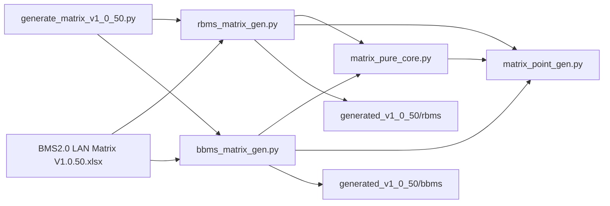

# 5.matrix_transfer — Matrix 点表生成

本目录为 **纯 Matrix 管线**：以 `BMS2.0 LAN Matrix V1.0.50.xlsx` 为唯一权威，生成 RBMS / BBMS 的枚举、pointattr、点表 CSV。

## 快速开始

```bash
# 在 5.matrix_transfer 目录执行；不带参数 = 同时生成 RBMS + BBMS
python generate_matrix_v1_0_50.py

# 也可单独生成
python generate_matrix_v1_0_50.py --rbms
python generate_matrix_v1_0_50.py --bbms
```

默认输入：`input/BMS2.0 LAN Matrix V1.0.50.xlsx`  
默认输出：`output/generated_v1_0_50/`

| 子目录 | 产出（各 3 个文件） |
| :--- | :--- |
| `rbms/` | `devRBMSPoint_e.h.snippet`、`protocol_bms_rbms_pointattr.c.snippet`、`RBMS.csv` |
| `bbms/` | `devBBMSPoint_e.h.snippet`、`protocol_bms_hmi_pointattr.c.snippet`、`BBMS.csv` |

## 目录结构

```text
5.matrix_transfer/
├── README.md
├── input/
│   └── BMS2.0 LAN Matrix V1.0.50.xlsx
├── generate_matrix_v1_0_50.py   # CLI 入口
└── lib/
    ├── matrix_pure_core.py      # 共享内核
    ├── rbms_matrix_gen.py       # RBMS 专责
    ├── bbms_matrix_gen.py       # BBMS 专责
    └── matrix_point_gen.py      # 基础工具（数据结构、格式化、写文件）
```



全管线 **不读** `firmware/kit_model.h`、`protocol_*.c`、模板 CSV；权威来源仅为 Matrix xlsx。

详细规则见：

- [`docs/design/RBMS_Matrix_纯规范生成计划.md`](../../docs/design/RBMS_Matrix_纯规范生成计划.md)
- [`docs/design/BBMS_Matrix_纯规范生成计划.md`](../../docs/design/BBMS_Matrix_纯规范生成计划.md)

## CLI 参数

| 参数 | 默认 | 说明 |
| :--- | :--- | :--- |
| `--matrix` | `input/BMS2.0 LAN Matrix V1.0.50.xlsx` | Matrix 规范文件 |
| `--out-dir` | `output/` | 输出根目录（其下为 `generated_v1_0_50/`） |
| `--rbms` | — | 仅生成 RBMS 三件套 |
| `--bbms` | — | 仅生成 BBMS 三件套 |

> [!TIP]
> 不带 `--rbms` / `--bbms` 时默认两者都生成。

退出码：`ERROR > 0` 时返回 `1`；Matrix 文件缺失返回 `2`。

## 枚举约定

- 数组：`xxx_Start` / `xxx_End = Start + N`（半开区间 `[Start, End)`）。
- 末尾：`kRbms_Data_End` / `kBbms_Data_End` **不写赋值**，由 C 枚举自动 +1，作为 RTDB 点位数量上界（见 `firmware/bsp/bsp_parse.c` 中 `gStDevTypePointNum`）。

## 运行环境

- **Python**：3.8+
- **依赖**：`openpyxl`（读 xlsx）
