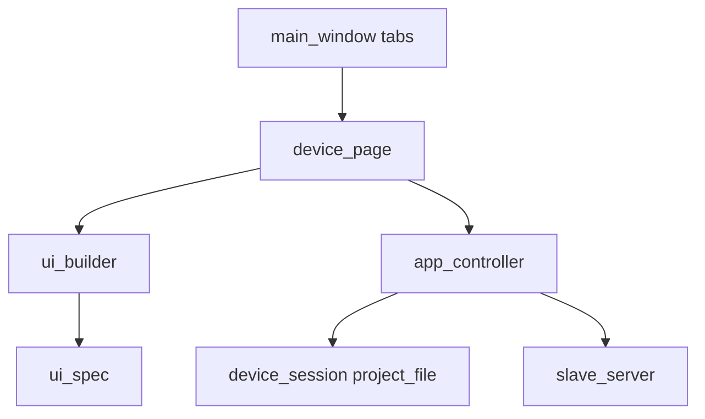
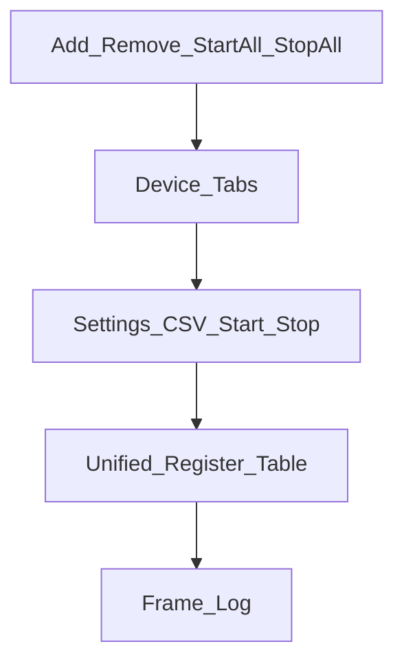

# Modbus Slave Sim — 项目计划

> 本文件随子项目一起维护，便于整目录迁移到 Windows 独立仓库/目录。  
> 实现状态：首版已落地（Python **3.13**）。

## 概述

独立现代化 PySide6 Modbus **从站**模拟器：多设备并行、工程文件、四类寄存器区；pytest 分层覆盖核心与 TCP 协议冒烟。

## 默认决策

- **命名通用**：目录本项目根（原 `bmsSim/modbusSlaveSim/`），窗口名 **Modbus Slave Sim**；设备身份由点表 CSV 决定。
- **独立程序**：不接入 OdinBmsHil；可整包移到 Windows 目录单独维护。
- **Python**：`>=3.13`（见 `.python-version` / `pyproject.toml`）。
- **工具**：`ruff` / `ty` / `pytest` 使用本机 **uv tool**；项目 `dev` 仅含 `pytest-qt` / `pytest-cov` / `pytest-asyncio`。
- **多设备并行**：按串口/TCP 链路聚合多 Unit；口够则并行。
- **工程文件**：`.mssproj.json` 一次保存设备列表 + 链路参数 + Unit + 四区当前值。
- **四类区**：Coil / Discrete Input / Input Register / Holding Register。
- **配置**：仅点表 CSV（BBMS 模板点表同表头风格）；**不支持 DBC**。
- **GUI**：自研浅色 `src/modbus_slave_sim/resources/theme.qss`（青绿 accent）。
- **布局**：标准 **src layout**（`src/modbus_slave_sim/`）。
- **测试**：核心模块行覆盖目标 ≥90%（当前约 95%）。

## 功能码 → 数据区

| FC | 区 | 读写 |
|----|-----|------|
| 1 / 5 / 15 | Coil | 可读；5/15 可写 |
| 2 | Discrete Input | 只读（GUI 仍可改仿真值） |
| 3 / 6 / 16 | Holding Register | 可读；6/16 可写 |
| 4 | Input Register | 只读（GUI 仍可改仿真值） |
| 0 | 跳过 | — |

- 字寄存器：`phys = raw * ratio + offset`；位区：0/1。
- 去重键：`(area, address)`。

## 工程文件

```json
{
  "version": 1,
  "devices": [
    {
      "id": "uuid",
      "name": "device",
      "point_csv": "relative/or/abs.csv",
      "unit_id": 1,
      "link": { "type": "tcp", "host": "0.0.0.0", "port": 5020 },
      "values": {
        "coils": {},
        "discrete_inputs": {},
        "input_registers": {},
        "holding_registers": {}
      }
    }
  ]
}
```

RTU link 示例：`{"type":"rtu","serial_port":"COM3","baudrate":9600,"bytesize":8,"parity":"N","stopbits":1}`。

## 多设备与接口

- 同串口 / 同 TCP `host:port` → 一个 server 多 Unit；否则多 server。
- 冲突：Unit 重复、同串口参数不一致、端口占用 → 拒绝并提示。

## CSV 使用列

`Ename`/`Name`/`Code`/`Data Type`/`Attribute`/`Function Code`/`Register Address`/`Endian`/`Precision`/`Ratio`/`Offset`/`Min Value`/`Max Value`/`Unit`；可选 `Default Value`。

## 分层（界面 / 逻辑分离）



| 层 | 文件 | 职责 |
|---|---|---|
| 壳层 | `main_window.py` | 多页签、新增/删除通信、日志路由 |
| 子页 | `device_page.py` / `widgets/` | 单路设置/点表/启停/寄存器表/报文 Log |
| UI 规格 | `ui_spec.py` + `ui_builder.py` | 声明式步骤/字段 → Widgets |
| 控制器 | `app_controller.py` | 工程/设备/步骤应用/启停；无 Qt 依赖 |
| 领域 | `device_session` / `point_csv` / `project_file` | 会话、点表、工程 I/O |
| 运行时 | `slave_server.py` | Modbus 从站 |

## GUI 布局（多页签 × 单路子页）

每个页签一路通信：页内为设置 / 点表 / 启停 + 统一寄存器表 + 底部报文 Log；顶栏可「新增通信 / 删除当前 / 全部启动 / 全部停止」。




## 目录与文件

| 路径 | 职责 |
|------|------|
| `pyproject.toml` | 依赖、入口、src 包配置 |
| `main.py` | 推荐启动：`uv run main.py`（Ctrl+C 退出） |
| `src/modbus_slave_sim/` | 可安装包根 |
| `src/.../__main__.py` | `python -m modbus_slave_sim` |
| `src/.../main.py` | GUI 入口；加载 QSS；SIGINT 处理 |
| `src/.../point_csv.py` | CSV → 四区；phys↔raw |
| `src/.../project_file.py` | 工程 I/O |
| `src/.../device_session.py` | Device/Link/分组/冲突 |
| `src/.../slave_server.py` | 按 Link 启停；四块 datastore |
| `src/.../ui_spec.py` | 工具栏 / 三步向导声明式规格 |
| `src/.../ui_builder.py` | 规格 → Widgets 构建引擎 |
| `src/.../app_controller.py` | 工程/设备/启停业务（无 Qt） |
| `src/.../main_window.py` / `widgets/` | 薄视图：展示与对话框 |
| `src/.../resources/theme.qss` | 主题 |
| `tests/` | 单元 / TCP / GUI |
| `tests/fixtures/mini_four_area.csv` | 自包含四区夹具（迁移后仍可用） |
| `README.md` | 用法 |
| `PLAN.md` | 本计划（随项目迁移） |

## 测试

```bash
uv sync --extra dev
QT_QPA_PLATFORM=offscreen uv run pytest -q --cov --cov-report=term-missing
ruff check .
```

| 层 | 文件 | 覆盖点 |
|----|------|--------|
| 单元 | `test_point_csv.py` 等 | FC→四区、工程往返、冲突 |
| 集成 | `test_slave_tcp.py` | TCP 四区读/写、双 Unit |
| GUI | `test_main_window.py` | pytest-qt 工程往返冒烟 |

说明：部分用例会尝试加载原 monorepo 的 `web/模板点表/`；迁移到 Windows 独立目录后若路径不存在，对应用例会失败——可将模板 CSV 拷入 `tests/fixtures/` 或跳过（核心夹具 `mini_four_area.csv` 已自包含）。

## GUI 功能清单（当前）

1. 主窗口：多页签，每页一路通信（设置/点表/启停/寄存器表/报文 Log）  
2. 列：Area/Name/Addr/Ratio/Offset/Raw/Phys/Unit/通信次数（无表头排序）  
3. 工程文件多设备并行；同链路多 Unit / 多链路多 server  

2. 设置对话框：TCP/RTU、串口或网口、通信参数  
3. 选择点表 / 启动 / 停止  
4. Log：实时 Modbus RX/TX 报文（PDU + HEX）  

## 迁移到 Windows 时注意

- 整目录拷贝即可（含 `.python-version`、`uv.lock`、本 `PLAN.md`）。
- 串口名改为 `COMx`；工程里 RTU `serial_port` 相应修改。
- GUI 测试在无显示环境下用 `QT_QPA_PLATFORM=offscreen`（或 Windows 等价设置）。
- 重新 `uv sync --extra dev`；确认本机已 `uv tool install` pytest / ruff / ty。

## 不做

- 不回写点表 CSV；不并入 OdinBmsHil；无 DBC/CAN；无跨进程口仲裁；无设备业务逻辑仿真。

## 任务状态

| ID | 内容 | 状态 |
|----|------|------|
| scaffold | 包、pyproject、theme、README | 完成 |
| points-server | CSV 四区 + multi-slave server | 完成 |
| project-file | 工程 JSON | 完成 |
| gui | 现代化主窗 | 完成 |
| tests | 单元+集成+GUI | 完成 |
| verify | pytest 全绿 + ruff | 完成 |
