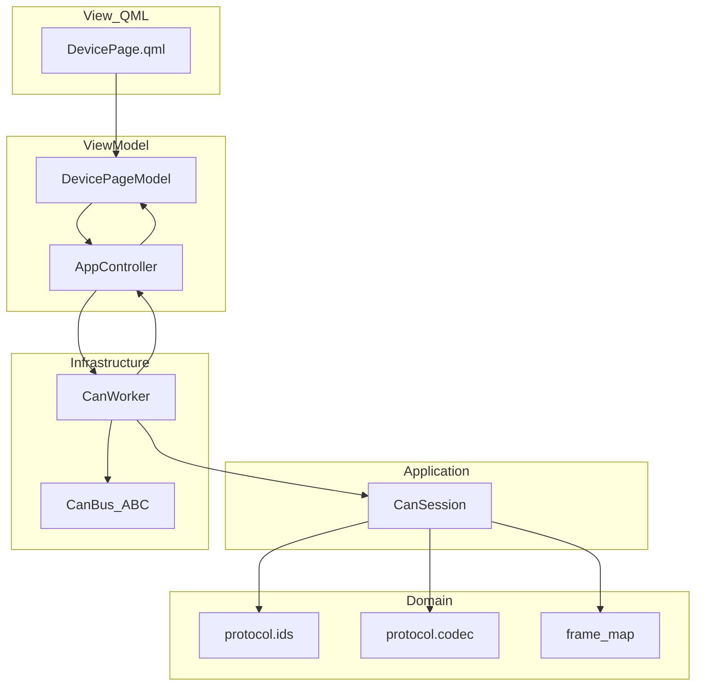

# PMS CAN 通信 Demo GUI — 项目计划

> 本文件随 `6.pms_demo` 维护，便于整目录迁移。  
> 实现状态：**QML GUI** + 总线开闭 + **校验 / 周期读显**（USBCAN-2E-U / `can_zlg`）；事件下发仍为壳。
> 协议字段摘录自 MCU CAN 映射表（帧表已固化为 `protocol/frame_map.py`，不跨目录 import）。

## 0. 目录

- [[#1. 目标与范围]]
- [[#2. 已确认协议]]
- [[#3. 默认决策]]
- [[#4. 架构]]
- [[#5. 单页 UI]]
- [[#6. 目录草图]]
- [[#7. 实现任务]]
- [[#8. 验收]]
- [[#9. 风险与边界]]

## 1. 目标与范围

在 `6.pms_demo` 内新增 **PySide6 CAN 通信 demo**：

- 复用包内 `can_zlg`（open / send / recv / close）
- **8** 个下位机同构页签
- 校验通信 → 周期读显 → 事件下发

首版不做：DBC 编辑器、滤波、定时硬件发送、过程编排、完整 PMS 业务状态机。

## 2. 已确认协议

| 能力 | 行为 |
| :--- | :--- |
| 校验通信 | 发 `0x1806ddss`，**DLC=1 / data=`01`**；收到对应 `0x1A06ssdd` 则通 |
| 周期读 | 定时发 `0x1810ddss`（默认 **1 s**）；**不依赖校验、不等待应答**；若总线上有 `0x1A80`… 仍可刷新表格 |
| 事件写 | `0x1826`、`0x1827`、`0x1830`～`0x1848`；每帧 **P1～P4 +「发送」**（写仍为壳） |
| 获取参数 | 事件性发 `0x1811ddss`；收 `0x1A26`/`0x1A27`/`0x1A30`～`0x1A48` 填入对应 `0x18xx` 界面 |
| 下位机数 | 固定 **8** 页；每页可设 MCU / 主机字节（拼进 `ddss` / `ssdd`） |
| 编码 | Big-Endian；槽位按映射表 `factor` 做 `raw_int16 ↔ 工程值` |

### 2.1 周期显示约定（首版）

- 触发：发 `1810`（Measurement poll），默认周期 1000 ms；不校验是否收到测量帧。
- 展示：自 `0x1A80` 起依次类推；**各页按下位机地址分发**；测量值**有变化才刷新**单元格；空槽灰显。
- 表格列：`CAN ID | P1 | P2 | P3 | P4`；单元格为工程值；tooltip 可带参数名与单位。

```text
1A80 | P1 | P2 | P3 | P4
1A81 | P1 | P2 | P3 | P4
...
```

### 2.2 事件下发约定（首版）

每事件帧一块面板（`1826` 为模板，`1827` / `1830`～`1848` 同构）：

```text
[0x1826]
  P1  <标签>  [  值  ]
  P2  <标签>  [  值  ]
  P3  <标签>  [  值  ]
  P4  <标签>  [  值  ]
  [ 发送 ]
```

- 标签来自映射表参数名；值按 factor 编成 4×int16 BE 后发送。
- 不足 4 参数的帧：空槽编辑框禁用。
- 「发送」只发本帧一条 CAN；不做一键全发。
- 「获取参数」：发一次 `0x1811ddss`；回读 `0x1Axx` → 填 `0x18xx` 表格 / PcCommand。

### 2.3 CAN ID 拼装

- 约定：`ss`=上位机，`dd`=下位机
- 上位机 → 下位机：`(base << 16) | (dd << 8) | ss`（如 上位机=0 下位机=2 → `0x18060200`）
- 下位机 → 上位机：`(base << 16) | (ss << 8) | dd`（如 → `0x1A060002`）
- 默认：8 页下位机 `dd` = `0x02`…`0x09`，上位机 `ss` = `0x00`（可改）

## 3. 默认决策

| 项 | 决策 |
| :--- | :--- |
| 落点 | `6.pms_demo/`（内含 `can_zlg/` 与 SDK 旁路） |
| Python | `>=3.13`（对齐仓库锚点） |
| GUI | **QML**（Qt Quick Controls）+ Python `AppController`；业务不进 UI 线程 |
| 总线 | 全窗口共享一条 `CanBus`；单测用 `FakeCanBus` |
| 帧表 | 包内 `protocol/frame_map.py` 固化；禁止跨顶层目录 import |
| 质量门禁 | `ruff` / `ty` / `pytest`（uv tool）；真盒手测另列 |

## 4. 架构

MVVM + 端口适配器：QML 只绑 ViewModel；`can_session` 无 Qt；单 `CanWorker` 线程做总 `recv` 循环；8 页状态互不影响。



| 模块 | 职责 |
| :--- | :--- |
| `protocol/ids.py` | `compose_tx_id` / `compose_rx_id` / `parse_id` |
| `protocol/codec.py` | 8 字节 ↔ 4×int16 BE（factor 待下批） |
| `protocol/frame_map.py` | 周期 `1A80+` 与事件帧 P1–P4 标签 |
| `can/queues.py` | TX/RX 队列 |
| `can/dispatch.py` | 接收按源地址 `ss` 分发 |
| `can/can_session.py` | 无 Qt：每页独立校验/周期 |
| `can/can_worker.py` | 总线↔队列泵；Signal 回主线程 |
| `models/device_page_model.py` | 页 ViewModel |
| `app/app_controller.py` | 组合根 |
| `qml/` | 界面 |

### 4.1 实现要点

- 一条总线一个 Worker；**TX/RX 均走队列**；接收按源地址 `ss` 分到对应页。
- 仅本页「已校验且周期开启」才按 **该页** `periodMs` 发 `1810`。
- 校验超时 **200 ms**（真盒 USB 往返）；关窗口停 Worker 再 `bus.close()`。

## 5. 单页 UI

1. **通信区**：MCU ID / Host ID；「校验通信」；状态灯
2. **周期区**：周期 ms、启停；表 `CAN ID | P1 | P2 | P3 | P4`
3. **事件区**：可滚动；每帧「P1–P4 标签/值 + 发送」
4. **Log**：本页 TX/RX 摘要

主窗口顶栏：设备型号（`USBCAN-2E-U` / `USBCANFD-200U`）、通道、波特率、打开/关闭；未开总线时禁用页内操作。

## 6. 目录草图

```text
6.pms_demo/
  docs/ { DESIGN.md, PLAN.md }  # 设计文档与项目计划
  README.md
  pyproject.toml
  main.py
  can-zlg/               # 接口层：can_zlg/ 包 + vendor/（目录连字符避免 cwd 撞包名）
  src/pms_can_demo/
    main.py              # 入口
    app/                 # 组合根 / 总线 / qml_paths / qtprop
    can/                 # session + worker
    models/
    protocol/
    qml/
  tests/
```

仓库根 `README.md` 工具索引补一行 `6.pms_demo`。

## 7. 实现任务

| 序号 | 任务 | 状态 |
| ---: | :--- | :--- |
| 1 | 搭建 `pms_can_demo` 包、pyproject、README、依赖 PySide6 | 已完成（GUI 壳；`can_zlg` 待接线） |
| 2 | `frame_map` + `ids` / `codec` | 已完成（factor 待下批） |
| 3 | `can_session` + `CanWorker` | 已完成（校验+周期） |
| 4 | QML + 8 页 ViewModel | 已完成 |
| 5 | 单测 + ruff / ty / pytest | 已完成 |
| 6 | 事件下发真实收发 | 待做 |

## 8. 验收

### 8.1 自动化

在 `6.pms_demo`：

```bash
ruff format .
ruff check .
ty check
pytest -q
```

仓库根按 `AGENTS.md` 四条再跑；至少本次新增 `.py` 无新增问题。单测用 Fake，不依赖真盒。

### 8.2 真盒手测

1. 打开总线
2. 设置 ID → 校验通信通
3. 开周期 → `1A80` 行 P1–P4 刷新
4. 事件发送仍为界面壳（本批未接）

## 9. 风险与边界

| 风险 | 说明 |
| :--- | :--- |
| 周期回读范围 | 首版按 `1A80+` 显示；若固件突发集合变化，只改 `frame_map` |
| 跨目录 | 不得 import 兄弟工具；映射表变更时需手工同步 `frame_map` |
| 平台 | 真盒仅 Windows + 官方 DLL；Linux/WSL 仅 Fake |
| 总线负载 | 8 页同时周期时各按自己的间隔发 `1810`，总线排队 |
| 校验超时 | 200 ms（原 50 ms 对 USB-CAN 过紧）；仍失败时看状态栏是否收到其它帧 |

## 变更日志

| 日期 | 说明 |
| :--- | :--- |
| 2026-08-14 | 首版计划：校验 / 周期 P1–P4（`1A80+`）/ 事件标签值发送；写入本文件 |
| 2026-08-14 | GUI 壳落地：`pms_can_demo` 主窗 + 8 页 + 帧表；逻辑未接 |
| 2026-08-14 | 总线固定 USBCAN-2E-U，接入 `can_zlg` 开闭；Fake 环境变量 `PMS_CAN_USE_FAKE` |
| 2026-08-14 | 校验（50 ms）+ 周期读显接入；单 Worker 总 recv；事件下发仍为壳 |
| 2026-08-14 | `can_zlg` 与 `zlgcan_python_250825` 迁入 `pms_can_demo/` |
| 2026-08-14 | `can_zlg` 扁平收口：官方 SDK 归入 `can_zlg/vendor/`（保留 `src/` 避免包名与目录撞车） |
| 2026-08-14 | 包内顶层收拢：`app/`、`can/` 子包，入口文件尽量少 |
| 2026-08-14 | 真盒校验：超时 200ms；校验窗口短轮询；状态栏打印非期望 RX |
| 2026-08-14 | 2E-U InitCAN 设置 acc_mask=全收；校验超时补充「无 RX」提示 |
| 2026-08-14 | 对齐 can_OTA：收发 cwd=SDK；Init 仅 canfd.mode；阻塞 Receive；校验 1s；vendor 帧位域 eff |
| 2026-08-14 | 纠正 ID：`ss`=上位机、`dd`=下位机；下行 `1806ddss` / 上行 `1A06ssdd`（例：0/2 → `18060200`/`1A060002`） |
| 2026-08-14 | 去掉多余壳目录：`6.pms_demo/pms_can_demo/` 上提到 `6.pms_demo/`（对齐 `5.modbusSlaveSim`） |
| 2026-08-14 | `can_zlg` 去 `src/`；双 JSON（meas/config）+ catalog；工程值显示；每 PCS 隔离；未知帧告警 |
