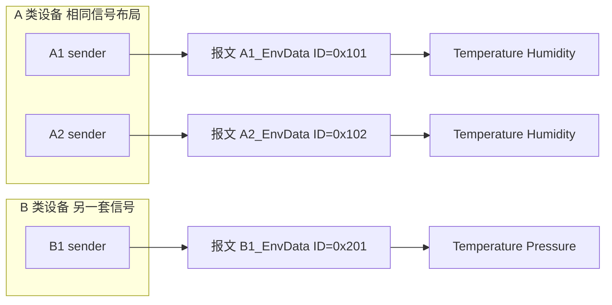

# gen_dbc_from_csv.py 双 CSV 使用说明

## 目的

`gen_dbc_from_csv.py` 使用双 CSV 输入生成 DBC：

- `messages.csv`：一行一个报文
- `signals.csv`：一行一个信号

命令示例：

```bash
python gen_dbc_from_csv.py --messages messages.csv --signals signals.csv --output generated.dbc
```

## 文件关系

- `signals.csv` 通过 `message_name` 关联到 `messages.csv`
- `messages.csv` 中每个 `message_name` 必须在 `signals.csv` 中至少有 1 条信号
- 两个文件都必须有表头，且必需列不能缺

## 核心换算公式（最重要）

```text
physical = raw * scale + offset
```

- `raw`：按 `start/length/byte_order` 从报文中提取出的原始值
- `scale`、`offset`：来自 `signals.csv`
- 最终值是否按浮点语义处理由 `is_float` 决定：
  - `is_float=true`：最终值按浮点数处理（如 `12.3`）
  - `is_float=false`：最终值按整数语义处理（常用于状态量/计数值）

## messages.csv 列说明

> `messages.csv` 只强制 3 个必填列：`message_name`、`frame_id`、`length`。  
> 其他列是可选列：列不存在或单元格为空都按默认值处理。

| 列名 | 类型 | 列要求 | 默认值（空值或缺列） | 取值说明 |
| :--- | :--- | :--- | :--- | :--- |
| `message_name` | `str` | 必需列，且值必填 | 无 | 报文名称，需与 `signals.csv` 中的 `message_name` 对应 |
| `frame_id` | `int/hex` | 必需列，且值必填 | 无 | 支持十进制（如 `291`）或十六进制（如 `0x123`） |
| `length` | `int` | 必需列，且值必填 | 无 | 报文长度（DLC），必须 `> 0` |
| `sender` | `str` | 可选列，值可空 | `DefaultNode` | 发送节点名 |
| `is_extended_frame` | `bool` | 可选列，值可空 | `false` | 是否扩展帧 |
| `is_fd` | `bool` | 可选列，值可空 | `false` | 是否 CAN FD |
| `cycle_time` | `int` | 可选列，值可空 | `None` | 周期时间（ms） |
| `bus_name` | `str` | 可选列，值可空 | `None` | 总线名称 |
| `protocol` | `str` | 可选列，值可空 | `None` | 协议字段 |
| `strict` | `bool` | 可选列，值可空 | `true` | 严格模式 |
| `unused_bit_pattern` | `int` | 可选列，值可空 | `0` | 未使用位填充值 |
| `send_type` | `str` | 可选列，值可空 | `None` | 发送类型 |
| `comment` | `str` | 可选列，值可空 | `None` | 报文注释 |
| `header_id` | `int` | 可选列，值可空 | `None` | 容器报文头 ID |
| `header_byte_order` | `str` | 可选列，值可空 | `big_endian` | 仅支持 `little_endian` / `big_endian` |

## signals.csv 列说明

> 空值会按默认值处理（`message_name`、`name`、`start`、`length` 除外）。

| 列名 | 类型 | 列要求 | 默认值（空值或缺列） | 取值说明 |
| :--- | :--- | :--- | :--- | :--- |
| `message_name` | `str` | 必需列，且值必填 | 无 | 关联的报文名，必须存在于 `messages.csv` |
| `name` | `str` | 必需列，且值必填 | 无 | 信号名 |
| `start` | `int` | 必需列，且值必填 | 无 | 起始位，必须 `>= 0` |
| `length` | `int` | 必需列，且值必填 | 无 | 位长度，必须 `> 0` |
| `byte_order` | `str` | 可选列，值可空 | `little_endian` | 仅支持 `little_endian` / `big_endian` |
| `is_signed` | `bool` | 可选列，值可空 | `false` | 是否有符号 |
| `unit` | `str` | 可选列，值可空 | `None` | 单位 |
| `raw_initial` | `int/float` | 可选列，值可空 | `0` | 初始原始值 |
| `scale` | `int/float` | 可选列，值可空 | `1` | 线性缩放因子 |
| `offset` | `int/float` | 可选列，值可空 | `0` | 线性偏移量 |
| `is_float` | `bool` | 可选列，值可空 | `false` | 物理值是否按浮点处理 |

## 布尔值与数值格式

- 布尔可写：`true/false`、`1/0`、`yes/no`、`y/n`（不区分大小写）
- `frame_id`：支持十进制和 `0x` 十六进制
- `start`、`length`、`cycle_time`、`header_id` 等整数列必须是合法整数

## 统一示例数据（固定）

后续所有示例都使用同一帧 8 字节数据（第 1 到第 8 字节）：

```text
01 23 45 67 89 AB CD EF
```

按 0-based 索引：

- `Byte0=0x01`
- `Byte1=0x23`
- `Byte2=0x45`
- `Byte3=0x67`
- `Byte4=0x89`
- `Byte5=0xAB`
- `Byte6=0xCD`
- `Byte7=0xEF`

## 位提取速查（基于固定示例）

| 场景 | 配置 | 结果 |
| :--- | :--- | :--- |
| 跨字节 8 bit（Intel） | `byte_order=little_endian, start=4, length=8` | `raw=0x30` |
| 跨字节 8 bit（Motorola） | `byte_order=big_endian, start=4, length=8` | `raw=0x09` |
| 第 2/3 字节按小端拼 16 bit | `byte_order=little_endian, start=16, length=16` | `raw=0x6745` |
| 第 2/3 字节按大端拼 16 bit | `byte_order=big_endian, start=23, length=16` | `raw=0x4567` |

## Intel 小端模型（工程推荐）

在 Intel 小端下可用统一模型：

```text
raw = (raw_bus >> start) & ((1 << length) - 1)
physical = raw * scale + offset
```

其中 `raw_bus` 取整帧按小端拼接后的整数。

```python
data = bytes.fromhex("01 23 45 67 89 AB CD EF")
raw_64 = int.from_bytes(data, byteorder="little", signed=False)
# raw_64 = 0xEFCDAB8967452301

start = 4
length = 8
mask = (1 << length) - 1
raw = (raw_64 >> start) & mask  # raw = 0x30
```

## 大端整数对照（仅用于理解显示）

```python
data = bytes.fromhex("01 23 45 67 89 AB CD EF")
raw_64 = int.from_bytes(data, byteorder="big", signed=False)
# raw_64 = 0x0123456789ABCDEF

start = 4
length = 8
mask = (1 << length) - 1
raw = (raw_64 >> start) & mask  # raw = 0xDE
```

> 这段仅用于说明“同一字节流转成大端整数后”的数值样子。  
> DBC 的 Motorola 跨字节信号解析，不建议手写“右移+掩码”替代工具链。

## 多设备实例怎么写（A 类两台 + B 类一台）

先分清三层概念（不要混在一列里）：

| 概念 | 写什么 | 例子 |
| :--- | :--- | :--- |
| **设备类型** | 文档 / `comment` 里说明，或报文名前缀 | A 类 = 温湿度；B 类 = 温度 + 气压 |
| **设备实例** | `sender`（DBC 节点名） | `A1`、`A2`、`B1` |
| **CAN 报文** | `message_name` + `frame_id` | 总线上每条帧一行，**名称唯一** |



规则（与本工具 `gen_dbc_from_csv.py` 一致）：

1. **`messages.csv` 一行 = 总线上的一条 CAN 帧**（一个 `frame_id`）。  
   A1、A2 即使信号定义相同，也各占一行，且 **`frame_id` 必须不同**（否则 ID 冲突）。
2. **`sender` = 哪台设备发这条帧**，建议与实例名一致：`A1`、`A2`、`B1`。
3. **`message_name` = 这条帧在 DBC 里的名字**，建议带实例：`A1_EnvData`，不要只写 `A类`（类不是帧）。
4. **`signals.csv` 用 `message_name` 挂信号**：  
   - A1、A2 各写一套相同布局（温度、湿度）；  
   - B1 写 B 类自己的信号（温度、气压）。

`messages.csv` 示例：

```csv
message_name,frame_id,length,sender,cycle_time,comment
A1_EnvData,0x101,8,A1,100,A类设备实例A1
A2_EnvData,0x102,8,A2,100,A类设备实例A2
B1_EnvData,0x201,8,B1,100,B类设备实例B1
```

`signals.csv` 示例：

```csv
message_name,name,start,length,byte_order,is_signed,unit,raw_initial,scale,offset,is_float
A1_EnvData,Temperature,0,16,little_endian,false,degC,0,0.1,-40,false
A1_EnvData,Humidity,16,16,little_endian,false,%RH,0,0.1,0,false
A2_EnvData,Temperature,0,16,little_endian,false,degC,0,0.1,-40,false
A2_EnvData,Humidity,16,16,little_endian,false,%RH,0,0.1,0,false
B1_EnvData,Temperature,0,16,little_endian,false,degC,0,0.1,-40,false
B1_EnvData,Pressure,16,16,little_endian,false,kPa,0,0.01,0,false
```

> 若 A 类有 10 台，就写 10 行 `messages.csv` + 在 `signals.csv` 里复制 10 份相同信号表（仅 `message_name` / `frame_id` / `sender` 不同）。本仓库示例见 `sample_multi_*.csv`。

## 最小示例（温湿度 / 气压）

物理量换算示例（与仓库内 `sample_multi_*.csv` 一致）：

| 信号 | 单位 | scale | offset | 含义 |
| :--- | :--- | :--- | :--- | :--- |
| `Temperature` | `degC` | `0.1` | `-40` | 摄氏温度，常见车载编码：`raw×0.1−40` |
| `Humidity` | `%RH` | `0.1` | `0` | 相对湿度 |
| `Pressure` | `kPa` | `0.01` | `0` | 气压 |

换算列含义见上表；完整多设备 CSV 见上文「多设备实例」与 `sample_multi_*.csv`。

## 常见错误

- `messages.csv` 缺少列：至少需要 `message_name,frame_id,length`
- `signals.csv` 缺少列：至少需要 `message_name,name,start,length`
- `header_byte_order` 或 `byte_order` 非法：只能是 `little_endian` / `big_endian`
- 报文无信号：`messages.csv` 某行的 `message_name` 在 `signals.csv` 中不存在
