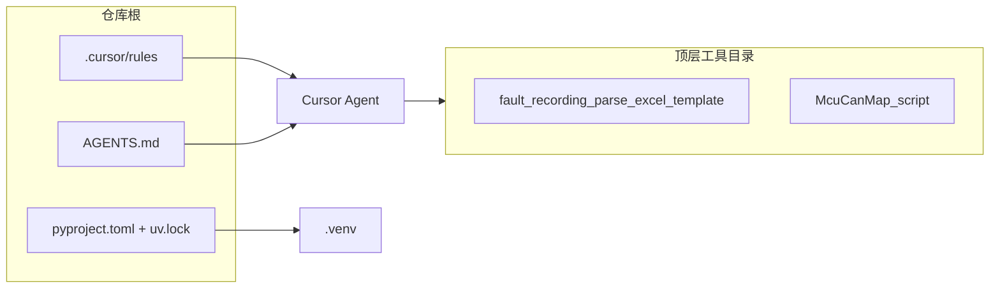

# AI 编码治理 — 当前实践说明

> [!NOTE]
> 本文描述**本仓库当前已落地的做法**，供后续维护与 onboarding 参考。  
> **规范与原则**见 [cursor-3.5-ai-coding-rules.md](./cursor-3.5-ai-coding-rules.md)；**Agent 验收命令**见 [AGENTS.md](../AGENTS.md)。

## Table of Contents

- [文档分工](#文档分工)
- [仓库在解决什么问题](#仓库在解决什么问题)
- [目录与 Git 策略](#目录与-git-策略)
- [Python 与 uv（当前做法）](#python-与-uv当前做法)
- [Cursor Project Rules 清单](#cursor-project-rules-清单)
- [日常：人 / AI 各做什么](#日常人--ai-各做什么)
- [子项目依赖（当前）](#子项目依赖当前)
- [已知限制与遗留](#已知限制与遗留)
- [扩展：新工具 / 新规则](#扩展新工具--新规则)
- [变更记录](#变更记录)

## 文档分工

| 文档 | 性质 | 读者 |
| :--- | :--- | :--- |
| [cursor-3.5-ai-coding-rules.md](./cursor-3.5-ai-coding-rules.md) | **要求**：Cursor 3.5 下应如何组织 Rules、与官方能力对齐 | 定规范、评审 |
| **本文** | **实践**：本 repo 里具体放了哪些文件、怎么用 | 维护者、后来者 |
| [AGENTS.md](../AGENTS.md) | **执行清单**：环境初始化 + 四条 Python 验收命令 | Cursor Agent |
| 各工具 `README.md` | **工具说明**：输入输出、构建命令 | 使用单个子项目的人 |

## 仓库在解决什么问题

- 多个**互不相关**的小脚本 / 工具放在同一 GitHub 仓库（monorepo），便于个人备份与检索。
- 代码**主要由 AI 辅助生成**，需要可重复的：中文输出习惯、类型与 lint、改完必跑检查。
- 任一顶层目录将来可**整包拆成独立 repo**，因此避免根级 `common/`、跨目录 import。



## 目录与 Git 策略

### 顶层工具（当前）

| 目录 | 技术栈要点 |
| :--- | :--- |
| `fault_recording_parse_excel_template/` | Python + openpyxl + win32com；VBA `.bas`；PowerShell 构建脚本 |
| `McuCanMap_script/` | Python + openpyxl；输出 CSV / `c_struct_*.c` |

### `.gitignore` 与 Cursor

- **提交**：`.cursor/rules/**`（Project Rules 随仓库共享）。
- **不提交**：`.cursor/*` 其余（会话、commands、skills 等本地能力），见根 [.gitignore](../.gitignore)。
- **不提交**：`.venv/`。
- **已纳入版本库**：`McuCanMap_script/McuCanMap.xlsx`、`fault_recording_parse_excel_template/can_fault_recording_template.xlsx`（输入 / 构建中间产物，clone 即可用）。

### 未纳入本套治理的内容

- `.cursor/commands/`、` .cursor/skills/`：Obsidian 等个人工作流，**未**作为本仓库 AI 编码基线的一部分写入 Git。

## Python 与 uv（当前做法）

### 版本锁定

| 文件 | 当前内容 |
| :--- | :--- |
| [.python-version](../.python-version) | `3.13`（由 uv 解析为当前最新 3.13 补丁，如 3.13.13） |
| [pyproject.toml](../pyproject.toml) | `requires-python = ">=3.13,<3.14"` |
| [uv.lock](../uv.lock) | 锁定 dev 与子项目依赖版本 |

### 虚拟环境

- 路径：仓库根 **`.venv/`**（`uv sync` 自动创建，勿提交）。
- 首次或换机：

```powershell
cd <仓库根>
uv python install 3.13
uv sync
uv run python --version
```

### 依赖组（`[dependency-groups]` + `[tool.uv] default-groups`）

一次 `uv sync` 会安装三组（无需记多个命令）：

| 组名 | 安装包 | 服务目录 |
| :--- | :--- | :--- |
| `dev` | `ruff`、`ty`、`pytest` | 全仓校验 |
| `fault-recording` | `openpyxl`、`pywin32` | `fault_recording_parse_excel_template/` |
| `mcu-can-map` | `openpyxl` | `McuCanMap_script/` |

拆仓或仅用 pip 时，各目录有独立 [requirements.txt](../fault_recording_parse_excel_template/requirements.txt)（内容与子组一致）。

### 校验配置摘要

| 工具 | 配置位置 | 说明 |
| :--- | :--- | :--- |
| Ruff | `[tool.ruff]` | `target-version = "py313"`，`src` 含两个工具目录与 `tests/` |
| ty | 无额外 `[tool.ty]` | 默认检查仓库内 Python；全仓可能含遗留告警 |
| pytest | `[tool.pytest.ini_options]` | 当前仅 `tests/test_repo_smoke.py` 冒烟 |

## Cursor Project Rules 清单

规则目录：[`.cursor/rules/`](../.cursor/rules/)。在 **Cursor Settings → Rules** 中应能看到 Project Rules（需启用）。

### Always Apply（每条对话都会带上）

| 文件 | 实际写什么 |
| :--- | :--- |
| `zh-engineering-standards.mdc` | 中文、版本锚定、安全、DoD；**不**重复各语言 lint 命令 |
| `repo-monorepo.mdc` | 顶层目录独立、禁止跨目录引用、新工具 / 拆仓约定 |

### 按 glob 附加（编辑对应文件时）

| 文件 | glob | 实际写什么 |
| :--- | :--- | :--- |
| `codegen-python-standards.mdc` | `**/*.py` | **3.13 推荐**类型注解（如 `str | None`、`list[str]`）与 API 调用；读 `uv.lock`；验收见下一行 |
| `ai-codegen-verification.mdc` | `**/*.py` | **四条** `uv run` 命令顺序；遗留代码策略 |
| `codegen-powershell.mdc` | `**/*.ps1` | `$PSScriptRoot`、退出码、Excel 构建链提示 |
| `codegen-vba-excel.mdc` | `**/*.{bas,vbs}` | Windows Excel、改 VBA 后重跑 build / repair |
| `codegen-c-standards.mdc` | `**/*.{c,h,...}` | **优先改** `gen_*.py`，少改 `c_struct_*.c` |
| `technical-obsidian-markdown.mdc` | `docs/**/*.md` | 仅 `docs/` 下笔记的 Markdown 结构 |
| `technical-obsidian-markdown-examples.mdc` | `docs/**/*.md` | 上条附录示例 |

### 故意未加载

| 位置 | 原因 |
| :--- | :--- |
| [docs/archive/codegen-vue-standards.mdc](./archive/codegen-vue-standards.mdc) | 仓库暂无 Vue；有前端子项目时再复制回 `.cursor/rules/` |

### 与 User Rules 的分工（当前约定）

- **User Rules**（Cursor 本机）：个人中文习惯、通用工程偏好。
- **Project Rules + AGENTS.md**：本仓库 Python 版本、`uv` 命令、monorepo 边界——**以仓库文件为准**，避免两处写不同命令。

## 日常：人 / AI 各做什么

### 人（维护仓库）

1. 克隆后执行上文 `uv sync`。
2. 改 Python 后在根目录跑 AGENTS.md 四条命令。
3. 新增顶层工具：新建目录 + `README` + `requirements.txt`（如有 Python）+ 视情况在 `pyproject.toml` 增加 `[dependency-groups]` 并在 `default-groups` 登记。
4. 改 Cursor 规则：编辑 `.mdc` 后提交；重大原则变更同步 [cursor-3.5-ai-coding-rules.md](./cursor-3.5-ai-coding-rules.md) 与本文。

### AI（Cursor Agent）

1. 读 `AGENTS.md` + 触发的 `.mdc`。
2. 改代码后**在终端执行**验收命令（不要只写「应该通过」）。
3. 声称完成前：至少保证**本次改动文件**无新增 ruff/ty 问题；全仓修绿可单列任务。

### 对话中可加的一句（可选）

> 按 `AGENTS.md` 跑完 ruff / ty / pytest 再结束。

## 子项目依赖（当前）

| 目录 | requirements.txt | uv 组 | 第三方包 |
| :--- | :--- | :--- | :--- |
| `fault_recording_parse_excel_template/` | 有 | `fault-recording` | openpyxl、pywin32 |
| `McuCanMap_script/` | 有 | `mcu-can-map` | openpyxl |

运行示例（仓库根）：

```powershell
uv run python McuCanMap_script/gen_scu_pcs_run_config.py
uv run python fault_recording_parse_excel_template/build_can_fault_excel_template.py
```

## 已知限制与遗留

| 项 | 说明 |
| :--- | :--- |
| 全仓 `ruff` / `ty` | 部分历史脚本仍有告警（行宽、f-string 等）；规则允许分阶段清零 |
| `ty` + `win32com` | 未单独配置 stub 时，仅改非 Excel 目录可忽略无关 unresolved |
| Project Rules 作用域 | **不**保证约束 Tab / Ctrl+K；关键靠 Agent 跑命令或日后 CI |
| CI | **尚未**配置 GitHub Actions；当前仅本地 `uv run` 验收 |

## 扩展：新工具 / 新规则

### 新顶层 Python 工具

1. 新建目录 `my_tool/`，内写 `README.md`、`requirements.txt`。
2. 在 `pyproject.toml` 增加：

```toml
[dependency-groups]
my-tool = ["依赖>=版本"]

[tool.uv]
default-groups = ["dev", "fault-recording", "mcu-can-map", "my-tool"]
```

3. 执行 `uv lock` && `uv sync`。
4. 根 [README.md](../README.md) 工具表加一行。
5. 若 AI 常改该目录代码，考虑新增 `codegen-*.mdc`（`globs` 指向该目录）。

### 新 Cursor 规则

1. 在 `.cursor/rules/` 新建 `xxx.mdc`，frontmatter 选 Always 或 `globs`。
2. 保持 **< 50 行为宜**；命令列表只保留一处（优先 `AGENTS.md`）。
3. 更新本文「Rules 清单」与 [cursor-3.5-ai-coding-rules.md](./cursor-3.5-ai-coding-rules.md) 对照表。

## 变更记录

| 日期 | 说明 |
| :--- | :--- |
| 2026-05-25 | 初版：记录 monorepo + uv 3.13 + Cursor Rules 落地现状 |
| 2026-05-25 | `McuCanMap.xlsx`、`can_fault_recording_template.xlsx` 纳入版本库 |
| 2026-05-25 | Python 规则强调：类型注解与函数调用须用当前 3.13 推荐写法 |
