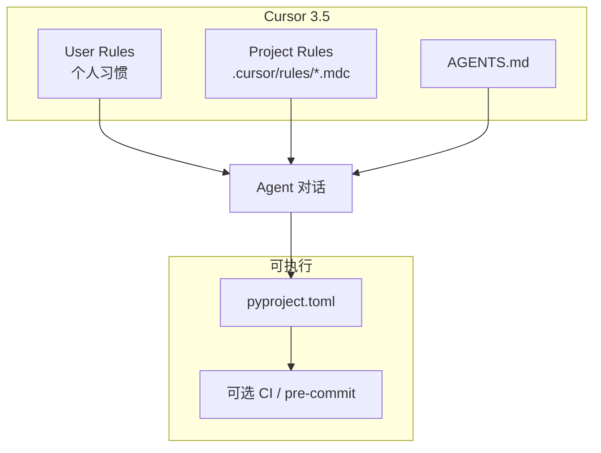

# Cursor 3.5 AI 编码规则（本仓库）

> [!NOTE]
> 官方文档未单独标注「IDE 3.5」专用格式；下列内容与 [Cursor Rules](https://cursor.com/docs/rules) 当前能力一致，适用于 Cursor 3.5 及同代 Agent 对话。  
> **本仓库已怎么做**（文件清单、uv、日常流程）见 [ai-coding-setup-practice.md](./ai-coding-setup-practice.md)。

## Table of Contents

- [结论](#结论)
- [三层治理模型](#三层治理模型)
- [本仓库文件对照](#本仓库文件对照)
- [Project Rules 四种应用模式](#project-rules-四种应用模式)
- [新建与维护规则](#新建与维护规则)
- [Rules / Skills / Commands](#rules--skills--commands)
- [Python 验收命令](#python-验收命令)
- [User Rules 与项目规则分工](#user-rules-与项目规则分工)
- [Monorepo 约定](#monorepo-约定)
- [不建议的做法](#不建议的做法)
- [可选加强](#可选加强)
- [参考链接](#参考链接)

## 结论

在 Cursor 3.5 中约束 AI 生成代码，**最合适**的组合是：

1. **Project Rules**（`.cursor/rules/*.mdc`）— 短、可执行、按文件类型触发  
2. **`AGENTS.md`** — Agent 必读的验收命令（短清单）  
3. **`pyproject.toml`** — `ruff`、`ty`、`pytest` 的可执行配置  

个人习惯放 **User Rules**；本仓库业务规范**不要**全部写进 User Rules。

> [!IMPORTANT]
> Project Rules 主要作用于 **Agent 对话**，不保证覆盖 Tab 补全或 Ctrl+K 行内编辑。除 Rules 外，应要求 Agent **实际运行**验收命令，并可选配置 CI / pre-commit。

## 三层治理模型



| 层级 | 位置 | 写什么 | 不要写什么 |
| :--- | :--- | :--- | :--- |
| User Rules | Cursor Settings → Rules | 全项目通用：中文、表达风格 | 本仓库目录结构、`uv run` 具体命令 |
| Project Rules | `.cursor/rules/` | 类型注解、禁止废弃 API、改 Python 后必跑检查 | 长篇教程、整份 style guide |
| AGENTS.md | 仓库根 | 四条验收命令及顺序 | 与 Rules 重复的冗长说明 |
| pyproject.toml | 仓库根 | `[tool.ruff]`、`requires-python`、dev 依赖 | 业务打包配置 |

**冲突优先级**（官方）：Team Rules → Project Rules → User Rules（合并进上下文，前者优先）。

## 本仓库文件对照

| 文件 | 模式 | 作用 |
| :--- | :--- | :--- |
| `.cursor/rules/zh-engineering-standards.mdc` | Always Apply | 全局中文、版本、安全、DoD（无语言命令重复） |
| `.cursor/rules/repo-monorepo.mdc` | Always Apply | 多工具 monorepo 目录边界、拆仓约定 |
| `.cursor/rules/codegen-python-standards.mdc` | `globs: **/*.py` | Python：**类型注解与 API 调用必须用 3.13 推荐写法** |
| `.cursor/rules/ai-codegen-verification.mdc` | `globs: **/*.py` | 改 Python 后四条验收命令 |
| `.cursor/rules/codegen-powershell.mdc` | `globs: **/*.ps1` | 构建脚本 |
| `.cursor/rules/codegen-vba-excel.mdc` | `globs: **/*.{bas,vbs}` | Excel VBA |
| `.cursor/rules/codegen-c-standards.mdc` | `globs: **/*.{c,h,...}` | C；生成物优先改 `gen_*.py` |
| `.cursor/rules/technical-obsidian-markdown.mdc` | `globs: docs/**/*.md` | 仅 `docs/` 下技术笔记 |
| `docs/archive/codegen-vue-standards.mdc` | 未加载 | Vue 备用；有前端时再移回 `.cursor/rules/` |
| [AGENTS.md](../AGENTS.md) | — | Agent 验收命令（执行版） |
| [pyproject.toml](../pyproject.toml) + [uv.lock](../uv.lock) | — | dev 依赖与锁定版本 |

`.gitignore` 忽略 `.cursor/*`，但**保留** `.cursor/rules/**`，以便规则随 Git 共享。

## Project Rules 四种应用模式

在 **Cursor Settings → Rules**（快捷键 **Ctrl+Shift+J**）中，每条规则对应一种应用方式：

| UI 模式 | frontmatter | 本仓库建议 |
| :--- | :--- | :--- |
| Always Apply | `alwaysApply: true` | `zh-engineering-standards.mdc`、`repo-monorepo.mdc` |
| Apply to Specific Files | `globs: "**/*.py"` 等 | Python、PS、VBA、C 分文件规则 |
| Apply Intelligently | 仅 `description` | 少用；本仓库以 globs 为主 |
| Apply Manually | 无 glob、非 always | 临时规范；聊天 `@规则名` |

### `alwaysApply` 与 `globs` 关系

| alwaysApply | description | globs | 行为 |
| :---: | :---: | :---: | :--- |
| `true` | — | — | 始终注入 |
| `false` | — | 有 | 匹配文件在上下文中时附加 |
| `false` | 有 | 无 | Agent 按 description 判断是否相关 |
| `false` | 无 | 无 | 仅 `@mention` 手动引用 |

### `.mdc` 示例（Python 验收）

```yaml
---
description: AI 生成 / 修改 Python 后的验收
globs: "**/*.py"
alwaysApply: false
---

修改后必须在仓库根执行并通过：

uv run ruff check .
uv run ruff format --check .
uv run ty check
uv run pytest -q
```

官方建议：单条规则 **< 500 行**；按主题拆分；用 `@filename` 指向示例，避免大段过期代码。

## 新建与维护规则

| 方式 | 操作 |
| :--- | :--- |
| UI | **Settings → Rules, Commands → + Add Rule** |
| 命令面板 | **New Cursor Rule** |
| Agent 聊天 | `/create-rule` |
| 手写 | 编辑 `.cursor/rules/xxx.mdc` 并提交 Git |

从 GitHub 导入远程规则：**Settings → Rules → + Add Rule → Remote Rule (Github)**（扫描 `.mdc`）。

## Rules / Skills / Commands

| 机制 | 用途 | 本仓库 |
| :--- | :--- | :--- |
| **Rules** | 短约束（必须 / 禁止） | **主力** |
| **Skills** | 多步骤工作流（`SKILL.md`） | Obsidian、Markdown 等；复杂流程再用 |
| **Commands** | 斜杠快捷入口 | 可选；验收不必重复建 Command |

> [!TIP]
> 官方提供 `/migrate-to-skills`（Cursor 2.4+），用于迁移「智能应用」类规则与旧 slash commands；**不迁移** `alwaysApply: true` 与带 `globs` 的规则。

## Python 验收命令

在仓库根、已执行 `uv sync` 后，**按顺序**运行（详见 [AGENTS.md](../AGENTS.md)）：

```bash
uv run ruff check .
uv run ruff format --check .
uv run ty check
uv run pytest -q
```

| 工具 | 作用 |
| :--- | :--- |
| **Ruff** | Lint + 格式（`[tool.ruff]`） |
| **ty** | 类型检查（Astral） |
| **pytest** | 测试；用例在 `tests/` 或各工具目录 `tests/` |

> [!WARNING]
> 遗留脚本可能尚未全仓通过上述检查。规则要求：**本次改动不新增** ruff/ty 问题；全仓修绿可作为独立任务。新增功能应补充 pytest。

运行环境：根目录 [`.python-version`](../.python-version) 固定 **3.13**，`uv sync` 安装 `dev` / `fault-recording` / `mcu-can-map` 依赖组（见 [AGENTS.md](../AGENTS.md)）。`requires-python >= 3.13,<3.14`。

## User Rules 与项目规则分工

| | User Rules | Project Rules + AGENTS.md |
| :--- | :--- | :--- |
| 存储 | 本机 Cursor 设置 | 仓库内，可 Git 共享 |
| 范围 | 所有项目 | 仅本仓库 |
| 适合 | 回复语言、个人偏好 | ruff/ty/pytest、目录约定、拆仓边界 |

避免两处重复写同一命令；**以 `AGENTS.md` 为验收唯一入口**。

## Monorepo 约定

本仓库为「一个 repo、多个互不相关的顶层目录」：

- 各目录自包含 `README`、依赖说明；无根目录 `common/` 共享业务代码。  
- 根 `pyproject.toml` **仅**开发工具元配置，不表示统一 Python 包。  
- 将来某目录可整包拆成独立 repo（见 [README.md](../README.md)「将来独立成仓」）。  
- 拆仓时带走：该目录、`README`、可选 `.cursor/rules/` 副本、`pyproject.toml`（或目录自有配置）、`tests/`。

## 不建议的做法

- 把所有规范塞进 **User Rules**（换项目仍生效，易冲突）。  
- 只用 **AGENTS.md**、不用 **`.mdc`**（条件触发与文件类型约束较弱）。  
- 在 Rule 里重复 Ruff 规则全文（应写在 `pyproject.toml`）。  
- 指望 Rules 约束 **Ctrl+K** 行内编辑（需格式化与 CI）。  
- 单条 Rule 过长（>500 行）或过多 **Always Apply**（本仓库保持 2 条短规则即可）。

## 可选加强

| 手段 | 说明 |
| :--- | :--- |
| **对话指令** | 结束时要求：「按 AGENTS.md 验收通过后再说完成」 |
| **GitHub Actions** | push 时跑 ruff / ty / pytest |
| **pre-commit** | 本地提交前强制检查 |

## 参考链接

- [Cursor Rules 文档](https://cursor.com/docs/rules)  
- [Rules 帮助页](https://cursor.com/help/customization/rules)  
- [Skills 文档](https://cursor.com/docs/skills)  
- 本仓库：[AGENTS.md](../AGENTS.md)、[README.md](../README.md)

---

## 变更记录

| 日期 | 说明 |
| :--- | :--- |
| 2026-05-25 | 初版：汇总 Cursor 3.5 规则分层、本仓库 `.mdc` 对照与 Python 验收基线 |
| 2026-05-25 | 规则整改：新增 monorepo / PS / VBA；瘦身 L1；Vue 归档；Obsidian 仅 `docs/**` |
