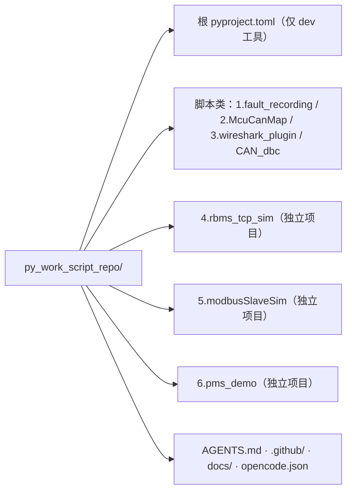

# Monorepo 子项目建立与 CI 接入规范

## 0. 目录

- [1. 目标与范围](#1-目标与范围)
- [2. 目录结构（推荐模板与本次发现的问题）](#2-目录结构推荐模板与本次发现的问题)
- [3. pyproject.toml 必备配置](#3-pyprojecttoml-必备配置)
- [4. 版本锚定与 .gitignore](#4-版本锚定与-gitignore)
- [5. 测试与质量门禁](#5-测试与质量门禁)
- [6. CI 接入（GitHub Actions）](#6-ci-接入github-actions)
- [7. 常见坑与解决方案（实战总结）](#7-常见坑与解决方案实战总结)
- [8. 校验命令](#8-校验命令)
- [9. 相关链接](#9-相关链接)

## 1. 目标与范围

本文总结 monorepo（一个顶层目录 = 一个独立工具，见 `docs/rules/repo-monorepo.md`）中子项目从「新建」到「接入 CI」的完整规范，内容来源于一次真实接入过程中的踩坑修复（详见 [7. 常见坑与解决方案](#7-常见坑与解决方案实战总结)）。

**适用对象**：新建或改造 `N.<name>/` 形式的独立 Python 子项目。

**阅读顺序**：先看 [2](#2-目录结构推荐模板与本次发现的问题) 目录结构，再对照 [3](#3-pyprojecttoml-必备配置) 配置模板，最后按 [8](#8-校验命令) 校验，接入 CI 看 [6](#6-ci-接入github-actions)。

## 2. 目录结构（推荐模板与本次发现的问题）

### 2.1 仓库分层（现状）



- **脚本类目录**（1/2/3/CAN_dbc）：无独立 pyproject，由根 `pyproject.toml` 的 ruff/ty/依赖组覆盖，无 pytest。
- **独立项目目录**（4/5/6）：自带 `pyproject.toml` + `uv.lock` + `src/` + `tests/`，各自跑 ruff/ty/pytest，CI 走 matrix job。
- 一个顶层目录只能有一个身份（脚本类或独立项目），**不允许混用**。

### 2.2 推荐标准结构

```text
N.project_name/                 # 顶层目录名 = 编号 + 蛇形名（如 6.pms_demo）
├── src/
│   └── pkg_name/               # 包名 = 目录名（蛇形），禁止 `../` 读兄弟目录
│       ├── __init__.py
│       └── ...（业务代码）
├── tests/
│   ├── conftest.py
│   └── test_*.py
├── docs/                       # 参考文档 / 设计文档 / 计划（如 DESIGN.md、PLAN.md、记录）
├── main.py                     # 可选：仅当需要 `uv run main.py` 根入口
├── pyproject.toml              # 完整配置（见第 3 节）
├── uv.lock                     # MUST 提交（--locked 依赖它）
├── .python-version             # 与仓库一致（3.13）
├── .gitignore                  # MUST NOT 忽略 uv.lock
└── README.md
```

### 2.3 本次发现的结构问题（教训）

| 问题 | 现象 | 处理 |
| :--- | :--- | :--- |
| 残留空目录 | 根存在小写 `modbusSlaveSim/`（仅 `.venv`，py=0），与 `5.modbusSlaveSim/` 并存 | 删除空目录；命名必须唯一、与包名一致 |
| 入口不统一 | 4 用 CLI scripts、5/6 根有 `main.py` 也留 `[project.scripts]` | 新项目二选一：根 `main.py`（`uv run main.py`）或 `[project.scripts]` 入口，不要双轨 |
| 配置缺失连锁 | 5 缺 `[tool.ty]`、4 缺 dev extra、4 忽略 `uv.lock`，导致 CI 逐个爆红 | 见第 3、4 节模板，建立即补齐 |
| 根检查越界 | 根 `pyproject.toml` 曾 include `4.rbms_tcp_sim`，其 tools 脚本 import 兄弟项目依赖（pymodbus）导致根 ty 报错 | 独立项目不进根检查范围，只进 CI matrix |

## 3. pyproject.toml 必备配置

完整模板（新项目直接拷贝）：

```toml
[project]
name = "pkg-name"
version = "0.1.0"
description = "一句话描述"
readme = "README.md"
requires-python = ">=3.13"
dependencies = [
    # 业务依赖；GUI 用 PySide6 时固定版本，如 "PySide6==6.8.1.1"
]

[project.optional-dependencies]
dev = [
    "pytest>=8",
    "pytest-cov>=5.0",
    "pytest-qt>=4.4",          # GUI 项目才需要
]

[build-system]
requires = ["hatchling"]
build-backend = "hatchling.build"

[tool.uv]
package = true

[tool.pytest.ini_options]
testpaths = ["tests"]
pythonpath = ["src", "."]      # "." 使 `from tests.conftest import ...` 可导入
qt_api = "pyside6"             # GUI 项目才需要

[tool.ruff]
target-version = "py313"
line-length = 100
src = ["src", "tests"]
exclude = [".venv", "__pycache__", "build", "dist"]

[tool.ruff.lint]
select = ["E", "F", "I", "UP", "B"]

[tool.ruff.format]
quote-style = "double"

[tool.ty.environment]
python-version = "3.13"
python = ".venv"
extra-paths = ["src"]

[tool.ty.src]
include = ["src", "tests"]
```

关键点：

- **`[tool.ty]` 必须有**。缺失时 ty 会向上找到仓库根配置、扫错范围（本次 5 的实测现象）。
- **`[tool.pytest] pythonpath = ["src", "."]`**。只写 `["src"]` 时 `from tests.conftest import ...` 会 `ModuleNotFoundError`。
- **dev extra 要包含 `pytest` 本体**（或依赖 pytest-qt 等会带入 pytest 的包），否则 `.venv` 无 pytest，`uv run pytest` 与 ty 解析 `import pytest` 都会失败。

## 4. 版本锚定与 .gitignore

- `uv.lock` **必须提交**（与 AGENTS.md 的版本锚定一致）；CI 用 `uv sync --locked`，无 lock 会直接失败。
- 子项目 `.gitignore` 只忽略 `.venv/`、`__pycache__/`、缓存目录，**不得写 `uv.lock`**（本次 4 曾忽略导致 CI `--locked` 失败）。
- 首个 `uv sync` 后立即确认 `git status` 能看到 `uv.lock` 再提交。

## 5. 测试与质量门禁

- GUI 测试一律设 `QT_QPA_PLATFORM=offscreen`，保证无显示环境可跑。
- 测试用 **`uv run pytest`**（走项目 `.venv`）；`pytest-qt` 的 `qtbot` 依赖 pytest 插件在 `.venv` 中。
- 测试写 `assert x is not None` 后再访问属性，既满足 ty 又防运行时错。

## 6. CI 接入（GitHub Actions）

在 `.github/workflows/python-check.yml` 的 `subprojects` matrix `dir` 列表加一行：

```yaml
subprojects:
  runs-on: ubuntu-latest
  strategy:
    fail-fast: false
    matrix:
      dir:
        - 4.rbms_tcp_sim
        - 5.modbusSlaveSim
        - 6.pms_demo
        # - 7.<new_project>   # ← 新项目在此追加
  steps:
    - uses: actions/checkout@v4
    - uses: astral-sh/setup-uv@v5
      with: { enable-cache: true }
    - run: uv tool install ruff ty pytest
    - run: uv sync --locked --extra dev
      working-directory: ${{ matrix.dir }}
    - run: ruff check .
      working-directory: ${{ matrix.dir }}
    - run: ruff format --check .
      working-directory: ${{ matrix.dir }}
    - run: ty check
      working-directory: ${{ matrix.dir }}
    - name: pytest
      working-directory: ${{ matrix.dir }}
      env: { QT_QPA_PLATFORM: offscreen }
      run: uv run pytest -q
```

- `working-directory: ${{ matrix.dir }}` 使 ruff/ty/pytest 读取**子项目自己的** `pyproject.toml`。
- GUI 与纯 CLI 项目共用此 job（offscreen 对 CLI 无害）。
- 脚本类目录留在根 job，由根 ruff/ty + `compileall` 冒烟覆盖。

## 7. 常见坑与解决方案（实战总结）

| # | 问题现象 | 根因 | 解决方案 |
| :--- | :--- | :--- | :--- |
| 1 | `uv tool run pytest -q --python .venv` 报 `unrecognized arguments: --python` | `--python` 是 uv 的选项，写在 pytest 后被当作 pytest 参数；且实测 `--python .venv` 根本不生效（解释器仍是 uv cache） | 一律用 **`uv run pytest -q`**（走项目 `.venv`） |
| 2 | ty 报兄弟目录/根目录的文件错误 | 子项目缺 `[tool.ty]`，ty 向上继承根配置 | 补 `[tool.ty]`（见第 3 节），python 指向本目录 `.venv` |
| 3 | `from tests.conftest import ...` 报 `ModuleNotFoundError: tests` | pytest 只把 `src` 加进 path，`tests` 作为包不可导入 | `pythonpath = ["src", "."]` |
| 4 | `uv sync --locked` 失败：lockfile 不存在 | `.gitignore` 忽略了 `uv.lock`，CI 全新环境无 lock | 提交 `uv.lock`，`.gitignore` 不忽略它 |
| 5 | ty 报 `import pytest` unresolved | 测试 import pytest 但 `.venv` 无 pytest | dev extra 含 `pytest>=8`（或由 pytest-qt 带入） |
| 6 | `Qt.AlignCenter` / `QAbstractItemView.SelectRows` / `QMessageBox.Yes` 等运行时报错 | PySide6 6.8 已移除无命名空间枚举 | 用命名空间限定：`Qt.AlignmentFlag.AlignCenter`、`QMessageBox.StandardButton.Yes`；`QMessageBox.warning/question` 显式传两个按钮参数 |
| 7 | 根 CI 检查子项目时报依赖缺失 | 根 pyproject include 了独立子项目，其 tools 脚本 import 兄弟项目依赖 | 独立项目只进 CI matrix，不进根 ruff/ty/pytest 范围 |
| 8 | GUI 测试在无显示环境失败 | 需要 Qt 窗口 | `QT_QPA_PLATFORM=offscreen` |
| 9 | `@Slot(str)` 使 ty 报 invalid-argument-type | PySide6 stub 对实例方法上的 Slot 检查过严 | 纯 Python 信号连接无需 `@Slot`，删除装饰器（信号 connect 到普通方法即可） |

## 8. 校验命令

子项目内（cwd = 子项目目录）：

```bash
uv sync --locked --extra dev
ruff check .
ruff format --check .
ty check
QT_QPA_PLATFORM=offscreen uv run pytest -q   # GUI 项目加 offscreen
```

全部 exit code 为 0 才算接入完成；随后在 `.github/workflows/python-check.yml` matrix 登记并 push，等待 Actions 全绿。

## 9. 相关链接

- [[repo-monorepo]]（`docs/rules/repo-monorepo.md`）— 顶层目录边界（常驻规则）
- [[AGENTS.md]]（`../AGENTS.md`）— 验收命令与 Python 规范
- [[codegen-python-standards]]（`docs/rules/codegen-python-standards.md`）— 3.13 类型规范
- [[opencode-config-guide.md]]（`docs/opencode-config-guide.md`）— opencode 配置实践
