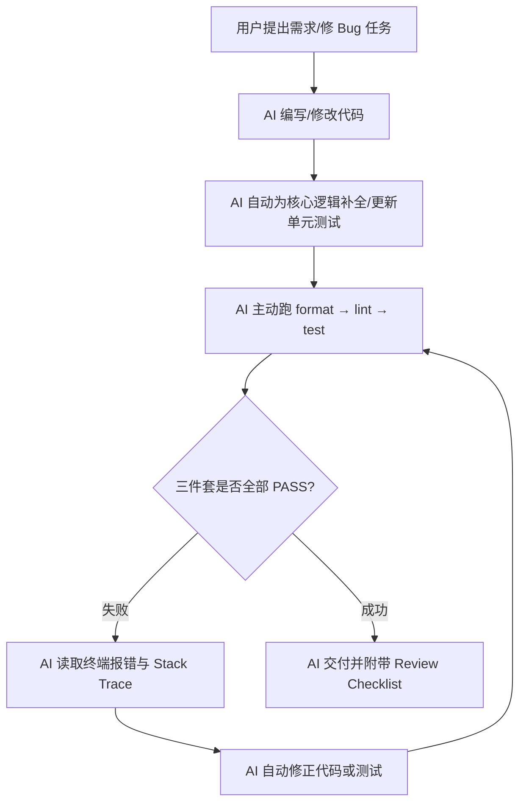

# 通用工程纪律与 AI 行为 Agent 全量规范

> **适用技术栈**：跨语言（C, C#, Go, Python, Vue, PowerShell 等）  
> **生效方式**：经 `opencode.json` `instructions`（`docs/rules/*.md`）常驻加载，适用于所有文件。
> **配套**：本目录各技术栈规则（按 `globs` 按需加载）；质量细节以本文件 + 各栈规则为准（不依赖外部笔记）

## 1. 核心行为准则与沟通规范

- **回复语言**：永远使用中文回复（除非用户要求其他语言）。
- **权威性与防幻觉**：严禁凭空捏造 API、函数签名或参数；不确定时必须查阅官方文档或本地头文件/源码。
- **最小入侵原则**：仅修改与用户需求直接相关的代码，避免大面积重构。
- **浅显易懂与完整性**：解释需通俗易懂，覆盖边界条件、异常处理和并发安全。

## 2. 敏感信息与配置安全

- **禁止硬编码**：所有密码、API Key、Token 必须通过环境变量或安全配置文件读取。

## 3. 资源释放与闭环回收

- **资源必闭环**：文件、网络、串口、数据库连接等必须在同一作用域使用 `defer close`、`using`、`with` 等方式释放。

## 4. 零裸打印与日志规范

- **禁止裸调试输出**：`print`、`printf`、`console.log`、`Write-Host`（非必要 UI）等禁止当作调试手段滥用。
- **统一日志框架**：诊断信息必须通过项目统一的日志库，包含时间戳、级别、线程/进程 ID（若项目已有约定则遵循项目）。

## 5. 质量三件套（format / lint / test）— 必须全开

L2/L3 及有测试能力的改动，**缺一不可**。只手测、或只开其中一件，不算完成。

| 件套 | 挡住什么 | 要求 |
| :--- | :--- | :--- |
| **format** | 风格漂移、无意义大 diff | 按栈执行格式化命令，退出码 0 |
| **lint** | 空引用、未使用、可空、简单臭点；Python 另含类型检查 | 按栈执行静态检查，退出码 0 |
| **test** | 行为回归 | 按栈执行自动化测试，退出码 0 |

**按栈一键命令（写进任务提示词，改完必须跑）：**

| 栈 | format | lint | test |
| :--- | :--- | :--- | :--- |
| C / 嵌入式 | 项目约定（如 `clang-format`） | 项目约定（如 `clang-tidy` / 编译 `-Wall`） | `make test` / `ctest` |
| C# / WPF | `dotnet format` | `dotnet build -warnaserror` | `dotnet test` |
| Go | `go fmt ./...` | `go vet ./...` | `go test -race ./...` |
| Python | `ruff format .` | `ruff check .` + **`ty check`**（不用 mypy） | `pytest -q` |
| Vue / TS | 项目约定（如 `npm run format`） | 项目约定（如 `npm run lint`） | `npm run test:unit` |
| PowerShell | — | 勿强求对方装 PSScriptAnalyzer | `-SelfTest`；失败 ExitCode 1 |

**顺序**：format → lint → test 全绿 → 再接线 UI（若有）。  
**红线**：红则禁止宣称完成、禁止加功能；先修到绿。禁止删测试 / 无故 skip / 降警告装绿。

## 6. AI 自动化测试与自我修复闭环

### 6.1 测试契约（主路径不够）

至少覆盖（按任务勾选写入提示词）：

- 成功主路径
- 非法输入 / 边界值
- 超时 / 取消（若适用）
- 关键错误类型（非只 `raises Exception`）
- 关闭 / 释放后再用的行为（可重入、NotOpen 等）

### 6.2 硬件 / SDK / 串口 / CAN / DLL

- **无硬件也能绿**：接口化 + Fake；禁止真设备才能一键测试绿。
- **真驱动路径**：用 Mock 原生 API 测 open/配置/send/recv/close 与失败清理。
- Fake 与真实现能力门禁一致（不支持的特性必须同样拒绝）。

## 7. 终极自检清单（Review Checklist）

- [ ] **沟通**：全程使用中文，未捏造虚假 API。
- [ ] **安全**：无硬编码的密钥、密码或 Token。
- [ ] **资源**：所有打开的句柄/内存/网络连接均有闭环释放逻辑。
- [ ] **日志**：已清除滥用裸打印，使用统一日志库（或项目约定的 CLI stdout）。
- [ ] **三件套**：已主动跑 format → lint → test，退出码均为 0。
- [ ] **契约**：测试含错误路径/边界，非仅快乐路径；IO 有 Fake（及必要 Mock）。
