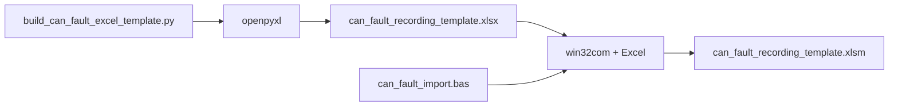

# CAN 故障录制 Excel 模板 — 构建说明

本目录为仓库内**独立工具**；说明与依赖均自包含。若将来单独成 GitHub 仓库，可直接以本目录为根迁移（见仓库根 [README](../README.md) 中「将来独立成仓」）。

## 结论

交付文件 **`can_fault_recording_template.xlsm`** 由本目录下的 **`build_can_fault_excel_template.py`** 生成：先用 **openpyxl** 写出无宏的 **`.xlsx`**，再用 **win32com** 把 **`can_fault_import.bas`** 嵌入工作簿并添加 **Import CSV** 按钮，另存为 **`.xlsm`**。

**当前发布版本**（改版本时只改 `template_version.py` 后重跑 build）：

| 项 | 值 |
| :--- | :--- |
| 版本号 | **1.1.0** |
| 发布日期 | **2026-05-21** |
| 说明 | CAN 故障录制 CSV 导入与分析；Instructions 仪表盘 UI；导入性能与 ImportLog 修复 |

## 目录内容

| 文件 | 作用 |
| :--- | :--- |
| `template_version.py` | **版本单一来源**：版本号、发布日期、发布说明（Instructions 与 xlsm 元数据） |
| `build_can_fault_excel_template.py` | 生成工作表结构、表头、Dashboard 下拉、Plot 表布局 |
| `can_fault_import.bas` | VBA 源码：导入 CSV、填 Parsed、填 Plot 数据、重建图表 |
| `setup_and_build_excel_template.ps1` | 设置 Excel `AccessVBOM` 并调用 build |
| `repair_vba_module.ps1` | Excel 关闭后 **重建 xlsx + 重嵌 VBA** 到 xlsm |
| `can_fault_recording_template.xlsx` | 构建中间产物（无宏） |
| `can_fault_recording_template.xlsm` | **最终模板**（含宏与按钮） |

## 生成流程



### 阶段 1：openpyxl（纯 Python，无需 Excel）

- 创建工作簿与工作表：**Instructions**、**Raw**、**ImportLog**、**Parsed**、**Dashboard**、**Plot_1A960004** … **Plot_1A9B0004**（`can1` / `dsp2` 录制 ID）
- **Raw** / **Parsed** 仅表头与占位说明，**不写入示例 CSV 数据**
- **Parsed** 字节/int16 列有占位公式；**seq_in_id** 与 **Plot_*** 数据在导入时由宏按 **can_id** 分组写入（不假定每 6 行一轮）
- 保存为 **`can_fault_recording_template.xlsx`**

### 阶段 2：win32com（需本机安装 Excel）

1. 打开上述 `.xlsx`
2. 删除旧模块 **CanFaultImport**（若存在），导入 `can_fault_import.bas` 并命名为 **CanFaultImport**
3. 在 **ThisWorkbook** 写入 `Workbook_Open`（空表时提示导入）
4. 在 **Instructions** 右上操作区（D2:F5）添加 **蓝色** 圆角按钮 **Import CSV…**（浅灰面板 + 标题/说明文字），`OnAction = ImportCanFaultCsv`；隐藏网格线
5. 另存为 **`can_fault_recording_template.xlsm`**（格式 52 = xlsm）

修改 VBA 后：关闭 Excel，运行 `repair_vba_module.ps1` 或完整重跑 build。

### 导入性能（VBA）

- CSV → Raw：整表一次 `Range.Value` 写入（ADODB 优先，Line Input 单次扫描回退）
- Parsed + Plot：单次遍历 Raw，Parsed/Plot 各一次批量写入
- 导入过程 `ScreenUpdating = False`；二次导入若已有 4 张图则只更新序列，不删重建

## 运行环境

| 项 | 要求 |
| :--- | :--- |
| Python | 3.x（仓库未锁版本；假定 3.11+） |
| 依赖 | `openpyxl`、`pywin32`（仅构建 xlsm 阶段） |
| Excel | Windows 桌面版 2016 / 2019 / 2021 / Microsoft 365 |
| 安全 | 构建前需 **AccessVBOM=1**（`setup_and_build_excel_template.ps1` 会写注册表） |

安装依赖示例：

```powershell
pip install openpyxl pywin32
```

## CSV 输入格式

本工具**仅**负责 Excel 模板的构建与导入宏；解析规则由 **`can_fault_import.bas`** 与模板内 **Instructions** 说明一致。

| 规则 | 说明 |
| :--- | :--- |
| 文件类型 | `.csv` 文本，逗号分隔 |
| 注释行 | 以 `#` 开头的行忽略 |
| 表头行 | 首列（去空格后）为 `can_id` 的行作为表头跳过 |
| 数据列 | `can_id`, `b0` … `b7`（8 字节，十六进制或十进制由录制工具导出格式决定） |
| int16 | 高字节 × 256 + 低字节（有符号）；如 `0x01`, `0xF6` → 502 |
| 分组 | 按文件中 **`can_id` 出现顺序** 分组，不假定固定 6 行一块 |
| 绘图 CAN ID | `0x1A960004`、`0x1A970004`、`0x1A980004`、`0x1A990004`、`0x1A9A0004`、`0x1A9B0004`（各对应一张 **Plot_*** 表） |

校验或调试时请自备符合上述格式的录制 CSV（本目录不捆绑示例文件）。

## 构建命令

在**本目录**下执行（克隆仓库后先 `cd` 到 `fault_recording_parse_excel_template`）：

```powershell
powershell -ExecutionPolicy Bypass -File .\setup_and_build_excel_template.ps1
```

或：

```powershell
python .\build_can_fault_excel_template.py
```

从仓库根目录进入本目录示例：

```powershell
Set-Location .\fault_recording_parse_excel_template
powershell -ExecutionPolicy Bypass -File .\setup_and_build_excel_template.ps1
```

## 校验

- 构建成功：本目录下存在 `can_fault_recording_template.xlsm`
- 打开模板 → 启用宏 → **Instructions** 上点击 **Import CSV...** → 选择符合上文格式的 `.csv`
- 导入成功会弹出 **Import CSV** 提示框（行数、CAN ID 数量、文件路径）
- 失败时自动写入并打开 **ImportLog** 表（时间、步骤、错误号、消息、CSV 路径）
